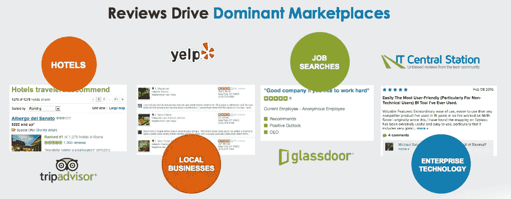
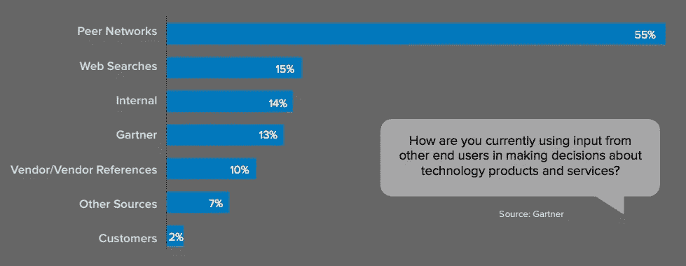
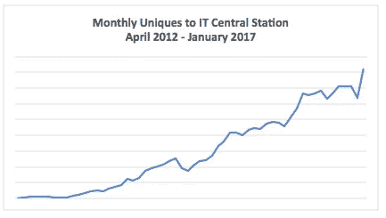
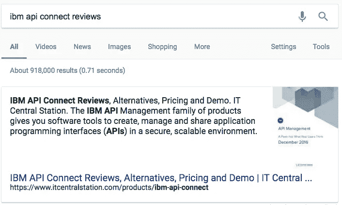
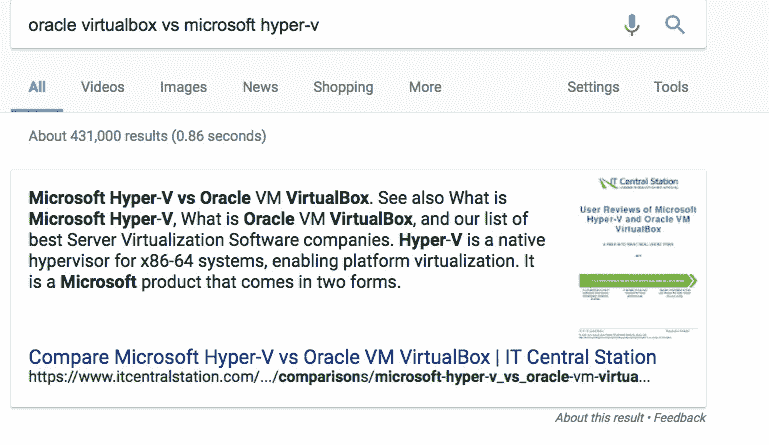
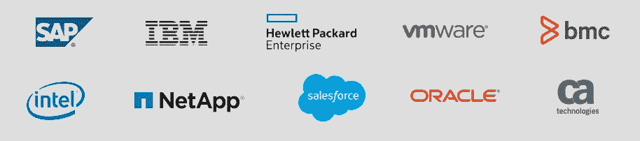

# IT 中心站正在企业技术领域引领同行推荐浪潮

> 原文：<https://medium.com/hackernoon/it-central-station-is-riding-the-peer-recommendation-wave-in-enterprise-tech-6c0eaadf40f7>

新闻快讯…企业客户的决策越来越多地受到影响消费者的对等网络和观点的驱动(例如 Yelp、Trip Advisor…)。脸书展示了 3800 亿美元的价值，部分是因为喜欢按钮影响消费者购买的力量。

企业每年在企业技术上花费 3 万亿美元。企业[技术](https://hackernoon.com/tagged/technology)公司知道他们发布的“白皮书”缺乏独立性，因此在购买考虑方面得分较低。买家正在寻找结合专业知识和独立声音的内容。这就是为什么“同行推荐正在影响超过 90%的 B2B 购买决策”，根据[最近的一篇 HBR 文章](https://hbr.org/2016/11/84-of-b2b-sales-start-with-a-referral-not-a-salesperson)。Gartner 的一项研究发现，像 [IT 中心站](https://www.itcentralstation.com/)这样的对等网络是买家从其他最终用户那里获取信息的主要方式:

企业技术购买途径有三个阶段

1.  探索——我想做出改变吗？
2.  评估——我将采用什么方法来应对这一变化？
3.  合作——我可以与该特定供应商合作吗？

据 Gartner 称，在购买流程的第二和第三阶段，来自分析师和影响者的建议(包括同行评审)是推动购买决策的最重要因素。

由才华横溢的拉塞尔·罗斯坦领导的 IT 中心站正在利用企业技术领域同行评审的力量来建立一个大企业。例如，[下面是对 AppDynamics APM](https://goo.gl/Q3MAzj) (应用性能管理)的回顾。

# 这一切都始于用户&每月独一无二的增长很快

由于 IT Central Station 是一家私营公司，出于竞争原因，我们不会透露具体数字，但 IT Central Station 的总访问量在 2016 年比 2015 年增长了 52%:

在有机搜索增长 66%的推动下，2017 年 1 月的用户增长比前一年 1 月加速至 60%，因为谷歌越来越重视 IT Central Station 的同行评论的价值。这使得 IT Central Station 的内容能够在各种企业 IT 产品的有机搜索结果中始终排名靠前或接近靠前:

Example of ITCS Appearing at the top of a Google Search (out of 918,000 results)

Example of ITCS Appearing at the top of a Google Search (out of 431,000 results)

用户来 IT 中心站的原因是阅读深入的评论。虽然主要竞争对手的评论平均长度为 50 字(Spiceworks)或 100 字(G2 Crowd)，但 IT Central Station 的评论平均长度超过 400 字，巩固了其作为阅读企业技术产品深入同行评论的地方的地位

# 内容的联合增加了中央电视台的影响力

IT Central Station 与许多领先的技术出版物签订了越来越多的分销协议。

这里有一个 IT Central Station 对 CDW 的评论示例，它是 IT 行业最大的经销商，年销售额达 170 亿美元。

IT Central Station 还在领先的技术媒体网站上发布产品评论，包括 CIO.com、计算机世界和信息世界。

最后，在 10 月份，IT Central Station 的同行评论的价值得到了另一次确认，IT Central Station 在 LinkedIn 的公告中受到了特别关注，该公告称“ [LinkedIn 将 B2B 产品和服务评论引入 Feed](https://business.linkedin.com/marketing-solutions/blog/marketing-for-tech-companies/2016/linkedin-introduces-b2b-product-and-service-reviews-into-the-fee) ”。

这些合作关系中的每一个都大大增加了 it 中心站的影响力，增强了 IT 接触每年购买价值 3 万亿美元的企业技术的决策者的能力。

# 货币化的增长甚至快于用户的增长

鉴于同行评审对购买决策的巨大影响，it Central Station 拥有企业 IT 客户的蓝筹股名单也就不足为奇了:

Partial List of IT Central Station Clients

客户喜欢它中央车站评论:

AppDynamics:“我们今年最大的一笔交易是我们投资 IT 中心站的结果。”
甲骨文:“在我们向甲骨文 IT 社区的主要成员询问他们最了解的对等技术评论网站时，IT Central Station 排名第一。"

由于他们与客户的密切关系，IT 中心站的收入在 2016 年增长了 90%，其中用户增长了 52%，每用户收入增长了 25%。

从 2015 年 1 月到 2016 年 1 月，每位客户的收入增长了 150%,这得益于覆盖范围的扩大以及新产品的推出，尤其是视频评论的推出。[这里是 HPE 3Par 闪存存储的视频回顾](https://goo.gl/q5n1OP)。

IT 中心站的收入在 2017 年及以后应该会继续攀升，因为 IT 中心站继续扩大其覆盖范围，扩大其客户群，并增加新产品。

# 未来的增长机会是巨大的

在其核心，IT 中心站建立了一个复杂的买方意向数据库和基于大数据技术的引擎。IT 中心站在其平台上跟踪企业购买者的行为，并分配购买者意向得分，汇总来自同一组织的其他访问者的数据。因此，IT 中心站知道哪些企业目前正处于购买过程中，他们正在评估哪些供应商，购买过程的长度，参与该过程的人员的资历，以及其他有价值的购买者数据。今天，IT 中心站通过使其客户能够利用意图向其用户进行营销来将这些信息货币化。IT 中心站有很大的机会更好地利用这些信息，甚至有可能创建自己的市场。虽然这条道路目前还不明确，但有一点是明确的，当你在一个 3 万亿美元的市场中拥有大量且不断增长的买家意向信息时，机会是巨大的。

> [黑客中午](http://bit.ly/Hackernoon)是黑客如何开始他们的下午。我们是 [@AMI](http://bit.ly/atAMIatAMI) 家庭的一员。我们现在[接受投稿](http://bit.ly/hackernoonsubmission)，并乐意[讨论广告&赞助](mailto:partners@amipublications.com)机会。
> 
> 如果你喜欢这个故事，我们推荐你阅读我们的[最新科技故事](http://bit.ly/hackernoonlatestt)和[趋势科技故事](https://hackernoon.com/trending)。直到下一次，不要把世界的现实想当然！

