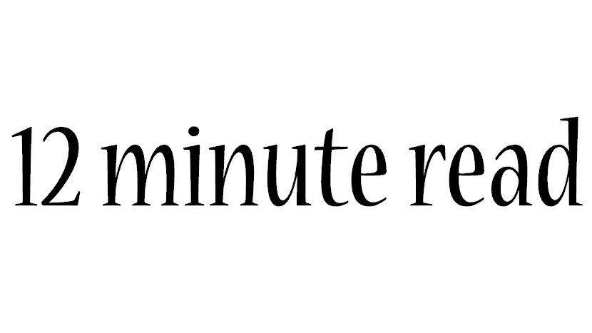

# “感觉就像你刚刚讲述了一个人生故事！”

> 原文：<https://medium.com/hackernoon/it-felt-like-you-just-told-a-life-story-510a0c7619f5>

## 17 个月的创业经历让我有了这么多可以分享的东西

最近，我和一位老同事聊天，他现在是一家成长型创业公司的产品总监。由于他目前正准备扩大组织规模(增加 26%的员工)，他对管理五个以上的 Scrum 团队很感兴趣。

我是一个快速发展的设计团队的一员，在此期间，该组织必须经历两个扩展阶段，所以我从*开始，“产品团队从两个 scrum 团队发展到八个，粗略地说”*。然后他问了鼓舞人心的问题！没想到我的回答对他有用，所以决定写在这里(不是谈话的文字记录)。

**组织结构如何？**

我加入的时候，有一个产品总监，监管多个产品经理。我的团队与这些团队密切合作，但还有另一个设计团队从事通信和广告项目，与营销团队密切合作。两个设计团队的领导都向设计主管汇报，而设计主管又向 CEO 汇报。到那时为止，我们还没有一个 C 级设计/ UX 人员，因为组织结构没有表明这种需求(或者还没有)。你知道，CXO 或 CDO 需要有更广阔的视野，而不仅仅是领导设计师和致力于“运营设计”。

请注意，产品总监更注重业务，不像你那样真正以产品为导向。产品经理也是。对于这些产品团队来说，设计和工程就像一个代理机构。就好像他们是我们的客户，我们提供设计师和工程师来解决他们的业务问题。

**缩放过程中的过渡如何？**

在我加入之前，设计师并没有参与一个 scrum 团队。他们过去常常召开会议，邀请产品经理为他们的项目竞标设计师资源。在我加入后，我们试图每两周做一次，就好像这是我们内部的冲刺。

第一次刮是在我加入后的三个月。联合创始人希望重组产品团队以提高效率，因此不再实行代理制。它还需要对设计师和工程师与产品团队坐在一起的空间进行物理重组。我们不得不雇用更多的设计师，因为设计师的数量不足以(由于技能上的巨大差异)将他们分配到产品团队中。我们花了大约三个月的时间进行大量的招聘和指导，直到每个产品团队都有了一批熟练的设计师。

第二次缩放仅在第一次缩放之后七个月。由于新的业务计划，一个新的产品总监被雇用，建立两个 scrum 团队开始。不到三个月，我们就不得不适应如此之多的招聘活动，招聘力度甚至超过了之前的规模，因为公司不再只有一名产品总监。幸运的是，这一次是在大学毕业前后，所以我们设法让具有良好潜力的应届毕业生在其他地方找到工作之前。我们的招聘人员帮了大忙！

**你是如何过渡到确保设计师领先于产品开发的？**

每个产品团队都有不同的适应方式。有两位杰出的产品经理，他们的团队适应得很快。一位女士对 UX 产生了真正的兴趣，因为她参加了一个 UX 课程。她对 UX 的了解让她立即重新安排了自己的团队，所以设计师从一开始就参与了进来。另一位是唯一一位产品经理，他的背景是产品研究(虽然是在一个完全不同的行业)，所以他很容易就转换到了 UX 思维。他还和大家一起用迭代过程(“硬核”scrum)重新安排了团队。两者都在第一个月内进行了调整。最慢的团队花了六个月的时间来适应将设计师完全纳入 scrum 团队。

在每个季度开始时，产品经理与他们的设计师和工程师团队坐在一起，分享季度路线图并安排项目执行。通常在这一阶段确定优先事项，但在本季度仍可进行调整。在这个阶段，重要的是估算工时。例如，一位设计师表示，接下来一个季度的项目将占用他 1.5 倍的产能，这表明需要聘用或为团队分配新的设计师。

我与产品经理密切合作，以便了解他们对设计师的需求，但由于我必须了解每个项目的范围和目标，因此我也会不时地帮助制定策略，例如，某个项目需要哪些设计活动，或者如何确认问题确实存在。有时我扮演一个备份设计师来帮助一个不太熟练的设计师，或者在 sprint 规划之外做一些辅助项目。

**毕竟，有什么更好的，设计师坐在一起与产品团队或作为一个机构？**

肯定要和产品团队坐在一起，因为有两个好处。首先，他们真正了解了产品(不像在代理环境中，他们不参与设计任务背后的讨论)。第二，这有利于他们作为设计师的成长，因为他们通过与工程师和产品经理的密切合作学到了更多。UI 设计者了解他们设计背后的工程，然后能够确保一个可实现的解决方案。UX 的研究人员对他们的产品有了更深入的了解，然后能够提出一个产品概念来解决客户的问题。

许多新人的加入不会减缓产品团队继续执行他们需要做的事情的速度吗？

新设计师能够快速适应，因为他们直接被安排在产品团队附近。他们从正在进行的 sprint 开始工作，并在移动中学习。在每个产品团队中，设计师坐在一起，所以这对新加入者也很有帮助(用设计师的语言交流)。

在第一次扩展中，我们没有一个合适的指导系统。只有在每种设计师类型的每周聚会上，例如 UX 研究员聚会，用户界面设计师聚会，他们彼此分享发现和经验以及如何做。

在第二次评估中，由于许多应届毕业生，我们要求导师(拥有高级职称或接近高级职称的设计师)对其学员的行为负责(这已传达给相关产品经理)。当新设计师因技能不足而无法提供帮助时，产品经理可以向导师寻求帮助。在某些情况下，在设计师的头两个星期里，导师会每周陪他们一天。

当然，我们也设法雇佣了一些有经验的设计师。那些有足够经验的人可以在适应中独立照顾自己。他们也有更好的沟通技巧。他们只是需要一个地方来询问事情是如何运作的，而且由于导师和每周的同事聚会，他们很清楚该去哪里询问。

**你是如何同时招聘这么多设计师的？**

一个新入职者的第一天就是直接见他们的产品团队，和导师还有我聊了聊，身体上安顿下来。第二天，有一个与设计负责人的会议，询问关于设计组织和文化以及产品品牌的问题。

在团队变得如此庞大之前，我曾经每周和所有设计师开一次会。我们分享了团队更新和每周学习的主题。除了与同行的每周会议之外，与来自多个产品的不同设计师的每周会议帮助他们了解适应的情况。

**谁是设计师的直线经理？**

是我。他们不向产品经理汇报，因为产品经理大多以业务为导向。他们的成长重点是实现业务目标，所以他们没有足够的知识来培养具有有助于设计质量(反过来有助于实现业务目标)的技能的设计师。

我们还向产品团队中的新成员解释了这一推理，他们之前碰巧在另一家初创公司工作。许多创业公司将设计作为产品或工程的一部分，因为他们的设计范围有限。对他们来说，设计只是效率或易用性，不包括定性或基于价值的经验因素，因此它甚至可以在工程团队中完成。

**你是如何确保设计师能够影响产品创新的？**

通过将设计团队与面向业务的产品团队分开。我还高兴地发现，联合创始人从一开始就提倡挑战彼此想法的文化。我们鼓励每个人提出自己的想法或挑战他人的想法，并确保这一点传达给新加入者(通过设计会议的负责人)。

**创新是由自上而下还是自下而上推动的？**

业务驱动的创新是自上而下的，因为这些决策来自董事会会议。然而，由于我们开始有多个产品总监，每个总监在讨论了解市场和客户的结果时都更加平易近人。

我们试图为每个产品总监分配一个设计领导。这两个人可以每月会面一次，讨论问题发现和设计策略。这就是为什么很难雇用额外的产品设计领导，因为这个人必须能够制定导致产品创新的战略。

CTO 如何融入客户体验是自下而上的创新驱动准备就绪的标志之一。仅仅因为我们与他分享了 UX 研究员关于理解客户的项目的综合列表，他就提出了支持客户体验的系统架构草案。直到现在我还是很惊讶。

**你能做真正的研究吗？**

还没有走向产品创新。真正的研究是什么意思？

我是说，你之前在博士期间做的研究。

学术研究？当然不是！这难道不是一些人对博士的刻板印象吗？开始的时候，有人对我说，*“你打算在这里做什么样的研究？你要让这个组织慢下来吗？”那是一句不恰当的话。显然，我知道我将与一家初创公司合作(这不是我的第一次创业经历)，所以“尝试和反思”是应该做的。设计师的方式。*

**你与 KPI 合作过吗？**

是的，但是是定性的，不是用数字。我们和产品经理一起想出了 KPI。在第一次规模扩张后，该公司聘请了一名人力资源(人员运营)方面的资深专家。这家伙很有见识。我请他帮助主持关于设计师关键绩效指标的会议。

**KPI 的例子是什么？**

例如，对于 UI 设计师来说，关键绩效指标之一就是要有一个可实现的设计。这意味着设计师必须与工程师一起工作，所以当他/她向产品经理展示他/她的设计时，可实现性已经存在了。这是这种 KPI 的可接受的质量。一个更好的质量，例如，当一个产品经理评论*“这个设计师不怕麻烦，创造了一个复杂但可实现的用户界面，带来了令人愉快的用户体验(根据我们客户的反馈)。”*

**你是如何界定自己的职责的？**

每六个月，所有员工都会和他们的直接经理进行一次正式的目标设定会议，但实际上，我每三个月就会更换一次职责。事情进展得太快了。在这种情况下，我必须与我的老板有充分的同步机会，因为是他就我的角色转换进行了沟通。这不仅仅发生在我们身上，其他团队也是如此(或者由于新团队的形成)。我们可以创建我们自己的角色或职称，并在几个月后更改它。

同时管理这么多人，不是很容易失去注意力吗？

当然啦！上次我处理团队的时候是 20+人。我感觉像爆炸 LOL。因此，当产品团队被分成四个小组，我们决定为每个小组聘请一名设计负责人时，我实际上离开了其他三个小组，坚持一个小组。一名高级设计师被提升为另一组的首席设计师，另外两组各有一名高级设计师。为了赶上进度，我每周都和他们见面(一对一的会议)。我实际上不能再解决他们的设计问题了。当我们见面时，他们可以与我分享一些问题，他们自己的解决方案，我只能提供一些建议或只是一个共鸣板。

在快速发展的过程中，一定会有很多摩擦！你是怎么处理的？

是的，当事情很混乱的时候，沟通需要很强。仅仅一些小故障就能引起一些挫折。例如，一个新加入产品的家伙直到快 2 个月才被介绍给我！对他来说，这感觉就像他在这么长时间要求(错误的人)之后，没有任何设计师被分配到他的团队。

我多次提出沟通问题。人力资源专家 guy 成立了一个名为 People Development 的团队，其任务之一就是指导员工的职业发展。领导沟通是我建议他们参加的培训主题之一。

与你之前的学术研究相比，这不是一个非常不同的工作吗？

你猜怎么着这种特殊的经历比学术研究更有价值！在一家初创公司，由于工作性质的不断变化，你每天都要做研究(阅读、实验、反思)。我喜欢接受新的挑战，这也是我过去喜欢读博士的原因。但是我可以在任何地方发现新的挑战，不仅仅是在学术研究中。

我们团队的一名新成员曾经学习临床心理学，并考虑读博士，直到她在一家初创公司体验了产品管理。她发现，在初创公司工作是一种不断学习的经历，就像做学术研究一样令人兴奋。我完全同意她的观点！

**你从这次经历中学到最多的是什么？**

[人的成长](/@qonita/self-evaluation-for-personal-growth-3c6793b05106)，组织设计，和沟通能力！对于沟通技巧，我们用了这个短语“搭建舞台”，因为每个团队领导为团队成员搭建舞台是很重要的。我们不应该厌倦于交流哪些阶段由谁拥有。我们提醒彼此要努力，不要因为需要重复像破唱片一样的东西而气馁。

关于组织设计，试试这本书[《设计组织的组织设计》,作者是 Peter mer holz&Kristin Skinner](http://orgdesignfordesignorgs.com)。这些是我从我离开后买了这本书的前团队成员那里学到的。团队领导还参加了 Kristin 举办的研讨会。参考消息 Peter 是 AdaptivePath(设计咨询领域的全球领导者之一)的联合创始人。

你在那里呆了多久？

17 个月。

哇，感觉就像你刚刚讲述了一个人生故事！

在电子商务这样竞争激烈的行业，扩大创业规模肯定比在更小众的行业或解决行业中没有那么多参与者的特定问题要快。当业务增长源于市场竞争而非创新时，你需要扩大规模。我很感激那次惊人的经历。

一些电子商务创业公司最终将成为市场的领导者，在这种情况下，组织将有更多的空间来呼吸，以便照顾创新。在一家初创公司，“产品总监”可能意味着领导业务开发的人，而在另一家初创公司，“产品总监”意味着领导产品创新的人。

在上述对话结束时，我们讨论了我们的三个共同观察结果:

1.  将 UX 引入一个知道零 UX 的组织需要两件事:知识传播和创造证据。通过展示更多用 UX 理解开发的项目，给客户带来真正的快乐，我们创造了更多的证据，让更多的人转向 UX 思维。第一步是让最初的几个人加入 UX 俱乐部，并承认他们是先驱(传播他们的模范行动)。
2.  在很多互联网创业公司中，产品经理或产品负责人更具有商业导向。他们更注重业务发展，而不是产品开发。如何让设计师融入产品团队，是一个以不同方式构建团队的问题。较大和较小的团队，工程师和设计师的比例，以及设计师是向产品(有设计经验的产品人员)还是向设计(管理中的设计人员)报告。
3.  在许多组织中，产品战略通常是商业战略的结果，而不是相反。使产品战略对商业战略产生影响的一个方法是创建一个单独的团队，例如“产品创新”或“设计战略”团队，它将作为一个桥梁，一个组织中的中间实体。这个团队与多个团队合作进行创新项目(以获得各种输入，而不仅仅是客户反馈)。

顺便提一下，我的前同事以 UX 经理的身份加入了这家 30 人的初创公司，他介绍了 UX 理解，并在组织中推广了 Scrum 实践。当他了解到这家初创公司需要更深入地了解他们的客户，以扩大他们的服务时，他提议成立一个产品创新团队。他就是这样过渡到产品总监的。他以前管理的“UX 团队”，做技术设计(UI)，与技术团队合并(向 CTO 汇报)。他正在接受一个新的挑战，将产品创新团队作为一个独立的团队(中间实体)。

他的产品创新团队由产品研究人员以及来自不同背景的人员组成，例如财务、营销、设计、工程人员，以解决客户的创新问题。我向他提到了我的前团队成员买的另一本书，杰夫·高瑟夫&乔希·塞登的《感知和响应》，这本书正是关于他的团队目前正在做的事情:感知和响应。我祝愿他在这个现在有 150 人、准备扩大规模的初创企业中一切顺利。

我认为他是一个从做 UX 自然过渡到做产品创新或战略的例子。在做 UX 的时候，你会不断地面对顾客的反馈，这些反馈很多时候会让你大吃一惊，让你对解决他们的问题充满好奇。您将不再看到产品本身。你最终会想到服务，这导致了战略和创新，这不仅仅是设计正确的产品，而是为你的客户设计正确的产品。

在 75 分钟的聊天中总结我的 17 个月真好！我真的很感谢他问我那些问题。

感谢初创公司的人:联合创始人(包括设计主管和首席技术官)对我的所有启发和信任，负责所有快速行动的招聘人员，两位早期采用者产品经理，两位平易近人的产品总监，前来救援的人力资源主管，接受挑战照顾一群设计师的高级设计师，由临床心理学家转变为产品经理的其他设计主管和高级设计师，在混乱中的所有分享，以及所有承受我严厉的爱的设计师！:)

