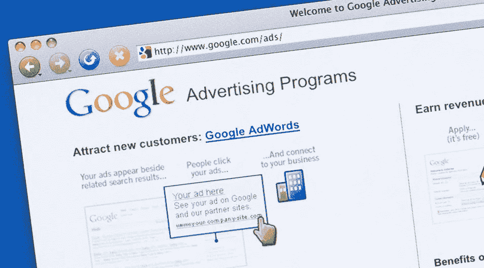

# 谷歌被宠坏的广告和代理来对抗它

> 原文：<https://medium.com/hackernoon/it-was-never-supposed-to-happen-and-yet-it-did-again-3b3611f1f300>

这本来是不应该发生的，但它还是再次发生了。惠普、玛氏、帝亚吉欧、亿滋、阿迪达斯和德意志银行在黑色星期五(一年中最重要的购物日)之前撤下了谷歌 YouTube[上的广告，此前这些品牌的广告活动出现在以“儿童和性化评论”为特色的视频旁边。](https://hackernoon.com/tagged/youtube)

似乎我们在这里看到了两个问题:在错误分类的内容旁边放置广告，以及识别和迅速删除攻击性评论的糟糕工作。更糟糕的是，[谷歌](https://hackernoon.com/tagged/google)在今年早些时候的一次事件后向品牌保证它有“有效的政策”来处理攻击性内容。我认为这些政策不是很有效。YouTube 面临压力，需要加强监管，给广告商更多控制权，并承诺对被标记的视频做出更快的回应。

抛开对谷歌底线的意义不谈，品牌还能剩下什么？接受谷歌下一轮解决问题的承诺是幼稚的(我相信这些品牌现在也明白了)。谷歌的算法已经错误地屏蔽了大量合法内容(误报)，赶走了合法内容创作者和他们的观众。算法不会完美，暂时不会，手动筛选每个视频即使对谷歌这样的巨头来说也太麻烦了。

我建议广告商开始更密切地关注他们的广告在哪里投放，以及谁在观看。对出版商进行选择并验证广告可能被证明是明智的，甚至可能减少每年高达 160 亿美元的广告技术欺诈。

广告验证明显受到出版商向品牌和其他人提供不同内容的影响。一旦出版商了解到他们正在被广告商验证，他们就可以——而且经常这样做——在品牌广告中提供更合适的内容。本质上，广告商需要像普通用户一样看起来和行为，以确保验证过程是有效的。为此，品牌可以使用业务代理(如 Strada.io)来执行来自住宅和移动 IP 地址的验证，这些地址不能被出版商识别为与品牌相关联，并替换他们的数字指纹。

虽然这可能只是开始，但这些努力有望带来一个更干净、更合适的广告技术市场。