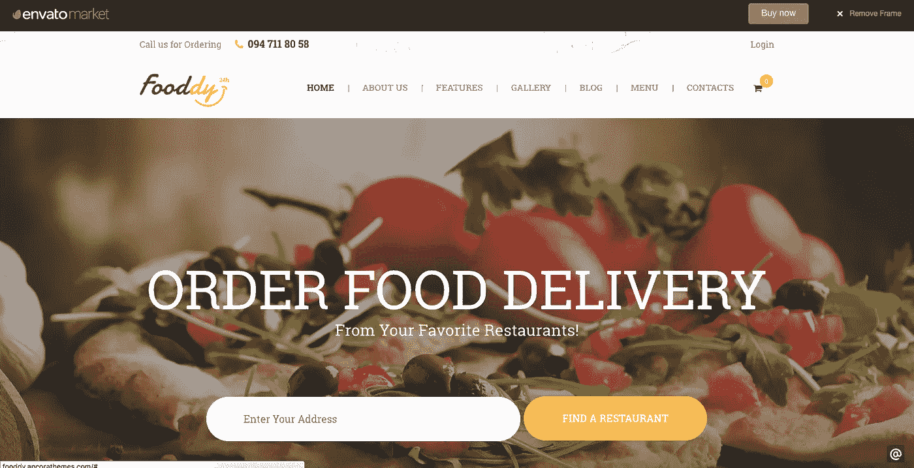
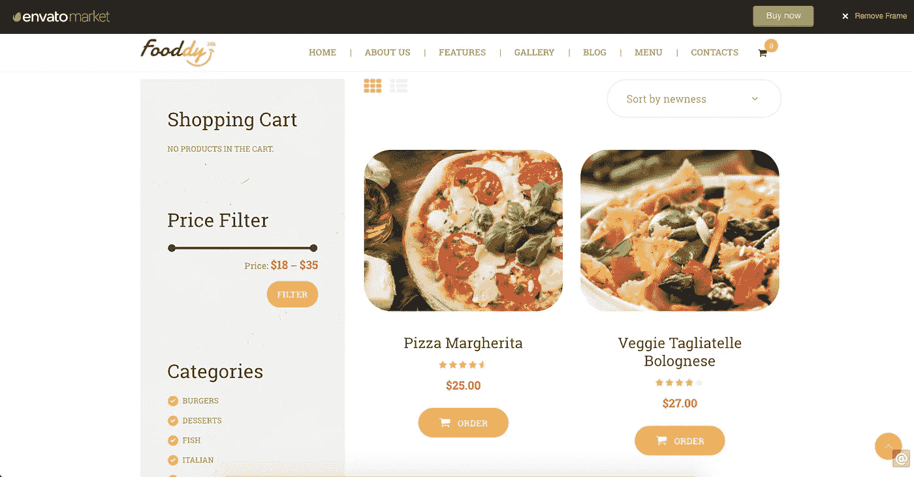

# 构建你的想法不需要花费一大笔钱

> 原文：<https://medium.com/hackernoon/it-wont-cost-a-bomb-to-build-your-idea-903be5e3eebe>

假设你有一个食品配送业务的想法。你是做什么的？典型的方法是雇佣一个自由职业者，或者将项目外包给一家公司，或者在某些情况下雇佣一个技术团队来完成。这个项目需要几个月，几千美元，你就可以在网上做生意了。你可能还会在[云](http://amzn.to/2qWpBeD)上花费主机托管费用。

如果我说，你可以花 1/10 的钱，在几周内让你的想法启动并运行起来。

我的解决方案是 Shopify 或者 Wordpres。Shopify 上有很多生意。如果你需要更多的控制，去 Wordpress。你可能会问“说真的，那是用来写博客的吗？”。是的，它是为写博客而建的。但是，Wordpress 的创造者让它高度个性化。

我来说一下细节。你的送餐业务或大多数想法都有这些共同点。

1.  )注册和登录
2.  )您的产品列表
3.  )计费和支付网关集成
4.  )跟踪顺序
5.  )电子邮件订阅

Wordpress 已经有一个注册和登录模块。你可以用 Wordpress 编辑器创建一个页面来列出你的产品。支付网关可以在 Wordpress 插件商店中找到。您可以通过电子邮件向用户发送订单更新信息。电子邮件订阅也是一项内置功能。

如果你不想这样做，或者如果你需要更多的功能，检查[主题森林](https://themeforest.net/?ref=febinjohnjames)网站的主题和插件。80%的机会是他们已经有了你正在寻找的功能。在极少数情况下，你将不得不聘请一个自由职业者来建立一个特定的功能或主题。

由于 Wordpress 是免费和开源的，你只需要为托管付费。很可能你正在验证你的想法，并期待着低流量。从 Hostgator 这样的共享主机开始。你一年的花费不到 100 美元。如果你想要更多的控制，去[数字海洋](https://m.do.co/c/72660420edd6)，每月 5 美元。

以上是我在[主题森林](https://themeforest.net/item/fooddy-247-food-ordering-delivery-theme/19731095?s_rank=4&ref=febinjohnjames)找到的一个这样的主题。

因为 Wordpress 有一个强大的社区支持，所以维护和升级是免费的。该平台已经成熟，因为它已经发展了多年。有大量的开发人员专门在 Wordpress 上工作。所以招聘也很容易。

因为很多人发现很难联系到我来咨询脸书(他们隐藏消息)。下面是我的 [LinkedIn](https://www.linkedin.com/in/febinjohnjames/) 。我们谈谈吧。

> [黑客中午](http://bit.ly/Hackernoon)是黑客如何开始他们的下午。我们是 [@AMI](http://bit.ly/atAMIatAMI) 家庭的一员。我们现在[接受投稿](http://bit.ly/hackernoonsubmission)，并乐意[讨论广告&赞助](mailto:partners@amipublications.com)机会。
> 
> 如果你喜欢这个故事，我们推荐你阅读我们的[最新科技故事](http://bit.ly/hackernoonlatestt)和[趋势科技故事](https://hackernoon.com/trending)。直到下一次，不要把世界的现实想当然！

