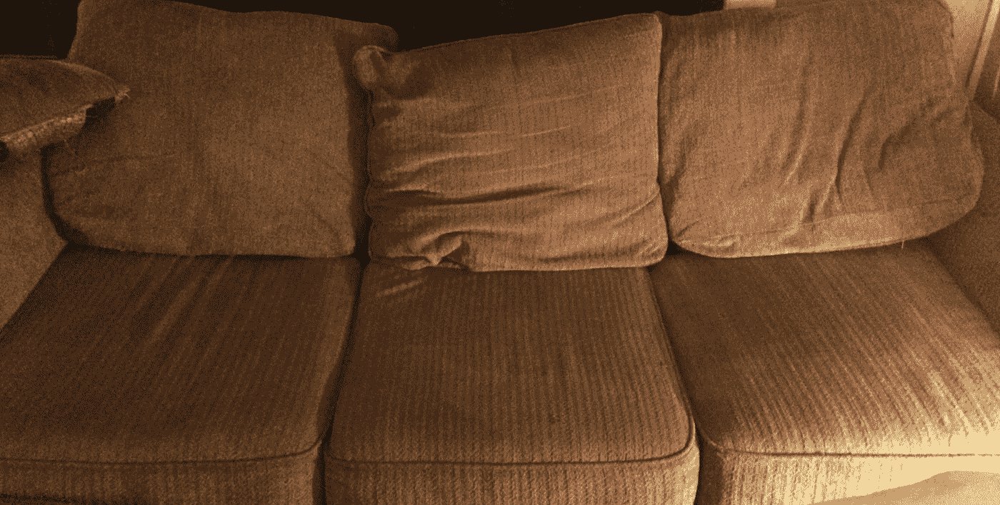
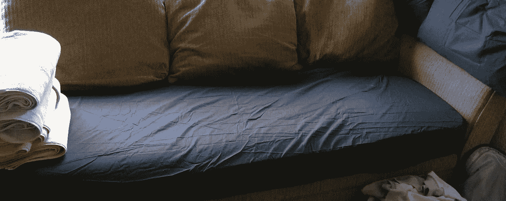

# 迭代一切——甚至是沙发

> 原文：<https://medium.com/hackernoon/iterate-everything-even-the-couch-7955dafa5fbc>

Not bad for a movie night, but not great for a restful sleep

一周前我带着一份总体规划来到温哥华。它涉及一长串的活动，包括疯狂营销和建立我们的联系平台。这一切将从我朋友的客厅开始，按照老套的方式，我会睡在沙发上。

这个计划似乎很可靠。我告诉过的每个人都说它很棒——我的父母，我的密友——我被说服了。我去了温哥华，与我的朋友布雷克和亚历克斯建立了轮班关系。

头几天，这个计划似乎天衣无缝。沙发比预期的要好，布莱克和我已经开始参加技术和创意社交活动，分享我们的想法，建立联系。我们开始跑步，但几天后我跑得气喘吁吁，我们才刚刚开始。

我们很快发现了计划中的漏洞。**尽管如此，我们并没有气馁；我们忙着迭代。**在我来到温哥华的两周内，我们的营销计划已经从在聚会上分发名片迅速转变为一种经过深思熟虑的科学方法。我们认为我们已经很好地处理了产品、营销和用户角色，**，但是我们没有。**我们迭代，练习，变得更好。

我在沙发上做了同样的事情。第一个晚上很好——我旅行太累了，我可以在蓝鸟队的比赛中睡在前排。但是第二晚很糟糕，第三晚更糟糕。最重要的是，我生病了。事情正在迅速复合。我没有屈服，让自己越来越虚弱，而是不断重复。

床不是一个选项——客厅是一个公共房间，我们的 Airbnb 用户用来看电视和闲逛。所以我有了创意。我去了沃尔玛，买了一个记忆海绵垫、一条床单、两个枕头和一条毯子。

所有加起来还不到 100 美元。看起来很贵，但这是对我健康的投资，也是对我高效工作能力的投资。我一直穿着床单和记忆海绵，拿掉靠垫睡觉。

作为一个团队，我们只是在做一家初创公司该做的事情——追求完美。我们知道我们永远不会达到完美，我们永远不会在我们的方法的最后迭代。我们对自己使命的定义每天都在改进。但愿沙发不会永远是我的床。

在 Shift Connections，我们每天都在追求正增长。我们这样做是因为学习和交流是我们的激情所在。我们相信每个人都应该有机会在一个鼓励他们的激情，并赋予他们的想法，无论他们的想法是大是小的环境中。我们每天都在努力创建这个社区。每一次迭代，我们都向前迈了一小步。

Fresh Sheets — I still can’t iron mom

> [黑客中午](http://bit.ly/Hackernoon)是黑客如何开始他们的下午。我们是 [@AMI](http://bit.ly/atAMIatAMI) 家庭的一员。我们现在[接受投稿](http://bit.ly/hackernoonsubmission)，并乐意[讨论广告&赞助](mailto:partners@amipublications.com)机会。
> 
> 如果你喜欢这个故事，我们推荐你阅读我们的[最新科技故事](http://bit.ly/hackernoonlatestt)和[趋势科技故事](https://hackernoon.com/trending)。直到下一次，不要把世界的现实想当然！

