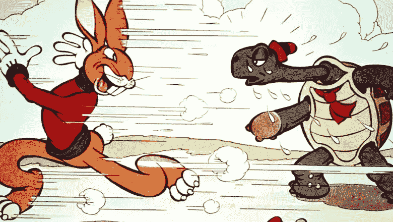

# 迭代，而不是冲刺

> 原文：<https://medium.com/hackernoon/iterations-not-sprints-efab8032174c>

Olympic sprinters

大卫·赫斯曼在推特上提出了这个非常有趣的观点，值得认真思考…

## 但是敏捷已经有了 sprint 的替代词——“T2”迭代。“冲刺”是 Scrum 特有的术语。

词语含糊不清，常常会带来意想不到的含义。“冲刺”这个词意味着一种速度——在一个短时间内，在向前的方向上，尽可能快地*。*

*当然，在现实世界中，你不会在跑完一个 sprint 后，立即进行另一个 sprint，一个又一个，以不间断的顺序进行。你会很快因疲惫而倒下。所以作为软件开发的比喻，这是有问题的。*

**

*The Tortoise and the Hare, Disney 1935*

*敏捷一直有这个问题——敏捷是开发软件的一种更快的方式，而不是更好的方式。坦率地说，我认为这是敏捷行业的卖点之一。现在，Scrum 和极限编程出现已经二十年了，人们仍然期望敏捷更快，而不是更好。*

*David 在这里一针见血地指出……敏捷是*快*而不是*好*的观点已经深入到最广泛使用的敏捷方法论的最基本术语中。这是我们给自己带来的问题。*

*“迭代”有不同的含义。首先，它意味着我们正在利用我们已经拥有的东西，并使它变得更好。但也许更重要的是，这并不意味着变化的速度。迭代可以很快，也可以很慢。重要的是提高，而不是速度。*

*对我来说，这是敏捷的核心。当我们完成一个迭代时，我们应该处于比开始迭代时更好的位置。我们应该看到明显的进展。瀑布的诅咒是看不到进展(由于缺乏可见性，无法进行路线修正)。Scrum 的诅咒似乎是关于最大速度的错误观点。*

*当我们开车时，前方的情况很糟糕，我们会减速。我们不以最高速度开车。敏捷的美妙之处在于，它帮助我们处理不确定的条件，因为通向我们产品的道路很少是笔直、平坦和干燥的。*

## *敏捷不是你能走多快，而是你能转多快。*

*前几天，我看了《生死场》，这是一部关于 20 世纪 70 年代早期一级方程式赛车的经典纪录片。在电影的开始，旁白提出了一个有趣的观点——“这些车不仅仅是快。他们*很快。*“一级方程式赛车能急刹车，急加速，急转弯，比普通车难多了。它们是最快的汽车，不是因为它们有最高的最高速度，而是因为它们对复杂的、不断变化的条件反应最灵敏。*

*这就是我希望敏捷成为的样子。不一定快，只是快。不是冲刺，只是迭代。*