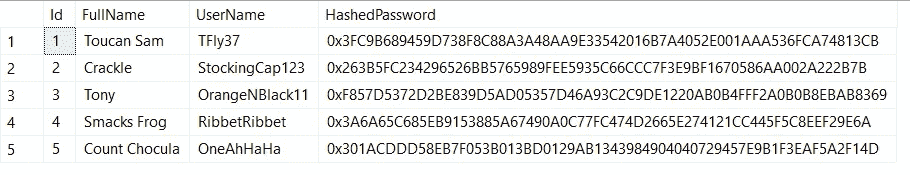
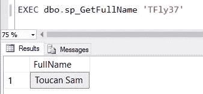
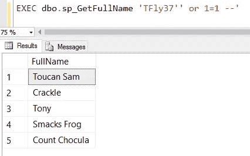
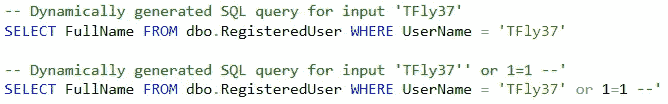

# 现在是 2017 年，您的查询仍然容易受到 SQL 注入的攻击吗？

> 原文：<https://medium.com/hackernoon/its-2017-are-your-queries-still-vulnerable-to-sql-injection-68c24dc5a327>


“[Medicine 1](https://www.flickr.com/photos/marosh/103066377/)” by [marosh](https://www.flickr.com/photos/marosh/) is licensed under [CC BY-NC-ND 2.0](https://creativecommons.org/licenses/by-nc-nd/2.0/).

*寻找一个脚本来发现您的服务器上可能的 SQL 注入漏洞？滚动到这篇文章的底部。*

[在 YouTube 上观看此内容](https://youtu.be/urAw58J9SJo)。

[OWASP 将 SQL 注入列为网络应用的头号漏洞](https://www.owasp.org/index.php/Top_10_2013-Top_10)。这种攻击的恶名甚至进入了流行的 XKCD 漫画[中。](https://www.xkcd.com/327/)

## 什么是 SQL 注入？

如果用户可以运行与最初意图不同的查询，那么 [SQL](https://hackernoon.com/tagged/sql) 查询容易受到 SQL 注入攻击。

有时 SQL 注入用一个例子更容易理解。[让我们使用这张注册用户表](https://gist.github.com/bertwagner/c22bd5c068f30bef21bf3738c5a52029):



然后让我们创建一个简单的存储过程来查询该表:

在上面的查询中需要注意的重要一点是，我们正在生成一个动态 SQL 语句；也就是说，我们正在构建 SQL 查询*字符串*，然后执行它。

假设这个存储过程正在运行，以便显示“欢迎使用<full name="">！”我们应用程序中的消息——网站访问者键入他们的`@ParmUserName`,我们执行存储过程返回他们的全名。</full>

下面是调用存储过程的代码:

```
EXEC dbo.sp_GetFullName 'TFly37'
```

和结果:



酷毙了。目前没有问题。

但是，如果我们的用户决定传入以下值作为他们的用户名呢？

```
EXEC dbo.sp_GetFullName 'TFly37'' or 1=1 --'
```

这个看起来很有趣的参数值返回如下内容:



**啊啊啊啊啊**！！！！

这个用户刚刚入侵了我们的网站，查看了我们表中的所有用户。

在这个特定的案例中，只有我们用户的全名被泄露，但在其他情况下，更敏感的数据，如密码、社会[安全](https://hackernoon.com/tagged/security)号码和银行账号也很容易被泄露(如果你想找点乐子，请在[上搜索“SQL 注入”,我被密码了吗？Pwned 网站列表](https://haveibeenpwned.com/PwnedWebsites)查看所有在保护你的隐私方面做得不好的公司)。

## 那么 SQL 注入的例子实际上是如何运作的呢？

因为我们的存储过程执行动态生成的查询，所以让我们看看对于传入的两个参数，生成的查询实际上是什么样子的:



尽管`TFly37'' or 1=1--`看起来不像一个可理解的输入参数，但是当它被连接到我们的查询中时，它是有意义的。

我们的恶意用户基本上是编写他们自己的 SQL 查询，该查询将返回我们用户的所有名称，而不仅仅是他们自己的名称。在许多情况下，狡猾的黑客可以更进一步，编写额外的注入代码来揭示整个用户表(或数据库中的其他表)的内容！

## 我如何预防 SQL 注入？

简单:不要将未组织的用户输入数据连接到 SQL 查询中。

在本例中，这很容易做到:只需重写存储过程，使其不使用动态 SQL:

当您没有动态 SQL 时，您不会受到 SQL 注入尝试的影响。

然而避免动态 SQL 并不总是可能的，那么在这些情况下我们能做什么呢？使用`sp_executesql`:

`sp_executesql` [允许您的动态 SQL](https://docs.microsoft.com/en-us/sql/relational-databases/system-stored-procedures/sp-executesql-transact-sql) 参数化，消除不必要的代码注入的可能性。

## 我当前的 SQL 查询是否容易受到 SQL 注入攻击？

所以 SQL 注入真的很糟糕，你不想变得像索尼、雅虎那样。我们如何检查我们的服务器上是否有易受攻击的查询？

我写了下面的查询来帮助你开始搜索。**它并不完美，**但它确实是审计潜在可注入查询的良好起点:

我发现这个脚本对我很有用，但是如果你发现它有任何问题，请让我知道，谢谢！

*你可能也会喜欢* [*在 Twitter 上关注我*](https://twitter.com/bertwagner) *。*