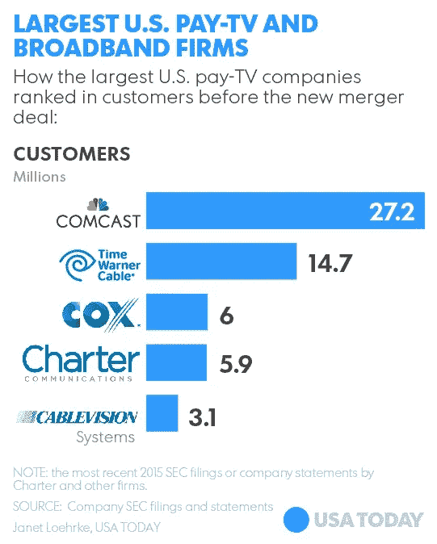

# 我们如何像电力一样部署互联网服务？

> 原文：<https://medium.com/hackernoon/its-2017-you-re-going-to-buy-a-new-house-that-was-built-just-for-you-690780c4afc9>

现在是 2017 年，你要去买新房子了。你需要选择谁将在你的公共街道上运送垃圾，选择使用固定塔架的电力供应商，在某些情况下，注册由私人公用事业公司运营的供水服务。这些都是你需要做出的第二天性决定，这样你才能过上富有成效和可持续的生活。

网络中立一直是十年来争论最激烈的话题。今天，我们有一个白宫，它的态度代表了整个概念的对立面。虽然推测 FCC 专员 Ajit Pai 以前支持开放互联网的概念，但众所周知他公开反对开放互联网。

我对网络中立问题的解决方案旨在基于克林顿-戈尔[信息高速公路](https://en.wikipedia.org/wiki/Information_superhighway)在地方范围内实施，这是一个由政府运营的服务器和交换机组成的国家系统，为每个美国家庭提供重要信息，就像每个家庭如何接收电话、天然气、电力和污水处理服务一样。

除非你使用井水，有丙烷，太阳能电池板或化粪池，否则你不会买房子或住在没有这些组件的房子里，你会吗？特别是电话线，这种基本的通信形式也可以*传输数据*，尽管速度较慢，除非使用数字用户线*。*

《赫芬顿邮报》详细描述了“信息高速公路”:

> 有一根电线进入你的家、学校或办公室，因为在美国每个人都有权使用电话服务。这是基于一根铜线，作为国有公用事业的一部分，其中大部分由现在的美国电话电报公司、威瑞森和 Centurylink 控制。这些网络正在老化，因为到 20 世纪 60 年代，几乎所有的美国都已经实现了电话服务的有线化。
> 
> 从 20 世纪 90 年代开始，(尽管各州有所不同)，这种铜线应该被光纤线取代，这将允许新的创新服务，更不用说有线电视和视频了。它一直被认为是基于国家的公用事业“公共交换电话网”的升级。
> 
> 它还应该对各种形式的竞争开放。作为顾客，你可以选择谁为你提供互联网、有线电视、宽带甚至电话服务。

此外，我们了解到，在过去的 20 年里，ISP 客户和纳税人一直在向一个系统付费，而这在私营企业中是永远不会发生的:

> 到 2014 年底，威瑞森、美国电话电报公司和 CenturyLink 三家当地电话公司将向美国收取约 4000 亿美元的费用，因为光纤的未来从未出现过。虽然它因州而异，但算上你每月支付的税收、费用和附加费(这些费用中的许多实际上是公司的收入或你支付的公司税)，从 1992 年到 2014 年，每个家庭大约为 4000 美元到 5000 美元，这是一个很低的数字。

我的计划进展非常简单:在几个特定的、有针对性的地方进行测试，比如有足够资源部署网络的城镇、城市或县，然后在全国范围内扩展和部署。市政宽带已经带来了一些好处。

你可能会问，当今天市场上已经有很多竞争时，这样做的目的是什么？嗯，没有。全国许多市场都有近乎垄断或寡头垄断的服务提供商。看看五大有线电视公司 2015 年的市场份额就知道了，把 Charter 和 TWC 合并。

这将如何工作呢？

不是社会主义吗？

不，在这方面你也错了。

这个计划是关于一个概念，只有一个:物流。

电信业的无能及其游说团体颠覆国会议员的顽固不化意味着，市政当局和政府现在需要掌握主动权，制定创新战略，将公民与重要的公用事业联系起来。

从私营企业得到的启示来看，我们可以把联邦快递作为一个例子来说明这是如何运作的。在他们庞大的配送设施中，每小时有成千上万的包裹被运送到拖车、货车、飞机和火车上。与 UPS 不同，联邦快递没有自己的地面车辆或雇佣司机(这是[有争议的](https://www.forbes.com/sites/robertwood/2015/06/16/fedex-settles-driver-mislabeling-case-for-228-million/#431fb08dc22e))，他们主要专注于将箱子搬到这些车辆上。换句话说，他们的收入和利润被用于复杂的分拣机、设备、设施、软件包、研发以及与前者相关的人员的工资/薪水。相反，UPS 拥有其所有的设备和车辆，这不仅增加了管理费用，还增加了需要跟踪的资产数量。

另一个可以与 ACA 开放式交易所进行比较的地方是，客户可以进入政府运营的保险提供商数据库，并为他们选择最佳匹配。市政宽带也存在类似的二分法。

这与[光纤到户](https://en.wikipedia.org/wiki/Fiber_to_the_x#Fiber_to_the_premises) (FTTP)和网络中立性有什么关系？我们如何用它来建设一个全国性的宽带网络？

首先，还没有 FTTP 系统的地方政府找到资金来源来建设这些线路。它可能来自出售可再生能源，如附近大坝的能源，或者投资该地区的太阳能项目。或者，可以简单到征收小额税，保证所有公民都能获得纤维。

下一步，互联网服务提供商将相互竞争，沿着新的公用事业“传递他们的数据包”。就像联邦快递沿着传送带运送盒子一样，互联网服务提供商将沿着光纤运送包裹。如果客户找到了更便宜的替代方案，因为另一家 ISP 找到了更便宜的方式将数据包发送给他们，那么该选项将是可用的。不会有“政府经营的互联网”这种东西，只会是政府保证和实施 FTTP。

最后，客户仍然可以通过他们选择的 ISP 在公共光纤上支付他们想要的速度。这并不意味着 ISP 可以降低流量，即使用户使用的是准系统，因为光纤的高容量会使这种尝试无效。由于这不过是试图掏顾客的钱包，在极少数情况下，地方政府将有权起诉违规的互联网服务提供商并处以罚款。

尽管目前网络中立的前景黯淡，但如果我们努力争取，光明的未来就在我们身边。

> [黑客中午](http://bit.ly/Hackernoon)是黑客如何开始他们的下午。我们是 [@AMI](http://bit.ly/atAMIatAMI) 家庭的一员。我们现在[接受投稿](http://bit.ly/hackernoonsubmission)并乐意[讨论广告&赞助](mailto:partners@amipublications.com)机会。
> 
> 如果你喜欢这个故事，我们推荐你阅读我们的[最新科技故事](http://bit.ly/hackernoonlatestt)和[趋势科技故事](https://hackernoon.com/trending)。直到下一次，不要把世界的现实想当然！

