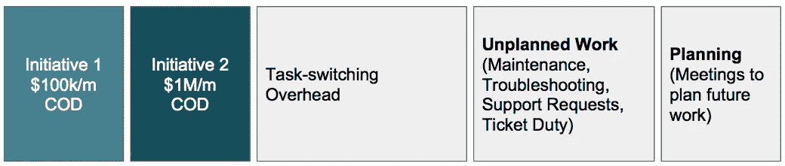
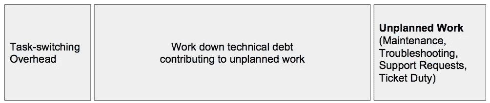

# 有些团队能完成任何事情，这是一个奇迹

> 原文：<https://medium.com/hackernoon/its-a-wonder-some-teams-get-anything-done-64104f59bf5e>

## 或者，为什么你应该可视化所有的工作和使用延迟的成本

让我们回顾两个(非常常见的)例子。

## 例子

**1 号展品**。这个团队正在进行两个**项目**。计划 1 每月花费公司 100，000 美元。计划 2 每月“花费”公司 100 万美元。

Work breakdown for a singe team

延迟成本(COD)是总期望值对时间的[偏导数。大约 30%的团队能力专门用于这两项增值计划。团队的剩余能力被“花费”在未计划的工作(源于未管理的复杂性)、对未来工作的计划以及任务转换上。为什么理性的人会这样工作？很容易…反应迅速，保持忙碌，展示首席执行官的宠物项目的一些进展，并务实地处理技术债务。他们应该怎么做？类似于…](https://en.wikipedia.org/wiki/Cost_of_delay)

Working down the technical debt to limit the amount of unplanned work

因为计划外的工作消耗的能力几乎等于两个增值计划的总和，所以尽快消除它可能是明智的，特别是考虑到未管理的复杂性的非线性本质。它可能会变得非常快。不幸的是，这将不受欢迎，因为“不做新东西”对团队来说是一种心理打击。

**附件 2** 。现在我们来看一个“共享”的团队(B 队)。也许他们是一个工具或基础设施团队。幸运的是，他们没有同样的债务悬在头上，但是他们必须为两个“高优先级”的项目服务(团队 A 发誓这是高优先级的，实际上可能是他们的最高优先级)。只有一个问题:其中一项工作(I2)是解决延迟成本的 10 倍(100 万美元对 10 万美元)。

Shared team (Team B) is splitting its capacity between two projects. Why?

这很糟糕吗？当然啦！太可怕了。倡议 2 占 10 个倡议 1。如果两者都做，计划 2 的完成会增加一个月，那么公司将“损失”100 万美元。为什么会这样？我能想到很多原因:

*   团队 B 有一个专门的资源，他不能处理计划 2，所以他们没有培训那个人，而是选择让那些人忙于其他事情。
*   B 队没有对 A 队进行反击，因为他们担心被称为没有反应。
*   有人承诺会演示倡议 1。在业余时间，一名设计师制作了一个人人都喜欢的模型。

## 讨论

为什么聚焦这么难？为什么减速到提速这么难？为什么这些团队做出不合理的决策？

1.  延期的成本。请注意我们是如何使用延迟成本来揭露在附件 1 的两个项目中拆分工作的愚蠢，以及在附件 2 的情况下两个共享项目的愚蠢。如果没有一个苹果到苹果的方法来区分工作的优先级，这种洞察力将是不可能的。延迟成本允许我们在结合对计划持续时间的粗略感觉时，做出明智的优先化决策。
    **待办事项**:用 CD3 ( [见此处](http://blackswanfarming.com/cost-of-delay-divided-by-duration/))开始估算延迟成本并进行优先级排序。
2.  **隐形工作**。在我的例子中，所有的工作都是可见的。这种情况很少发生，对于团队来说这是一个棘手的话题。将“票税”和计划外的工作公之于众会让人感到尴尬。在某些情况下，他们要求有回旋余地来减少债务，但遭到了拒绝。或者他们依赖另一个团队来解除障碍，而帮助永远不会到来。或者更糟的是，他们不希望总理否决他们的工作(即使他们知道这是必要的)。所以他们秘密地与计划外的工作作斗争。我在我的 [Ops 死亡螺旋帖子](/@johnpcutler/learned-helplessness-and-the-ops-death-spiral-b0fff7d916b1)中对此谈了更多。进行 Scrum 的团队也不能幸免。
    **待办事项**:做到足够安全，可视化所有工作。让团队参与进来，并解释优势。
3.  **任务切换**。我们长期低估了任务转换的影响(包括我们的个人生活和工作生活)。想象一天从早上 9 点开始。电子邮件。九点半有一个半小时的脱口秀。经过一些干扰后，你可以在午饭前集中精力工作一个小时。从下午 1 点到 3 点，你被困在会议中。更多计划外的工作。最后，从下午 4 点到 5 点，你可以讲一个故事。考虑每次中断后开始的成本。战壕里的人们经常谈论“逃跑的日子”。
    **待办事项**:限制在制品(WIP)。屏蔽不被打扰的时间。
4.  **保持忙碌**。我们天生就会忙忙碌碌。当某件事情被阻塞时，我们被编程来接下一个任务。产品经理不断地问“我们能并行处理这个吗？”一想到有人无事可做——或者上帝禁止指导另一个团队成员，或者完成一些微小的 UX 债务任务——就令人深感不安。高利用率是危险的。
    **To Do** :限制利用率可能很难，也不合理，但通过实施保守的 WIP 和观看队列可以达到同样的效果。
5.  团队只是需要更多的纪律。人们很容易将长的交付周期归因于缺乏团队纪律。因此引入了更多的过程(从而增加了计划时间)。从这些例子中可以看出，问题在于多任务和不受管理的复杂性。理想情况下，您测量的是交付周期——从计划构思到实际向客户交付预期价值的时间——因此您将能够获得何时需要更多资源(或更多关注)的早期指标。但是即使这样……趋势是将延迟归因于团队行为/纪律，而不是系统。
    **要做的事情**:让工作变得可见，诚实对待资源分配。展示团队正在努力工作，但同时面临多项任务。
6.  **讨好的需要。**你可能会认为优化公司的经济状况是头等大事。但事实并非如此。经理和团队希望提供帮助，并添加各种不需要存在的依赖和约束。领导人希望宣称他们正在全力以赴，兑现他们的所有承诺。也许团队 B 向团队 A 承诺他们将在第三季度开始(在计划 2 出现之前)。没有 B 队的帮助，A 队可能会无所事事，没有人喜欢无所事事的团队。
    **要做的事情**:嗯嗯。用经济术语来描述事物，并致力于全球经济结果？
7.  **不舒服的决定**。请注意这些例子中包含了多少艰难的讨论。我们倾向于回避艰难的对话，或者试图捍卫我们的地盘，而不利于确定最佳的前进方向。
    **要做的事情**:看书[关键对话](https://www.amazon.com/Crucial-Conversations-Talking-Stakes-Second/dp/1469266822)。使用延迟成本来保持事情基于经济学。

就是这样。没什么惊天动地的。

> [黑客中午](http://bit.ly/Hackernoon)是黑客如何开始他们的下午。我们是这个大家庭的一员。我们现在[正在接受投稿](http://bit.ly/hackernoonsubmission)，并乐意[讨论广告&赞助](mailto:partners@amipublications.com)机会。
> 
> 如果你喜欢这个故事，我们推荐你阅读我们的[最新科技故事](http://bit.ly/hackernoonlatestt)和[趋势科技故事](https://hackernoon.com/trending)。直到下一次，不要把世界的现实想当然！

