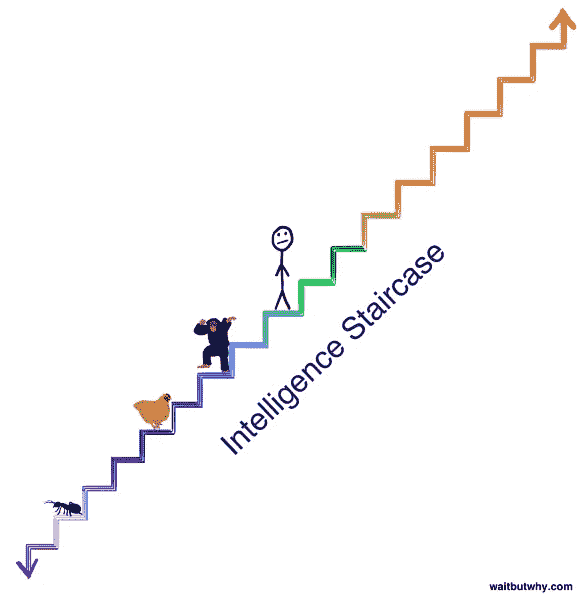

# 这是所有的乐趣和游戏，直到人工智能赢得所有

> 原文：<https://medium.com/hackernoon/its-all-fun-games-until-ai-wins-them-all-d5d657b064be>

你玩过[突围](https://hackernoon.com/tagged/breakout)这个游戏吗？你知道的，一种电子游戏，你把一个球弹入屏幕上方的方块中来打破它们。嗯，为了像你小时候一样打败那个游戏[谷歌](https://hackernoon.com/tagged/google)支付了 5 亿美元。没错，一家开发人工智能来打败越狱的公司价值 5 亿美元。

好吧……所以这家名为 DeepMind 的公司不仅仅是为了赢得电子游戏而成为*。它已经用更实际的方式应用其人工智能来加强谷歌，但玩游戏的想法是谷歌及其同行人工智能发展的核心。这提出了一个有趣的问题。*

AI 每局都赢会怎么样？

艾在国际象棋比赛中击败了我们中最好的人。(2011)[围棋](https://www.wired.com/2016/03/googles-ai-wins-fifth-final-game-go-genius-lee-sedol/) (2016)，以及最近的[扑克](https://www.wired.com/2017/02/libratus/) (2017)。令人兴奋(或害怕)的是许多专家不认为 AI 会在 10 年内打败一个围棋冠军。我重复一遍:那些毕生致力于推进人工智能的人不相信这在 10 年内能够实现。当权威人士质疑人工智能改变世界的速度有多快时，这应该让我们暂停一下。

但是当然还有很多 AI 尚未涉足的游戏。嗯，最近玩这些游戏变得容易多了。Open AI 是一家专注于实现人工智能使用民主化的非营利组织，它在 2016 年底发布了一个开源平台，任何人都可以在云中托管的 1000 多个视频游戏中轻松构建和测试人工智能。

 [## 宇宙

### 我们发布了 Universe，这是一个软件平台，用于在全世界范围内测量和训练人工智能的一般智能…

openai.com](https://openai.com/blog/universe/) 

围棋冠军 AlphaGo 的创造者 DeepMind 已经将目光放在了接下来的星际争霸 2 上。星际争霸是一个不完整的信息战略游戏——平衡资源管理、侦察和战术。这很重要，因为不完全信息博弈类似于现实世界的混乱。这与国际象棋和围棋形成对比，国际象棋和围棋有严格定义的结构，两个棋手都有每个棋手的棋子和过去行动的完整信息。

在这一点上，你可能想知道为什么公司要花费数十亿美元成为最擅长玩电子游戏的人？一个合理的问题。尽管 Twitch 的观众可能不同意，但视频游戏的胜利本身并不是目的。但是让我们用另一个问题来回答这个问题:人类为什么玩游戏？我们为什么要赢？

我猜想，答案是同一个。

一个简单的回答是，人们玩游戏是因为好玩。但是如果这是唯一的原因，那么我就浪费时间写了这么多，所以让我们再试一次。我们玩游戏是为了娱乐，也是为了学习。这种学习可以简单到如何与同龄人交往，也可以复杂到智胜对手所需的高级策略。游戏提供了一个*低风险的环境*来学习在生活中成功所必需的身体和精神技能——不管你如何定义成功——至少这是[维基百科](https://en.wikipedia.org/wiki/Game)告诉我的。在游戏结束后，我们把这些新创造的技能应用到我们设定和实现目标的努力中。这里的关键部分是游戏本身的风险较低。这允许我们尝试和失败，而不用担心长期失败。输了，我们就再玩一局。但是在生活中失败了，我们担心可能没有第二次机会。所以为了准备，我们玩。

所以为了准备现实世界的挑战，人工智能和我们一样，选择玩。

他们会一直玩下去，直到我们所有的游戏都被打败。很快我们的游戏对他们来说就会太简单了。这可能很难想象，但作为下一步，AI 很可能会创建自己的游戏来玩，这样他们就可以在低风险的环境中不断学习。同样，一只狗无法理解垄断，我们也无法理解这些新的人工智能游戏。为了对这个类比进行更深入的分析，请访问 waitbutwhy.com。

但这偏离了开篇的问题:游戏之后是什么？

在人工智能发现如何在像星际争霸这样的游戏中反复取得成功后，它似乎是一个相当直接的向现实世界的过渡。为什么一个知道如何专业地平衡资源消耗和军事战略的人工智能不能充分处理公司的供应链和物流战略？两者都有目标明确的数据输入和信息不完整的限制。

不，这不是一个完美的复制和粘贴的情况。人们参与到我们的现实中，所以当我们想出如何与人工智能交谈时，一开始会显得笨拙和犹豫。但鉴于这种学习曲线，这是合乎逻辑的进展。

在人工智能的后游戏时代，如果我们想让人工智能不断学习，除了让它们进入这个世界，我们别无选择。根本没有其他结果。人工智能有如此大的潜力来增加各种形式的人类产出，以至于有人会选择使用它。如果这是一个暴虐的政权或腐败的企业所为，巨大的痛苦将随之而来。确保这种转变对人类产生净积极影响的唯一方法是创造竞争性人工智能。为什么？因为在我们所有“kumbaya”法则和哲学的基础上，唯一支持它们的是权力。而唯一能制衡权力的就是权力。不管是好是坏，先进的人工智能将是人类有史以来发明的最强大的东西。我留给你这个:

> “自由在于分权。专制主义，权力集中。”——阿克顿勋爵

所以为了自由，让我们希望更多的人开始玩越狱。

点击这里关注马修·比金斯或者 T2 的 LinkedIn 了解更多

> [黑客中午](http://bit.ly/Hackernoon)是黑客如何开始他们的下午。我们是 [@AMI](http://bit.ly/atAMIatAMI) 家庭的一员。我们现在[接受投稿](http://bit.ly/hackernoonsubmission)并乐意[讨论广告&赞助](mailto:partners@amipublications.com)机会。
> 
> 如果你喜欢这个故事，我们推荐你阅读我们的[最新科技故事](http://bit.ly/hackernoonlatestt)和[趋势科技故事](https://hackernoon.com/trending)。直到下一次，不要把世界的现实想当然！

