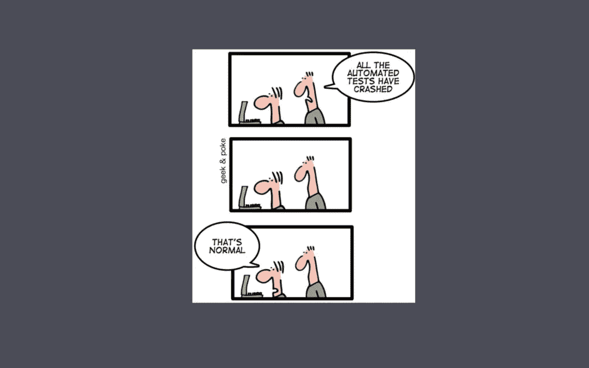
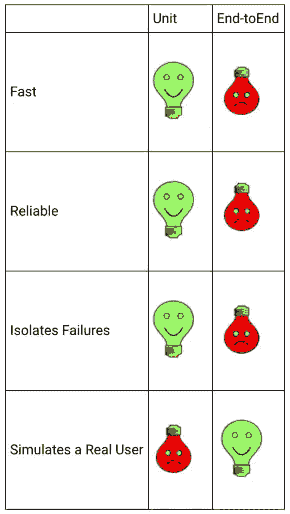
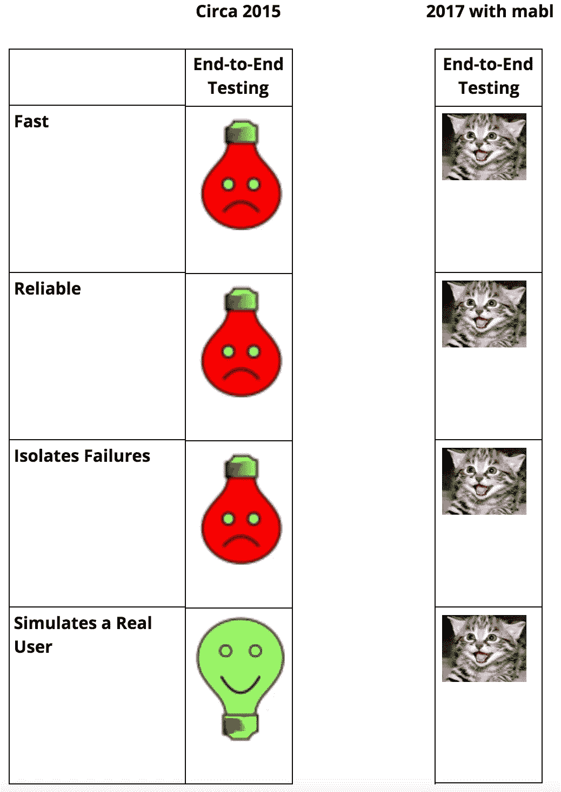

# 是时候使用机器学习来修复端到端测试了

> 原文：<https://medium.com/hackernoon/its-been-time-to-use-machine-learning-to-fix-end-to-end-testing-365ce718f359>

## 由 [Izzi Azeri，mabl 联合创始人](https://goo.gl/czfR5L)

> 披露: [mabl](https://goo.gl/7ZKSvU) **，**ML 驱动的测试自动化服务，之前赞助过黑客 Noon。

我是一名连续创业者，曾在谷歌、VMware、Stackdriver 工作过，现在是我的第二家创业公司，也是我联合创办的。我们在今年早些时候启动了 mabl，以帮助开发人员应对测试他们的应用程序的痛苦挑战，特别是随着 CI/CD 的采用和持续的自动化，开发周期越来越短。在我们创办公司的时候，我做了很多研究，主要是通过接触开发人员来了解他们对软件测试的看法，特别是那些已经采用 DevOps 的开发人员，我们还发起了一项[调查](https://www.surveymonkey.com/r/longreen)来获得量化的反馈。此外，我还发现了许多关于在现代开发人员工作流程中测试应用程序的挑战的博客。吸引我的博客帖子之一来自[迈克·瓦克](https://www.linkedin.com/in/mike-wacker-a1224395/)，他是谷歌的软件工程师，之前也是微软的开发人员。Mike 在 2015 年写了一篇[博客](https://testing.googleblog.com/2015/04/just-say-no-to-more-end-to-end-tests.html?m=1)帖子，讲述了为什么端到端测试不再重要，开发人员应该首先关注单元测试，其次才是集成测试，作为确保代码质量的基础。如果你还没有读过，并且参与了测试，你应该读一读。他的前提是(我在总结，可能对迈克不够公平):

*   E2E 测试“应该”为客户交付最大的价值，因为他们正在复制真实的用户场景。Mike 认为所有的产品利益相关者，包括开发人员、QA、经理都同意这个大前提。
*   然而，E2E 测试并不可靠，需要太长时间才能完成，而且当出现问题时，原因很难诊断。迈克认为，E2E 测试的这些问题应该迫使我们考虑一种不同的测试方法，以确保客户满意。
*   单元测试是直接的解决方案，因为它们能更快地发现错误并修复。这些与集成测试相结合，有助于一起测试众多组件，在编写冗长的 E2E 测试之前识别错误，是迈克对 E2E 测试的失信推荐的解决方案。

迈克当时的结论完全正确。既然你已经知道 E2E 测试带来的挑战，为什么还要浪费时间呢？相反，通过调整您的测试过程来进行补偿。

**进入机器学习**

正如桑德尔·皮帅在 [IO 2017](http://www.zdnet.com/article/google-bets-on-ai-first-as-computer-vision-voice-recognition-machine-learning-improve/) 上讨论的那样，鉴于计算机视觉、语音识别和机器学习的进步，谷歌正在改造其所有产品，以实现人工智能优先。我们已经从消费者的角度看到了谷歌多年来取得的进步，从自学式恒温器到交通导航，再到语音识别。谷歌的下一步是将人工智能应用于商业用例，这已经在[谷歌云](https://cloud.google.com/products/machine-learning/)中完成了。在 mabl，我们同意谷歌的观点。具体来说，我们相信 ML 可以对改善开发人员的生活产生深远的影响，让他们花更多的时间来构建伟大的产品，花更少的时间在重复的任务上。这就是为什么我们要挑战自己，解决迈克在 E2E 测试中指出的具体问题。

我们的[团队](https://www.mabl.com/team/)关注的一些事情包括:

*   古怪的测试
    ——正如 Mike 在他的博客中提到的，测试经常因为不可靠而失败。当这种情况发生时，开发人员会对他们的测试失去信心，并忽略它们。我们相信 mabl 应该能够自动检测到训练测试中的步骤何时因为 UI 的微小变化而失败。Mabl 应该向用户推荐一个补丁，并自动更新测试脚本。我们的目标是消除不稳定的测试，这样开发人员可以花更多的时间在编码上，花更少的时间维护他们的测试。
*   隔离失败
    ——开发人员大海捞针解决测试失败并不是对开发人员时间的最好利用。考虑到 mabl 一直在运行不同类型的机器创建的测试，她正在学习更多关于应用程序的知识，并且可以使用这些数据来提供应用程序的哪些部分以及哪些部分不工作的证据。对于 mabl 来说，帮助开发人员找出问题所在和原因非常重要。
*   测试速度
    ——Mike 特别指出要等待测试运行一整夜，只是为了找出某个特定的组件是否损坏。我们还从我们的一些用户那里听说，人工 QA 甚至将 QA 外包给人工测试人员仍然需要正常人的时间来测试。 ***我们认为测试应该是连续的，而不是一夜之间，应该以机器的速度运行，而不是人类的速度。***
*   自学测试
    ——Mike 没有提到的一件事是关于从过去的测试中学习。我们相信 mabl 应该不断地从她运行的测试以及用户给她的反馈中学习，就像 ML 应用于消费者模式一样。mabl 了解得越多，她就能越聪明地为用户提供关于其应用程序质量的见解。

**mabl 正在解决难题**

正如 Mike 指出的，端到端测试在今天(以及@2015 年 Mike 写博文的时候)是很难的。然而，我们认为我们应该修正 E2E 测试，而不是用单元和集成测试覆盖来取代 E2E。我们相信机器学习的进步允许我们修正 E2E 测试，甚至超越人类能够用测试自动化框架做的事情。我们已经这样做了 8 个月，一路上我们学到了很多。我们已经解决了一些难题，但还有许多要解决。如果您想了解更多信息，[请预留您的位置](https://goo.gl/7ZKSvU)以便提前访问，因为我们很快就会推出这项服务。

> 最初发表于 2017 年 10 月 25 日[www.mabl.com](https://www.mabl.com/google-was-right-in-2015-now-its-time-to-use-ml-to-fix-end-to-end-testing/)。