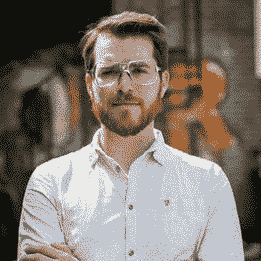
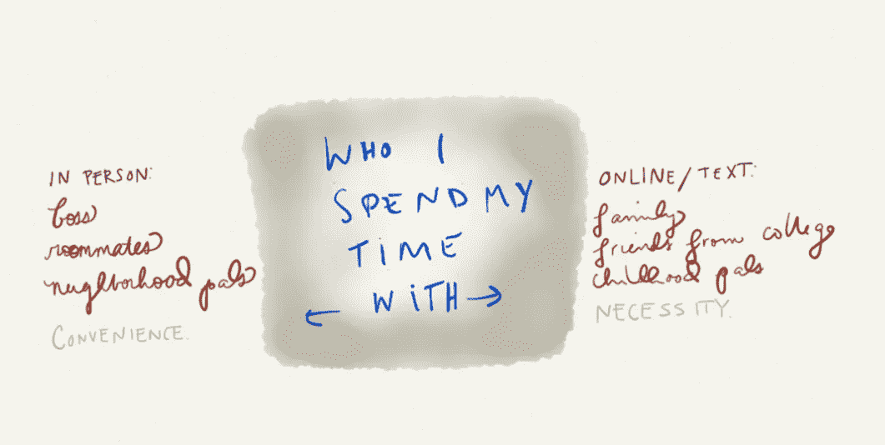
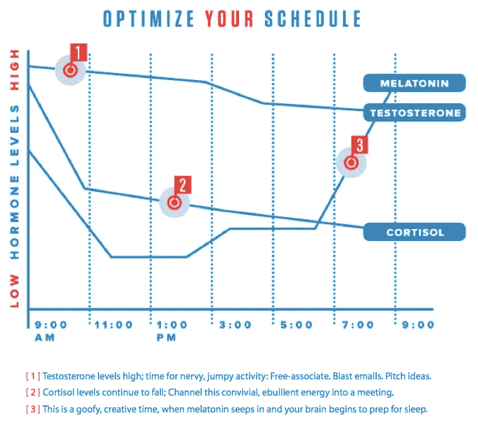
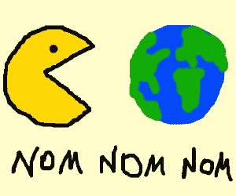
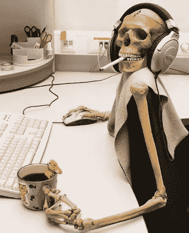
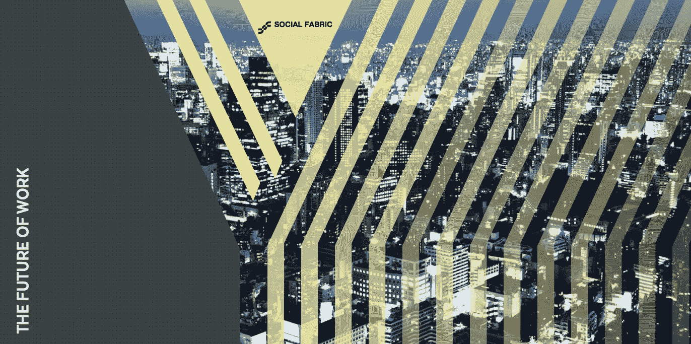

# 这是我们的工作方式

> 原文：<https://medium.com/hackernoon/its-how-we-work-b38d90255e2c>

我们为什么以这种方式工作？我们未来的工作将更多地是一个地方还是一种实践？在 2020 年，你的一天工作是什么样的？我们是否已经到了“玩耍”的高峰期？生产力会战胜存在感吗？当我们疲惫的系统不再适用时，组织自己的正确方式是什么？

这些年来，在我们的*未来工作*系列活动中，我们一直在探索这些问题和无数其他问题。我想从后视镜中看到顶峰，欣赏到目前为止我们遇到的出色的贡献者(他们的杯子也在上面闪烁):

**汉娜·布雷克**、[创新总监——MEC](https://www.linkedin.com/lite/external-redirect?url=http%3A%2F%2Fwww%2Emecglobal%2Ecom&urlHash=eCpF)、
萨姆·里德、[数字创新者](http://business.telus.com/en/business/internet/office-internet?INTCMP=NavMenu_SBS_Internet_OfficeInternet)、
德文·亨特、[帕恩特——创始人中心](http://www.foundercentric.com/)、
、[、**婴儿案**罗梅罗](http://babycakesromero.com/)、
、**乔迪·奥斯本**、[创始人——背叛者](http://thebackscratchers.com/)、
、埃里克·罗丹**如果呢！创新
**乔恩·伯克哈特**，[作者—新闻报道](https://www.linkedin.com/in/jonburkhart?authType=NAME_SEARCH&authToken=34IW&locale=en_US&trk=tyah&trkInfo=clickedVertical%3Amynetwork%2CclickedEntityId%3A3379392%2CauthType%3ANAME_SEARCH%2Cidx%3A1-1-1%2CtarId%3A1461569553052%2Ctas%3Ajon%20bu)
**詹弗兰科·奇科**，[创始人—泰肯实验室](http://taikenlab.com/)
**西蒙·莱文**，[电影导演](http://www.simonlevene.com/)
**纳维德·阿克兰**，[联合创始人—维斯塔德](https://vestd.com/)
**卢卡斯·塞登法登****

过去会议的一些片段:

# **关于协作**

培养开放和协作的工作文化对于组织在未来几年的蓬勃发展仍然至关重要。

# **突发工作时**

随着我们积极地将我们的思维模式从夜以继日的工作转变为高度集中的间歇性工作，冲刺式工作将变得越来越受欢迎。

# **关于环境**

都是为了把东西混在一起。如果你喜欢，可以在饮水机旁闲逛，去那家时髦的咖啡店，在地板上闲逛，同处一地，共同工作——做**#任何事情**

# **关于机械思维**

在未来二十年内，全球 50%的工作将实现自动化。对于确切的含义，观点存在分歧，但有一点是肯定的:下一代深度学习机器将非常聪明——它们将简单地自我编程。

# **论人**

在工作中找到自主性，但也要对任何给定项目中与他人相互联系的限制和好处保持敏感，在这两者之间取得微妙的平衡。

# **接合时**

一般来说，我们在工作中并不投入(近 85%的人声称他们没有投入，甚至**主动脱离**)。许多在创业领域的人不得不忙于工作，他们将每周工作 80 小时，这样他们就不必朝九晚五地工作。

# **关于机构**

为了保持相关性，它们必须继续从推-拉模式(模仿好莱坞)转变，强调敏捷性，并发展成为 21 世纪的学习型组织。

# **论创新**

把外部带进来——重组。简单。

# **关于创建内容**

内容正在吞噬世界，你需要不惜一切代价保持相关性。

# **论游牧民族**

查尔斯·汉迪是对的。预计到 2020 年，65%的劳动力将成为独立承包商。无论你是选择在沙滩上悠闲地环游世界，还是通过虚拟现实耳机将世界呈现在你面前，掌控自己命运的自由都将变得司空见惯。

四分之一个世纪后，我们可以承认，威廉·吉布森抓住了这个机会:

# “未来已经到来——只是分布不均匀而已。”

加入我们的第五版*工作的未来*系列:

**布雷特·麦克法兰**、[总监— ustwo](https://ustwo.com/)
**埃尔科·伊恩**、[成长黑客—绘画互联网](http://www.paintingtheinternet.com/)
**大卫·卡萨里**、[产品体验总监—自动化](https://automattic.com/)

将有助于指导我们探索新的运营模式、设计社区和开创未来。

***2016 年 5 月 19 日星期四@ Shoreditch House***

# [RSVP 这里](mailto:we@socialfabric.com)

还想对未来的工作有更多的了解吗？更多阅读自[**第四场**](https://hackernoon.com/the-future-of-work-sessions-c1d26536bb60#.t4eyps7vt)[**第三场**](http://socialfabric.com/2015/08/future-of-work-talks/)[**第二场**](http://socialfabric.com/2015/04/future-of-work-shoreditch-house/)[**第一场**](http://socialfabric.com/2014/09/better-ways-working/)

> [黑客中午](http://bit.ly/Hackernoon)是黑客如何开始他们的下午。我们是 [@AMI](http://bit.ly/atAMIatAMI) 家庭的一员。我们现在[接受投稿](http://bit.ly/hackernoonsubmission)并乐意[讨论广告&赞助](mailto:partners@amipublications.com)机会。
> 
> 如果你喜欢这个故事，我们推荐你阅读我们的[最新科技故事](http://bit.ly/hackernoonlatestt)和[趋势科技故事](https://hackernoon.com/trending)。直到下一次，不要把世界的现实想当然！

