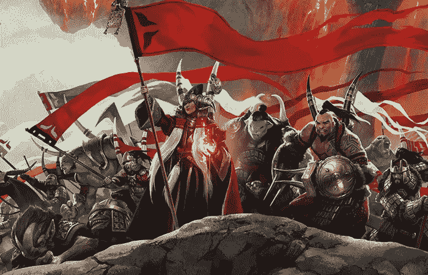
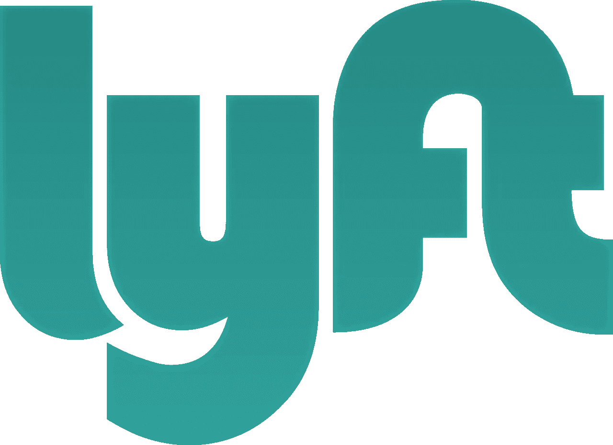

# 这不是结盟，这是统治

> 原文：<https://medium.com/hackernoon/its-not-alliance-it-s-domination-d641b6fc81b0>

> 最近轰动互联网的新闻是滴滴和优步中国的“合并”。打车行业的其他参与者会有什么打算？

所以现在全世界都知道了滴滴和优步中国合并的爆炸性新闻。在这笔交易中，优步中国收购了[滴滴](https://hackernoon.com/tagged/didi)，优步持有滴滴 20%的股份，使滴滴的估值达到 350 亿美元，并以 680 亿美元的估值投资了优步环球 10 亿美元。

仅这一项交易就给其他打车巨头 Lyft、Grab 和 Ola 带来了一些麻烦。我们能从这个联盟中期待什么？

**1。总合并**

甚至想一个全盘合并都不算太牵强。从滴滴目前的 350 亿美元和优步的 680 亿美元估值来看，我们实际上看到的是一个总估值至少为 1000 亿美元的企业集团。

我会让计算人员来计算实际的估价，但这可能意味着更多。当新闻第一次在彭博爆出时，它提到了优步追求其首次公开募股野心的途径。

把这个想法再坚持一会儿。为什么？我敢肯定，滴滴和优步在各大洲的所有投资者可能都在打电话，看看更大的图景可能是什么。在这两家巨头之间，至少有半打投资者投资了这两家公司。此外，滴滴还投资了所有竞争对手。

虽然你可能会说这是一种自然的对冲策略，但我会进一步假设这笔交易实际上让这些投资者有些紧张。如果滴滴决定在中国以外扩张，我们可能会再次看到另一轮大屠杀。为什么要冒着损失几十亿的风险去赚更多的钱呢？为什么不为投资者创造一个双赢的局面呢？

如果有可能的话，最简单的解决方案是完全合并，然后滴滴和优步都可以坐下来，在 IPO 后以所有其他竞争对手为代价，开拓自己的领地。一个非常有趣的想法，你说呢？

**2。时机成熟**

假设完全的合并不会发生，但是要拥有完全的统治地位，就要进行一些征服。虽然《彭博报告》确实指出，这笔交易现在允许优步在其他地方扩张，但猜测优步在想什么也就不足为奇了，滴滴也将扩张。

我们来看看配角。Lyft 主要在美国，Ola 在印度，Grab 现在在东南亚地区陷入了困境。我们可以用它来描绘什么样的场景？

**优步收购 Grab**

不，这可能不会发生。但是让我们想象一下。如果达成协议，优步可能会取消 Grab 的出租车业务。好吧，你认为我疯了。但是仔细想想。由于服务质量差，与所有现有的出租车公司竞争要容易得多。优步不需要“教育”出租车公司。优步只需要让出租车司机转而使用优步服务。

这也将使滴滴的进入变得更加困难，因为其主要业务来自打车服务。这意味着滴滴将不得不重新开始。与此同时，鉴于中国在该地区的声誉，他们将很难获得市场份额。也许在柬埔寨，但我们不要政治化。

**b .滴滴收单抢**

如果滴滴在没有相关的大型合并的情况下扩张到该地区，它也不会玩得很好。随着优步获得首次公开募股，我们将见证另一轮烧钱，这一次，这是一场三方大战。

因此，此次收购似乎是一个更自然的选择。滴滴已经[投资](https://techcrunch.com/2015/08/18/grabtaxi-lands-350m-new-backers-include-chinas-top-uber-rival-didi-kuaidi/)Grab，为什么不完全收购呢？滴滴不用改名字，至少不会马上改(想想联想和 IBM)，单调真的不是一个可以恰当使用的词。

Grab 的最大投资者之一是淡马锡，所以想想吧。我很确定淡马锡不想让 Grab 陷入困境。此外，Grab 目前的[估值](http://blogs.wsj.com/digits/2016/01/28/why-southeast-asias-grabtaxi-is-removing-taxi-from-its-name/)相对较低，足以进行一次完整的收购，甚至超过几倍。可以肯定地说，Grab 肯定也在考虑这种可能性。这是一笔甜心交易，投资者和所有联合创始人都获得了丰厚的回报。

另一种可能性是 Lyft 和 Grab 合并，但这不会产生太大的威胁，只是代表一只苍蝇被拍走的刺激。这次合并即使有价值，也是微乎其微。

**3。反优步联盟**

反优步联盟几乎已经死亡。正如 NYT 所报道的那样，鉴于滴滴和优步中国的合并，这一联盟意义不大。

这次合并有效地加强了 Ola 的存在。在可预见的未来，我看不到这些打车公司中的任何一家会想进入印度，合并将牢牢地把 Ola 留在印度。

因此，反优步联盟将简单地演变成包括优步在内的所有人与奥拉的合作。

**结论**

在涉及数十亿美元的时候，中国企业的基因是主导，而不是示好。更不用说滴滴在打车大战中失利的丢脸可能性了。合并只是第一步，总体合并似乎在几个层面上最有意义。首先，滴滴不用再担心其他竞争对手，优步已经站在了战斗的前沿。这也否定了滴滴必须征服美国的必要性。

认为滴滴进入东南亚后会受到欢迎是痴心妄想。这是一个赢家通吃的游戏。Grab 不会是一个不惜一切代价的抢夺者，但它没有选择的奢侈。软着陆将被滴滴收购，然后滴滴和优步完全合并，(也许会产生**配音**？)以及这家大公司的最终 IPO。

正如《NYT》的文章所概述的那样，Lyft 也可能会因为美国的反垄断法而幸免于难，但永远会困于渺小。

或许最大的赢家是苹果。20 亿美元的小钱，让它可以廉价进入打车领域，并有真正的机会泰然自若地推出无人驾驶汽车计划。

> [黑客中午](http://bit.ly/Hackernoon)是黑客如何开始他们的下午。我们是 [@AMI](http://bit.ly/atAMIatAMI) 家庭的一员。我们现在[接受投稿](http://bit.ly/hackernoonsubmission)并乐意[讨论广告&赞助](mailto:partners@amipublications.com)机会。
> 
> 如果你喜欢这个故事，我们推荐你阅读我们的[最新科技故事](http://bit.ly/hackernoonlatestt)和[趋势科技故事](https://hackernoon.com/trending)。直到下一次，不要把世界的现实想当然！

