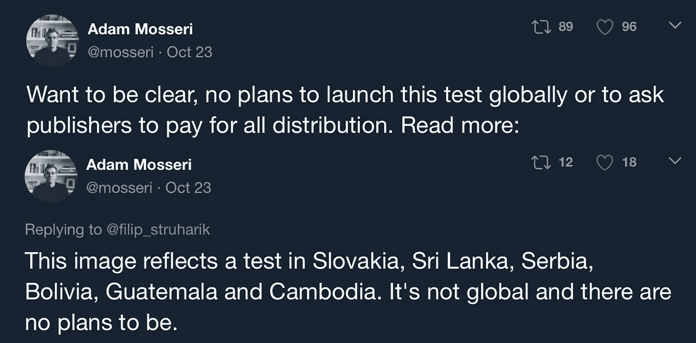
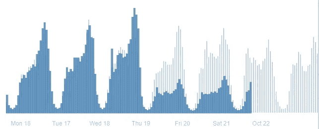
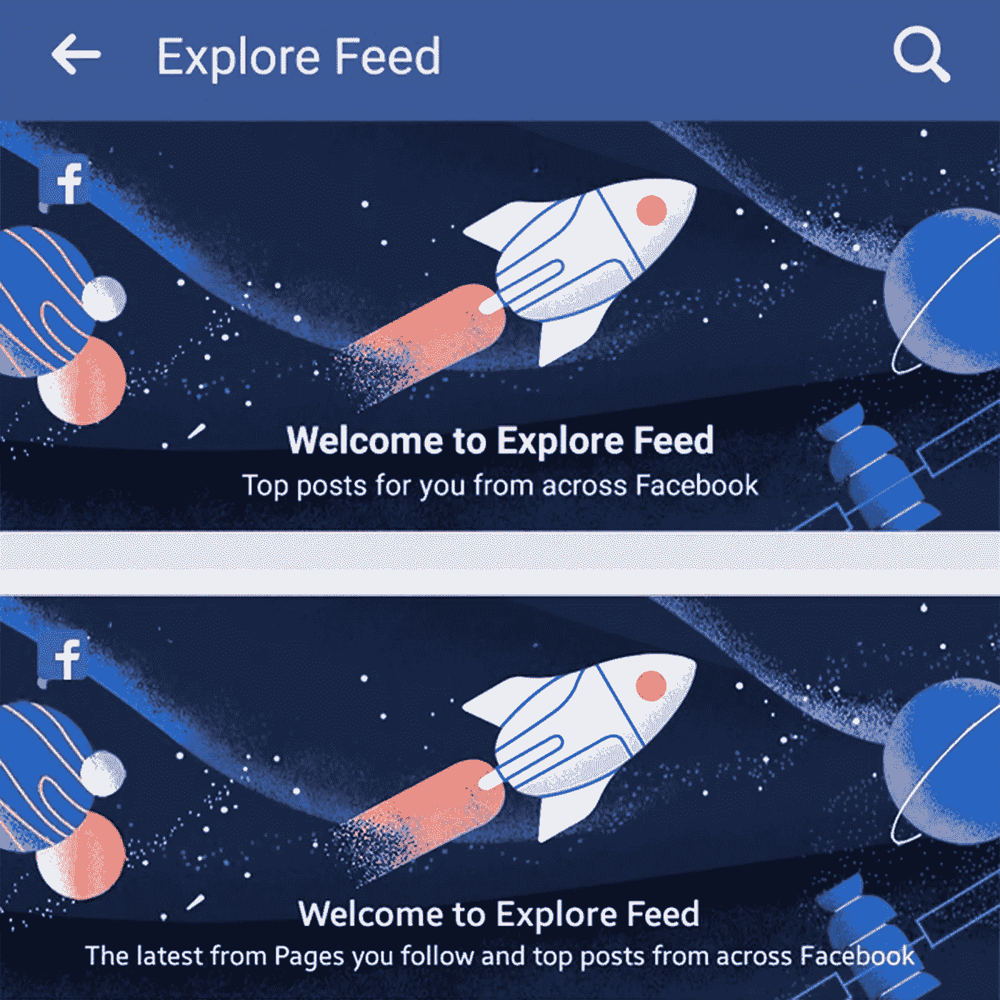
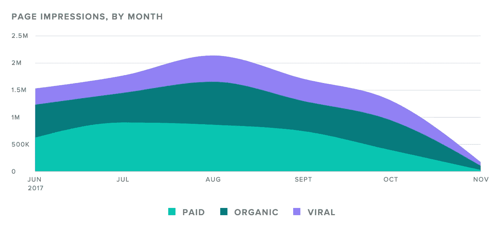

# “它不是全球性的，也没有计划成为全球性的。”—牙缝中的脸书

> 原文：<https://medium.com/hackernoon/its-not-global-and-there-are-no-plans-to-be-facebook-through-its-teeth-9425c0f6bb56>

10 月 21 日， [Filip Struhárik](https://medium.com/u/a630f8445766?source=post_page-----9425c0f6bb56--------------------------------) 决定抽出一点时间来写一写他们所见过的[脸书有机河段最大的下降](/@filip_struharik/biggest-drop-in-organic-reach-weve-ever-seen-b2239323413)，世界各地都能听到的截图就这样诞生了。

Interactions on 60 biggest Slovak media Facebook pages. Facebook is testing Explore Feed since Thursday. Source: CrowdTangle.

脸书最近测试了一些 Newsfeed 算法的变化，即 Explore Feed，该算法显示六个国家(斯洛伐克、斯里兰卡、塞尔维亚、玻利维亚、危地马拉和柬埔寨)的有机流量大幅下降。)

这个探索 feed 的基础是将品牌页面转移到一个独立的 Feed 中，这个 Feed 组合了他们所谓的“全脸书最好的页面”。

我们发现了这个视频的几个不同版本。

第一个看起来是美国用户最熟悉的，显示这将是你可能感兴趣的随机页面中的最佳帖子。第二张展示了更多脸书正在慢慢尝试完成的事情，那就是把最初的新闻反馈带回到它的起源——老友记第一类型的氛围。

这意味着没有品牌页面会出现在用户的新闻提要中，除非是广告集或赞助内容。

作为一名社交媒体总监，我做了任何一个有权有势的体面人都会做的事情，大声喊道:“哦，这是一个混蛋！”

一些同事和我最近开始讨论 10 月初左右的低到达率，这让我想回去仔细检查一下我们的客户的有机到达率有多低。

Page impression from June 1 2017 through November 6th 2017

没错。

我们的总访问量从 8 月份的 2，135，419 增至 10 月份的 1，310，118。

同样的废话，但是等一下，这不应该影响我们，因为这只是在几个国家的测试，脸书没有在其他地方扩张的计划！或者他们有吗？

[从这个推特时刻](https://twitter.com/i/moments/922764964267511808)我们从脸书新闻供稿负责人亚当·莫塞里那里得到一些信息，他试图让所有的营销和品牌经理裸体跑来跑去，把事情放在火上。

虽然他的评论让一些业内人士冷静下来，他们可以坐下来享受一些劣质的美国苹果酒，但其他人开始辩论他们听到的谣言。

有人说，品牌帖子的分享甚至不会出现在原始的新闻提要中，所有页面帖子将会在 Beyond Thunder Dome 提要中滚动，该提要聚集了你解除好友关系以供分享的那种垃圾。

快进到今天，11 月 6 日，星期一。

继续在手机或桌面上浏览你的新闻，我会等你的。注意到有什么不同吗？您在原始订阅源中看到的每个页面帖子都是一个广告集。

不仅如此，这里还有脸书如何向你展示你所关注页面的帖子。

在旋转木马里。

“你可能喜欢的页面故事”是你在一个区域关注的页面的八个帖子的集合。

所以它们并没有完全消失，但是八分之七被埋得如此之深，以至于你试图找到的人想要挖通那里看到它们的可能性非常小。

目前，来自页面的共享帖子仍会出现在最初的新闻提要中，但这可能会持续到他们完全转向探索提要、拥有专用的页面提要或坚持新闻提要中页面帖子的传送带。

更需要考虑的是，一旦用户的新闻源变得更加个人化，并且看到你的赞助内容，他们会有什么反应。侵犯他们新发现的好友时间会对感情产生怎样的影响？

脸书真的在寻找用户的最佳利益，并努力成为最好的出版和媒体平台吗？

当地球上三分之一的人是你的顾客时，你几乎可以在一些面包上拉屎，让他们买一个三明治。

但是你可能不需要担心吃一个，对吗？

“它不是全球性的，也没有计划成为全球性的”