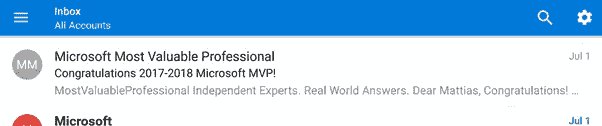
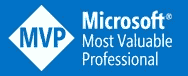

# 我已经成为微软 Azure MVP 了

> 原文：<https://medium.com/hackernoon/ive-become-a-microsoft-azure-mvp-67ff0b84d835>

## 有些东西会在你最不经意的时候出现

这是一个星期六的下午 5 点，你在度假，和你的孩子一起骑自行车，停下来吃冰淇淋。你像其他人一样快速浏览你的信息，有一条引起了你的注意:

你打开邮件，通读一遍:

> 亲爱的马蒂亚斯，
> 
> 祝贺你！我们非常高兴向您颁发 2017–2018 年度微软最具价值专业人士(MVP)奖！该奖项授予杰出的技术社区领导者，他们通过展示模范承诺，与他人分享自己非凡的热情、现实世界的知识和技术专长。我们感谢您过去一年在 Microsoft Azure 技术社区做出的杰出贡献。

尽管它带来了什么消息是 100%显而易见的——但感觉还是有点不真实。我被提名已经有一段时间了，在提名期间，除了当有人新提名你或者当你为你的主动提名添加活动时你会收到确认电子邮件之外，我没有听到太多关于这个项目的消息。所以即使你知道这是可能的，但这一点也不在意料之中。

我经常开玩笑地说，我在狂妄自大和冒名顶替综合症之间徘徊——虽然这是开玩笑的，但还是有一定道理的。虽然可能对傲慢部分没有帮助，但我发现写下你所做的事情非常“有益”——因为它将事实摆在桌面上，与我的工程师对话。拥有一份清单让事情变得“可衡量”和“可操作”！

我作为提名的一部分提交的一些活动导致了这个奖项，现在在我的 MVP 个人资料页面上公开了，网址是:

https://mvp.microsoft.com/en-us/PublicProfile/5002677

总的来说，我真的很感激，很荣幸，我必须承认有一点骄傲，我是第一次被授予微软 MVP 的 36 人中的一员。和你的孩子一样，你不应该有最喜欢的人，你也不应该有最喜欢的 MVPs 但是我必须说我真的很高兴我的朋友[加里·帕克](http://www.gep13.co.uk/blog/i-am-a-microsoft-mvp)也获得了这个奖项:

展望未来，我有很多想法要写博客，组织聚会和活动，维护开源项目，向产品团队提供反馈，在会议上发言，并很高兴看到作为 MVP 计划成员的一部分，将会有什么新的体验！

> [黑客中午](http://bit.ly/Hackernoon)是黑客如何开始他们的下午。我们是 [@AMI](http://bit.ly/atAMIatAMI) 家庭的一员。我们现在[接受投稿](http://bit.ly/hackernoonsubmission)，并乐意[讨论广告&赞助](mailto:partners@amipublications.com)机会。
> 
> 如果你喜欢这个故事，我们推荐你阅读我们的[最新科技故事](http://bit.ly/hackernoonlatestt)和[趋势科技故事](https://hackernoon.com/trending)。直到下一次，不要把世界的现实想当然！

