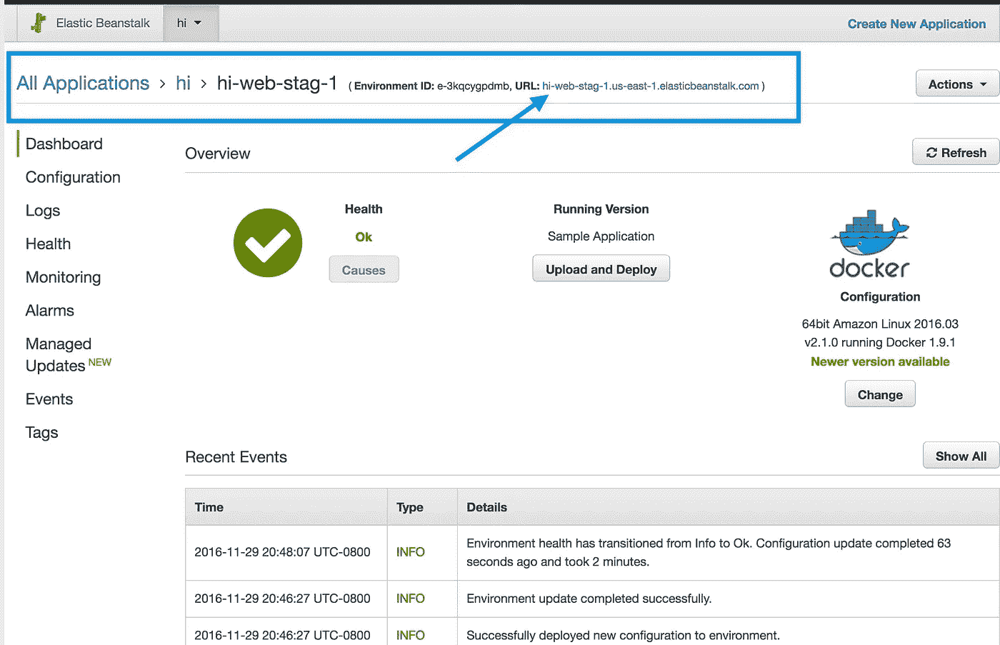

# Jack 和弹性豆茎——管理 AWS 弹性豆茎环境的简单方法

> 原文：<https://medium.com/hackernoon/jack-and-the-elastic-beanstalk-easily-manage-aws-environments-3ab496f08ad2>


感谢我收到的关于千斤顶工具的反馈:

> Jack 真的很酷，很有用，同时也让开始使用 EB 变得很容易。谢谢你更新版本和详细的说明，我只花了不到 10 分钟就为它设置好了一切-我对它的简单感到震惊。——图利的本杰明·坎特

该工具的文档可在 jack-eb.com[获得](http://jack-eb.com)

# 介绍

大约 2 年前，我开始更多地使用 AWS ElasticBeanstalk。并非巧合的是，这正是 AWS 为弹性豆茎添加 [Docker 容器支持的时候。](http://aws.amazon.com/blogs/aws/aws-elastic-beanstalk-for-docker/)

首先， [Elastic Beanstalk](http://aws.amazon.com/elasticbeanstalk/) 是 AWS 的 PaaS 产品，为部署和扩展 web 应用程序提供易于使用的服务。这有点像 AWS 版的 heroku，至少是在同一个空间里。代码上传到 Elastic Beanstalk 后，它会自动处理应用程序的容量供应、负载平衡、自动伸缩和健康监控。同时，开发人员保留对支持其应用程序的底层 AWS 资源的控制权。

对于像 Elastic Beanstalk 这样的 PaaS 产品，通常会有一个官方支持的语言列表。Elastic Beanstalk 官方支持:Go，Java SE，Java with Tomcat，。NET 在 Windows Server 上用 IIS，Node.js，PHP，Python，Ruby。

不过，有了 Docker 的支持，Elastic Beanstalk 为开发人员提供了一种方法，让他们可以为自己的服务使用任何编程语言和应用服务器。开发人员可以配置 Docker 容器，安装所需的额外包和库，而不必定制服务器本身。弹性豆茎处理为他们部署 Docker 容器。

与大多数 AWS 服务一样，Elastic Beanstalk 非常棒，只需要在服务之上添加一些工具来加速流程。这篇文章也介绍了用于快速创建和管理弹性 Beanstalk 环境的插孔。

# 杰克和弹性豆茎

我将介绍一些 jack 工具功能的简短示例。更多细节可以在项目[自述](https://github.com/tongueroo/jack)中找到。

# 创造环境

首先，用 jack 创建新的 EB 环境非常容易。通常使用 EB，您需要首先创建“EB 应用程序”,然后才能创建“EB 环境”。作为环境创建的一部分，Jack 会自动为您创建应用程序。这里有一个例子来说明它是如何工作的。

```
$ git clone https://github.com/tongueroo/sinatra
$ cd sinatra
$ jack create hi-web-stag-1
Running: eb init -r us-east-1 -p "64bit Amazon Linux 2016.03 v2.1.0 running Docker 1.9.1" "hi"Running: eb create --sample --nohang --keyname "default" --platform "64bit Amazon Linux 2016.03 v2.1.0 running Docker 1.9.1" --cname hi-web-stag-1 hi-web-stag-1
Environment details for: hi-web-stag-1
  Application name: hi
  Region: us-east-1
  Deployed Version: Sample Application
  Environment ID: e-3kqcygpdmb
  Platform: 64bit Amazon Linux 2016.03 v2.1.0 running Docker 1.9.1
  Tier: WebServer-Standard
  CNAME: hi-web-stag-1.us-east-1.elasticbeanstalk.com
  Updated: 2016-11-30 04:04:56.608000+00:00
Alert: An update to the EB CLI is available. Run "pip install --upgrade awsebcli" to get the latest version.
$ jack deploy # to deploy fresh code now
```

自动创建`hi`应用程序并创建`hi-web-stag-1`环境。默认的 EB 样例应用程序最初被上传到环境中，因此您可以在引入自己的代码之前测试环境以确保一切正常。您可以从 EB 控制台获取 DNS 端点并测试它是否工作。



下面是 curl 命令，用于测试应用程序是否返回 200 响应:

```
$ curl -svo /dev/null hi-web-stag-1.us-east-1.elasticbeanstalk.com 2>&1 | grep '< HTTP'
< HTTP/1.1 200 OK
$
```

# 创建多个 EB 环境

创建一个环境并创建应用程序并不是什么大不了的事情。最酷的是，jack 可以下载现有的环境配置，您可以使用它来快速重建更多的环境。EB 有一个克隆特性也可以做到这一点，但是如果环境之间的配置略有不同，您可以使用文本编辑器快速编辑下载的配置并从中创建一个新环境。我发现这种流动可以更快。

因为 jack 下载了整个配置，所以它还允许您“重命名”一个 EB 应用程序。可以理解的是，EB 克隆特性只在应用程序中起作用。使用 jack，您可以从任何应用程序的环境中下载配置，并在新的应用程序下完全重新创建它。这里有一个例子:

```
$ jack get hi-web-stag-1 -c hiworld-web-stag-1 # saves jack/cfg/hiworld-web-stag-1.cfg.yml
$ jack create hiworld-web-stag-1 # creates an hiworld app using jack/cfg/hiworld-web-stag-1.cfg.yml
$ jack deploy # deploys fresh code
```

# 比较多个 EB 环境

使用 jack 可以做的另一个技巧是快速比较 EB 环境之间的差异。您可以遍历多个环境，下载所有配置并快速比较它们的差异。假设您已经创建了两个登台环境:hi-web-stag-1 和 hi-web-stag-2。现在，您需要比较这两种环境的差异。如果有人使用 EB 控制台更新其中一个环境，就会发生这种情况。通常这被报告为“其中一个环境被破坏”。这里有一个快速比较的例子。

```
$ for i in {1..2} ; do jack get hi-web-stag-$i ; done
$ colordiff jack/cfg/hi-web-stag-{1,2}.cfg.yml
```

如果您有 3 个暂存环境:

```
$ for i in {1..3} ; do jack get hi-web-stag-$i ; done
$ colordiff jack/cfg/hi-web-stag-{1,2}.cfg.yml
$ colordiff jack/cfg/hi-web-stag-{1,3}.cfg.yml
$ colordiff jack/cfg/hi-web-stag-{2,3}.cfg.yml
```

这是一种非常快速的方法来检查环境之间的差异，并在有人说“环境关闭”时帮助调试。

# 应用预览

另一个值得强调的有用的 jack 特性是，它会在上传之前对配置进行区分，以验证您没有意外地忽略之前所做的更改。非常棒的是，Elastic Beanstalk 让开发人员可以很容易地使用 EB 控制台 GUI 来更新环境。然而，这有时会导致团队成员做出其他人不知道的改变。为了帮助解决这个问题，jack 工具将首先下载当前的 EB 配置，然后对您正在上传的配置进行比较，向您显示差异。这对于避免意外删除配置更改非常有帮助。

下面是一个实例类型从 t2.micro 更改为 t2.small 的示例。

```
$ jack apply hi-web-stag-1
Downloading config file...
Running: eb config save --cfg current-2016-11-29_22-19-27 hi-web-stag-1Configuration saved at: /Users/tung/src/tongueroo/sinatra/.elasticbeanstalk/saved_configs/current-2016-11-29_22-19-27.cfg.yml
Comparing ./.elasticbeanstalk/saved_configs/current-2016-11-29_22-19-27.cfg.yml and jack/cfg/hi-web-stag-1.cfg.yml
11c11
<     InstanceType: t2.micro
---
>     InstanceType: t2.smallAre you sure you want to update the environment with your the new config ?
If the difference is not what you expected, you should say no.
A blank newline indicates that there was no difference.
If you want to download the config from the environment and
overwrite your jack/cfg/hi-web-stag-1.cfg.yml instead, you can use this command:
$ jack get hi-web-stag-1
$ jack get help # for more info
yes/no? [no] yes
Copying jack/cfg/hi-web-stag-1.cfg.yml to ./.elasticbeanstalk/saved_configs/hi-web-stag-1-2016-11-29_22-19-27.cfg.yml for the upload
Running: eb config put hi-web-stag-1-2016-11-29_22-19-27Updating environment hi-web-stag-1 with template hi-web-stag-1-2016-11-29_22-19-27
$
```

# 摘要

Jack 是一个非常简单的工具，它在 eb 命令之上提供了一些额外的有用命令，比如`jack create,` `jack get`和`jack apply`。我希望其他人也觉得这个工具有用！

> 谢谢你读到这里。如果你觉得这篇文章有用，如果你推荐这篇文章(点击拍手按钮)让其他人也能找到它，我会非常感激！另外，请在 [LinkedIn](https://www.linkedin.com/in/tongueroo/) 上与我联系。

[](http://bit.ly/HackernoonFB)[](https://goo.gl/k7XYbx)[](https://goo.gl/4ofytp)

> [黑客中午](http://bit.ly/Hackernoon)是黑客们下午的开始。我们是 [@AMI](http://bit.ly/atAMIatAMI) 家庭的一员。我们现在[接受投稿](http://bit.ly/hackernoonsubmission)并乐意[讨论广告&赞助](mailto:partners@amipublications.com)机会。
> 
> 如果你喜欢这个故事，我们推荐你阅读我们的[最新科技故事](http://bit.ly/hackernoonlatestt)和[趋势科技故事](https://hackernoon.com/trending)。直到下一次，不要把世界的现实想当然！

