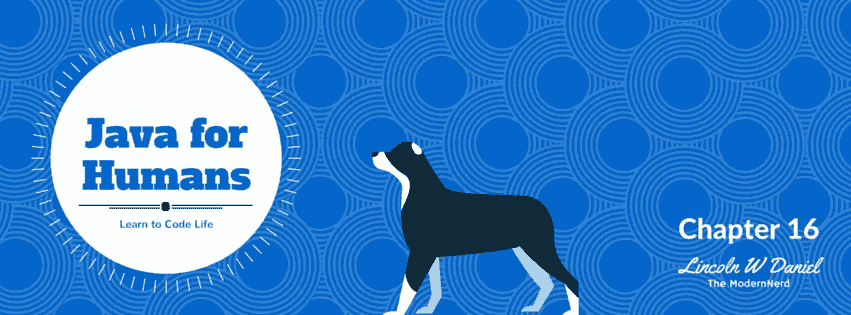

# 面向人类的 Java 类继承}

> 原文：<https://medium.com/hackernoon/java-for-humans-class-inheritance-d82a357b2659>

[**View Table of Contents**](/modernnerd-code/java-for-humans-table-of-contents-457306e6bc1c#.n3y0jb7xc) | [**Download Supporting Code**](http://javaforhumans.com/code)| [Subscribe to ModernNerd Youtube Channel for Coding Videos](https://www.youtube.com/channel/UC_zTAq-3TIfGqvoB_U6Peyg) | [By Lincoln W Daniel](http://lincolnwdaniel.com)

继承是所有编程中最强大的概念之一。没有它，我们很难做很多很酷的事情。我小时候最喜欢的游戏之一是征服 2.0。这个游戏很有趣，因为你可以成为任何人，同时，每件事都和其他事一样。是的，既不同又相同。这不是很好吗？让我解释一下。