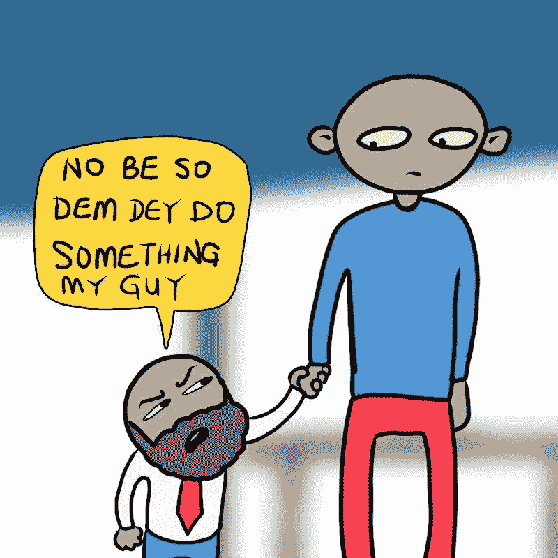

# 初级开发人员故事

> 原文：<https://medium.com/hackernoon/javascript-2-1229c35fa894>

嗨，伙计们，正如我承诺的…我对我正在读的书的“不那么专业”的评论；

> Marijn Haverbeke 的《雄辩的 Javascript》。

第 4 章谈到了数据结构:对象和数组。从数组到属性(比如 propName.length)到方法(比如 propName.push for arrays)到对象本身(不同的类型)等等。

起初很复杂，但在第三次阅读时，我开始明白了它的内容，我能够理解并解决练习中的一些问题。这一章的练习教会了我每次遇到问题/挑战时总是回去修改&重新制定策略，并且永不放弃(也是因为 Ollaollu 和 Lekan(有点)不在)..你明白我的意思吗？是啊)。我想我在 [JavaScript](https://hackernoon.com/tagged/javascript) *的这一部分已经相当扎实了(所以请帮助我…..布兰登…艾希？).*

*这是其中一个问题:*

> 一个范围的总和
> 
> 编写一个 range 函数，它采用两个参数 start 和 end，并返回一个包含从 start 到 end(包括 start 和 end)的所有数字的数组。接下来，编写一个 sum 函数，它接受一个数字数组并返回这些数字的和。运行前面的程序，看看它是否确实返回 55。作为额外的分配，修改您的 range 函数，使其带有一个可选的第三个参数，该参数指示用于构建数组的“步长”值。如果没有给定步长，数组元素将按 1 的增量递增，这与旧的行为相对应。函数调用范围(1，10，2)应该返回[1，3，5，7，9]。确保它也适用于负步长值，以便 range(5，2，-1)产生[5，4，3，2]。

小菜一碟，对吧？我也知道。

每当我试图运行一个错误的代码时，JavaScript 就会出现；

[Great photo by TheVunderkind](https://twitter.com/thevunderkind)

*在这一点上，我回到 Viking 来获得更多关于对象/数组的操作(或者基本上是我在 JavaScript 上学到的所有东西)，因为这是让我继续下去的事情之一(是的，(有时？)我喜欢挑战)并且发现我有一些[任务](https://hackernoon.com/tagged/assignment)来测试我已经谈论的所有内容(从第一章到这一点)。

** *心跳开始加速***

** *大咧咧***

** *搓手*** ( **像鸟人**)

嗯，一开始有点挑战，但是随着我写的每一个代码，我变得更加自信..你可以查看[这里](https://github.com/Timibadass/assignment_js_sprint)(另外我还用基本的 OOP 制作了一个轮盘游戏，[这里](https://github.com/Timibadass/assignment_js_sprint/blob/master/Roulette.js))。

> “构建软件设计有两种方式:一种是让它简单到没有明显缺陷，另一种是让它复杂到没有明显缺陷”——c . a . r . Hoare，1980 ACM Turing Aware 讲座。

Random picture from twitter

最后，我完成了基本的工作。

没人看到我在上面做了什么？smh，你们这些人配不上我。

**不，让他们做点什么吧，我的伙计** -尼日利亚洋泾浜英语，意思是“那不是做事的正确方式”。

> [黑客中午](http://bit.ly/Hackernoon)是黑客如何开始他们的下午。我们是 [@AMI](http://bit.ly/atAMIatAMI) 家庭的一员。我们现在[接受投稿](http://bit.ly/hackernoonsubmission)并乐意[讨论广告&赞助](mailto:partners@amipublications.com)机会。
> 
> 如果你喜欢这个故事，我们推荐你阅读我们的[最新科技故事](http://bit.ly/hackernoonlatestt)和[趋势科技故事](https://hackernoon.com/trending)。直到下一次，不要把世界的现实想当然！

