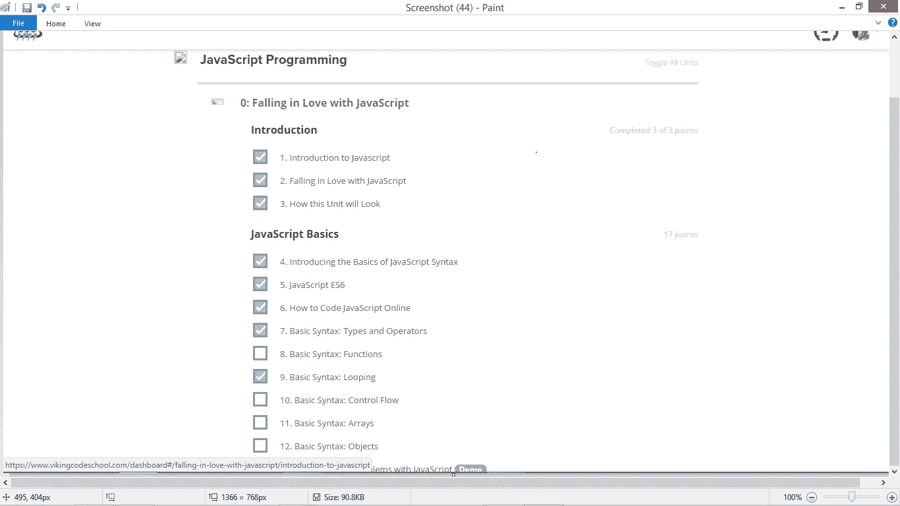

# JavaScript:“如果你写无限循环，它会让你的电脑崩溃”

> 原文：<https://medium.com/hackernoon/javascript-91c42b74d9b6>

Course outline

一段时间以来，我一直在学习 JavaScript，这很有挑战性(我们会克服)，同时也很有趣。也许是学习新事物的兴奋或随之而来的挑战让它变得有趣，不管怎样，我喜欢它的每一点。

从[学习](https://hackernoon.com/tagged/learning)基础知识，即类型和运算符、函数、循环(对于循环& while 循环)到[犯](https://hackernoon.com/tagged/making)错误并尝试调试基本语法(并在此过程中更好地学习/理解)。我记得第一次读到无限循环时的恐惧

> “如果你写并且无限循环它*会不会*让你的电脑崩溃”

哇，有多少人因为无限循环而失去了电脑？他们感觉如何？第一个发现无限循环的人有没有像[艾萨克·牛顿一样饱受其苦？](https://en.wikipedia.org/wiki/Isaac_Newton)

 [## 重定向通知

艾萨克·牛顿爵士 goo.gl](https://goo.gl/images/SJH7GI) 

当我继续读下去的时候，所有这些问题都在我脑海中闪过..直到我创建了一个无限循环(ghen ghen，对吧？不是真的)我甚至不知道我做了什么，但页面(JS bin)变得没有反应，所以我不得不杀死它(感谢 chrome)并重新加载它。我仍然不知道哪里出错了，试着运行同样的代码，直到我试着调试我的代码，并了解到无限循环不是计算机的百慕大三角。

我正在花时间学习，但是说实话，我真的等不及要开始和 JS 玩特技了，就像我在我的推特上说的

> 《伊萨疯狂》

受 [HackerNoon](https://hackernoon.com/how-to-build-an-online-presence-as-a-junior-developer-c90bc096989b) 文章的启发，更多更新即将到来。

日安。

> [黑客中午](http://bit.ly/Hackernoon)是黑客如何开始他们的下午。我们是 T21 家庭的一员。我们现在[接受投稿](http://bit.ly/hackernoonsubmission)并乐意[讨论广告&赞助](mailto:partners@amipublications.com)机会。
> 
> 如果你喜欢这个故事，我们推荐你阅读我们的[最新科技故事](http://bit.ly/hackernoonlatestt)和[趋势科技故事](https://hackernoon.com/trending)。直到下一次，不要把世界的现实想当然！

