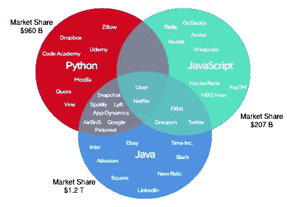
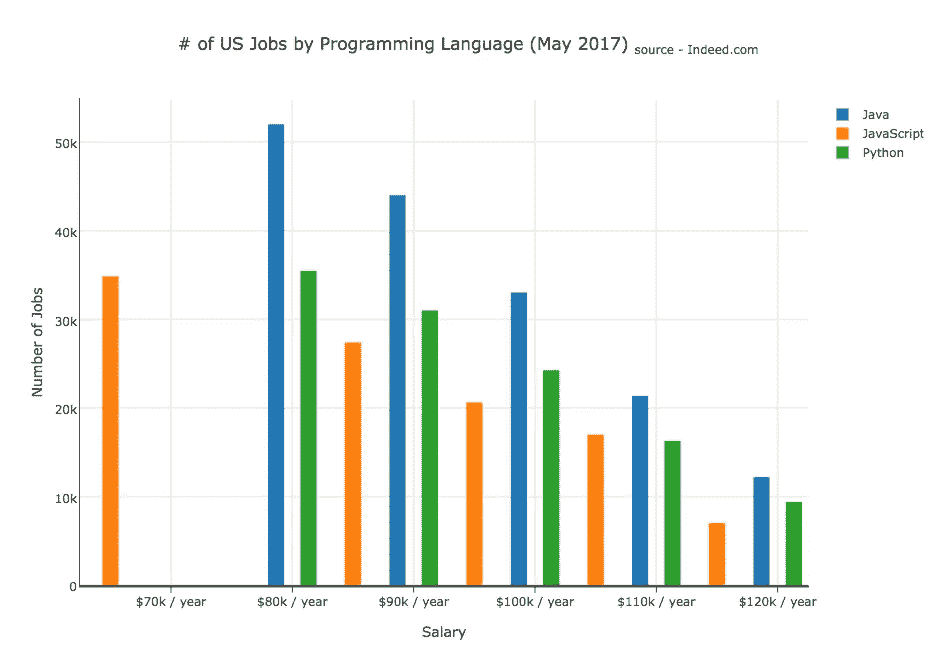

# JavaScript——终于成为一流的语言

> 原文：<https://medium.com/hackernoon/javascript-a-first-class-language-at-last-209376f69731>



Cross-section of programming languages used in back-end services at tech companies (source: Stackshare.io)

2003 年，**保罗·格拉厄姆**写了他的公司决定使用 **Lisp** (一种[编程](https://hackernoon.com/tagged/programming)语言)。他的文章将 Lisp 描绘成计算机语言中的法语——独特、深奥，能够表达不可表达的东西。他认为，正是 Lisp 给了他的公司相对于竞争对手的不公平优势。

如果 Lisp 像法语，那么今天的 JavaScript 就像英语。尽管两者可能是不一致的语法大杂烩，但英语是世界上使用最广泛的语言，JavaScript 是使用最广泛的计算语言。

然而，JavaScript 仍然没有得到其他语言那样的尊重。虽然它在初创公司和大型公司中的使用持续增长，但人们通常只是出于必要才认为它有用。大公司的高级工程师声称它不是一种“真正的”编程语言。许多人并不知道它除了像素操作之外还有其他用途。

作为一名 JavaScript 工程师，我想更深入地了解公众对这种语言的看法，以及它在现实中有多根深蒂固。我发现有些批评是站得住脚的，但许多不是。

**成长中的生态系统**

JavaScript 越来越多地用于软件开发的各个方面，而不是风格效果——例如，后端任务、web 服务器和数据处理。正如[](https://zeit.co/)**的首席执行官 Guillermo Rauch 所指出的，JavaScript“是进化的结果，而不是设计的结果。它做得很快，并且有一个小小的目的。剩下的就是市场力量和适应。”**

**劳奇的公司在浏览器和服务器上提供了一个只使用 JavaScript 的开源网络框架。原来很多公司也是这么做的。网站[**stack share . io**](http://www.stackshare.io)显示了关于公司技术栈的信息，显示网站上更多的公司在后端使用 JavaScript(6000)，而不是 Python(4100)或 Java(3900)。该网站主要面向初创企业，但它是一个表明生态系统正在增长的数据点。下面是一个维恩图，显示了不同公司的技术栈及其各自的市场份额(来自 StackShare.io 的*数据*)。**

****

**Cross-section of programming languages used for back-end services in tech companies (market share values approx.)**

**编程工作呢？看看**Indeed.com**向我们展示了美国大多数的编程工作都是用 Java 做的，但是 JavaScript 也紧随其后，如下图所示。**

****

**其他对 JavaScript 有利的统计数据:**

*   **它在 **Github** 上拥有最多的开源项目(比 Java 多 50%)。**
*   **在 **Stack Overflow** 的 2017 年开发者调查中，NodeJS 被评为最受欢迎的框架。**
*   **JavaScript 是目前栈溢出方面最流行的编程语言。**

**对 JavaScript 的批评**

**我问一位甲骨文的朋友，工程师们对 JavaScript 有什么担忧。他说的是“因为它是一种解释的、非类型化的语言，所以它对于系统编程来说并不理想。”这是对这种语言的普遍抱怨。JavaScript 函数将接受任何参数，如果参数不是特定的类型，Java 函数将抛出一个错误。**

```
function doSomething(literallyAnything) { return; }
```

**我问了另一个在谷歌工作的朋友。他向我指出了 NodeJS 上一些未解决的问题，说一些错误虽然微不足道，但让他有理由担心框架的成熟度。**

**Rauch 指出 JavaScript 的垃圾收集并不是最佳的。另一个批评是 Java 和 Python 更适合数据科学项目，比如机器学习和自然语言处理。这可能与这些语言的可用库有关，而不是固有的缺陷。学术界对 Java 和 Python 的依赖也是原因之一。**

**我采访的几位工程师提到，他们经常听到其他工程师贬低 JavaScript 作为编程语言。虽然人们确实担心 JavaScript 被用于后端任务，但大部分敌意似乎与该语言和生态系统的当前状态脱节。**

****当前技术水平— JavaScript****

**在过去的 5 年里，JavaScript 取得了长足的进步。JavaScript 的一些早期用例是像脸书的“喜欢”按钮这样的功能。当用户点击“喜欢”图标时，页面不会刷新，但会改变其状态。这种类型的行为只有通过 JavaScript 在 web 上才有可能。**

**开发人员几年前就开始使用 JavaScript 制作*单页面应用* ( *SPAs)。*术语“单页”指的是这些应用程序只向浏览器加载一次代码，所有后续视图都是用 JavaScript 生成的。对此的一个批评是，它们的初始下载时间很长——在手机上长达 20-30 秒！**

**在过去的 2 年里，向浏览器发送 JavaScript 代码的技术有了显著的改进(参见: **webpack** )。这消除了 JavaScript web 应用程序的缓慢加载速度，创造了更好的性能和用户交互。这是当前 web 开发的最新水平。**

**随着这些进步，出现了使用 JavaScript 的新范例。州管理图书馆将计算机科学原理应用于用户交互。JavaScript 工程师的门槛变得更高了。**

**从这些变化的背景来看，早期公司在后端使用 JavaScript 也是有意义的。如果您已经有了有才华的前端 JS 工程师，这使他们能够更容易地协作、审查和共享代码。**

**尽管 JavaScript 可能是作为浏览器语言开始的，但它在计算机科学的各个方面变得越来越普遍 web、移动、物联网和后端服务。工程师们明智的做法是，不要因为对语言的过时理解而放弃它。虽然它一直是一种“真正的”编程语言，但我们终于到了这样一个时刻:这种说法最容易被误解。**

****结论****

**从这些观察中，很明显 JavaScript 已经满足了成为一流编程语言的以下标准:**

*   **初创公司和大型私营公司广泛采用后端服务(NodeJS)框架**
*   **蓬勃发展的开源社区(在 Github 上最活跃)**
*   **对作为专业技能的信息技术知识的强烈需求(Indeed.com)**

**最终，一家公司决定追求某种技术堆栈都是妥协的结果。我们在 [**Commandiv**](http://www.commandiv.com) 使用 JavaScript 进行前端和后端服务，但并不适合所有人。决定的一部分是熟悉度。为了在创业中快速前进，对你使用的工具得心应手是必不可少的。**

**也就是说，我认为质疑 JavaScript 是否是“真正的”编程语言的日子已经一去不复返了。它的旅程还远未结束，但它的采用率和改进率给了它前进的道路足够的信心。**

***感谢*[*Alim s . Gafar*](https://medium.com/u/acf3fdf117eb?source=post_page-----209376f69731--------------------------------)*的点评。***

**汤姆·戈登伯格是个人投资平台[*Commandiv*](http://www.commandiv.com/)*的首席技术官和联合创始人。如果你喜欢这篇文章，请喜欢并分享它！***

****脚注****

**虽然该语言不支持静态类型，但脸书和微软等公司已经发布了添加该功能的库(脸书发布了 ***Flow*** *，微软发布了****TypeScript****)。***

**[](http://bit.ly/HackernoonFB)****[](https://goo.gl/k7XYbx)****[](https://goo.gl/4ofytp)**

> **[黑客中午](http://bit.ly/Hackernoon)是黑客如何开始他们的下午。我们是阿妹家庭的一员。我们现在[接受投稿](http://bit.ly/hackernoonsubmission)并乐意[讨论广告&赞助](mailto:partners@amipublications.com)的机会。**
> 
> **如果你喜欢这个故事，我们推荐你阅读我们的[最新科技故事](http://bit.ly/hackernoonlatestt)和[趋势科技故事](https://hackernoon.com/trending)。直到下一次，不要把世界的现实想当然！**

****