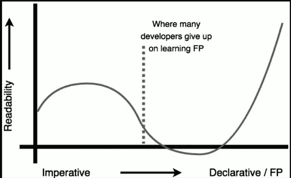

# Javascript 和函数式编程:简介

> 原文：<https://medium.com/hackernoon/javascript-and-functional-programming-an-introduction-286aa625e26d>

> *注:这是《Javascript* *与函数式编程》系列关于* [*学习 JavaScript ES6+中的*](https://hackernoon.com/tagged/learning) *函数式编程技巧的一部分。check out*[*<Part 2>*](https://hackernoon.com/javascript-and-functional-programming-pt-2-first-class-functions-4437a1aec217)*关于第一类函数。*

我从来都是讲底线的。对伪知识概念、花哨的术语和炒作不感兴趣。相反，我总是寻求帮助我尽快发布代码的工具和技术。这种方法最初是有成效的——特别是当我构建较小的“概念验证”应用程序时。

不幸的是，这种方法无法扩展。随着我作为一名开发人员的进步，我开始感受到生产力回报递减的定律。建立一个项目，并达到基本功能是很快的。但是当我的应用程序变得越来越复杂时，真正的问题开始出现了。我发现随着项目生命周期的推进，我正在编写复杂的代码。我写的代码变得难以理解。为了理解它，我必须极度集中注意力。

我有一种渴望的感觉，必须存在一种更好、更干净的开发软件的方法。我听说过一些关于函数式编程的传闻，以及它是如何让开发人员写出更简洁优雅的代码的。在使用 React 和 Redux 时，我第一次不知不觉地接触到了函数范式和模式。他们都融入了一些原则，我喜欢他们。我读到过 FP——最初令我沮丧的是，我看到它的范例是基于抽象的数学概念，而且它在学术界非常流行。因为我的目标是尽可能快地运送产品，这似乎是一种违反直觉的方法，违背了我试图实现的目标。在工程学院读了 4 年后，我非常坚定地认为，学术界只解决理论问题，不太可能在我的日常构建工作中帮助我。

🤔🤔🤔🤔🤔🤔🤔🤔🤔🤔🤔🤔🤔🤔🤔🤔🤔🤔🤔🤔🤔🤔🤔🤔🤔🤔🤔🤔🤔🤔🤔🤔🤔

但是 FP 一直缠着我。优雅的解决方案和范例散布在我最喜欢的开源项目、博客帖子和教程中。我把我的 skeptecism 放在一边，开始钻研 FP。

Let’s just do this FP thang!

虽然这些概念涉及新的术语，并且包括陡峭的学习曲线，但我对这种“新方法”感到惊讶和兴奋。这一系列文章分享了我的学习经验，旨在提取和总结 FP 的精华，使开发体验更干净、更简洁。我将尝试对我讨论的模式建立一个直观的理解，并尽可能简单地构建问题和提供的解决方案，超越不必要的复杂定义。学习 FP 有一点令人生畏的名声，但是通过将概念分解成更小的部分，我们将使想法更容易消化。

From the amazing Mostly Adequate FP Guide

与其他编程范例相比，FP 的主要区别在于*声明式*方法(FP)与*命令式*方法。在我们深入正式定义之前，让我们通过看一个例子来探究它们的区别。

# 必要的

Imperative functions in the wild

这个代码看起来邪恶吗？应该的！以上方法有什么相似之处？

1.  这段代码片段的主要复杂性源于这样一个事实，即我们不是告诉计算机*我们想要*它做什么，而是指导它*如何做*。告诉计算机如何操作的代码。转到索引为 *i 的数组，并变异或交换一个值*称为命令式代码。
2.  这段代码不可读(😱😱😱).这是一个玩具例子，但是随着你的程序增长，你的功能变得更加复杂，像这样使用 *for loops* 创建的代码并不简单，需要我们的大脑分析循环的内部工作，同时跟踪索引、变量等等。命令式代码增加了阅读时的认知负荷，随着时间的推移，更容易在推理和逻辑上出错。

# 宣言的

让我们重写这段代码，但是以声明的方式。

。地图？。减少？这是什么妖术？

首先，我保证给定相同的输入，这两种方法每次都会产生相同的输出*。*

声明性片段的一个小插曲-

`**.map()**` 是 JS 中每个数组都可以访问的方法。的。方法创建一个新数组，其结果是在调用数组中的每个元素上调用一个提供的函数。

。`**reduce()**`是一种对累加器和数组中的每个元素(从左到右)应用函数以将其缩减为单个值的方法。

现在还不要担心这些。在接下来的文章中，我们将深入探讨这些方便的数组原生方法。但是很明显，声明性代码片段比命令性代码片段更简洁。读起来也轻松了很多。我没有指示程序我希望它访问哪些索引等等，而是简单地给`**.map()** and **.reduce()**`(在我们的例子中是一个匿名函数)提供一个表达式，告诉程序*我希望*对数组中的每个元素做什么。

这种声明式方法将通过以下方式全面地为我们服务:

1.  在你的代码中学习和使用众所周知的、可理解的模式，*和*被证明可以避免使代码更难理解的错误。

2.编写更短、更有表现力、更简洁的代码。毕竟，我们写的代码越少，我们需要调试的就越少。

最重要的是，这些工具和范例将帮助我们实现更快地运送产品的最终目标。看看下一篇文章[，我们将讨论 JS 中的函数，为什么它们是特殊的，以及它们的特性如何支持函数式编程。](https://hackernoon.com/javascript-and-functional-programming-pt-2-first-class-functions-4437a1aec217)

## 如果这篇文章有帮助，请点击拍手👏按钮以示支持！⬇⬇

你可以在 [Instagram](https://www.instagram.com/omeragoldberg/) 、 [Linkedin](https://www.linkedin.com/in/omer-goldberg-680b40100/) 和 [Medium](/@omergoldberg) 上关注我。

而且最重要的是！我正在使用 [Mindflow.ai 创建这些教程。](https://arieg419.wixsite.com/mindflow) [Mindflow](https://arieg419.wixsite.com/mindflow) 会(几乎)自动创建您工作流程的智能摘要。它让记录我的工作变得轻而易举！在这里注册 [alpha 版本](https://arieg419.wixsite.com/mindflow)。