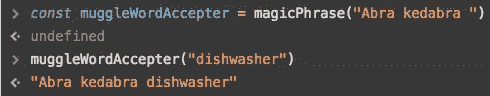
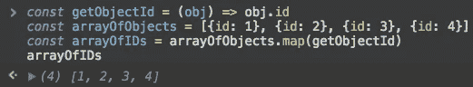
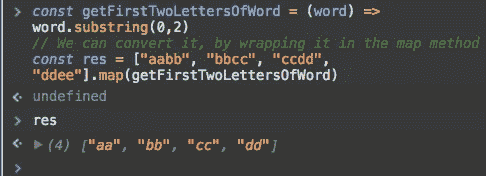

# Javascript 和函数式编程:Currying(第 4 部分)

> 原文：<https://medium.com/hackernoon/javascript-and-functional-programming-currying-pt-4-96e3230782ab>

> 注意:这是“ [Javascript](https://hackernoon.com/tagged/javascript) 和函数式编程”系列中关于[学习 JavaScript ES6+中的](https://hackernoon.com/tagged/learning)函数式编程技术的一部分。从头开始检查出 [<第 1 部分>](https://hackernoon.com/javascript-and-functional-programming-an-introduction-286aa625e26d)


Currying 是指我们调用的函数的参数比预期的少。反过来，被调用的函数返回一个接受剩余参数的函数。

```
const magicPhrase = 
 (magicWord) => 
  (muggleWord) => 
    magicWord + muggleWord 
```

然后我们可以用下面的模式调用这个函数



Call it maaagic

编写返回函数的函数，这些函数又返回一些输出(可能是另一个函数！)会变得相当麻烦。幸运的是，我们有像 Ramda 和 lodash 这样的功能性 JS 助手库，它们为我们提供了像 curry 这样的实用方法。curry 实用程序包装通常声明的函数，并将它们转换成一系列单参数函数。因此，我们可以将前面的代码转换为:

```
import _ from "lodash"const magicPhrase = _.curry((magicWord, muggleWord) => magicWord + muggleWord)const muggleWordAccepter = magicPhrase("Abra kedabra ")muggleWordAccepter("dishwasher")
```

另一个例子是我们最喜欢的 add 函数的改进实现

```
import _ from "lodash"const addFunction = _.curry((a, b) => a + b)const addOne = add(1)addTen(1)
```

所以我们实际上是用第一个变量“预加载”了 add 函数。由于 JS 闭包，我们的函数能够记住传递的第一个值。

## 为什么你应该关心奉承

1.  Currying 让我们有能力编写简洁、明了和可重用的函数。

2.我们使用这些函数作为清晰的、可测试的逻辑单元来组成程序中逻辑上更复杂的部分。

3.使用 currying，任何对单个元素起作用的函数都可以转换成对数组(列表)起作用的函数，只需用 *map* 包装它。

```
const getObjectId = (obj) => obj.id // works on single objectconst arrayOfObjects = [{id: 1}, {id: 2}, {id: 3}, {id: 4}]const arrayOfIDs = arrayOfObjects.map(getObjectId)
```



BAM! Our function that worked on single elements can work on arrays!

## 例子

真正熟悉这些概念的唯一方法就是实践:)言归正传。我们将从另一个例子开始，将一个操作单个元素的函数转换成一个操作数组的函数。

```
const getFirstTwoLettersOfWord = (word) => word.substring(0,2)// We can convert it, by wrapping it in the map method["aabb", "bbcc", "ccdd", "ddee"].map(getFirstTwoLettersOfWord)
```



下一个例子来自令人惊奇的《基本足够指南》，带有一个小的 ES6 重构:)

让我们重构 max 函数，这样它就不会引用任何参数。

```
arr = [2,4,6,8,9]// LEAVE BE:
const getMax = (x, y) => {
  return x >= y ? x : y;
};

// REFACTOR THIS ONE:
const max = (arr) => {
  return arr.reduce((acc, x) => {
    return getMax(acc, x);
  }, -Infinity);
};const max = arr.reduce(getMax, -Infinity)
```

让我们包装原生 JS *切片方法*，使其功能化和可定制化。

```
import _ from "lodash"const arr = ["barney", "fred", "dave"]arr.slice(0, 2) // ["barney", "fred"]const slice = _.curry((start, end, arr) => arr.slice(start, end));
const sliceWithSetIndexes = slice(0,2)

sliceWithSetIndexes(arr) // ["barney", "fred"]
```

## 摘要

我们已经看到了几个使用 JS 函数的例子。Currying 是指将具有多个实参(接受实参)的函数转换为实参较少的同一个函数的过程。它利用 JS 闭包来记住之前调用中使用的参数。Currying 扭转功能，使他们可以更自然地一起工作。它最大的优点是它很容易允许函数组合，我们将在下一篇文章中深入探讨！

## 如果这篇文章有帮助，请点击拍手👏按钮以示支持！⬇⬇

你可以在 [Instagram](https://www.instagram.com/omeragoldberg/) 、 [Linkedin](https://www.linkedin.com/in/omer-goldberg-680b40100/) 和 [Medium](/@omergoldberg) 上关注我。