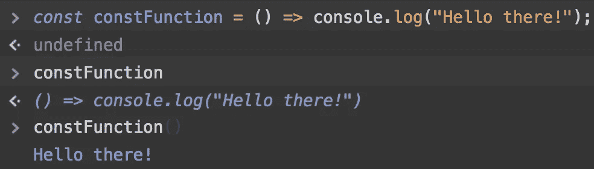
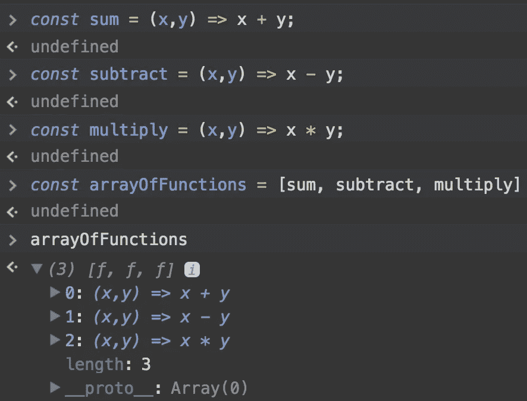

# Javascript 和函数式编程—第二部分:一级函数

> 原文：<https://medium.com/hackernoon/javascript-and-functional-programming-pt-2-first-class-functions-4437a1aec217>

> 注意:这是“Javascript 和函数式[编程](https://hackernoon.com/tagged/programming)”系列中关于[学习 JavaScript ES6+中的](https://hackernoon.com/tagged/learning)函数式编程技术的一部分。点击这里查看[第三部分(该系列的下一篇文章)。](https://hackernoon.com/javascript-and-functional-programming-pt-3-pure-functions-d572bb52e21c)从头开始检查出 [<第一部分>](https://hackernoon.com/javascript-and-functional-programming-an-introduction-286aa625e26d)

## 欢迎来到颠倒世界

在我们开始之前，有些事情你需要知道…如果你曾经用 JS 编程过，你可能以前用过 FP 模式！这些模式和范例一直都存在，只是我们没有能够正确地看待它们。我们将从熟悉的领域开始，探索新的领域。事情可能会变得有点…嗯…奇怪。但是不要害怕！我们将一起生存！

## 一级函数

在 Javascript 中，函数是*第一类对象。*就像我之前提到的，我们不喜欢隐晦的术语，所以我们来解释一下。根据 Mozilla 开发者词汇表:

> 当一种编程语言中的函数被像对待任何其他变量一样对待时，该语言被称为具有一级函数。例如，在这种语言中，函数可以作为参数传递给其他函数，可以由另一个函数返回，也可以作为值赋给变量。

## 作为常数的函数

在下面的例子中，我们将声明一个 const 并给它分配一个匿名的 arrow 函数。

初始赋值后 *constFunction* 是一个带有函数值的常量。我们通过在 Chrome inspector 中记录 constFunction 变量来验证这一点。因为 *constFunction* 是一个函数，我们也可以调用它。

## 充当对象的键值

现在我们知道了变量可以保存函数，让我们用一个对象中的键值来演示一个函数。这对于以前做过面向对象编程的人来说应该很熟悉。

## 用作数组项

当函数是第一类对象时，我们可以将它们作为数据传递给数组，就像其他数据类型一样。让我们使用 Chrome 控制台来检查一下。

## 高阶函数

现在我们已经热身了，让我们开始有趣的东西:)JS 开发人员每天都会看到接受其他函数作为参数的**函数。如果你来自一个不支持 FP 的语言，这看起来会有点奇怪😳😳😳😳😳😳😳让我们通过看一些例子来熟悉这个概念。**

**接受回调函数的异步函数。**

errorLoggerFunction is defined as a function with the ES6 arrow syntax

在这个例子中，我们将 *jsonfile* npm 模块用于 *writeFile m* 方法。 *writeFile* 期待的第三个参数是一个函数。当 *jsonfile.writeFile* 方法执行时，要么成功，要么失败。如果失败，它将执行*错误记录功能。*或者，我们可以使用更简洁的语法，去掉命名函数:

It’s an anonymous function because we didn’t name it

**设置超时**

Classic callback example

这个例子显示了内置的异步 *setTimeout* 方法，它接受两个参数。让我们稍微形式化一下，用函数式编程术语解释一下 *setTimeout* 函数。

让我们从读取函数的签名开始。我们可以观察到 *setTimeout* 接受的参数数量是两个。在函数式编程中，一个函数接受的参数数量被称为它的实参数，来自一元、二元、三元等词。因此，我们可以说 *setTimeout* 是 arity 2，或者换句话说，它是一个二元函数。

*setTimeout* 期望的参数是一个函数和在执行给定函数之前等待的时间间隔。Hmmm … **另一个接受函数作为输入的*函数？***

在函数式编程中，这是如此普遍，以至于这些类型的函数甚至有一个名字！它们被称为*高阶函数。*

> 一个**高阶函数**是一个**函数**，它以一个**函数**作为自变量，或者返回一个**函数**。

给你。现在你可以在工作中/与朋友的任何随意交谈中低调地使用这个词，听起来像个老板！😂😂😂

You can’t be wrong if no one understands what you’re saying

让我们变得更有趣一点，在下一个例子中**创建一个函数数组(列表)**。

在第 5 行，我们声明了一个函数数组。然后我们使用 forEach 方法迭代数组。 *forEach* 是一个本地支持的 ES6+函数，它接受一个函数来执行数组中的每一项。所以 ***forEach 也是高阶函数！***

我们的 *forEach* 接受一个匿名函数作为输入。 *forEach* 将遍历数组，隐式访问数组中的当前项，并调用它 *getCalculation。*值得注意的是 *forEach* 隐式访问数组元素，相比之下，如果我们使用常规的 for 循环，我们会访问当前元素。*数组功能【I】*。数组中的每一项都是一个函数，因此我们使用它所期望的参数来调用 *getCalculation* 。

太棒了。这个例子说明了函数式编程中的**函数可以像任何其他数据类型**一样传递到数组(列表)中。**功能无处不在！**

现在让我们构建我们自己的*高阶函数！*

addWrapper is a function that accepts a function as an argument

被调用时， *addWrapper* 函数返回一个简单的加法函数。通过调用 *addWrapper* 函数的结果并给它提供两个参数，我们可以访问匿名加法函数。

我们可以更加疯狂地使用我们的间接方式，编写一个函数来返回一个函数，而这个函数又返回它自己的函数！

I hope you like curry!

这是函数式编程中非常强大的模式。在接下来的文章中，当我们谈到*curry 和部分应用*时，我们会深入探讨这个问题。

一级函数是任何函数式编程语言的基石。你应该从我们关于*一级函数*的讨论中吸取的要点是，函数可以被赋值为常量、变量、数组元素，甚至可以被设置为对象上的键值。另外，(也是最重要的？！)函数可以和函数之间来回返回— **就像其他任何数据类型一样！**

查看下一篇文章 **，我们将讨论 JS 中的纯函数，为什么它们会让你的代码库更干净，以及你如何立即开始利用它们。**

## 如果这篇文章有帮助，请点击拍手👏按钮以示支持！⬇⬇

可以在 [Instagram](https://www.instagram.com/omeragoldberg/) 、 [Linkedin](https://www.linkedin.com/in/omer-goldberg-680b40100/) 和 [Medium](/@omergoldberg) 上关注我。