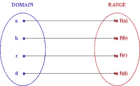

# Javascript 和函数式编程。3:纯函数

> 原文：<https://medium.com/hackernoon/javascript-and-functional-programming-pt-3-pure-functions-d572bb52e21c>

## 纯洁

> 注意:这是“Javascript 和函数式[编程](https://hackernoon.com/tagged/programming)”系列中关于[学习 JavaScript ES6+中的](https://hackernoon.com/tagged/learning)函数式编程技术的一部分。[点击这里查看 JS 中关于 currying 函数的第 4 部分。](https://hackernoon.com/javascript-and-functional-programming-currying-pt-4-96e3230782ab)从头开始检查出 [<第 1 部分>](https://hackernoon.com/javascript-and-functional-programming-an-introduction-286aa625e26d)


Damn, this feels good

**动机**

我们的许多错误都源于 IO 相关的、数据突变的、带有副作用的代码。这些问题遍布我们的代码库——从接受用户输入、通过 http 调用接收意外响应，到写入文件系统。不幸的是，这是一个严酷的现实，我们应该习惯于面对它。或者是？

如果我告诉你，我们可以最小化执行程序关键/易变部分的代码，会怎么样？我们可以强制(按照惯例)我们代码库的大部分都是*纯的，并且将与 IO 相关的* / *副作用*代码限制在我们代码库的特定部分。这将使我们的调试过程更容易，更连贯，更容易推理。

那么，这个神话般的纯函数是什么呢？一个纯函数有两个主要特征:

# **1。纯函数是确定性的**。这意味着，给定相同的输入，函数将总是返回相同的输出。用数学术语来说明这个函数(这个会很快！)这是一个定义明确的函数。每次，每个输入都返回一个输出。



A pure function, in the wild!

## 纯函数

```
const add = (x, y) => x + y // A pure function
```

*add* 是一个纯函数，因为它的输出完全依赖于它接收的参数。因此，给定相同的值，它将总是产生相同的输出。

这个怎么样？

```
const magicLetter = '*'
const createMagicPhrase = (phrase) => `${magicLetter}abra${phrase}`
```

这个有点可疑…createMagicPhrase 函数依赖于其范围之外的值。所以，不纯粹！

## 不纯的函数

```
const fetchLoginToken = externalAPI.getUserToken
```

fetchLoginToken 是纯函数吗？它每次都返回相同的值吗？绝对不行！有时它会工作——有时服务器会关闭，我们会得到一个 500 错误——在将来的某个时候，API 可能会改变，这样这个调用就不再有效了！所以，因为函数是非确定的，我们可以有把握地说它是一个不纯的函数。

# **2。单纯的功能不会造成副作用**。副作用是系统中任何对外界来说*可见的*变化。

```
const calculateBill = (sumOfCart, tax) => sumOfCart * tax
```

*算账单*纯吗？肯定:)它展示了两个必要的特征:

*   该函数只依赖于它的参数来产生结果
*   该功能不会产生任何副作用

[最充分指南](https://drboolean.gitbooks.io/mostly-adequate-guide/)指出副作用包括但不限于:

*   更改文件系统
*   将记录插入数据库
*   进行 http 调用
*   突变
*   打印到屏幕/记录
*   获取用户输入
*   查询 DOM
*   访问系统状态

## 为什么我们的功能应该是纯粹的？


Aside from just being awesome

***可读性- >*** 副作用让我们的代码更难阅读。由于非纯函数是不确定的，它可能会为给定的输入返回几个不同的值。我们最终会编写需要考虑不同可能性的代码。让我们看另一个基于 http 的例子:

这个代码片段可能以多种不同的方式失败。如果传递给 *getTokenFromServer* 的 *id* 无效怎么办？如果服务器崩溃并返回一个错误，而不是预期的令牌，该怎么办？有很多突发事件需要计划，忘记一个(或几个！)对他们来说是非常容易的。

此外，一个纯函数更容易阅读，因为它不需要上下文。它预先接收所有需要的参数，并且不谈论/篡改应用程序的状态。

***可测性* - >** 因为纯函数本质上是确定性的，所以为它们编写单元测试要简单得多。你的功能要么有效，要么无效😁

***并行代码* - >** 由于纯函数只依赖于它们的输入，不会产生副作用，所以对于并行线程运行和使用共享内存的场景来说非常棒。

***模块化和可重用性* - >** 把纯功能想成逻辑的小单元。因为它们只依赖于您提供给它们的输入，所以您可以轻松地在代码库的不同部分或不同项目之间重用函数。

***参照透明- >*** 这个*听起来好复杂*🙄🙄当我第一次读到标题时，我想喝杯咖啡休息一下！简单地说，引用透明性意味着函数调用可以被它的输出值代替，而不改变程序的整体行为。这是创建纯函数时最有用的思维框架。

## 它是纯洁的，而且…但是它有什么作用吗？

值得注意的是，尽管纯函数提供了大量的好处，但是在我们的应用中只使用纯函数是不现实的。毕竟，如果我们这样做了，我们的应用程序将没有副作用，因此不会对外界产生任何可观察到的影响。那会很无聊😥😥😥。相反，我们将尝试将所有副作用封装到代码库的特定部分。这样，假设我们已经为我们的纯函数编写了单元测试，并且知道它们正在工作，如果我们的应用程序中出现了问题，跟踪起来会容易得多。

## 让我们变得纯洁

让我们通过把下面的非纯函数转换成纯函数来结束我们的讨论。这是一个虚构的例子，但是演示了我们如何轻松地将 unpure 代码重构为 pure。

我们先来回顾一下为什么这个函数是不纯的。我们的函数是 *unpure* ，因为它依赖于 a 和 b，这在它的作用域之外。此外，它还直接改变了变量的值。重构这个函数的最快方法是

*   首先确保函数依赖的所有变量都作为参数传递
*   我们可以返回反映新值的新值，而不是改变(操作)b 和 c。

## 摘要

我们已经介绍了转换我们的代码库以包含更多纯函数的许多好处。这使得我们的代码更容易推理、测试，最重要的是 ***更容易预测。*** 记住，纯粹的函数并不意味着完全消除我们的代码库的*副作用。而是将他们限制在一个确定的位置，并尽可能多地消除他们。当你的程序开始变得越来越大，越来越复杂的时候，这种方法会被证明是正确的。*

[**点击这里查看下一篇文章**](https://hackernoon.com/javascript-and-functional-programming-currying-pt-4-96e3230782ab) **，在这里我们将讨论 JS 中的函数组合，为什么它们会让你的代码更具可读性，以及你如何立即开始利用它们。**

## 如果这篇文章有帮助，请点击拍手👏按钮以示支持！⬇⬇

你可以在 [Instagram](https://www.instagram.com/omeragoldberg/) 、 [Linkedin](https://www.linkedin.com/in/omer-goldberg-680b40100/) 和 [Medium](/@omergoldberg) 上关注我。