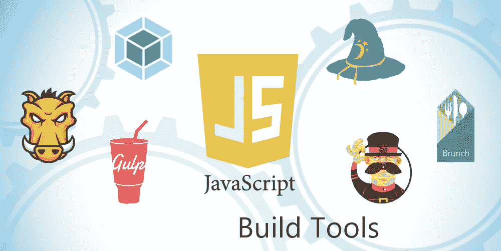
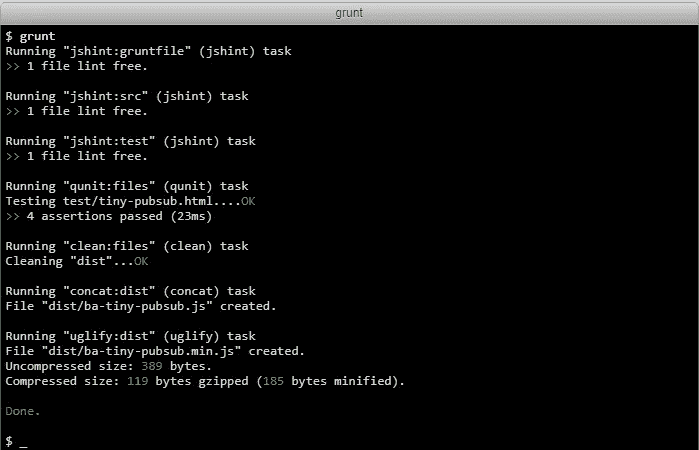
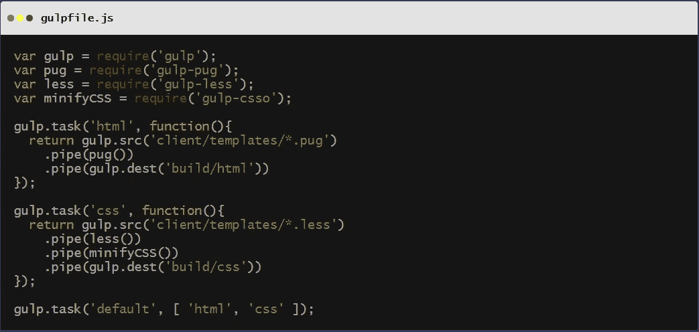
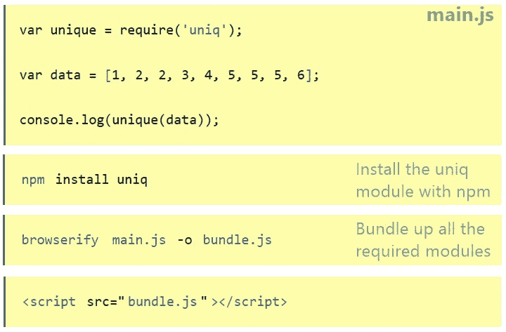
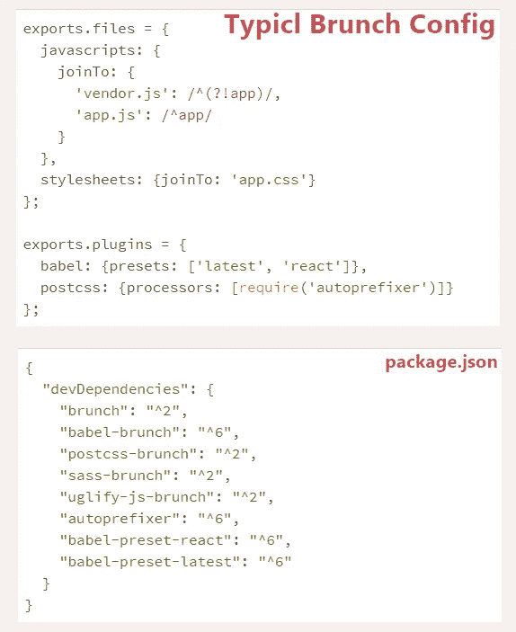
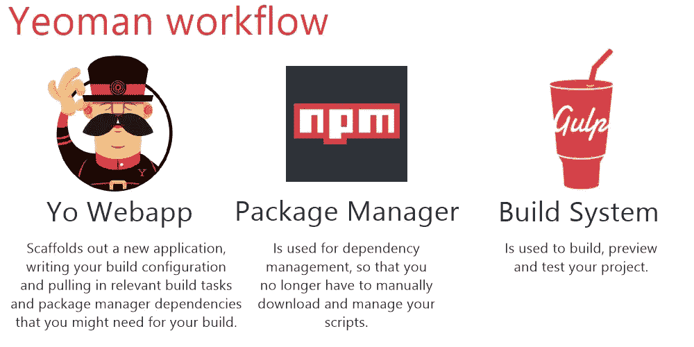

# JavaScript 构建工具和自动化系统

> 原文：<https://medium.com/hackernoon/javascript-build-tools-and-automation-systems-9589c5c91ebe>

今天，JavaScript 已经成为全世界 web 开发人员非常流行的工具。你可以构建许多项目，比如构建 web 应用程序、移动应用程序等等。

然而，有些任务在开发过程中是非常重要的，如缩小、单元测试、网页刷新。这些任务不仅非常无聊，而且压力很大，令人沮丧。尽管如此，这些任务还是要做。

本文将涵盖 JavaScript 程序员可用的一些流行的构建和自动化工具。这些技术包括:

*   网络包
*   咕哝
*   吞咽
*   浏览
*   早午餐
*   约曼

让我们深入了解一下，看看这些技术如何帮助改进开发工作流。

# 网络包

> 版本 3.9.1
> 
> 34 304 GitHub ★
> 
> 48 个插件
> 
> 22 个依赖项

根据它的名字，人们应该能够很好地解释它的作用。Webpack 用于捆绑许多 web 包和不同的依赖项，包括 CSS 文件和图像，然后在将它们捆绑成可管理的输出文件之前为它们创建模块。这有助于提高生产率和可重用性，因为它通过将依赖关系树分割成块并按需加载来减少开发包的加载时间，这意味着它消耗更少的内存。

可以使用 npm 命令安装 Webpack:

`npm install -g webpack`

和纱线

`yarn add webpack — dev`

Webpack 是一个非常复杂的工具。然而，随着时间的推移，你可以通过浏览一些在线教程轻松学会。很容易找到关于该工具的教程。它很受欢迎。你可以在[网站](https://webpack.js.org/)上找到更多关于这个套餐的信息。

# 咕哝

> 版本 1.0.1
> 
> 11 653 GitHub ★
> 
> 6 个 315 插件
> 
> 16 个依赖项

Grunt 是一个非常好的任务运行器，可以自动完成所有这些无聊的重复过程。它可以让你无拘无束地看着他们跑。由 Ben Alman 创建，用 Node JS 编写，GruntJS 是一个基于 JavaScript 的命令行构建工具，允许开发人员自动执行诸如缩小、CSS 预处理、部署、编译、单元测试、林挺等任务

你会同意这样的工具会使你的工作更容易和更快，因为项目开始滚动。Grunt.js 是一个相当大的库，提供了大约 6000 个插件，包括流行的插件，如 CoffeeScript、Less、RequireJS、JSHint、Sass、Stylus 等，以“使自动化的简单任务比以往任何时候都更容易”。

Grunt 不仅仅停留在任务的自动化上。开发完成后，您还可以在网页上管理图像文件的大小和质量。这将有助于你在不影响质量的情况下提高网站的加载速度。实际上，Grunt 是建立在节点上的。但是，要使用这个库，您不必精通 Node.js 的使用。就像 Webpack 一样，它非常受欢迎，用不了多长时间你就能找到使用这个工具的方法。

Grunt 可以使用 npm 命令安装:

`npm install -g grunt`

它也有自己的命令行工具。这一点以及更多内容可以在[官方网站](https://gruntjs.com/)上找到。

# 吞咽

> 版本 3.9.1
> 
> 28 066 GitHub ★
> 
> 3382 插件
> 
> 13 个依赖项

Gulp 是项目开发的一个任务或构建 runner。它允许一个简单和平稳的开发工作流程。有了 Gulp，您会发现这个工具给了您一个非常需要的机会，让您可以花更多的时间在代码上，而不是配置过程上。

Gulp 这些年来变得非常流行，因为它是一个超级可定制的工具，并且有一个巨大的带有现成插件的库。前端开发人员经常使用 Gulp，因为他们发现自己在一遍又一遍地做一些没有效率的任务，比如制作 HTML 模板、缩小 CSS 和 JavaScript、优化图像，甚至设置 localhost。在网站开发过程中，这些任务必须重复进行，因此 Gulp 介入其中，以提高工作流程的效率。

也可以使用 npm 命令进行安装:

`npm install -g gulp`

使用 Gulp，您不必花太多时间来学习 API 的工作方式，因为它提供了四个简单的 API，包括:

*   吞咽任务
*   gulp.src
*   吞咽目标
*   大口.看着

Gulp 拥有庞大的用户生态系统，因此它是一个相当受欢迎的工具。可以从[官网](https://gulpjs.com/)了解更多。

# 浏览

> 版本 14.5.0
> 
> 11 555 GitHub ★
> 
> 118 个插件
> 
> 47 个依赖项

使用 Browserify，您可以利用 grunt 配置来设置 Browserify 构建。它还可以与 Grunt 无缝协作，因为您可以使用 grunt-browserify 在 Grunt 中运行 Browserify。

Browserify 库的一个非常重要的特性是源代码转换，它可以很容易地将源代码从一种类型转换成另一种类型。这意味着您可以轻松地将 CoffeeScript 编译成 JavaScript。它不止于此。您也可以像在 node.js 中一样，通过简单地使用“require”在浏览器中编写代码。Browserify 试图通过提供 Node 的许多核心功能来将 Node 生态系统扩展到浏览器中。

可以使用 npm 简单地安装 Browserify:

`npm install -g browserify`

你可以在[官方网站](https://dashbouquet.com/browserify.org)上找到更多关于这个令人敬畏的工具的信息。

# 早午餐

> 版本 2.10.12
> 
> 6 255 GitHub ★
> 
> 107 个插件
> 
> 23 个依赖项

Brunch 是一个非常适合创建项目的 JavaScript 工具。它能够自动化所有类型的项目，从小规模项目到大规模项目。早午餐通过为项目中的每个文件提供不同的范围并仅在需要时执行它们，使您的项目易于导航，从而使任务变得更容易。

Brunch 支持一些 JavaScript 编码风格，比如 CommonJS、AMD、自定义包装器和定义。在开发过程中，Brunch 提供了一个本地服务器，一个使用 bower 的简单管理系统，还通过现成的插件提供了选择任何框架的选项，如 Jasmine、Less、Sass、CoffeeScript 等。

Brunch 是一个节点包，也可以通过以下方式轻松安装:

`npm install -g brunch`

有了 Brunch，你不必再从头开始你的项目，因为它有非常有效的框架安装程序，使启动一个项目变得容易。它是一个纯粹的构建工具，不需要任何配置，允许无缝配置和编译，允许快速开发项目。可以从[官网](http://brunch.io/)了解更多。

# 自耕农

> 版本 2.0.1
> 
> 8 806 GitHub ★
> 
> 7 024 个插件
> 
> 25 个依赖项

Yeoman 是一个 JavaScript 库，“围绕生成器构建，也用于构建和运行那些生成器”。我刚才把你弄糊涂了吗？

这个 JavaScript 库是一个通用的脚手架系统，对于创建任何类型的应用程序(生成器)都非常有效。有了 Yeoman，你可以很容易地用合适的工具创建一个项目，而不用花费大量的时间去获得所需的工具。

因此，Yeoman 所做的就是创建你想自动创建的任何应用程序，快速创建新项目，创建新模块和软件包，并帮助保持 JavaScript 的最佳标准和编码实践。这确保你有一个没有痛苦的项目开发过程。

您可以使用 npm 命令轻松安装 Yeoman，如下所示:

`npm install -g yo`

安装好约曼后，您可以通过以下方式安装所需的发电机:

`npm install -g generator-webapp`

然后，您可以使用 Yeoman 工具轻松创建一个应用程序。

`yo webapp`

这可以节省您在创建这些应用程序之前在命令行中浏览目录的时间。Yeoman 不依赖于语言，这意味着它也用于创建其他语言的应用程序。这也意味着，在尝试使用这个伟大的工具时，您可以获得遇到的任何问题的解决方案。万一您还没有完全理解“生成器”的概念，这已经超出了本文的范围。你可以很容易地在网上找到教程，也可以在[官网](http://yeoman.io/)上找到。

# 包装它

为你选择最好的构建工具可能是一个非常艰巨的任务，但是它对于决定开发对你来说有多容易非常有用。

本文中谈到的所有工具都非常相似。但是，它们也有各自的不同之处，在不同的领域有着各自的优势。

*   **如果需要重新加载对 JavaScript 或 CSS 所做的更改，那么 Webpack** 是最好的选择。
*   如果在配置需要不同文件的独立任务时需要大量重复工作，Grunt 是最好的选择。
*   如果需要在节点流上做大量重复的工作，并且需要使用管道链打开和关闭相同的文件，那么 Gulp 是最好的选择。
*   **Browserify** 非常擅长为浏览器打包 node.js 模块。
*   **早午餐**最适合从零开始建立新的大型项目，因为由于骨架的可用性，它几乎不需要配置。
*   如果你已经有了一个基本的设置，并想重新制作类似的东西，你可以很容易地搭建另一个。

总之，所有这些工具可以相互补充，并在一起使用时会创造高效率。

[*安东·沙利尼科夫*](https://www.linkedin.com/in/anton-shaleynikov-45812a1/) 撰写