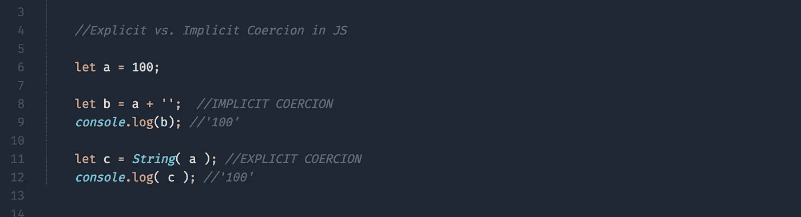
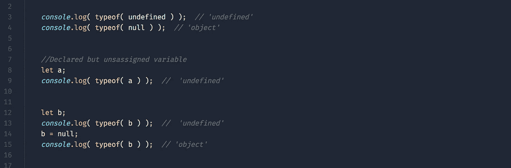
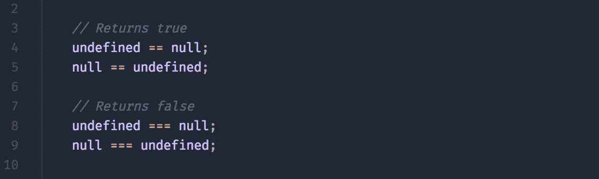

# Javascript 强制解释

> 原文：<https://medium.com/hackernoon/javascript-coercion-explained-545c895213d3>

## 以及一些实际的例子

B 在我们开始 JS 强制探索之前，值得注意的是这篇文章的存在，因为 JS 是一种[非类型化语言](https://hassan4u.wordpress.com/2010/12/11/typed-vs-untyped-languages/)(根据您的定义，可能是弱类型)。

## 打字语言

> 强**类型的**编程**语言**是这样一种语言，其中每种**类型的**数据(如整数、字符、十六进制、打包十进制等)都被预定义为编程**语言**的一部分，并且为给定程序定义的所有常量或变量都必须用其中一种数据类型来描述。
> 
> — [来源哟](http://whatis.techtarget.com/definition/strongly-typed)

对于我们这些 JS 用户来说，这意味着这种语言可能会被迫在编译时做出某些基于[规则的](http://delapouite.com/ramblings/javascript-coercion-rules.html)类型的决定。在这篇文章中，我们将提到两种不同类型的强迫，**显性**和**隐性**。

显式强制是作者将一种类型的值转换为另一种类型的明显尝试。隐式强制作为另一个操作的不太明显的副作用出现。参见下面的例子([要点](https://gist.github.com/btg5679/f0f456357ec8571f599e7d6ccbec2308)):

implicit/explicit coercion

请注意，在上面的例子中，隐式和显式的两种方法都导致了相同的结果，有趣的是*如何*导致了一些争论。即可读性是争论的焦点。几乎总是有人，而不是你，会阅读你的代码。以上方法哪个可读性更强？

说了这么多，让我们看看 JS 如何使用`==`和`===`处理数据类型之间的比较，以及使用`null`和`undefined`时的比较。

## 空与未定义

下面是一些代码示例，将在下面详细解释([要点](https://gist.github.com/btg5679/61eb19e762ab05cc2be26339c8cff8a2)):

null vs undefined types

上述代码的主要优点是:

*   `null`是一个*对象*
*   `undefined`是它自己独特的类型*未定义*

## 比较

我们现在来看看使用[相等](https://developer.mozilla.org/en-US/docs/Web/JavaScript/Reference/Operators/Comparison_Operators) `[==](https://developer.mozilla.org/en-US/docs/Web/JavaScript/Reference/Operators/Comparison_Operators)` [和严格相等](https://developer.mozilla.org/en-US/docs/Web/JavaScript/Reference/Operators/Comparison_Operators) `[===](https://developer.mozilla.org/en-US/docs/Web/JavaScript/Reference/Operators/Comparison_Operators)` [比较来比较不同类型的值的结果。](https://developer.mozilla.org/en-US/docs/Web/JavaScript/Reference/Operators/Comparison_Operators)

好，让我们强迫 JS 解释器对我们的意图进行一些猜测:

undefined/null

请注意，`undefined`和`null`在相等比较(4–5)中彼此相等，但在严格相等比较(8–9)中不相等

让我们来看一些**字符串**、**数字**和**布尔**的比较:

string/number/bool

现在你可能注意到了一个模式。当使用相等比较来比较不同类型的 val 时，JS 可能会正确地强制这些值。虽然准确性是通过严格的比较来实现的。

## 结论

最后，强制是非类型化语言的一种必然的邪恶。

我的建议是:

> 当你写代码时**总是**使用严格比较，除非你能证明不这样做是合理的。

 [## Javascript ES6 —箭头函数和词汇“this”

### ES6 Javascript 标准中最令人期待的新特性之一是箭头函数表达式。它承诺…

medium.com](/@reasoncode/javascript-es6-arrow-functions-and-lexical-this-f2a3e2a5e8c4) 

一如既往，让我们知道你的想法和问题，请在推特上关注我们。坚持下去。

## 如果这篇文章有帮助，请点击拍手👏按钮下面几下，以示支持！⬇⬇