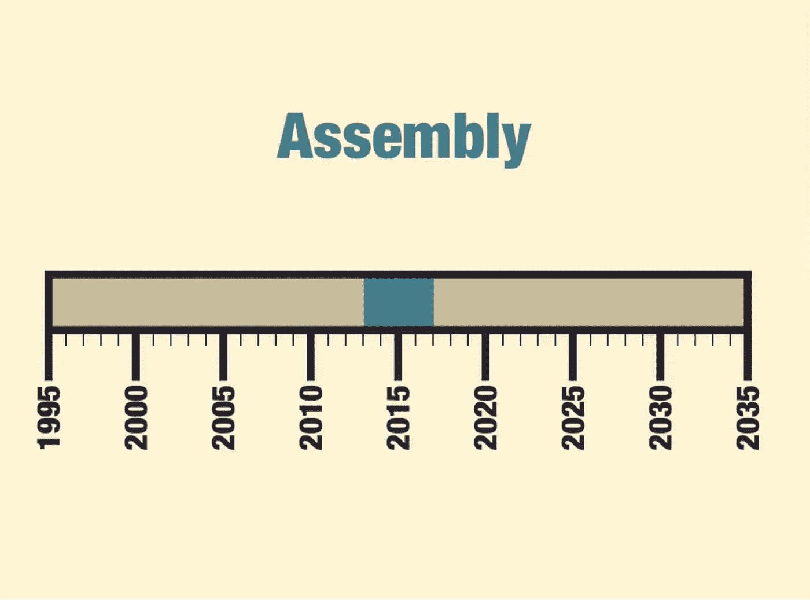

# 编译 JavaScript？真的吗？

> 原文：<https://medium.com/hackernoon/javascript-compilation-epoch-ebfb7b5bb664>

用于 [Javascript](https://hackernoon.com/tagged/javascript) 编译的 WebAssembly、Emscripten 和[工具](https://hackernoon.com/tagged/tools)。

Slide from the “The Birth & Death of JavaScript” by [Gary Bernhardt](https://www.destroyallsoftware.com/screencasts)

## 我有两个消息告诉你:好消息和坏消息。

**好消息—***JavaScript 编译的时代已经开始。* **坏消息—** *我们还没有为这个时代做好准备。*

# 真的吗？

也许你已经看过 [**这次大会的演讲**](https://www.destroyallsoftware.com/talks/the-birth-and-death-of-javascript)([加里·伯恩哈特](https://www.destroyallsoftware.com/screencasts)的《JavaScript 的诞生&死亡》)。

> 简而言之，这个演讲的中心思想是——浏览器将成为新的操作系统，JS 将成为新的 C 语言，软件将移植到浏览器中。

是的，这个时代已经在 Chrome OS、 [**电子**](https://electron.atom.io/) 、Emscripten、WebAssembly 之后开始了。*为什么自电子？*因为电子 app 相当于作为桌面 app 工作的浏览器。在 web 将迁移到 web 之前，这是一个很好的第一步:*在所有桌面应用程序都可以在浏览器中工作之前，我们可以尝试在浏览器上运行单个桌面应用程序。*

## *电子有什么问题？*

关于电子的主要问题很简单: [**电子是用于桌面的 Flash(**关于电子的伟大文章**)。**](https://josephg.com/blog/electron-is-flash-for-the-desktop/)

> 例如，我在 Mac 上安装了 Slack、Atom 和其他 3 个用 Electron 开发的应用程序。相当于 5 个 Chromium 浏览器。

# **WebAssembly、Emscripten 和 LLVM**

 [## web 组装/设计

### 设计- WebAssembly 设计文档

github.com](https://github.com/WebAssembly/design) 

我相信你已经听说过 [**WebAssembly**](http://webassembly.org/) 。

但是如果你想使用 **WebAssembly** ，你**需要了解 C 或 C++** 。
有多少**前端**开发人员**熟悉**C/c++？
*我个人在现实生活中并不认识这样的开发者。*

现在，我们可以通过两种方式将 C/C++代码编译成 Wasm:

*   用 Emscripten 编译。
*   用 LLVM 编译。[安装指南在此。](https://gist.github.com/yurydelendik/4eeff8248aeb14ce763e)

## Emscripten

 [## 克里普肯/埃姆斯普滕

### 一个 LLVM 到 JavaScript 的编译器

github.com](https://github.com/kripken/emscripten) 

> Emscripten 使本机代码在 Web 上立即可用。

[**Emscripten**](https://kripken.github.io/emscripten-site/)**的目的之一就是将**已有的庞大 C/C++代码库移植到 Web** 。但是目前，JavaScript 是最流行的语言之一。它在我们的**浏览器**中运行，在**移动平台**上运行，在**服务器** ( *节点*)上运行。JS **codebase** **是** **巨大的**也是。**

# **JS -> WebAssembly**

**就我个人而言，我在寻找任何可以将 JS 翻译成 l 语言的工具，这些语言可以被翻译成 C/C++或 asm.js。还有……我没有找到任何这样的工具。**

**不过可以找个工具把`<your-favorite-language/>`翻译成 JS。这个工具几乎总是存在的。这证明 JS 代码库可能是**有史以来**最大的代码库。JS 代码可以用 [Java](http://www.jsweet.org/) 、 [Python](http://www.infoworld.com/article/3033047/javascript/4-tools-to-convert-python-to-javascript-and-back-again.html) 等语言生成。**

> ****有趣的想法**:[原因](https://facebook.github.io/reason/)语言是基于 OCaml 的后端开发的，用于生成 JS。OCaml 字节码可以翻译成 C 代码。意味着 Reason(可能)允许你同时写 WebAssembly 和 JS。**

**另一种方法是将 JS 编译成 **LLVM 字节码**。理论上，那可以提供 JS 编译成**的原生代码和 WebAssembly。这是个疯狂的想法，但会很棒。****

# **小纸条:**

> **几乎每种语言都可以生成 JS，但是您只能用可以编译成 LLVM 字节码的语言生成 WebAssembly(它将在浏览器中与 JS 交互)。**
> 
> **但是与其写 C 代码，不如将 JS 翻译成 WebAssembly。**

# **“编译”您的 JS 的工具:**

# **围住**

> **将 Node.js 项目编译成可执行文件**

** [## igorklopov/附上

### 将 Node.js 项目编译成可执行文件

github.com](https://github.com/igorklopov/enclose) 

[这是第一次尝试“编译”JS。](http://enclosejs.com/) Enclose 有两个版本:免费和专有。免费版本只能捆绑五个文件。
另外，看起来 **Enclose 已经过时了。** 现在*项目业主在 **Pkg** 上*工作。** 

# **包装**

> **将 Node.js 项目打包成可执行文件**

** [## zeit/pkg

### pkg——将 Node.js 项目打包成可执行文件

github.com](https://github.com/zeit/pkg) 

最近尝试“编译”JS。
它是如何工作的？ **Pkg** 只是把 30MB 的节点二进制放到可执行文件中。所以即使像`const a = 5`这样的代码也会生成一个大文件。

*来自* [*节点-编译器*](https://github.com/pmq20/node-compiler) *文档(对照表):*

> **Pkg** 动态入侵`fs.*` API 以访问包内文件。
> **Pkg** 使用 JSON 存储包内文件。

**用例:**

*   制作应用程序的演示版本。
*   制作交叉编译的可执行文件。

> *个人比较确定 Pkg 更合适的名字是* ***附 2 :)***
> 
> Pkg 的主要开发者是伊戈尔·克洛波夫:[这里是 repo 的脉冲。](https://github.com/zeit/pkg/pulse/monthly)
> 
> [您可以检查提交历史](https://github.com/zeit/pkg/commits/master)。
> 
> **Pkg** 使用 devdependency `eslint-config-klopov`。** 

# **Nexe**

> **🎉从 node.js 应用程序中创建一个可执行文件**

** [## nexe/nexe

### nexe -🎉从 node.js 应用程序中创建一个可执行文件

github.com](https://github.com/nexe/nexe) 

又一次尝试编译 JS。

它到底是如何工作的没有官方信息，但是*经过一个小的研究，我弄明白了*中的 [**Nexe 下载节点二进制文件**](https://github.com/nexe/nexe/blob/master/lib/exe.js#L304-L308) (就像 **Pkg** 和**包围**)。

问题:

*   Nexe 不支持节点本机模块。
*   Nexe 不支持动态 require 语句。
*   Nexe 使用 browserify(不好吗？我想这并不现代。)。
    [*但只限于高手分支。您可以在这里找到 dev branch。*](https://github.com/nexe/nexe/tree/next)** 

# ****节点编译器****

> **使用 dynamic require 和所有 fs 将 Node.js 应用程序编译成一个可执行文件。* API 支持。**

** [## pmq 20/节点编译器

### node-compiler——使用 dynamic require 和所有 fs 将 Node.js 应用程序编译成一个可执行文件。* API…

github.com](https://github.com/pmq20/node-compiler) 

**节点编译器**推荐自己是 Pkg 和 Nexe 的更好替代品。正如你所看到的[这个工具将你的应用与节点二进制文件](https://github.com/pmq20/node-compiler/blob/master/lib/compiler/npm_package.rb#L25-L57) *(我不确定，没有关于它如何工作的信息)*。

*还有，* [*在项目回购里找到 Node.js 回购很奇怪吧？*](https://github.com/pmq20/node-compiler/tree/master/node)

# 小总结:

*   **附上**好像没保养。
*   `<sarcasm>
    **//**` **Pkg** === ( ***附 2.0:*** *伊戈尔·克洛波夫的归来)* `</sarcasm>`
*   `<sarcasm>` **节点编译器**在 repo 中存储 Node.js repo。`</sarcasm>`
*   [**Nexe** 在发展，但不那么积极。](https://github.com/nexe/nexe/commits/next)
*   **这些项目都不编译 JS，只是用节点二进制打包你的代码。**
*   但是**它们对于某些用途来说仍然很棒**，因为你可以将你的代码打包成可执行文件。** 

# **用 JS 引擎编译**

## *****可以用 V8/查克拉/蜘蛛猴编译 JS 吗？*****

**是的，我们可以。 **理论上的**。例如，我们可以从引擎中取出未优化的编译(非“JIT-ed”)代码。**

**不，我们不能。未优化的本机代码比 JIT 优化的代码效率低。**

****也许。每个 JS 引擎都是一个非常复杂、令人困惑的系统，有自己的架构和特性。****

> **如果你问某人浏览器是如何工作的，你会发现这个开发者只知道浏览器的一些常识。而且是… **吓人**。因为不是所有的程序员都知道**系统(执行他们的代码)是如何工作的**。**

# **结论。**

*   ****电子**必须**修正**。**
*   **很多前端开发者**不会用 WebAssembly** ，因为**没有 C/C++背景。****
*   **没有任何工具可以将 JS 翻译成另一种语言。**
*   **JS 代码可以从几乎任何编程语言生成。**
*   **可以让可执行文件存在的工具，但是他们把节点二进制文件放到你的文件中。**
*   ****浏览器**非常**复杂**并且可能**更好地向开发者解释。****
*   **WebAssembly 可能会成为 JavaScript 的编译形式。**

*****也许，JS 是新的 C 语言？现代世界的现代 C。*****

**github:[https://github.com/Metnew](https://github.com/Metnew)
推特:[https://twitter.com/coldlinecall](https://twitter.com/coldlinecall)
邮件:*vladimirmetnew@gmail.com***

************

> **[黑客中午](http://bit.ly/Hackernoon)是黑客如何开始他们的下午。我们是这个家庭的一员。我们现在[接受投稿](http://bit.ly/hackernoonsubmission)并乐意[讨论广告&赞助](mailto:partners@amipublications.com)机会。**
> 
> **如果你喜欢这个故事，我们推荐你阅读我们的[最新科技故事](http://bit.ly/hackernoonlatestt)和[趋势科技故事](https://hackernoon.com/trending)。直到下一次，不要把世界的现实想当然！**

****