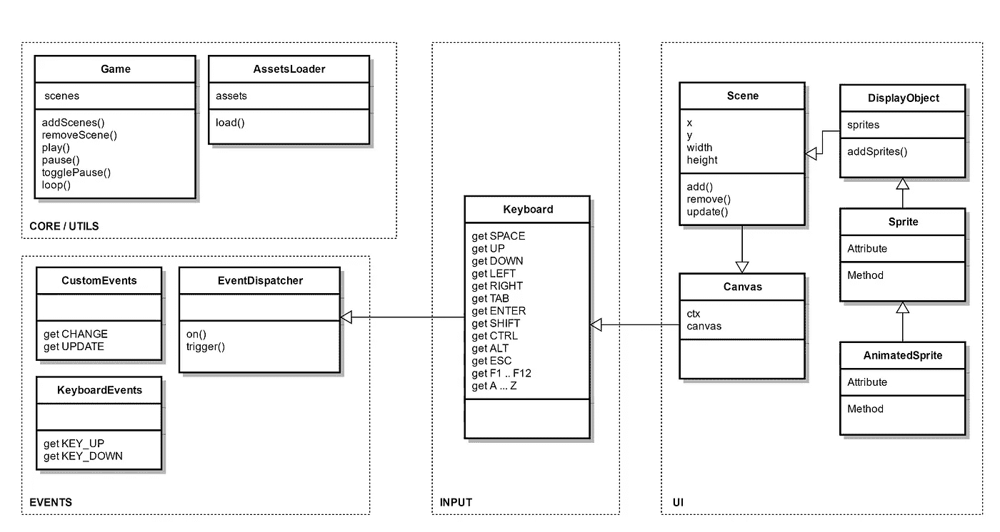

# JavaScript:你喜欢游戏吗？(第一部分)

> 原文：<https://medium.com/hackernoon/javascript-do-you-like-games-part-1-c1320c2c52ec>

关于这个话题:第 1 部分| [第 2 部分](https://blog.hellojs.org/javascript-do-you-like-games-part-2-9d4141ca2493) | [第 3 部分](https://blog.hellojs.org/javascript-do-you-like-games-part-3-6225ec264902) | [第 4 部分](/@radu.bogdan.gaspar/javascript-do-you-like-games-part-4-9d6e8adb5626) | [第 5 部分](/@radu.bogdan.gaspar/javascript-do-you-like-games-part-5-a79bb69ad9e1) | [第 6 部分](/@radu.bogdan.gaspar/javascript-do-you-like-games-part-6-7bff0b8ce05e)

也许我应该问你是否曾经思考过游戏是如何工作的，甚至是从零开始构建一个游戏？如果不是，现在就转身离开；我在你的未来看到了很多数学！

童年时，我对马里奥和其他类似的游戏非常着迷。他们非常简单*但*玩起来非常有趣。随着 Wii U 上的超级马里奥制造器的出现，马里奥正在卷土重来，这实际上一点也没有让我感到惊讶。

在多年的编程之后，我尝试制作一些自己的游戏，我很快意识到方法、工作环境、策略、计划、测试和思维方式完全不同。

我仍然想学习…使用一个框架是不够的；我想知道足够的信息来从头开始建造一个。纯粹的愚蠢，对吗？我更喜欢像维托尔德·冈布罗维茨一样思考这个问题

> 愚蠢是智慧的孪生姐妹。

这部分没有代码(抱歉)；我们需要先解决一些事情…

那么一个人如何开始构建一个游戏呢？事情是这样的，一场比赛通常不是一个人在没有团队的情况下进行的。你需要几样东西:一个故事/想法，一个游戏流派，游戏平台(网络，桌面，移动，主机)，一个程序员和一个最起码的设计师。目前这个团队包括:我，我自己和我……让我们看看结果如何。

我想做一个迷你引擎/框架/库/包，让我能够构建游戏。它需要具备一些基本功能，如:

*   游戏循环
*   通用屏幕绘制和刷新逻辑
*   多个屏幕容器(就像你在双人分屏游戏中看到的一样)
*   屏幕容器剪辑
*   屏幕分层
*   输入事件处理(通过键盘和/或鼠标)
*   自定义事件调度
*   资产加载(用于游戏中的媒体文件，如声音和精灵表)
*   显示和动画小精灵(blit ing a . k . a .[bit blit](https://en.wikipedia.org/wiki/Bit_blit)
*   动画帧速率控制
*   路径查找(这可能很好)
*   2D 物理引擎(2D 保持事情“简单”，因为它应该有碰撞检测支持和其他功能)

你可能会认为这是一个庞大的列表，但理想的引擎不应该固执己见的游戏类型，你可以建立；此外，这个列表实际上很小，我想走出我的舒适区一点。

我想在 ES6 中写所有的东西，所以我准备了一个[***babel-gulp-webpack-sass***](https://github.com/raduGaspar/babel-gulp-webpack-sass-boilerplate)样板文件。它与 live reload 扩展一起工作，以促进开发，所以请确保在浏览器中安装它。按照[指示](https://github.com/raduGaspar/babel-gulp-webpack-sass-boilerplate/blob/master/README.md)让它运行。

我将在另一个 GIT 库中完成所有的编码，以保持样板文件的完整性。

为了渲染，我决定使用画布元素。它不是交互式的(我将在后面详细介绍)，所以它可能会增加更多的编码挑战，这是完美的。它通常是网页游戏的首选，因此符合要求。

方法很简单，我们将有一个双重用途的代码库:

*   一部分是引擎
*   另一个将是使用该引擎的游戏。

用一个不成熟的引擎创建迷你游戏会很快让我们知道它缺少什么以及如何改进它。

让我们从第一件事开始:

**游戏循环**。这是什么？我们为什么需要它？

我认为游戏循环是游戏的心跳。它保持一切更新和正确渲染。如果我们想要确定性的行为，那么在屏幕上绘制的所有东西都需要与单个游戏循环一起工作。

你不想创建一个射击游戏，让子弹穿过玩家而不造成伤害，或者让玩家穿过地图，因为玩家、子弹和地图更新在不同的循环中。

在旧的浏览器中，***setInterval()***方法是可行的，因为你可以每隔 *n* 毫秒调用一次。如今，这是一个糟糕的做法，只有在***requestAnimationFrame()***不可用时才作为后备。***requestAnimationFrame()***方法会触发~60 fps。这是一个近似值，因为它通常会匹配刷新率；更多[此处](https://developer.mozilla.org/en-US/docs/Web/API/window/requestAnimationFrame)。

我通常喜欢在开始编码之前有一个小的类图，至少突出主要的类容器。目前来看，这种思路应该足够了:

game engine diagram v.1.0

这个图表是不完整的，这很好，我们只是需要一些东西来开始，但首先一些解释:

*   在一切的核心，我们有一个 ***EventDispatcher*** ，我们可以用它来监听和发出(触发)事件；这可能应该是一个单一的，它将像一个全球发布和订阅。
*   ***键盘*** 将帮助我们确定按键何时被按下和释放。现在，虽然它确实扩展了***event dispatcher***，但是我们不应该使用它的特性来实现 ***键盘*** 逻辑，因为我们不想来回传播事件，我们只是想在需要时拥有那个选项。
*   ***Canvas*** 只有两个任务:创建并存储对 Canvas 标签及其上下文的引用，在调整屏幕大小时更新其属性。一切都将被绘制在一个 ***画布上*** 实例中。
*   ***场景*** 扩展了 ***画布*** 你可以把它想象成一个视口/摄像机/屏幕。我们可以有多个 ***场景*** 实例，用于我们想要做的事情，比如分屏。它的工作还包括调用其中所有元素的****render()***方法。*
*   ****display object***是保存我们想要渲染的任何项目。其他类会对它进行扩展，添加更多的属性；例如，我们可能想要设置像*是固体*、*有重力*和其他被物理引擎消耗的东西。*
*   ****游戏*** 类将保存主游戏循环、所有场景以及一些游戏播放和暂停功能。*
*   ****资产加载器*** 是不言自明的。*

*这个结构可能并不完美，但它很好地满足了我们的需求，因为任何与 ***Canvas*** 直接或间接相关的类都将能够:分派事件、监听键盘输入并绘制到漂亮的屏幕上。*

*您可能会问自己，我们是否真的需要事件调度程序；实际上，我打算以后用它来促进单向数据流。*

*接下来，我们将开始所有这些类的工作，也许实现一个迷你游戏的基础，看看一些实际的进展。*