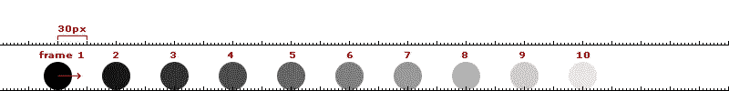
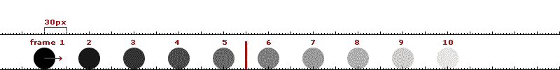

# JavaScript:你喜欢游戏吗？(第三部分)

> 原文：<https://medium.com/hackernoon/javascript-do-you-like-games-part-3-6225ec264902>

关于这个话题:[第 1 部分](https://blog.hellojs.org/javascript-do-you-like-games-part-1-c1320c2c52ec) | [第 2 部分](https://blog.hellojs.org/javascript-do-you-like-games-part-2-9d4141ca2493) |第 3 部分| [第 4 部分](/@radu.bogdan.gaspar/javascript-do-you-like-games-part-4-9d6e8adb5626) | [第 5 部分](/@radu.bogdan.gaspar/javascript-do-you-like-games-part-5-a79bb69ad9e1) | [第 6 部分](/@radu.bogdan.gaspar/javascript-do-you-like-games-part-6-7bff0b8ce05e)


上一篇[文章](https://blog.hellojs.org/javascript-do-you-like-games-part-2-9d4141ca2493)有点长，所以我们将以较小的增量前进。

先来讨论一下[运动](https://hackernoon.com/tagged/movement)在游戏中的工作原理。18 世纪的瑞士数学家、物理学家、天文学家、逻辑学家和工程师莱昂哈德·欧拉设计了一种方法，让我们根据两件事来预测一个物体的位置:它的当前位置和速度。我们实际上在我们的[上一篇文章](https://blog.hellojs.org/javascript-do-you-like-games-part-2-9d4141ca2493)中使用了我们的 **Square** 类的 ***update()*** 方法:

```
this.x += 1 * movementMultiplier;
this.y += 1.5 * movementMultiplier;
```

欧拉积分在速度恒定的游戏中创造了奇迹，在处理器上也非常容易；不幸的是，你会很快发现，如果你计划建立一个物理引擎，这是不够的…它变得非常不准确。让我们想象一下:



Euler integration

在上图中，网格上两个峰值之间的距离约为 30px，我们的球的速度为每帧 60px，我们运行 10 帧(60fps，即 1/6 秒)。这似乎很好…运动是恒定的，所以应该很容易处理，对不对？…嗯，不完全是；让我们在那里加一面墙:



在第 5 帧和第 6 帧之间，你可以看到一面令人印象深刻的墙；更令人印象深刻的是，按照现在的逻辑，那个球会像不存在一样穿过墙。如果你想实现心灵运输，这可能会很酷，但如果你想碰撞，就没那么酷了。

在游戏中，检测多个物体的碰撞是必要的，如果你考虑到每个物体都有它自己的轨迹，速度和外力作用在它身上…欧拉积分证明是不够的。

另一种方法是使用龙格-库塔方法中的一种，但是它们会给处理器带来压力；对于精确的物理计算来说，这是完美的，但是对于我们的目的来说，这可能有点过了。

大多数游戏中的 go to 方法将使用法国物理学家 Loup Verlet 的方程，特别是 [Verlet 积分](https://en.wikipedia.org/wiki/Verlet_integration)。主要的区别在于，使用 Verlet 积分，您计算的是对象的速度，而不是它在下一帧中的位置。您可以通过从当前位置中减去前一个位置来完成此操作。

我一直在说速度，所以我要纠正我自己；**我们实际上在计算速度**。速度和速率的区别对我们很重要，因为速度不知道方向，而速率是一个矢量，它知道方向；这是一个非常小却非常重要的区别。

```
let velocity = currentPosition - previousPosition;
position += velocity;
```

这是否意味着我们的碰撞问题消失了？不完全是这样，但是这样更容易纠正；我们可以根据当前和以前的状态计算下一个状态，使我们能够在渲染之前解决任何冲突。

我们将在游戏引擎中创建一个 **VerletModel** ，这将允许其他对象在需要时使用它；就目前而言，它应该:

*   暴露 x 和 y 速度的 getters 和 setters
*   公开 x 和 y 位置值的 getters 和 setters

engine/models/VerletModel.js

这个模型可以潜在地保存其他事物的变量，比如:*重力*、*摩擦力*、*旋转*等等，或者它可以通过添加这些特性的另一个类来扩展。这背后的原因很简单:所有的游戏都有运动，但不是所有的游戏都需要复杂的物理。

我们来看一个例子；我们将创建另一个如上所述移动的正方形，并为我们的模型添加一点加速度和摩擦逻辑。一个经典的 MVC 方法应该可以解决这个问题:

*   **SquareModel** 类，它将扩展 **VerletModel** :它将存储与我们的 square 相关的所有数据，以及一个 ***update()*** 方法，该方法将覆盖 **VerletModel** 中的默认方法。

verletSquare/square/SquareModel.js

你可以看到我们使用 ***x*** ， ***y*** ， ***vx*** 和**vy*设置器和 **VerletModel** 的获取器来计算摩擦力，然后将摩擦力加到加速度上。*

*   **SquareView** 类，它将扩展**场景(目前为**；因为这应该扩展**显示对象**，我们还没有)

verletSquare/square/SquareView.js

**SquareView** 接收一个 **SquareModel** 和 **SquareCtrl** 的实例，并在自己的 ***update()*** 方法中对其进行更新。您还会看到，我们在模型上存储了一个场景引用，因为这是将正方形正确包装到其父场景所必需的。这很烦人，应该是自动完成的，但是我们还不担心这个。

*   **SquareCtrl** 类，它将扩展**键盘**

verletSquare/square/SquareCtrl.js

**SquareCtrl** 只有一个作用:根据当前按下的键改变加速度。当我们释放一个键时，摩擦力设置为 0.94。这个值将与我们的速度相乘，结果加到我们的加速度上。

最后我们会得到一个摩擦效果，它会让物体在每一帧中减速。

如果我们按住键，每一帧的加速度增加 0.5。在我们的 ***update()*** 方法中，我们确实有一点代码重复，但是对于这个演示来说这没什么问题。

让我们把所有东西放在一起:

verletSquare/index.js

这是一个实际操作的演示(使用箭头键):

源代码:

[](https://github.com/raduGaspar/game-physx/tree/0c8966fc40832b9a5540c5b5301e00237a699358) [## 红景天/游戏-physx

### 一个用于 JavaScript 游戏制作的小工具

github.com](https://github.com/raduGaspar/game-physx/tree/0c8966fc40832b9a5540c5b5301e00237a699358) 

此时你可能会想:*难道我们没有给代码增加更多的复杂性吗？是的，复杂性正在增加；有些是无法避免的，有些是由于我们的 MVC 方法。*

一如既往，这里需要改进；首先，在模型上添加场景引用的方式是次优的，我们在控制器中也有代码复制，在 MVC 中有相当多的逻辑。

随着这些文章的进展，我们将慢慢地从 MVC 转向一个流动的架构，但是总的来说，我们确实学到了更多关于游戏中运动是如何工作的。

下一次我们将创建一个 **DisplayObject** 类并覆盖:精灵表、精灵、动画精灵和帧率控制。