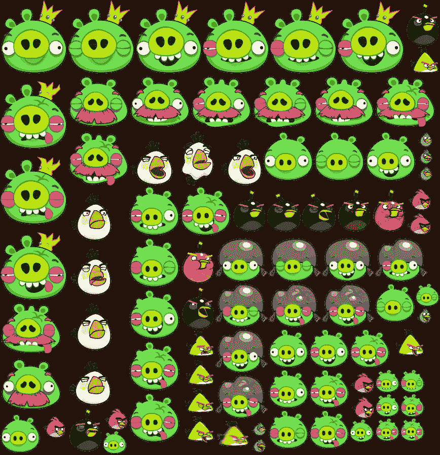
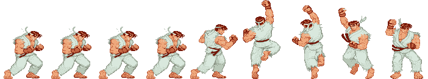

# JavaScript:你喜欢游戏吗？(第四部分)

> 原文：<https://medium.com/hackernoon/javascript-do-you-like-games-part-4-9d6e8adb5626>

关于这个话题:[第 1 部分](https://blog.hellojs.org/javascript-do-you-like-games-part-1-c1320c2c52ec) | [第 2 部分](https://blog.hellojs.org/javascript-do-you-like-games-part-2-9d4141ca2493) | [第 3 部分](https://blog.hellojs.org/javascript-do-you-like-games-part-3-6225ec264902) |第 4 部分| [第 5 部分](/@radu.bogdan.gaspar/javascript-do-you-like-games-part-5-a79bb69ad9e1) | [第 6 部分](/@radu.bogdan.gaspar/javascript-do-you-like-games-part-6-7bff0b8ce05e)

我们将继续使用**显示对象**，它扩展了**场景**。您可以在本系列的第 1 部分中回顾这个模式，但是我们将对事物的命名方式进行一些修改。

它的工作非常简单；它将需要在一个*子*数组中呈现的对象分组，并且它将公开允许我们向这个数组添加和移除元素的方法。它实际上在功能上非常类似于**画布**。

我们希望在我们的**场景**中呈现的所有东西都是**显示对象**。想象一个游戏，我们有一艘宇宙飞船。每当飞船移动，它的推进器就会被点燃。**显示物体**可以容纳飞船和推进器，因为它们属于一起。

像这样分开物体意味着我们也可以单独测试碰撞，因为与推进器碰撞的东西不应该记录在船上。

你可以使用这种逻辑更进一步，增加收集能量的能力，为船只增加更多的火力，并使这些增强可以被敌人的火力摧毁，等等。

现在我们只关心分组逻辑:

engine/ui/DisplayObject.js

雪碧床单:它们是什么，能提供什么？

一个游戏通常需要大量的图形资源。在 2D 游戏中，这些图像通常被称为*精灵*。每个图像都有宽度、高度和颜色深度。像素由 4 个通道定义:

*   3 个颜色通道(红色、绿色、蓝色)和
*   1 个阿尔法通道。

每个通道都有一个从 0 到 255 的值。可以用 8 位存储最大值 255(二进制 255 = 11111111)；4 个通道*每个通道 8 位= 32 位。每个像素总共有 4 个字节。64x64 图像所需的内存为 64*64*4 = 16.3 千字节。

这不是很多，但管理多个角色、项目和动画会影响内存和隐含的性能。最好的方法是将所有图形资产存储在一个 sprite 表中。下面是愤怒的小鸟游戏中的部分精灵表示例:

© **Rovio Entertainment —** Angry Birds Sprite Sheet (868 x 898 px)

它有各种各样的猪，他们受到的伤害阶段，以及一些鸟。有一些工具可以帮助你创建 sprite 工作表，比如 [TexturePacker](https://www.codeandweb.com/texturepacker) ，但是你也可以创建自己的实用程序来相对容易地完成这项工作。

您可以创建具有固定宽度和高度单元格的 sprite 表，或者您可以通过裁剪透明部分使每个 sprite 占用尽可能少的空间来优化它们。

我们的引擎将有一个 **SpriteSheet** 类，它将实现一个 ***getTile()*** 方法来返回基于其位置的特定图块。我们目前的工作思路是，工作表中的所有图块都具有相同的宽度和高度(因此，如果一个图像是 64x32px，则它们都是)。

engin/ui/SpriteSheet.js

它需要两个参数:加载的图像和图块大小。加载的图像将由我们的 **AssetsLoader** 实用程序类提供，我们在本系列的[第 2 部分](https://blog.hellojs.org/javascript-do-you-like-games-part-2-9d4141ca2493)中已经介绍过。

由于我们的 sprite 表对于每个图块都有固定的宽度和高度，所以我们可以遍历整个图像并存储每个 sprite 的坐标。

动画精灵没有什么不同，看看街头霸王游戏中的 Ryu 精灵表:

Ryu Sprite Sheet (702 x 130 px)

这和电影胶片是一个概念。你有很多帧的静态图像，你以很高的帧速率遍历它们。这给人以运动的错觉。

那么一个**动画的 prite** 类会是什么样子呢？它应该有几样东西:

*   x 和 y 位置
*   它正在处理的精灵表
*   动画的开始和结束帧
*   动画是否应该永远循环(默认为真)—在以后，我们也可以允许这是一个数字(如循环 3 次)
*   如果循环为假，它应该在最后一帧停止
*   动画帧速率(除非我们想要每秒 60 次切换这些帧)
*   在上面的图像中，Ryu 有 9 帧，但我们正在处理一个基于 0 的索引，所以帧从左到右从 0 到 8 计数；这将是我们班的默认方法

engine/ui/AnimatedSprite.js

这就是所谓的 blitting。帧速率控制由 ***update()*** 方法中的日期实例管理。我们检查经过的时间是否大于周期…如果是，我们简单地将帧索引增加 1；无论是 ***update()*** 还是 ***render()*** 方法仍然是每秒调用~60 次，这并不影响我们。

让我们把所有东西放在一起:

sprites/index.js

下面是 Ryu 以 10 fps 的速度循环播放动画的工作演示:

源代码:

 [## 红景天/游戏-physx

### 一个用于 JavaScript 游戏制作的小工具

github.com](https://github.com/raduGaspar/game-physx/tree/f23ba9e81de0e448a11d9f1501f8935250e43bc0) 

在下一篇文章中，我们将尝试用我们目前拥有的[引擎](https://hackernoon.com/tagged/engine)创建一个简单的游戏，比如小行星或者[太空](https://hackernoon.com/tagged/space)入侵者。