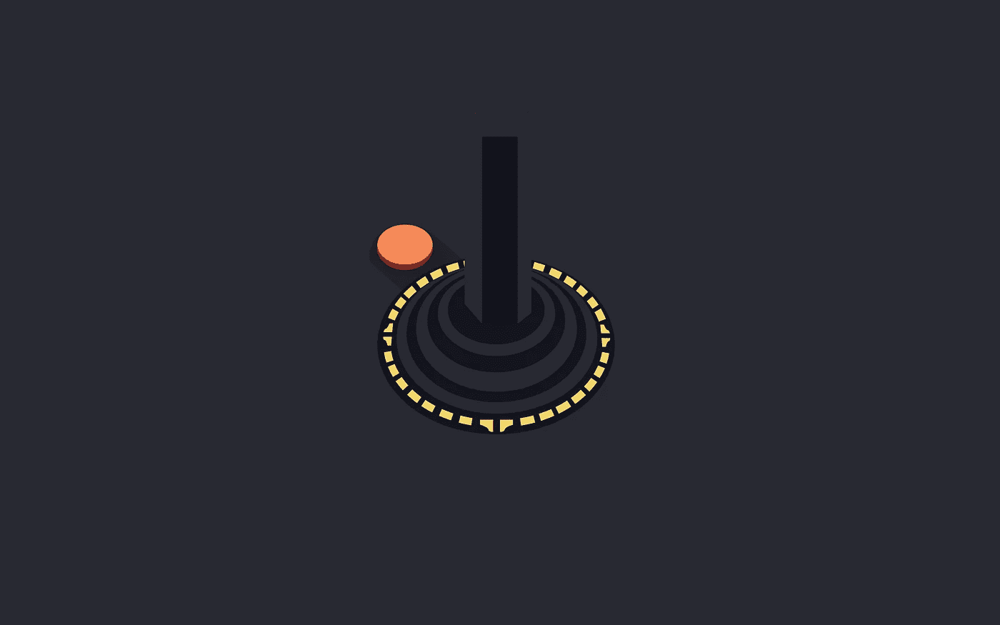
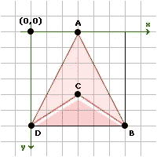
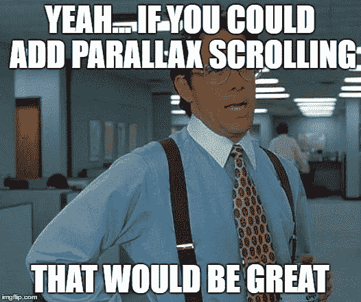

# JavaScript:你喜欢游戏吗？(第五部分)

> 原文：<https://medium.com/hackernoon/javascript-do-you-like-games-part-5-a79bb69ad9e1>

关于这个话题:[第 1 部分](https://blog.hellojs.org/javascript-do-you-like-games-part-1-c1320c2c52ec) | [第 2 部分](https://blog.hellojs.org/javascript-do-you-like-games-part-2-9d4141ca2493) | [第 3 部分](https://blog.hellojs.org/javascript-do-you-like-games-part-3-6225ec264902) | [第 4 部分](https://blog.hellojs.org/javascript-do-you-like-games-part-4-9d6e8adb5626) |第 5 部分| [第 6 部分](/@radu.bogdan.gaspar/javascript-do-you-like-games-part-6-7bff0b8ce05e)



我相信现在是我们尝试用现有的引擎开发一款游戏的时候了；你同意吗？我们将制作小行星，它于 1979 年 11 月首次亮相；由雅达利公司发布。

我们可以用很多方法来实现这个游戏:

*   我们可以使用 sprite sheets，因为我们现在确实支持它们
*   我们可以使用代码来绘制游戏元素
*   我们甚至可以添加声音，因为 **AssetsLoader** 类支持这样做

我相信尝试使用 [JavaScript](https://hackernoon.com/tagged/javascript) 绘制游戏元素会有更多的学习价值，所以像:玩家、子弹、小行星和星域都将是单独的类。

我们还没有像碰撞这样花哨的东西，所以游戏一开始会很无聊，但是不要担心…碰撞肯定是要做的事情。

我们将从玩家开始……我们需要某种船，它根据我们之前实现的**虚拟模型**移动。画布笛卡尔坐标系从左上角的 x = 0，y = 0 开始，所以我们画的任何东西都是相对于那个的；我们想要这艘船:



画这个需要的指令是: *moveTo()* 点 A 然后 *lineTo()* 点 B，C，D 然后回到 A，从 D 到 A 的线是可选的，因为我们可以简单地调用 *closePath()* 。我们将重用点 B，C 和 D，加上一些偏移，来创建船舶推进器。

我们可以创建一个实用的绘图方法。它需要两个参数:一组 ***动作*** 和每个动作的一组 ***坐标*** 。这个方法应该是 **DisplayObject** 类的一部分，因为任何绘制的东西都会扩展它。

我们现在只使用 *moveTo()* 和 *lineTo()* ，所以我们的引擎将被指示使用这些:

engine/ui/DisplayObject.js

*draw()* 方法可以这样使用:

```
// normal approach
// moveTo(10, 10)
// lineTo(10, 20)
// lineTo(20, 20)// draw method approach
draw([0, 1, 1], [[10, 10], [10, 20], [20, 20]]);
```

你可能会说这种方法弊大于利，没有适当的[文档](https://hackernoon.com/tagged/documentation)我承认，它可能会令人困惑…但它是一个辅助方法，我们不必使用它。为了清楚起见，我不会在这些帖子中使用它。

我们的船需要围绕它的中心点旋转，所以当我们计算绘制它所需的坐标时，必须考虑这个事实。

asteroids/objects/Player.js

如您所见，我们的**玩家**类既是一个视图又是一个控制器。您可以使用箭头键或(W，A，D)和空格键来控制船只，以播放射击声音(尽管我们还没有子弹)。我们遗漏了 **PlayerModel** …让我们也补充一下:

asteroids/models/PlayerModel.js

这个类似于我们在前面的例子中实现的，但是有一些额外的特性。 **PlayerModel** 的更新功能也处理旋转，并增加了一个速度陷阱，如果推进器关闭，它会使船减速。我们可以将所有这些特性直接添加到 **VerletModel** 中，并在需要的时候启用它们，但是现在这样就可以了。

我们可以做的下一件事是创建一个 **Map** 类。这将绘制场景中所有渲染对象的一些指示器，比如玩家和小行星。

这基本上是一个游戏中的地图，它需要两个参数:

*   标记(指示器)尺寸和
*   地图比例因子。

后者将表示贴图大小相对于场景大小的百分比。**映射**类如下所示:

asteroids/objects/Map.js

当标记接近地图的外边缘时， *getSize()* 方法将调整标记的大小。这是为了防止它溢出**地图**容器大小。

让我们也加入一个**星域**来更好的衡量；它应该产生:

*   动态数量的恒星
*   这将是很好的自动生成 3 种类型的恒星大小(大，中，小)，以模拟某种深度；我们还会把它们的颜色从亮白色变成深灰色。
*   它应该相对于播放器模型和恒星大小来移动恒星，从而产生一种视差效果，即较近的恒星比较远的恒星移动得快



asteroids/objects/StarField.js

你会注意到我们在 *update()* 方法中调用了 *super.update()* 。这是为了确保我们在 *generateStars()* 方法中添加的所有星星都被渲染。或者，我们可以编写自己的 *render()* 方法来完成这个任务，但是让我们使用:D 引擎！

视差效应在第 62 & 63 行开始起作用，我们根据模型速度和恒星比例计算每个恒星的 x 和 y 位置。我们还将星星包裹在场景中，所以感觉我们正在穿越一个永无止境的领域。根据大小改变星星的颜色也给整体效果增加了一点美感。

你也会注意到我们在这里使用了一个**粒子**类。这是新的东西，是引擎的一部分。它绘制一个指定半径和颜色的圆:

engine/ui/Particle.js

让我们把所有东西放在一起，看看它是如何工作的:

asteroids/index.js

演示(免费 codepen 帐户中没有声音):

源代码:

[](https://github.com/raduGaspar/game-physx/tree/c94de6e128a25a188443968d172a21155dbed787) [## 红景天/游戏-physx

### 一个用于 JavaScript 游戏制作的小工具

github.com](https://github.com/raduGaspar/game-physx/tree/c94de6e128a25a188443968d172a21155dbed787) 

下一次我们将学习如何生成随机的小行星，这样所有的岩石看起来都有一点不同，将它们添加到地图中用于追踪和子弹生成逻辑。