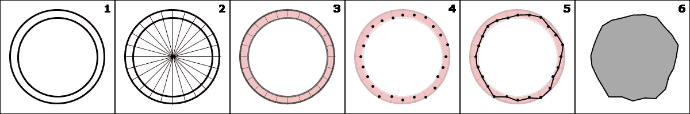

# JavaScript:你喜欢游戏吗？(第六部分)

> 原文：<https://medium.com/hackernoon/javascript-do-you-like-games-part-6-7bff0b8ce05e>

关于这个话题:[第一部分](https://blog.hellojs.org/javascript-do-you-like-games-part-1-c1320c2c52ec) | [第二部分](https://blog.hellojs.org/javascript-do-you-like-games-part-2-9d4141ca2493) | [第三部分](https://blog.hellojs.org/javascript-do-you-like-games-part-3-6225ec264902) | [第四部分](https://blog.hellojs.org/javascript-do-you-like-games-part-4-9d6e8adb5626) | [第五部分](https://blog.hellojs.org/javascript-do-you-like-games-part-5-a79bb69ad9e1) |第六部分

是时候报道小行星的产生了。我敢打赌，你从来没有想过玩摇滚会很有趣…好吧，你错了！

在我们编码之前，让我们把我们想要达到的目标形象化，用语言表达出来:

*   我们想要一个可以画小行星的类(天才的一笔)
*   它应该在一组给定的参数范围内随机绘制，因为一遍又一遍地看同一块石头会很快让人感到无聊

就实际步骤而言，这样的对象可以绘制如下:

asteroid drawing approach

一切都从两个同心圆开始。您可以将这些看作是我们的类将接收的两个简单参数；最小和最大半径。

在第二步中，我们将圆均匀地分成几片。切片的数量会给我们小行星的“分辨率”…它的粒度。数字越大，我们的岩石细节就越精细。增加这个数字也要付出性能代价。

继续第三和第四步，我们展示感兴趣的区域。我们希望在切片上生成该范围内的一组随机点。更确切地说，这些点中的每一个都将被定位在大于或等于我们提供的最小半径的半径处，但不大于最大半径。

第五步和第六步代表简单的部分…用一条线连接这些点并应用填充颜色，产生一个随机生成的小行星。很漂亮吧？这是一个基于画布的视觉表现:

调用这个类将创建过多的岩石形状，但是要小心那些最小和最大半径值…你不希望你的小行星看起来太尖；还是你？我们将上述逻辑保留在一个 **RockModel** 类中，该类将扩展 **VerletModel** :

asteroids/models/RockModel.js

我们还做了一些额外的工作，根据我们生成的点来计算最终岩石的宽度和高度。岩石将被施加一个(非常小的)随机旋转和速度。

由于我们希望岩石随机地放置在场景中，并且由于该场景实例在模型中不可用，我们将在 **Rock** 类中设置它的 x 和 y 位置。

实际的显示对象 **Rock** 类看起来会是这样的:

asteroids/objects/Rock.js

它只是渲染从模型中得到的所有这些点之间的线。

至此，每个人都应该很清楚，使用脚本化的形状比使用精灵更加耗费处理器资源。虽然遍历几个点并在它们之间画线没什么大不了的，但如果你处理成千上万个这样的对象，这很快就会变成一个点。长话短说，这不会很好地扩展…所以考虑你自己被警告。

我们说过我们想要一个小行星场，就像我们已经有的恒星场一样…那些岩石会移动，但它们的移动需要受到宇宙飞船速度的影响，所以让我们接下来这样做:

asteroids/objects/RockField.js

我们希望我们的**地图**追踪这些新的物体，但是它还不知道如何去做。我们希望地图接受**显示对象**类，如果其中任何一个有孩子，它应该递归迭代并显示他们。

asteroids/objects/Map.js

这里唯一的区别基本上是 *renderMarker()* 方法，它接受一组对象作为参数。如果它在给定的集合条目中找到任何子条目，它将遍历它们。

接下来，是时候发射一些子弹了。 **Player** 类需要处理它，因为它是一个玩家特定的动作，所以我们将添加这段代码:

asteroids/objects/Player.js

如您所见，每当按下空格键，我们就生成一个新的**项目符号**，该类如下所示:

asteroids/objects/Bullet.js

**Bullet** 类扩展了 **Particle** ，所以我们不需要复制 *render()* 方法。相反，在 *update()* 上，我们只是根据船只的角度来设置 x 和 y，因为我们总是想朝船只面对的方向发射子弹。

我们还会在 3 秒后自动销毁子弹。你也可以在构造函数中用一个 *setTimeout()* 方法来实现这一点…但是我们不是野蛮人:D(如果一切都按照我们说的那样以相同的帧速率工作就好了)。

将所有东西放在一起:

asteroids/index.js

你现在可以发射比你需要的更多的子弹，而且没有碰撞可言(然而),这是一个非常令人印象深刻的展示…只是绕着火飞(空格键和 J 键可以用来开火)。

你可能会注意到岩石包裹逻辑中的一个小怪癖，因为它目前有点不稳定，但我们最终会找到它的。

实际演示:

源代码:

 [## 红景天/游戏-physx

### 一个用于 JavaScript 游戏制作的小工具

github.com](https://github.com/raduGaspar/game-physx/tree/beb59dbf1a7f6e9acafc7b6f197259963888b454) 

接下来我们应该开始讨论碰撞。这是一个更大的主题，涉及到相当多的数学知识，所以我希望它能跨越几篇文章。需要复习一下[向量](https://hackernoon.com/tagged/vector)数学，所以我们会继续。