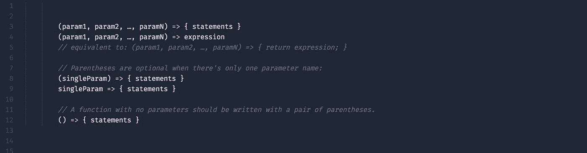
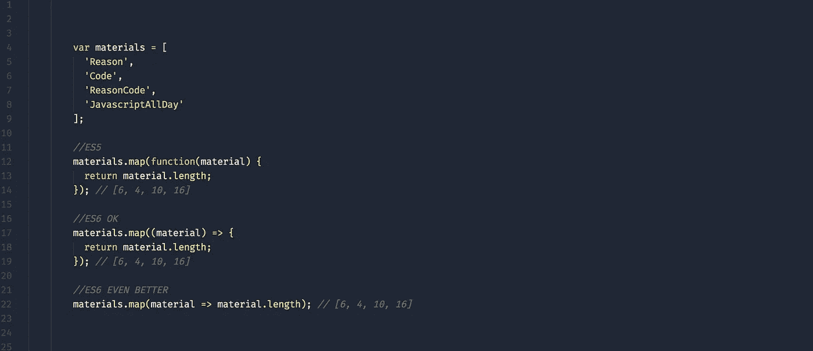
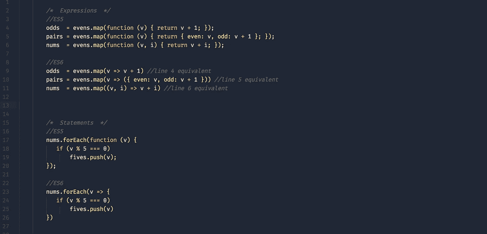
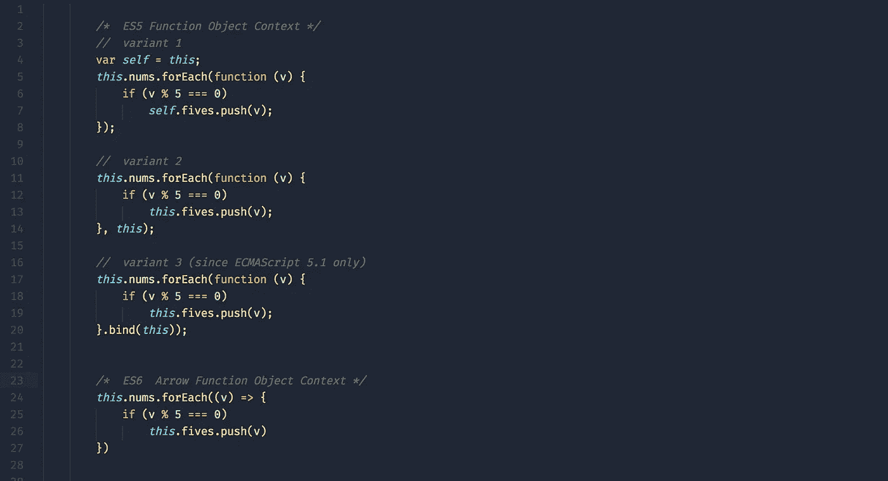

# JavaScript ES6-Arrow 函数和词法“this”

> 原文：<https://medium.com/hackernoon/javascript-es6-arrow-functions-and-lexical-this-f2a3e2a5e8c4>

OES6 Javascript 标准中最令人期待的新特性之一是 [Arrow Function Expression](https://developer.mozilla.org/en-US/docs/Web/JavaScript/Reference/Functions/Arrow_functions) 。它承诺一个比它的前身[函数表达式](https://developer.mozilla.org/en-US/docs/Web/JavaScript/Reference/Operators/function)更短的[语法](https://www.sitepoint.com/es6-arrow-functions-new-fat-concise-syntax-javascript/)。此外(IMHO 更激动人心的是)，新的 Arrow Function 是如何绑定的，或者实际上**并不**绑定自己的`this` *。* Arrow Functions **在词汇上**绑定了它们的上下文，因此`this`实际上是指原始上下文。

让我们更深入地看看这两种实现。

*请记住，以下所述的 ES5 通常是指 ES6 之前的状态。*

*很多人都在问这些教程中使用的编辑器主题。正是*[*AYU*](https://github.com/dempfi/ayu)*崇高的主题加上了* [*苹果 SF*](https://developer.apple.com/fonts/) *的字体(细)。*

*如果你喜欢这个帖子，查看我最近关于组件共享的帖子，给我关注* [*推特*](https://twitter.com/reasoncode) *:*

 [## 反应-本地-网络和真正的组件共享

### 巫术。

medium.com](/@_bengarrison/react-native-web-and-true-component-sharing-caa535b9dd7f) 

# 基本箭头函数语法

我们稍后将讨论一些更具体的例子，但让我们先把这个问题解决掉。

basic arrow fn syntax

您可以在第 3 行看到语句的基本语法，在第 4 行看到表达式。注意第 4 行等同于第 5 行。对于单参数函数，括号是可选的(第 8-9 行)。第 12 行没有 param 函数示例。

# 较短的函数

## 实施例 1

shorter functions ex 1

注意第 5 条*。地图()*功能在第 12 行。第 17 行是 ES6 实现，第 22 行是 **BETTER** ES6 实现。

## 示例 2(表达式和语句)

shorter functions ex 2

# 词汇本

我们已经确定 ES6 Arrow Functions 的语法优于以前的标准，现在让我们看看执行上下文的含义。

在过去，你可能选择了一种常见的模式，即顶层的`this`后面是嵌套的`.bind(this)`和`self=this`语句。请查看下面的图示。

lexical this

第 4、11 和 17 行都提供了管理现有执行上下文限制的 ES5 实现。你可以在第 24 行看到 ES6 箭头函数词法这个上下文。

那么**到底是如何**让‘词法 this’允许我们传递执行上下文呢？通过使用“词法范围”。[词法范围](http://whatis.techtarget.com/definition/lexical-scoping-static-scoping)仅仅意味着它使用了包含 Arrow 函数的代码中的`this`。

我认为结束这篇文章的一个好方法是总结 ES6 中函数的整体状态。随着 ES6 开始占据主导地位，你可能很难再看到老学校的功能:

*   构造函数有望被类声明所取代
*   作为子程序的函数将被箭头函数取代
*   作为方法的函数将被方法定义所取代

这就是 ES6 中的箭头函数。让我知道你的想法和问题，并在推特上给我一个关注。坚持下去。

# 如果你喜欢这篇文章，请推荐分享，帮助别人找到！