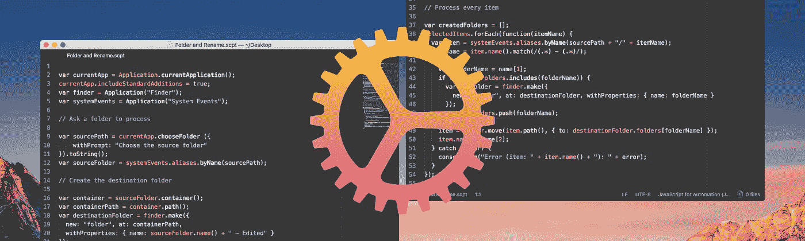
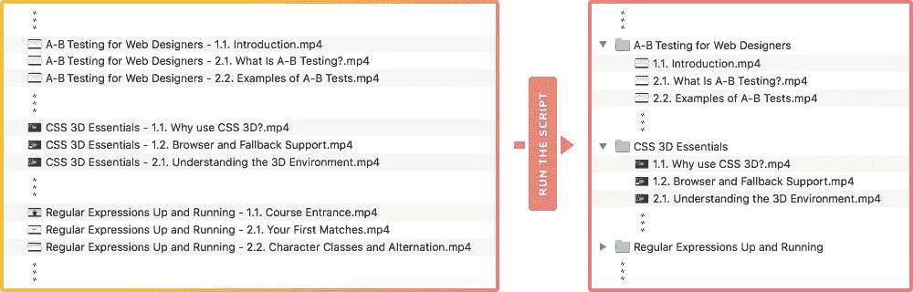
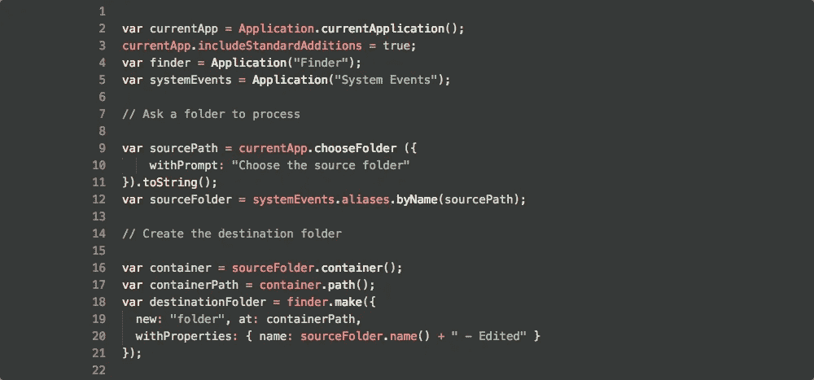
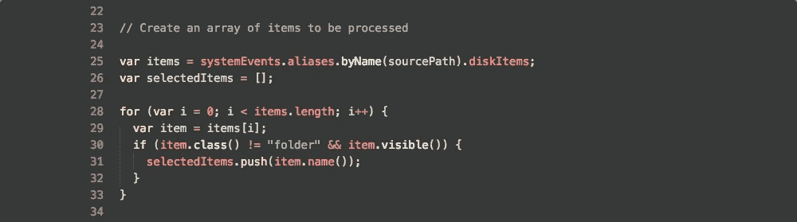
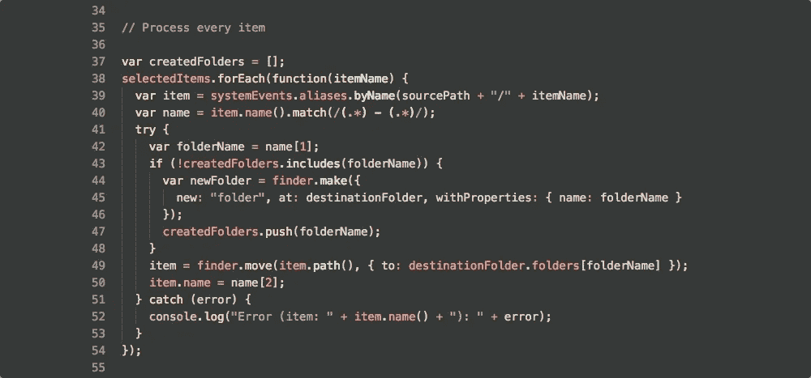
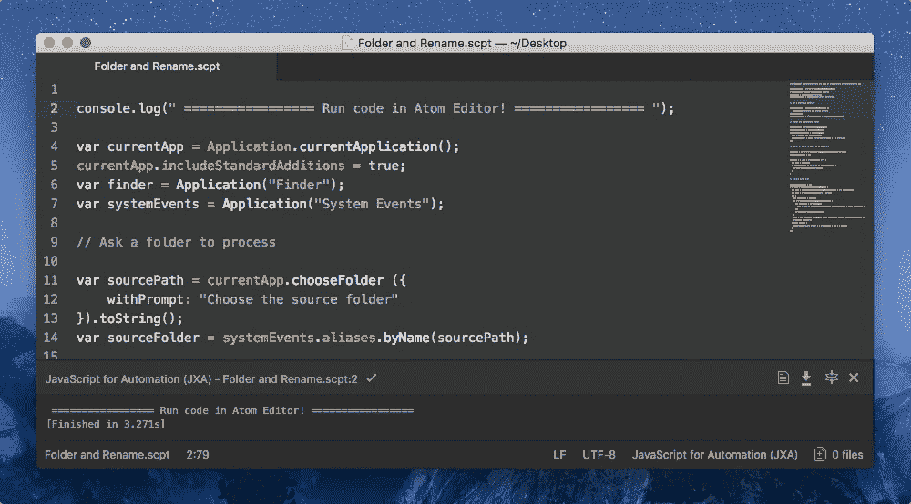
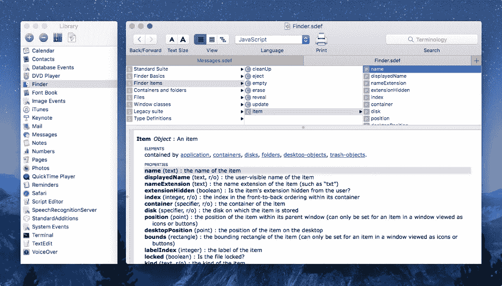

# 用于 macOS 自动化的 Javascript

> 原文：<https://medium.com/hackernoon/javascript-for-automation-in-macos-3b499da40da1>

## 我是如何自动完成一项长期的文件夹和重命名任务的？

有时我们会遇到由许多相似的小步骤组成的简单任务。过了一点，手动操作就不合理了。这是您需要开始使用自动化工具的地方。

在 macOS 中，有两种方法可以让你不用安装任何东西，或者你可以使用第三方工具。

最简单的方法是使用 **Automator app** 。它有一个拖放界面，允许您通过组合预定义的操作来轻松设置工作流。可能性几乎是无限的，但是建立真正复杂的、多步骤的、非线性的工作流程并不容易。

更难但真正高级的方法是使用**JXA(**[**Javascript**](https://hackernoon.com/tagged/javascript)**进行自动化)**。这是一种基于 Javascript 的编程语言。从苹果电脑约塞米蒂开始，它取代了 AppleScript。**你几乎可以自动完成任何事情，从按特定顺序点击按钮，到说出命令时打开一组应用程序。你也可以在 Automator 应用程序中使用 JXA，这将是一个不错的组合。**

# 我的案子需要自动化

在我的年度订阅期内，我从 Tutsplus 下载了很多视频课程。下载的文件没有分组，而且文件名很长。所以它们需要被重命名和折叠。我本来可以一个一个地做，但这会花费不合理的长时间。所以我决定让它自动化。

# 剧本解释说

这真的很简单，而且基本上不言自明。让我们一起过一遍。

首先，我们创建两个经常使用的变量:`currentApp`用于提示当前应用程序中的某些内容，`finder`用于创建和移动文件，`systemEvents`用于访问文件。

该操作系统有一套标准的脚本附加功能，提供朗读文本、显示用户交互对话框等功能。要使用它们，应用程序必须显式地将`includeStandardAdditions`标志设置为`true`。第三行代表那个。我们声明我们想要使用这些附加物。

之后，我们提示一个文件夹选择器面板来获取要处理的文件夹。然后，我们在同一个目录中创建一个新文件夹，将已处理的文件移动到其中。

稍后，我们使用 for 语句遍历文件夹，并根据文件名创建一个数组。目的是以后通过使用它们的名字再次访问这些文件。因为当我们将已处理的文件移出时，文件夹的内容会动态变化。使用文件名将确保我们访问正确的文件。

正常情况下，我们应该能够不使用文件名来完成这项工作。我试图那样做，但做不到。必须有一种方法来创建指向文件的指针，当文件夹的内容改变时，这些指针不会损坏。如果有人告诉我如何做，我会更新这一部分。

最后，我们处理数组中的每个文件。首先，我们通过使用文件名获得文件，并使用正则表达式将文件名分为两部分:连字符前和连字符后。第一部分是文件夹名，第二部分是文件名。

之后，我们用这个名字创建一个新的文件夹，如果还没有的话，把文件移动到里面并重新命名。

仅此而已！

> [下载脚本文件。](https://cl.ly/mA3J)

# 提示和技巧

## 使用 [Atom](https://atom.io) 编辑器编写并运行脚本

JXA 的默认编辑器是苹果的脚本编辑器。但是真的很基础，没那么好用。我推荐你通过安装两个写和运行 JXA 的包来使用 [Atom](https://atom.io) 。

第一个包是用于自动解/重编译`.scpt`文件的[语言-javascript-jxa](https://atom.io/packages/language-javascript-jxa) ，第二个包是用于在包括 jxa 在内的 Atom 编辑器中运行脚本的[脚本](https://atom.io/packages/script)包。我应该补充一点，我不完全确定脚本包是否能像脚本编辑器一样提供广泛的输出，但是对我来说，这已经足够了。

我还想提一下我在 Atom 中使用的主题:[新月-atom-syntax](https://atom.io/themes/new-moon-atom-syntax) 。我真的很喜欢它的颜色和对比度！

## 应用程序脚本字典/属性列表

脚本编辑器中有一个面板，用于查看应用程序的属性列表。这是为了帮助你弄清楚如何通过 JXA 命令 macOS 应用程序。你可以通过打开脚本编辑器并点击其中一个菜单项来查看:`File > Open Dictionary`或`Window > Library`。

# 资源

由于资源不足，编写这个脚本的时间比我预期的要长。大多数教程和书籍都是针对 AppleScript 的，尽管 JXA 问世已有多年。

在这个链接 有一个很棒的资源列表 [**。除此之外，我会推荐你去**搜索 Github** 中的代码片段。有许多公共脚本，有时你会遇到一些非常接近你想要做的事情。**](https://apple-dev.groups.io/g/jxa/wiki/JXA-Resources)

希望这些能帮助你开始自动化的事情，并帮助你节省一些时间！**请点击或按住**👏**能扣多少扣多少！**🙂