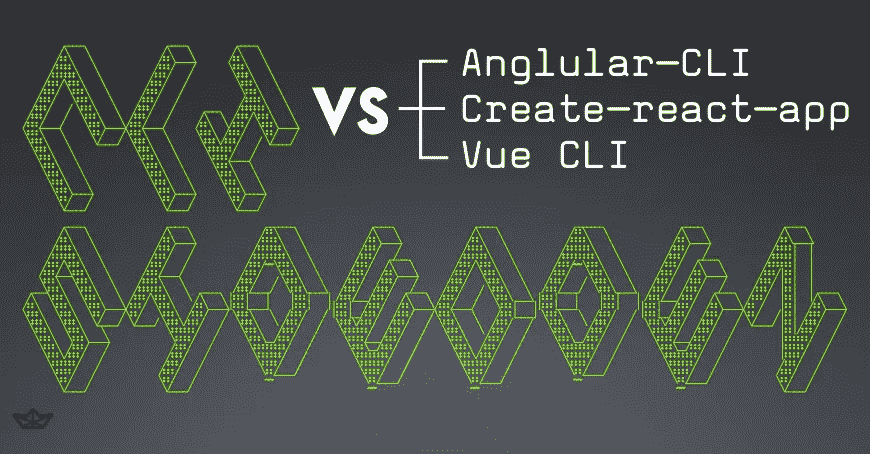

# JavaScript 前端框架 CLI 对决

> 原文：<https://medium.com/hackernoon/javascript-frontend-framework-cli-showdown-a20b49a41ec1>

许多现代 JavaScript 前端框架都有一个独立的命令行界面(CLI)程序作为补充，帮助建立一个合适的开发环境。由于许多使用 [Stream](https://getstream.io) 的开发人员也使用一个或多个这样的框架，我们喜欢保持最新。我们也很乐意传递我们所学到的东西。这篇文章为新手和资深开发者提供了 Angular、React 和 Vue 可用的 CLI 程序的分类和比较。

目的是帮助新开发人员理解使用 CLI 工具的好处和利弊，而不是从头开始设置相关工具。有经验的开发人员会喜欢快速、彻底和独立的比较，以供参考。这不是一个基准，也没有宣布赢家；与大多数工具一样，这是一种“以马换课程”的情况。

为了保持建议的实用性，我们将比较列出的特性，并通过创建一个简单的演示应用程序来使用 CLI 程序。如果你想继续尝试演示应用程序，你需要的只是了解如何使用 [npm](http://npmjs.com) 或 [yarn](https://yarnpkg.com) 。

## 背景

让我们面对现实吧，用现代 JavaScript 框架开发单页面应用程序(spa)是一项复杂的活动。除了与给定框架相关的明显的学习曲线之外，几乎总是需要额外的工具。

典型的前端 JavaScript 开发环境可能包括任务运行器或捆绑器(例如 [gulp](https://gulpjs.com/) 、 [Browserify](http://browserify.org/) 或 [Webpack](https://webpack.js.org/) )、实时(或[热](https://stackoverflow.com/questions/41428954/what-is-the-difference-between-hot-reloading-and-live-reloading-in-react-native))代码重新加载、代码[林挺](https://en.wikipedia.org/wiki/Lint_(software))和自动化单元测试。所有这些工具的目的是帮助开发人员和团队以高效的方式编写和部署高质量/经过良好测试的代码。

CLI 程序已经成为用丰富的开发工具启动项目的一种流行方式。虽然这些 CLI 的使用是完全可选的，但它们提供了对紧密围绕每个框架的开发人员社区中流行工具的深入了解。它们还可以节省大量的设置和持续开发时间。

## 介绍挑战

每种工具面临的挑战来自两个方面:

1.  首先，我们希望了解 CLI 的功能，并熟悉其中包含的特定工具。
2.  其次，我们想看看 CLI 作为真实项目的基础有多好。这有助于我们对 JavaScript 生态系统的总体理解，也将使我们能够确定该工具是否适合在现实世界中使用。

这意味着我们的 CLI 应该提供或允许我们快速添加和建立前端 SPA 的基本但重要的方面:

1.  SPA 基础知识:创建组件和运行开发服务器
2.  视觉设计:集成 CSS 框架
3.  与 HTTP 服务集成:检索后端或第三方数据

## 参赛者们

首先，让我们简要地看一下我们的参赛者，以及他们在方法和他们汇集的技术方面的比较。

## 角度气候

> Angular CLI 是一个初始化、开发、搭建和维护 Angular 应用程序的工具。

我们审查了 *v1.3.2* ，发现了以下内容:

*   **构建工作流/捆绑范例:**零配置；弹出到网络包
*   **支持正在进行的开发的命令:**是；“ng generate”将为新组件、服务、指令等发出样板代码。
*   默认语言和版本: TypeScript 2.3.3
*   **打字:**内置打字稿
*   **代码林挺:** [tslint](https://palantir.github.io/tslint/)
*   **实时林挺:**不支持([‘将不实现’](https://github.com/angular/angular-cli/issues/3437#issuecomment-265222916))
*   **测试:** [茉莉](https://jasmine.github.io/) + [量角器](http://www.protractortest.org/#/)
*   **现场单元测试:** [因果报应](https://karma-runner.github.io/1.0/index.html)
*   **代码覆盖:**通过开关启用内置的[伊斯坦布尔](https://istanbul.js.org/)代码覆盖工具

## 创建-反应-应用

> 创建没有构建配置的 React 应用程序。

我们审查了*版本 1.4.0* ，发现了以下问题:

*   **构建工作流/捆绑范例:**零配置；弹出到网络包
*   **支持正在进行的开发的命令:**否；项目设置后，手动添加新组件
*   **默认语言和版本:** JavaScript 与[选定的附加功能](https://github.com/facebookincubator/create-react-app/blob/700c8cd4d4b2b024ac13491daecc8ecf011a814b/packages/react-scripts/template/README.md#supported-language-features-and-polyfills)包括一些 ES6 扩展和 [Babel](https://babeljs.io/) polyfills
*   **打字:**提供添加[流](https://flow.org)的指令
*   **代码林挺:** [ESLint](https://eslint.org/)
*   **活林挺:**是；开发服务器发出的错误
*   **测试:** [笑话](https://facebook.github.io/jest/)
*   **实时单元测试:**是
*   **代码覆盖率:**是，通过 Jest

## Vue CLI

> 用于搭建 Vue.js 项目的简单 CLI

我们审查了 *webpack 模板 v2.8.2* ，发现了以下内容:

*   **构建工作流/捆绑范例:**各种 via 模板；提供了 Webpack，Browserify 的官方模板。也存在其他社区提供的模板
*   **支持正在进行的开发的命令:**否；项目设置后，手动添加新组件
*   **默认语言和版本:**JavaScript ES6/es 2015；模板也支持
*   **代码林挺:** ESLint(设置时可选)
*   **实时林挺:**默认不配置
*   **测试:** [摩卡](https://mochajs.org/)、卡玛、[夜巡](http://nightwatchjs.org/)(设置上可选)
*   **实时单元测试:**是
*   **代码覆盖率:**伊斯坦布尔默认启用

## 项目比较

为了比较 CLI，我们经历了以下步骤:

1.  已安装 CLI
2.  使用相关命令创建了一个项目，并尝试了开发服务器
3.  增加了 SASS 支持和网站 CSS 框架的[基础](https://foundation.zurb.com/sites)
4.  集成了 [stream-js](http://github.com/getstream/stream-js) API 客户端来演示如何与第三方 API 交互

你可以自己尝试这些项目。简单地叉回购，你会与我们平起平坐。

在这个过程中，我们发现了一些关于这些 CLI 的有趣的注意点。

最大的好处，尤其是对于那些不熟悉这些前端框架的人来说，是有机会避开许多决策，快速开始使用一套社区信任的工具。花几个小时学习 CLI 命令并进一步阅读相关工具，就可以很容易地投入到编写生产质量代码的实际工作中。

有经验的开发人员会很快意识到，每个 CLI 在功能和集成的工具类型方面都非常相似。深入挖掘是值得的，因为围绕各种前端框架的生态系统中有对当前最佳实践和趋势的见解。

当整个团队都采用 CLI 时，每个人都会受益，而且好处往往会被放大。项目以积极的测试习惯和林挺代码库开始的机会增加了。随着时间的推移，随着新团队成员的加入，并带来了使用相同 CLI 和相关工具的经验，入职工作也就结束了。

当然，也有一些不好的方面。特别是，一旦需要第三方项目依赖或其他开发环境工具，就有可能出现挑战和混乱。大多数情况下，这不是 CLI 的错，而只是基于 Webpack 的开发环境(每个 CLI 都在幕后使用)和所包含的各种其他第三方工具(例如 Babel 和 Karma)固有的复杂性。

我们最好的建议是尽量让事情简单，并通过逐渐增加更复杂的内容来扩展你的知识和理解。

## 角度 CLI

Angular CLI 是独一无二的，可能被认为是“功能最丰富”的，因为它不仅仅是简单地创建项目，还提供了节省时间的命令，在向项目添加新组件时，这些命令会生成大量的样板文件。

CLI 旨在在全球和本地安装。全局版本和本地版本之间的版本不一致通常不是问题，但是如果您在几个项目之间切换和工作，可能会有些混乱/令人烦恼。

“angular-cli”包的名字在项目从测试版到第一个稳定版本时改变了。如果你的机器安装了旧的测试版本，那么[的具体升级步骤](https://github.com/angular/angular-cli#updating-angular-cli)会有点繁琐。

使用子目录对组件、服务和其他角度的组件类型进行分组是相当常见的。运行“npm generate”命令时，可以包含子文件夹，但是当您不可避免地忘记时，清理子文件夹是非常烦人的。如果可以配置 CLI 提示和/或所需的子目录，那就更好了。

查看 Github 上的[Stream-Example-Angular-CLI](https://github.com/GetStream/Stream-Example-Angular-Cli)项目。

## 创建 React 应用

这个 CLI 工具确实兑现了“不配置”的承诺。生成的项目配置文件非常精简。这对于那些不太习惯许多长配置文件的开发人员来说非常好，这些文件通常包含在一个涉及 Node、Webpack、Babel、测试和林挺工具的项目中。

环境配置文件的结构化方法，支持共享(提交)和个人(提交。gitignore'd)偏好和秘密是一个亮点，因为它是经过深思熟虑的。

有点令人失望的是，它立即需要从简化的 create-react-app 配置中“退出”,不是为了直接进行开发，而是为了让单元测试套件正确运行并通过 Foundation。诚然，这是由于基础项目的次优打包，但这仍然是与 CLI 的一个摩擦点。

查看 Github 上的[流-实例-创建-反应-应用](https://github.com/GetStream/Stream-Example-Create-React-App)项目。

## Vue CLI

与 Vue 生态系统中的几乎所有东西一样，CLI 使用起来超级简单和直接。模板化方法和在 Browserify 和 Webpack 之间进行选择的选项是 Vue 的 CLI 所独有的，这无疑有助于 Vue 框架的广泛和快速采用。

Vue 的另一个独特方面是收集信息以启动项目的问答形式。考虑到 Angular 和 React CLI 程序都能够通过接收项目名称作为命令行参数来完成工作，奇怪的是 Vue 问了大约 9 个问题。

查看 Github 上的[Stream-Example-Create-Vue-Cli](https://github.com/GetStream/Stream-Example-Vue-Cli)项目。

## 结论

在回顾了主要功能并将每个 CLI 用于演示应用程序后，很明显每个都提供了宝贵的长期时间节省。对于新开发人员和老开发人员来说都是如此。

对于新开发人员来说，最大的收获是不费吹灰之力就能获得一个内聚的开发环境。

对于有经验的开发人员来说，熟悉并定期检查 CLI 项目的状态可以提供一些很好的见解。令人高兴的是，这些项目提供了一种快速了解当前最佳实践、趋势和开发人员偏好的方法。了解每个前端框架周围的生态系统的整体状态也很棒。

目前我们只有这些了。如果您对 Stream 感兴趣，请查看我们的 [JavaScript 文档](https://getstream.io/docs/js/)，并确保尝试我们的 [5 分钟在线教程](https://getstream.io/get_started/)。

> *这是 GetStream.io 团队的一次合作，由 GetStream.io 的开发者倡导者*[*Dwight Gunning*](https://twitter.com/DwightGunning)*领导，原博文可在*[https://getstream . io/blog/JavaScript-framework-CLI-对决/](https://www.google.com/url?q=https%3A%2F%2Fgetstream.io%2Fblog%2Fjavascript-framework-cli-showdown%2F&sa=D&sntz=1&usg=AFQjCNHoINZVJMeZI_fKs8STfPZ1c6yDIw) *找到。*