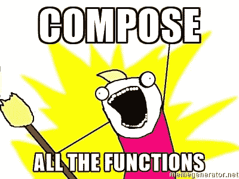

# 函数 JavaScript:日常使用的函数组合。

> 原文：<https://medium.com/hackernoon/javascript-functional-composition-for-every-day-use-22421ef65a10>


[PIRO4D](https://pixabay.com/en/puzzle-kreispuzzel-platform-1713170/)

**函数组合**是函数式编程中我最喜欢的部分。我希望给你提供一个好的真实世界的例子，这样你不仅理解了函数组合，而且你今天就可以开始使用它了！在这篇文章中，我们将学习如何编写和组织你的文件，这样你就可以像这样编写简短、简洁、实用的代码

…会产生这样的输出…

如果你想修补，请直接前往[代码栏](http://codepen.io/joelnet/pen/QdVpwB)。继续阅读开始学习:)

# 基础知识

我们必须先走后跑，所以让我们从你需要知道的无聊的事情开始。

> **函数组合**是一个数学概念，允许你将两个或多个函数组合成一个新函数。

您可能在 googling 函数组合时偶然发现了这个例子。如果你还没有，我向你保证，你会的。

我自己对使用这个例子感到内疚，我没有意识到的是，学生们还不能看到如何在他们今天的代码库中实际应用这个例子。取而代之的是，他们将这个例子与下面的例子进行比较:

```
const value = (x + 2) * 3
```

*很难理解为什么*你更喜欢函数的例子。

> 老师不能恰当地提供好的真实世界的例子将导致学生不能理解为什么。

希望我能更好地展示函数组合的威力。

# 回归基础

函数组合的关键是拥有可组合的函数。可组合函数应该有 1 个输入参数和 1 个输出值。

通过 currying 函数，可以将任何函数转换成可组合的函数。我将在另一篇文章中详述奉承，但是您应该仍然能够理解奉承是什么。

你可能会做 html 的东西，所以这是一个很好的起点。我们来做一个`tag`。(我将在这里使用字符串，但是您也可以使用 React 来做这件事)。

```
const tag = t => contents => `<${t}>${contents}</${t}>`tag('b')('this is bold!') > <b>this is bold!</b>
```

我还希望有一个函数来处理像`<div class="title">...</div>`属性的标签。所以我将添加另一个函数来处理这个用例。

加入一点重构，将所有这些整合到这四个功能中…

现在我们可以用“T3”或“T4”来称呼“T2”。

# 让事情变得真实

既然你已经完成了那些无聊的东西，你应该得到一些有趣的代码。

让我们使用这个新奇的`tag`函数来创建一些实际的东西。我们可以用一些简单熟悉的东西， [bootstrap 的列表组](https://getbootstrap.com/components/#list-group)。

首先，让我们为每个标签和`listGroupItems`创建一个函数来支持多个`listGroupItem`

如果我们查看列表组 html 的结构，我们可以看到有一个包含多个子元素的外部元素。由于*总是*被这样创建，所以每次调用`listGroup(listGroupItems([‘Cras justo’, ‘Dapibus ac’]))`来渲染列表似乎有点冗长。

我应该可以打电话给`listGroup([‘Cras justo’, ‘Dapibus ac’])`。函数应该知道我想做什么。

为此，我首先将`listGroup`重命名为`listGroupTag`。这样我就可以创建一个新的`listGroup`函数来封装对`listGroupTag(listGroupItems([]))`的调用。

# 功能组成



对于那些跳过整篇文章并一直向下滚动到这一部分的人来说，你可能会失望。组合函数实际上是整个过程中最简单的部分。当你创建了可组合的函数后，它们就像是在一起了。

看看下面的代码。任何时候识别出这种模式，就可以很容易地组合这些函数。

```
const listGroup = items =>
  listGroupTag(listGroupItems(items))
```

当组合在一起时，结果看起来与原始结果相似，左边是`listGroupTag`，后面是`listGroupItems,`，然后是右边的`items`。

```
const listGroup = items =>
  compose(listGroupTag, listGroupItems)(items)
```

让我们把它们放在一起看，这样我们就能看出它们的相同点和不同点。

当函数组合在一起时，它们就像常规函数一样从右向左读取。

因为`compose`返回一个带`list`的函数，而我们的`listGroup`函数也带一个`list`，所以我们可以简化`listGroup`来等于我们的组合并移除`list`。

```
const listGroup =
  compose(listGroupTag, listGroupItems)
```

现在你可能还没疯，我理解。在我们编写的所有代码中，函数组合只帮助我们简化了一行代码。

> 随着代码库的增长，函数组合的威力将会显现出来，允许您创建大量的组合。

所以让我们添加一个引导面板。

现在，如果我们想要创建一个元素，它是在一个`panel`里面的一个`list-group`，我们所要做的就是:

```
const listGroupPanel =
  compose(basicPanel, listGroup)
```

(上)函数也等价于这个(下)。您可以编写任意数量的函数！

```
const listGroupPanel =
  compose(basicPanel, listGroupTag, listGroupItems)
```

# 组织您的代码

组织你的代码也很重要。这涉及到将你的函数分成多个文件。

我喜欢创建一个名为`functional.js`的文件，这是我放`compose`和相关功能函数的地方。

我们在上面创建的所有函数我都会放在`html.js`中。

我还为 DOM 操作创建了一个`dom.js`(你将在 codepen 中看到。)

将我们的代码分解成多个库文件允许我们在其他项目中重用这些函数。

现在我们在`main.js`写主程序的时候，代码会很少。

# 这个例子

我不能将 codepen 示例分成多个文件，所以我使用注释将它们分开，这样您就可以看到如何正确地布局您的文件。

我把最终的应用程序放在 codepen 上了，所以你可以修改它。
[https://codepen.io/joelnet/pen/QdVpwB](https://codepen.io/joelnet/pen/QdVpwB)

# 数学

最初我在这里有一些东西，但是你不需要知道重力的方程式来知道物体吸引。

# 作曲和演奏

另外值得一提的是，`compose`有一个陪伴功能`pipe`。`pipe`也构成函数，但顺序相反。在某些情况下，从左到右(或从上到下)书写会更容易理解。

```
// pseudo codeconst login = pipe(
  validateInput,
  getCustomer,
  getAuthToken
  loginResponse)
```

下面是这些函数，我建议把它们放在一个`functional.js`库中，你可以把它包含在你所有的项目中。

# 摘要

函数组合要求您以可组合的方式编写函数。这意味着你的函数必须有一个输入和一个输出。具有多个输入的函数必须被简化。

编写函数不仅简单，而且有趣。

您将通过函数组合实现最高级别的代码重用。

> 使我们的代码可重用应该是我们的目标之一。

我的下一篇文章将是关于编写异步函数的。我以为我可以把这些都写进一篇文章里，但是这一页很快就变长了。所以我们就此打住吧。订阅，以免错过第 2 部分！

我知道这是一件小事，但当我在媒体和 Twitter 上收到这些后续通知时，我感到非常高兴。或者你觉得我满嘴屁话，在下面的评论里告诉我。

干杯！

# 相关文章

[](https://hackernoon.com/rethinking-javascript-eliminate-the-switch-statement-for-better-code-5c81c044716d) [## 重新思考 JavaScript:删除 switch 语句以获得更好的代码

### 在我的前 3 篇文章中，我说服你删除 if 语句，取消 for 循环，并且不要使用 break。

hackernoon.com](https://hackernoon.com/rethinking-javascript-eliminate-the-switch-statement-for-better-code-5c81c044716d) [](https://hackernoon.com/rethinking-javascript-death-of-the-for-loop-c431564c84a8) [## 重新思考 JavaScript:For 循环的死亡

### JavaScript 的 for 循环为我们提供了很好的服务，但是它现在已经过时了，应该被更新的函数所取代…

hackernoon.com](https://hackernoon.com/rethinking-javascript-death-of-the-for-loop-c431564c84a8) [](https://hackernoon.com/rethinking-javascript-the-if-statement-b158a61cd6cb) [## 重新思考 JavaScript:if 语句

### 功能性思维打开了我对编程的思维。

hackernoon.com](https://hackernoon.com/rethinking-javascript-the-if-statement-b158a61cd6cb) [](http://bit.ly/HackernoonFB)[](https://goo.gl/k7XYbx)[](https://goo.gl/4ofytp)

> [黑客中午](http://bit.ly/Hackernoon)是黑客如何开始他们的下午。我们是 [@AMI](http://bit.ly/atAMIatAMI) 家庭的一员。我们现在[接受投稿](http://bit.ly/hackernoonsubmission)，并乐意[讨论广告&赞助](mailto:partners@amipublications.com)机会。
> 
> 如果你喜欢这个故事，我们推荐你阅读我们的[最新科技故事](http://bit.ly/hackernoonlatestt)和[趋势科技故事](https://hackernoon.com/trending)。直到下一次，不要把世界的现实想当然！

