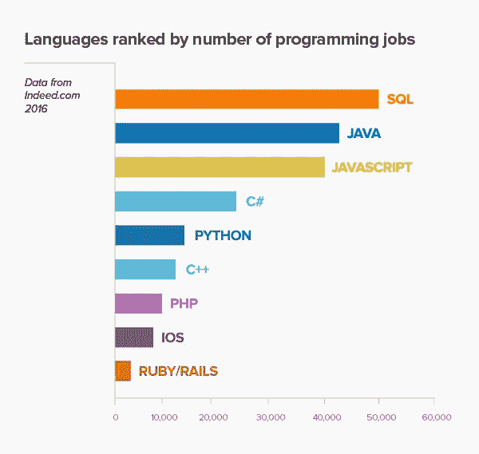
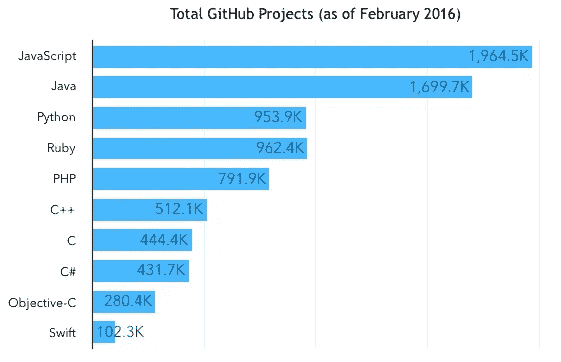
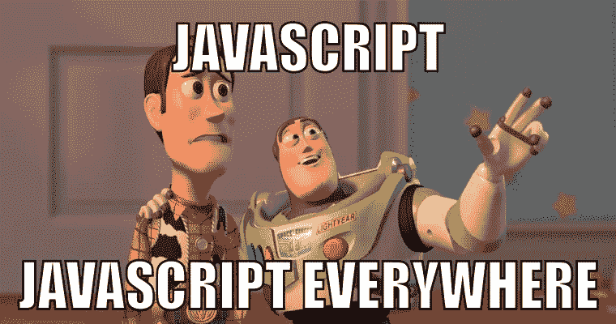
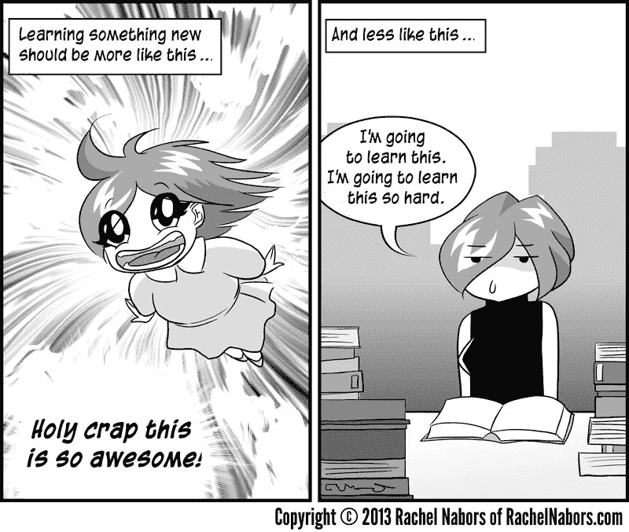

# JavaScript 对初学者来说越来越可怕了

> 原文：<https://medium.com/hackernoon/javascript-is-getting-scarier-for-beginners-c93372039650>

Let’s Go For a Ride!

在过去的几个月里，已经有很多关于 JavaScript 疲劳的文章。媒体上充斥着支持和反对 JavaScript 疲劳的作者。与此同时，其他人很高兴有一个无聊的堆栈与 T1 一起工作。

 [## Javascript 疲劳

### 几天前，我在喝咖啡时遇到了一个朋友&皮尔。

medium.com](/@ericclemmons/javascript-fatigue-48d4011b6fc4)  [## JavaScript 疲劳:另一种视角

### 认可进步需要一定程度的搅动

medium.com](/@joshburgess/javascript-fatigue-an-alternative-perspective-b6ae411e89ac) 

让我们把这个弄清楚。疲劳不是我的话题。

2016 年，我是 JavaScript 的初学者，这是我第一次体验到我第一次互动时有多害怕。以下是一些让我开始使用 JavaScript 的统计数据:

Courtesy: Codementor.io

事实上，通过学习 JavaScript，我可以为网络(网站)、移动设备(网络应用程序、 [ionic](https://ionicframework.com/) 、 [React-native](https://facebook.github.io/react-native/) )甚至软件(电子)进行开发。一种语言，我几乎无处不在。

Freaking Everywhere!

所以在 2016 年年中，我谷歌了一下**学习 JavaScript** ，第一站是[代码学院](https://www.codecademy.com/learn/javascript)。他们承诺了一门关于 JavaScript 基础的课程，我不得不告诉你，就是这样。但是有些事情是错误的，它与之前激励我的数据不符。我所了解到的与现存的任何事物形成了鲜明的对比。这让我开始思考。后来，我听到比尔·索鲁尔[谈到](https://www.youtube.com/watch?v=XkbTPCHcCyI&feature=youtu.be&t=1398)展示纸牌魔术的魔术师课程与承诺教授如何让自由女神像消失的课程有所不同，我知道了问题所在。

那一年的这个时候，我得到了一个项目，我要为 android 和 iOS 开发一个移动应用程序。我说了什么？我当然说好，我们去爱奥尼亚！因为我懂 Javascript。会出什么问题呢？！

这就是我的问题开始的地方。我曾冒险进入爱奥尼亚的世界，它变成了角状。这是一个特别糟糕的时机，因为 ionic v2 即将推出，它使用 Angular 2，该版本的所有教程都是用 Typescript 编写的，Typescript 到底是什么？！我决定暂时用离子 1，并希望这能解决问题。

当然没有。时尚指南来了。 [Airbnb 的风格指南](https://github.com/airbnb/javascript?utm_source=mybridge&utm_medium=blog&utm_campaign=read_more)， [Google Javascript 风格指南](https://google.github.io/styleguide/jsguide.html)，Angular Styles 指南:[约翰爸爸](https://github.com/johnpapa/angular-styleguide)，[托德摩托](https://github.com/toddmotto/angular-styleguide)。他们想改变我写代码的方式。尽管他们之间有些相似之处，但他们都谈论[模块捆扎机或加载机或捆扎机](https://medium.freecodecamp.com/javascript-modules-a-beginner-s-guide-783f7d7a5fcc)或其他什么。这才冒险进入 W [ebpack](https://webpack.github.io/) 。

You get to see the rainbows for real!!

Webpack，这是一个复杂的 API！我设法让它运行起来，然后进行测试驱动开发。输入[茉莉](https://webpack.github.io/)因果报应[摩卡](https://mochajs.org/)我想得到[摩卡](https://en.wikipedia.org/wiki/Moksha)什么的。每个人都想改变我的编码方式和工作方式， ***我没有写代码*。**

有了十几个框架、transpilers 和 bundlers，许多适应 JavaScript 生态系统的初学者迷失了方向。

# 结局

然而，我并没有就这样绝望地结束我的 2016 年。那年冬天，我来到了自由代码营，打磨了我所知道的关于 JavaScript 的一切。我参与了 FCC 项目，那种成就感涌上了我的血管。我从一些真实的人那里得到了一些很好的指点，帮助我提高了比赛水平。

 [## 治愈 JavaScript 疲劳的研究计划

### 像其他人一样，我最近看到了 Jose Aguinaga 的帖子“2016 年学习 JavaScript 的感觉”。

medium.freecodecamp.com](https://medium.freecodecamp.com/a-study-plan-to-cure-javascript-fatigue-8ad3a54f2eb1)  [## 克服 JavaScript 框架疲劳

### JavaScript 社区正在遭受一波框架疲劳。这是由新的……

teropa.info](https://teropa.info/blog/2015/07/15/overcoming-javascript-framework-fatigue.html) 

现在可能没有合适的马可以下注，但这并不是一件坏事。JavaScript 给了我们比别人更多的选择，来选择我们的马。我从惨痛的教训中学到了这一点，我们不必因为一些新的、更好的东西即将出现，而且其他人都在使用它，就改变我们的筹码。改变，因为改变会给你提供更好的东西。如果你在用 gulp，而且很爱用，那就不要追 Webpack 了，到时候 Webpack 会来找你的。

> 生活就像骑自行车。为了保持平衡，你必须不停地移动。
> 
> -阿尔伯特·爱因斯坦

理所当然！这是一些错误选择的故事，但我相信它们是需要被讲述的故事。我仍然不能让自由女神像消失，但我不怕尝试。

疲劳，不疲劳。害怕，不是害怕。现在是 JavaScript 开发人员的最佳时机，让我们来编码吧。创造。以后再担心。

> [黑客中午](http://bit.ly/Hackernoon)是黑客如何开始他们的下午。我们是 [@AMI](http://bit.ly/atAMIatAMI) 家庭的一员。我们现在[接受投稿](http://bit.ly/hackernoonsubmission)并乐意[讨论广告&赞助](mailto:partners@amipublications.com)机会。
> 
> 如果你喜欢这个故事，我们推荐你阅读我们的[最新科技故事](http://bit.ly/hackernoonlatestt)和[趋势科技故事](https://hackernoon.com/trending)。直到下一次，不要把世界的现实想当然！

