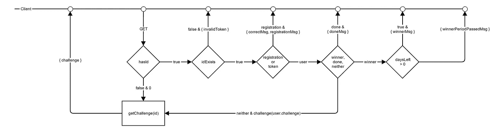
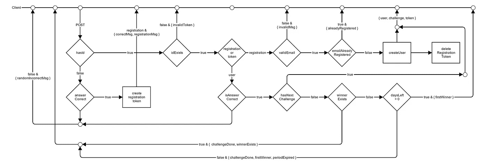

# JavaScript: JSHeroes 和加密挑战的形成

> 原文：<https://medium.com/hackernoon/javascript-jsheroes-and-the-making-of-a-crypto-challenge-f7ca8a69eb0e>

如果你还不知道，2017 年 6 月 8 日和 9 日，一场国际 [JavaScript](https://hackernoon.com/tagged/javascript) 会议将在罗马尼亚的克卢日纳波卡举行…你应该去参加！

它被恰当地命名为 [JSHeroes](http://jsheroes.io) ，因为所有的演讲者都对这个不断发展的社区产生了积极的影响。创建时间表是为了让主题按照有意义的顺序排列。他们占据的时间点也是根据以下因素选择的:主题难度、之前的演讲以及听众在一天中的特定时间可能会感到的疲劳……这是一个相当大的挑战。

我强烈建议参加这次会议，因为选择的主题符合当前的趋势和市场需求。这些主题也经过了广泛的审查，以确保我们的参与者尽可能获得最佳的专业知识。你可以在这里获得入场券[，或者更好的是，](http://www.jsheroes.io/tickets.html)[通过完成我们正在进行的加密挑战](http://crypto.jsheroes.io/)赢得入场券。

会议是有趣的，但是高水平的会议也给你提供了一个获得免费入场券的机会，那就更好了。这是密码挑战的故事。

我第一次有这个想法是在 5 月 18 日——会议前 3 周，在与我的部门经理沟通后，我开始在一周内完成这个项目。在一周内完成这个需要一些计划，所以我开始这样做:

*   第一步:在会议开始前至少 10 天上线…这应该有足够的时间来完成所有的挑战
*   第二步:保持用户界面简单，这是开发人员通常应该熟悉的；避免复杂的 UX 流。
*   步骤 3:由于会议的目标受众本质上是技术性的，这也应该反映在加密挑战中
*   第四步:逐步提高难度等级，但要简单到足以让人赢得比赛，有趣到值得一玩
*   第五步:让用户看到所有参与者的总体进展…这应该会产生一种紧迫感/压力感
*   步骤 6:保持后端简单可靠
*   第 7 步:从头开始创造所有挑战，以确保真正的解决方案
*   第八步:想出有意义但不明显的暗示

对…不是一个很大的列表，但测试一切是至关重要的，我不能在上线后有任何失败，我没有一个 QA 团队在我的支配下。确保成功的一个方法是保持一切简单。

分解为任务的步骤的解决方案:

*   第一步:不要在编码方面表现糟糕
*   第二步:大多数开发人员都熟悉终端……这将是我的主要设计方法……终端也应该有一些现成的命令
*   第三步:进行某种开发者更容易发现的隐藏注册……更好的是，让它成为一个挑战，因为这是整个要点(想法:解决注册的第一个挑战)
*   步骤 4:围绕一个共同的主题实施挑战(这里没有剧透)
*   第 5 步:第一个终端命令的诞生: ***状态*** 既然您需要一种查看所有默认命令的方式，那么最好也实现一个 ***帮助*** 命令来配合它。屏幕可能会很混乱，所以最好添加一个 ***清除*** 命令…但是如果你清除了而忘记了挑战描述和提示，你将需要一个 ***挑战*** 命令来检索当前挑战的详细信息。
*   第 6 步:NodeJS 和 Express 应该可以做到……添加一个简单的数据库来跟踪注册和用户。创建一些 npm 脚本以方便开发运行和生产构建，并创建 pm2 脚本以方便实时运行。
*   第 7-8 步:让每件事都押韵，让它变得更有趣(可能会让我自己变得更难)

技术栈分别是: [React](https://hackernoon.com/tagged/react) ，Redux，Babel，NodeJS，Express，NeDB，Webpack。根据我的计划，后端只需要这些:

```
GET /toc #static page with terms and conditions
GET /status/:id*? # restrict to registered users
GET /challenge/:id*? # retrieves challenge for user
POST /challenge/:id*? # processes users responses
```

前端只有一个任务…显示挑战和接受用户输入，为此我只需要我的 redux 存储来保存后端日志(响应)。

终端中的数据将以下列形式之一显示:

*   标题(终端标题，如果已注册，则用用户电子邮件填充)
*   描述日志(通常是挑战，由后端提供)
*   状态和错误日志(只是另一个带有状态的日志)
*   以前执行的命令

我们可以按如下方式构建这些日志:

```
{
  type: 'log', // or 'input', 'vspace'
  status: null, // or 'success', 'error'
  text: '',
}
// where vspace is an empty line (if needed)
// a log can be a description or a success/error message
// an input is a previously executed command
// and text is the actual terminal entry text
```

到目前为止还不错；保持事情简单…一切都是日志。为不同的类型创建组件，为状态添加 CSS，为默认的已知终端命令创建动作: ***帮助*** ， ***清除*** ， ***状态*** 和 ***挑战*** ，前端大部分完成。

转到后端:创建控制器，评估并实现每条路线的不同流程。让我们看看在我们的简单应用程序中有哪些流:

**获得挑战:**

路线定义为 *(/challenge/:id*？)*意味着请求可以包含可选的 ID，它应该代表注册用户或注册 ID。如果没有提供 ID，我们可以假设用户未注册，并提供第一个(注册)质询。

如果提供了 ID，我们需要检查该 ID 是否:

*   无效:我们应该返回一个错误日志，
*   注册 ID:我们应该返回一个带有注册消息的成功日志，
*   用户 ID:如果用户是第一个挑战，我们应该返回适当的用户挑战和一个标记 URL 的消息

**挑战后:**

route 和 GET 有相同的定义，ID 也有相同的含义，但是我们处理的是其他东西。如果没有提供 ID，我们可以假设用户正在回答第一个问题，因此我们应该检查答案是否正确:

*   如果答案不正确:返回一个带有随机“不要放弃”消息的错误日志
*   如果答案是正确的:返回一个成功消息，生成一个注册 ID 并将用户重新路由到该 ID

如果提供了 ID，我们需要检查该 ID 是否:

*   无效:我们应该返回一个错误日志，
*   注册 ID:在这里我们检查:ID 是有效的，提供的电子邮件是有效的，还没有注册；如果适用，返回每个错误消息。然后创建用户，我们将用户重新路由到包含其 ID 的 url。
*   一个用户 ID:这里我们检查:ID 是有效的，答案是正确的；如果适用，返回每个错误消息。然后，如果还有剩余的挑战，我们将返回下一个挑战，或者一个获胜/完成的消息。

**获取状态:**

和挑战请求一样，这个请求可以包含一个 ID。如果它是一个有效的用户 id，我们返回玩家总数，以及每个挑战的玩家数量(不包括注册挑战)，否则我们像往常一样返回一个错误日志。

我将留给你们这两个描述流程的图表:



GET /challenge (flow)



POST /challenge (flow)

出于显而易见的原因，我不会详细介绍挑战和提示是如何创建的，但这一步需要花费的时间与为应用程序编写完整的代码一样长。另外，如果你只是玩游戏的话，你可以自己看到它们。

我们设法在会议前 13 天上线，挑战在会议结束后仍然可以进行…当然除了奖品。

[在这里玩！](http://crypto.jsheroes.io/)享受。

**关于 JSHeroes 的更多信息** :
[为一次技术会议制定议程](/cluj-javascripters/building-the-agenda-for-a-tech-conference-bf9a9fd8fd39)作者[亚历克斯·摩尔多瓦](https://medium.com/u/93d08ec35da2?source=post_page-----f7ca8a69eb0e--------------------------------)
[JSHeroes，一个由 JavaScript 信徒写的故事……](/cluj-javascripters/jsheroes-a-story-written-by-javascript-believers-7b1067f46e95)作者[保罗·布里](https://medium.com/u/7b739c52332f?source=post_page-----f7ca8a69eb0e--------------------------------)
[说服你的经理给你弄一张 2017 年 JSHeroes 门票的简单方法](/cluj-javascripters/simple-ways-to-convince-your-boss-to-get-you-a-ticket-to-jsheroes-2017-6c4020f46ebc)作者[亚历克斯·波桑](https://medium.com/u/517ce1cc0a4e?source=post_page-----f7ca8a69eb0e--------------------------------)
[JSHeroes 2017:幕后](/cluj-javascripters/jsheroes-2017-behind-the-scenes-f02d40413cb1)

[](http://bit.ly/HackernoonFB)[](https://goo.gl/k7XYbx)[](https://goo.gl/4ofytp)

> [黑客中午](http://bit.ly/Hackernoon)是黑客如何开始他们的下午。我们是 [@AMI](http://bit.ly/atAMIatAMI) 家庭的一员。我们现在[接受投稿](http://bit.ly/hackernoonsubmission)并乐意[讨论广告&赞助](mailto:partners@amipublications.com)机会。
> 
> 如果你喜欢这个故事，我们推荐你阅读我们的[最新科技故事](http://bit.ly/hackernoonlatestt)和[趋势科技故事](https://hackernoon.com/trending)。直到下一次，不要把世界的现实想当然！

