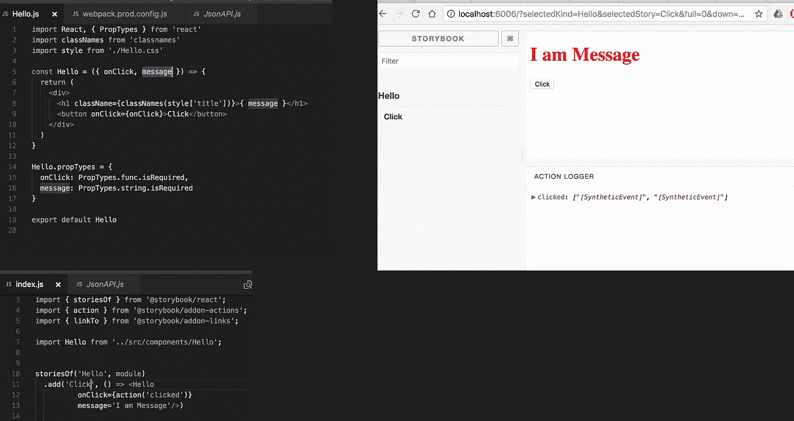

# 故事书:React 组件开发速度提高 150%

> 原文：<https://medium.com/hackernoon/javascript-nodejs-es6-react-storybook-example-tutorial-config-develop-ui-native-demo-bb58039c929>


react storybook development tool ui

我从很多朋友那里听到了关于 ***故事书*** 的部分，他们要么是工作游戏，要么是创业公司，花了大约半天的时间做正确的配置和了解正确的开发工具。我强烈建议每个 React 开发人员和团队使用它，原因如下:

*   故事书在你的应用程序之外运行，这允许你独立地开发 UI 组件。
*   它可以提高组件的重用性、可测试性和开发速度。
*   快速开发，无需担心特定于应用程序的依赖性。

([按故事书](https://github.com/storybooks/storybook/blob/master/README.md))

# 1-安装

```
$ npm i -g @storybook/cli
$ cd my-react-app
$ getstorybook
```

# 2-进行正确的配置

[git 提交](https://github.com/wahengchang/react-redux-boilerplate/commit/aa2f4d6fd0ce55525bf471904eb82683a3d5d9a6)涉及到 5 个配置文件，它们都是由`getstorybook` CLI 生成的。我花了更多时间的是`[webpack.config.js](https://github.com/wahengchang/react-redux-boilerplate/commit/aa2f4d6fd0ce55525bf471904eb82683a3d5d9a6#diff-6da49b24efd584154cfb4ec759745192)`，因为 css-module 在目标中使用。

`[.storybook/config.js](https://github.com/wahengchang/react-redux-boilerplate/commit/aa2f4d6fd0ce55525bf471904eb82683a3d5d9a6#diff-6ab7cd89286451cc2620c7509b7d23b8)`

`[.storybook/webpack.config.js](https://github.com/wahengchang/react-redux-boilerplate/commit/aa2f4d6fd0ce55525bf471904eb82683a3d5d9a6#diff-6da49b24efd584154cfb4ec759745192)`

`./[package.json](https://github.com/wahengchang/react-redux-boilerplate/commit/aa2f4d6fd0ce55525bf471904eb82683a3d5d9a6#diff-b9cfc7f2cdf78a7f4b91a753d10865a2)`

`[./stories/index.js](https://github.com/wahengchang/react-redux-boilerplate/commit/aa2f4d6fd0ce55525bf471904eb82683a3d5d9a6#diff-fc0beb5060745097c94da659f02f2884)`

## 目标组件

目标组件必须是一个简单的函数，返回 ***HTML 元素/反应。*组件**。

```
const Hello = ({ onClick, message }) => {
  return (
    <div>
      <h1 className={classNames(style['title'])}>{ message }</h1
><button onClick={onClick}>Click</button>
    </div>
  )
}Hello.propTypes = {
  onClick: PropTypes.func.isRequired,
  message: PropTypes.string.isRequired
}export default Hello
```

# 奔跑

```
$ npm i --save-dev @storybook/react
$ npm run storybook
```

打开浏览器`localhost:6006`



## 解决纷争

花费时间最多的部分是解决这个问题:
— [sh:开始-故事书:找不到命令](https://github.com/storybooks/storybook/issues/1426#issuecomment-313639873)

在全局安装 storybook 并通过`getstorybook`生成所需配置后，显示错误:

```
sh: start-storybook: command not found
npm ERR! file sh
npm ERR! code ELIFECYCLE
npm ERR! errno ENOENT
npm ERR! syscall spawn
npm ERR! dashboard@0.0.0 storybook: start-storybook -p 6006
```

## 解决方案:

```
$ npm i --save-dev @storybook/react
$ npm run storybook
```

## 参考

[https://github . com/story books/story book/blob/master/readme . MD](https://github.com/storybooks/storybook/blob/master/README.md)

[https://github . com/wahengchang/react-redux-boilerplate/commit/aa 2 f 4d 6 FD 0 ce 55525 BF 471904 EB 82683 a 3d 5d 9 a 6](https://github.com/wahengchang/react-redux-boilerplate/commit/aa2f4d6fd0ce55525bf471904eb82683a3d5d9a6)