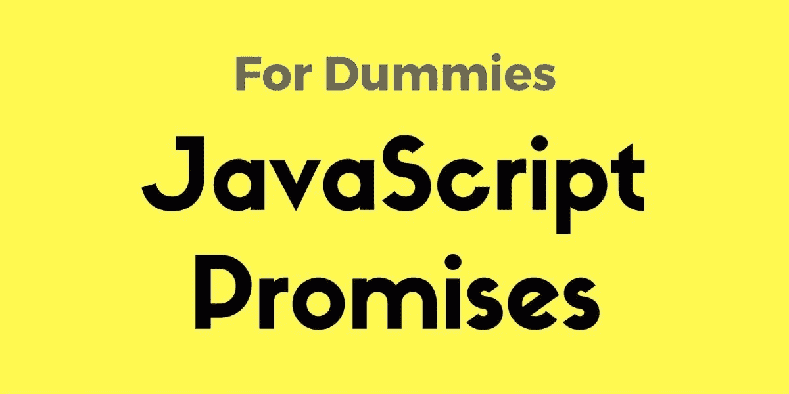

# JavaScript 对傻瓜的承诺

> 原文：<https://medium.com/hackernoon/javascript-promises-for-dummies-e7a4f2666c32>

[**Javascript**](https://hackernoon.com/tagged/javascript) **承诺**都不难。然而，许多人发现开始时有点难以理解。所以，我想用一种虚拟的方式写下我对[承诺](https://hackernoon.com/tagged/promise)的理解。

# 理解承诺

简而言之，一个承诺:

“想象你是一个**小孩**。你妈妈答应你下周会给你买一部新手机。

你不知道下周你是否会拿到那部手机。你妈妈可以*真的给*你买一部全新的手机，或者*放你鸽子*如果她不高兴就没收手机。

那是一个**承诺**。承诺有三种状态。它们是:

1.  承诺是待定的:直到下周你才知道你是否会得到那部手机。
2.  承诺是**解决**:你妈妈真的给你买了一部全新的手机。
3.  承诺被拒绝:你不会得到一部新手机，因为你妈妈不高兴。

我的苏格兰威士忌中的完整文章:

 [## JavaScript 对傻瓜的承诺

### 更好地了解 JavaScript 承诺。Javascript 承诺不难。然而，很多人觉得它有点…

scotch.io](https://scotch.io/tutorials/javascript-promises-for-dummies) 

> [黑客中午](http://bit.ly/Hackernoon)是黑客如何开始他们的下午。我们是 [@AMI](http://bit.ly/atAMIatAMI) 家庭的一员。我们现在[接受投稿](http://bit.ly/hackernoonsubmission)并乐意[讨论广告&赞助](mailto:partners@amipublications.com)机会。
> 
> 如果你喜欢这个故事，我们推荐你阅读我们的[最新科技故事](http://bit.ly/hackernoonlatestt)和[趋势科技故事](https://hackernoon.com/trending)。直到下一次，不要把世界的现实想当然！

