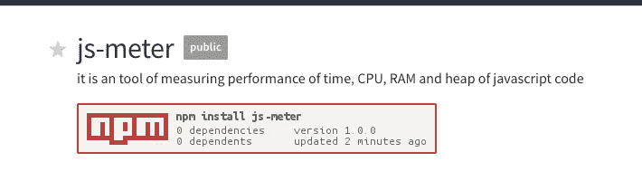

# [javascript]测量时间、CPU、RAM 和代码堆的性能

> 原文：<https://medium.com/hackernoon/javascript-test-performance-cpu-ram-time-spend-testing-speed-nodejs-react-157ded65c343>



它是一个测量 javascript 代码的时间、CPU、RAM 和堆的性能的工具

# 安装

```
$ npm install --save js-meter
```

# 使用

```
***const jm = require('js-meter')*** 
const isPrint = true
const isKb = true       // or Mb***const m = new jm({isPrint, isKb})*** 
for(var i=0; i<10000; i++){
    Math.random()
}

***const meter = m.stop()***// RAM        :  1080 kb
// HeapTotal  :  1024 kb
// HeapUsed   :  -7.2265625 kb
// External   :  0 kb
// CPU        :  3.344 ms
// Spend time :  1004 ms
```

## 例子

[https://github . com/wahengchang/js-meter/blob/master/example . js](https://github.com/wahengchang/js-meter/blob/master/example.js)

# 参考:

https://www.npmjs.com/package/js-meter