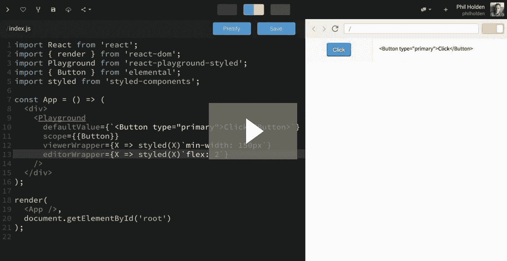
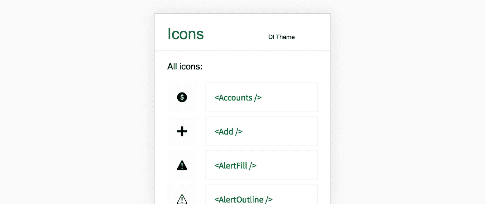
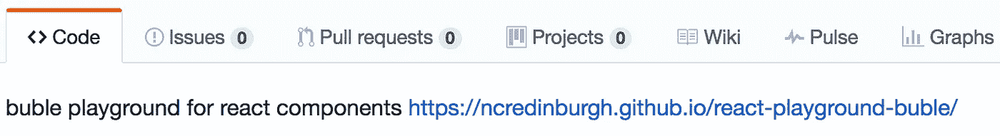
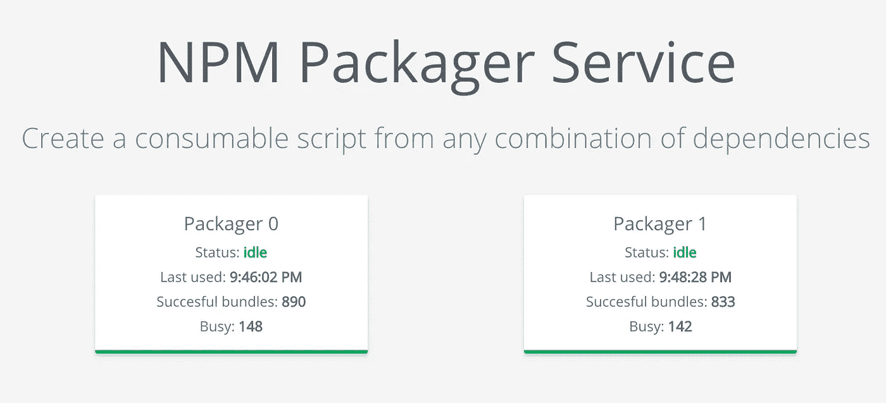
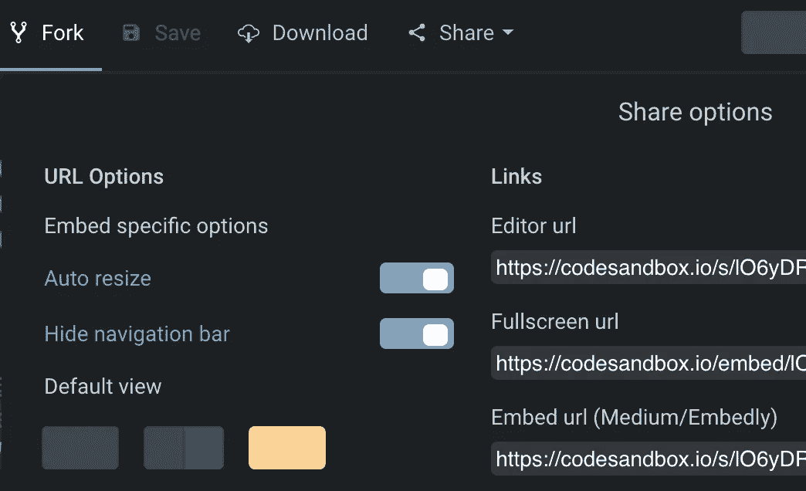

# JavaScript:收紧循环(第 1 部分)

> 原文：<https://medium.com/hackernoon/javascript-tightening-the-loop-part-1-9771a0de372a>

在我的上一篇帖子[2017 年 JS 让我兴奋的地方](https://hackernoon.com/javascript-what-excites-me-in-2017-7681766b7d79)中，我写了 JavaScript 在编程语言中的独特优势。它是唯一一种无需下载、编译和构建就能评估运行的库、组件或框架的语言。

正如标题所示，这篇文章是在新年写的(我差点没发表它)。我在 4 月份才发表，因为我正在申请工作，经常被问及对 JS 未来的看法。这个帖子现在已经有超过 12，000 次阅读(感谢所有喜欢和关注的人)。

Ives van Hoorne

第一个评论者是[艾夫斯·范·霍恩](https://ivesvh.com/)。他与[巴斯·布乌尔斯马](https://www.linkedin.com/in/bas-buursma-b904a3139/)共同创作了 [codesandbox.io](https://codesandbox.io/s/new) 。几天前我一直在玩 CodeSandbox，非常喜欢它。作为开发人员，当你钦佩的人也喜欢你自己的工作时，这是特别有益的。

> 这真是一篇鼓舞人心的文章。它给了我很多想法和对我现在和未来项目的新看法。
> 
> 干得好，谢谢！

当评论到达时，我刚从五大科技公司之一的 5 小时现场面试回来。我打开电子邮件，看到我有一份来自当地创业公司的家庭作业。如果我想选择为哪家公司工作，我需要在那天晚上做这个练习。

任务是创建一个货币转换小部件。你输入一个欧元值，它会转换成其他九种货币。如果你连续点击任何两种货币，它会显示过去五天的欧元汇率。它需要使用一个公共 API，并且需要一个有效的“后退”按钮。所以它需要路由和历史。我想知道我是否可以为此使用 CodeSandbox。

我开始时预计我将不得不放弃，并在某个时候使用一个“真正的编辑器”。但令我惊讶的是，在凌晨时分就完成了。

我选择代码沙盒是因为我希望我的评估员能非常快地对我的作业做出反应。我不想让他们安装或构建任何东西。我还希望他们能够通过简单地发送一个 URL，在团队内部与尽可能多的人分享我的解决方案。

对我来说，这是我第一次在一个在线编辑器中做一个真正的项目。通过导入、真实路由和连接到真实 API 引入 npm 依赖关系。

我周五早上提交了申请，下午就收到了周一现场面试的邀请。我觉得这个问题是经过深思熟虑的，因为它测试了各种各样的日常前端技能。

# 活文档

在我为以前的雇主 [NCR 爱丁堡](http://ncredinburgh.com/)工作时，我一直在为一个组件库创建活文档(NCR 对我来说是一个伟大的雇主，他们在我身上投资了很多，给了我这么多学习的机会……谢谢！).这些文档使开发人员能够现场使用组件并编辑他们的道具。它的灵感来自于强大的实验室对[胜利](http://formidable.com/open-source/victory/guides/animations)图表的记录。为了帮助完成这个任务，我创建了[*react-playground-style*](https://ncredinburgh.github.io/react-playground-buble/)(下面是一个书呆子视频)。

Egghead video click to play

游乐场用的是 Bublé，而不是下载量小很多的 Babel。它以*风格组件*为主题。下面是一个例子，我记录了基本的 UI 按钮(试着编辑代码):

而 codesandbox.io 就像是运行在浏览器中的 IDE[*react——游乐场风格的*](https://ncredinburgh.github.io/react-playground-buble/) 则是另一个极端。它被设计得尽可能小，不引人注目，响应迅速，这样就不会打断文档的流动。代码默认为比例字体，以节省水平空间。我将它连接到 Webpack 的热加载，并使用它来开发和记录各种状态的组件(有点像 react-storybook)。我可以一边开发一边在手机上热加载。游乐场的响应速度如此之快，以 320 像素的宽度在旧 iPhone 上仍然有效:

**读者挑战 1:** 使用 *styled-components* 开发一个组件库，使用 *react-playground-styled 开发一个组件指南。*使用 Now.sh 或 Github 页面部署文档(在评论中放置一个链接)。

# 病毒式文档

GitHub 页面有一个问题，现在部署了，它们不适合在社交媒体上传播。在 GitHub 中，ReadMe.md 和交互式 GitHub 页面之间的链接相当脆弱。您是否曾经在自述文件中搜索过 real docs 链接:

艾夫斯和我都被媒体的病毒力量所震撼。我在 Medium 上的一篇文章获得的粉丝比我在 Twitter 上一整年获得的都多。这就提出了一个问题，如果我们能在介质上记录组件会怎么样。

所以我开始和艾夫斯聊天，了解他如何做他的 *npm* 进口，看我是否可以把这个加到[*react——操场风格*](https://ncredinburgh.github.io/react-playground-buble/) 。原来(与 WebPackBin 的创建者一起工作)他已经创建了 [NPM 打包服务](http://webpack-dll-prod.herokuapp.com/)来做这件事。

# 少即是多

当我考虑将 NPM 打包程序整合到 *react-playground 风格。我意识到我并不想这么做。*React-playground-styled*只是一个组件，所以我真正需要的是一个通用的包装器，它接受源代码作为道具，安装导入并呈现代码。这样的组件可以渲染我的操场或其他任何东西。*

[Embed.ly](http://Embed.ly allows postMessages to be sent to the parent frame to say when content has changed size. It is meant for using browser resize but we can abuse it for text entry.) 是一个服务媒介用来允许多种类型的嵌入物被插入到它的物品中。Medium 只允许通过 embed.ly 嵌入(其他很多网站也使用 embed.ly)。我和艾夫斯聊过创建一个服务，它获取要点并将其呈现给 embed.ly embed。经过更多的思考，我们决定没有必要使用要点，因为你不能在开发的时候预览结果。为什么不直接用 CodeSandbox 来写代码并存储呢？

为了让我的游乐场工作，我需要当用户输入新的代码行时，封闭 iframe 的高度发生变化。React virtualized 有一些很棒的代码叫做 [AutoSizer](https://github.com/bvaughn/react-virtualized/blob/master/source/AutoSizer/AutoSizer.js) ，用于在不使用定时器的情况下生成元素调整事件。Embed.ly 允许将包含高度的 [postMessages 发送到父框架，以告知内容何时改变了高度。它是用来连接窗口调整事件的，但是我们可以滥用它来输入文本。所以我和 Ives 分享了一些](https://blog.embed.ly/native-embeds-e670ccd4602)[概念验证代码](https://codesandbox.io/s/4R92oDNq0)。我们借用了 Auto Resizer 代码，并将其事件与 CodeSandbox 中 embed.ly 的 postMessages 联系起来。尝试将下面操场中的 JSX 重新格式化为多行，并观察嵌入式操场的增长。

你在上面看到的是一个黑客，它仍然包含了整个 CodeSandbox 而不仅仅是 SPA。要在 CodeSandbox 中使用 responsive height，请按如下方式包装 React 根元素，以防止边距扩展到页面正文之外:

*

*

然后转到分享按钮，并检查“隐藏导航栏”和“自动调整大小”,现在复制并粘贴到一篇文章中的中等网址，并按下回车键。在未来，CodeSandbox 计划允许你在自己的子域上发布每个沙盒。这意味着每个沙箱可以有自己的私有 localstorage 和 IndexDB。它将允许用户注册需要域名的 API 提供者。拥有自己的子域甚至可以让沙箱在未来通过注意力令牌货币化。对内容提供商的勇敢支付目前只在域名级别进行。

对于编辑器 CodeSandbox，只有 1%的 JS 开发人员对嵌入感兴趣。但是如果你拿走编辑器，只留下预览面板，你会发现每个人都可能对这个应用感兴趣。你有在社交媒体中嵌入 React 组件和应用的通用工具。

# **闭合回路**

您可以在 CodeSandbox 中构建重要的应用程序，并通过 Medium 和其他社交媒体站点部署它们。

例如，这在一个应用程序中，用于检查您的加密货币投资情况。它从 CoinMarketCap 的 API 获取数据。尝试在空白行上添加和编辑硬币和数量(例如 BTC、瑞士法郎等、巴特、斯蒂姆等):

[翻转](http://www.flippening.watch/)是以太市值超过比特币的时候。在写这篇文章的时候，它还没有发生，但是当你读到这篇文章的时候，它可能已经发生了。如果我写一篇关于这个主题的博客，我的 PNG 饼状图很快就会过时。分叉上面的加密计算器以显示我们离翻转有多近是相当琐碎的。拥有实时数据可以推动对博客文章的回访:

这个投票应用程序使用 Firebase 作为后端。它使用匿名认证来阻止你投票两次:

我们只是触及了表面。我们可以创建邮件列表订阅、购物车、捐款箱、支付流程、域名注册、评论区、实时文本聊天或 WebRTC 视频流。

对于初学者来说，这些应用甚至比桌面编辑器和命令行更容易在线开发或适应。没有必要学习:

*   *国家预防机制*
*   饭桶
*   网络包
*   *创建-反应-应用*
*   托管和部署

有趣的是，CodeSandbox 允许你下载一个 *npm* 可启动版本的应用程序(使用 *create-react-app* )。这将是通过 Now.sh 自动部署的一小步。如果有更紧密的集成，那么只需在 web 上单击一下就可以完成，那就太好了。

那么你不需要成为一个“全栈开发者”来发布一个小部件或者一个 SPA。当您删除构建系统和开发设置时，它为新的受众打开了开发简单 React 组件的大门:

*   UX 设计师
*   平面设计师
*   商业分析师
*   小学生

读者挑战 2: 创建一个整洁的代码沙箱，嵌入到文章中，并在评论中添加一个链接。

# 教育

由于基于 DOS 的外壳、不区分大小写的文件名、路径中的反斜杠以及缺少符号链接，开发者在 Windows for JS 上的体验一直很差。ChromeOS 一直在接管教育，但缺乏正常用户模式下的终端。

如果代码沙盒可以使用 Now 部署，那么使用 Windows 和 ChromeOS 的学生就可以部署真正的网站和应用程序。他们不需要使用教育语言或者仅仅为了评估而创建程序。

当我回顾我在学校做卧室程序员的时候，那是我一生中最有创造力的时期。在学校，没有什么是不可想象的。我很想看看如果儿童和青少年在社交媒体上竞争、创造和传播疯狂的应用程序会发生什么(有些东西肯定会被粘住)。

**挑战 3:** 写一篇中等大小的文章，包含一些 CodeSandboxes 示例和练习，学校教师可以用它们来备课。这一课应该激励和挑战学生开发他们的第一个 web 应用程序。在评论中删除网址。

# 企业

在 NCR，我一直在创建一个组件库。与此同时，我的一些同事正在创建公共 API。代码沙箱是第三方消费这两种东西并将其转化为定制小部件，然后发布到其门户网站的好方法。

我在*风格组件*上遇到的一些阻力是，客户希望用他们自己的样式表调整 CSS，或者需要以一致的风格创建额外的标记，但他们只有具有 CSS 和 HTML 技能的开发人员，却没有反应。当你删除 npm，babel，webpack 等，用 JSX 和*风格的组件*开发与 CSS 和 HTML 没有太大的不同。

**挑战 4:** 鼓励贵公司在公共 npm 上发布其 React UI 库，并在网上发布组件指南和 API 指南。发布一篇媒体文章，宣布一个黑客马拉松，员工和第三方在 CodeSandbox.io 中使用您的 API 和组件库，在 web 上创建令人敬畏的东西。在下面的评论里放一个链接到这篇中型文章。

# 待续

在本文中，我介绍了代码编辑器在 web 上运行并可以部署到 web 上的一些可能性。但是我们也需要位图和 SVG 编辑器，视频序列器，音频编辑器和 3D 模型编辑器来做同样的事情。在此之上，我们需要一个实时数据层和用户界面系统，它可以很容易地以任意方式组合在一起。所以我希望看到对建立这样一个生态系统感兴趣的人的评论。

我正在考虑写一篇关于 Steemit.com 的博客。Steemit 向作者和那些对他们的文章投赞成票的人提供加密关注令牌(即尊重令牌)。它与使用社交网络的人分享社交网络的价值。不知何故，在撰写本文时，代币的市值为 5 亿美元。这很奇怪，因为没有广告。

从长远来看，我感兴趣的是应用和文章的作者如何资助他们的创作。我还想探索如何在那里使用嵌入。因此，如果您希望了解未来的文章，请在下面添加您的电子邮件:

> [黑客中午](http://bit.ly/Hackernoon)是黑客如何开始他们的下午。我们是 [@AMI](http://bit.ly/atAMIatAMI) 家庭的一员。我们现在[接受投稿](http://bit.ly/hackernoonsubmission)并乐意[讨论广告&赞助](mailto:partners@amipublications.com)机会。
> 
> 如果你喜欢这个故事，我们推荐你阅读我们的[最新科技故事](http://bit.ly/hackernoonlatestt)和[趋势科技故事](https://hackernoon.com/trending)。直到下一次，不要把世界的现实想当然！

