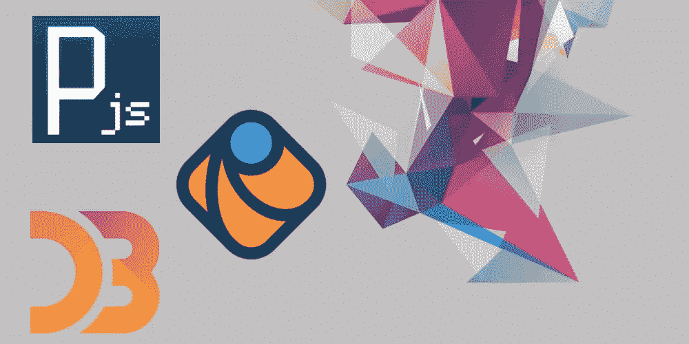
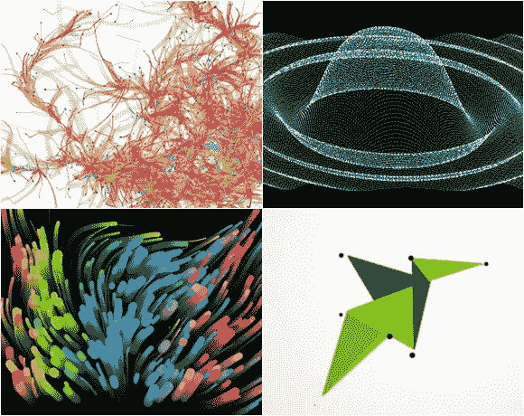
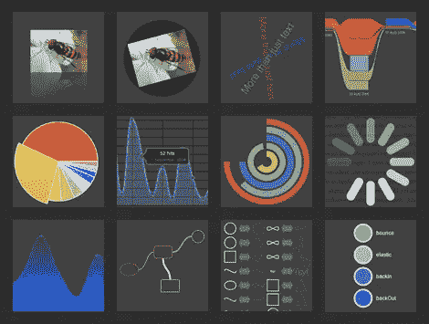
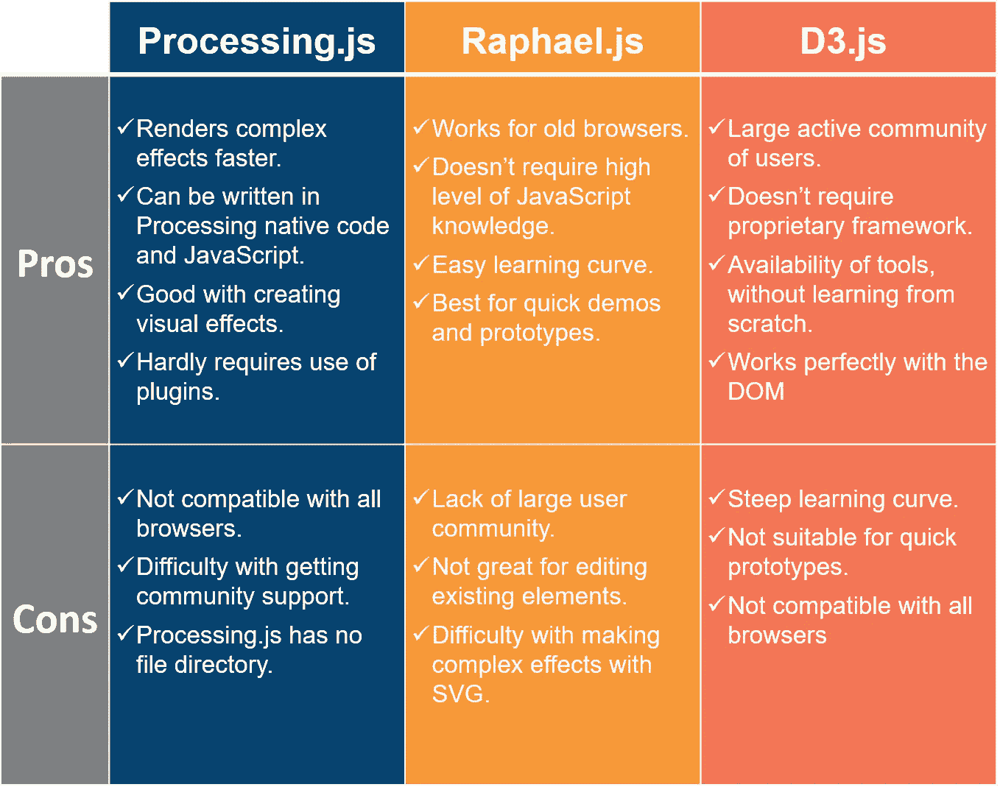

# JavaScript 可视化框架综述

> 原文：<https://medium.com/hackernoon/javascript-visualization-frameworks-review-f3cccf78ccf0>

数据已经逐渐成为当今世界一个非常重要的方面工具。

数据驱动着世界，在这个世界被数据和网络所控制的阶段，从大量产生的数据中读取信息是有意义的。

像 JavaScript 这样的语言对于网页的显示方式非常重要，拥有一种向客户端显示数据的方式是完全有意义的。

幸运的是，对于 JavaScript 传播者、前端开发人员和数据科学家来说，本文讨论了三种主要的 JavaScript 框架，用于向客户端可视化数据，而不必切换到被吹捧为与数据更相关的语言，如 Python 和 r。

文章谈到的三大绘图工具包括 **Processing.js、Raphael.js** 和 **D3.js**

# Processing.js

Processing 是一种语言和编程环境，以类似 Java 的语法作为其本机代码，最初由 Ben Fry 和 Casey Reas 在 2001 年开发。2008 年，John Resig 将它移植到 JavaScript 上进行开源。

Processing 的用户调用他们的应用程序 sketches，Processing.js 只是将本机代码转换成 JavaScript，以便在 web 页面上呈现它们。

它还有一个 setup()和 draw()函数，分别用于初始化应用程序状态和在 canvas 元素上进行绘制。

学习使用 processing.js 框架的过程超出了本文的范围。不过网上参考可以在这里找到**。**

**令人鼓舞的是:**

*   **这是一种高效且轻松的方法，可以让你的读者更好地理解你的观点。**
*   **它还为用户的交互提供了空间，因为它可以接受用户的输入；从而使它成为一个非常灵活的工具。**

**Processing.js 可以在这里 下载 [**。等到你掌握或使用它的时候，你就可以为**](http://processingjs.org/download/) **[**项目**](https://github.com/processing-js/processing-js/) 做贡献了。****

**尽管这个工具非常强大，但据说它是今天文章中要讨论的三个框架中最不强大的。这就把我们带到了下一个框架。**

# **拉斐尔**

****

**据说拉斐尔的最大优点是它能够让绘画变得容易。要使用 Raphael，你只需要一个浏览器和文本编辑器。然而；这还不是最激动人心的部分。**

**拉斐尔还说:**

*   **也允许编码，你可以写命令让它在用户加载你的网页时以一种独特的方式绘制东西。**
*   **支持 HTML5 中的

    <canvas>元素。</canvas>** 
*   **几乎可以在所有的浏览器上工作，旧的浏览器和很可能即将到来的浏览器。**
*   **不需要外部插件就能正常工作。**
*   **是移动设备友好的。**

**Raphael 直接使用浏览器的内置图形语言可缩放矢量图形(SVG)。**

**然而，Raphael 与旧浏览器兼容的主要原因是它能很好地处理一种称为矢量标记语言(VML)的格式。**

**与 Processing.js 不同，它必须从 Processing 移植而来，是一种基于 Java 的语言，Raphael 是纯 JavaScript 这意味着它可以无缝、自然地处理网页。**

**Raphael.js 是一个比 Processing.js 更受欢迎的框架。它在数据可视化社区中也有很多用户，无论什么时候出现问题，你都可以向他们求助。它是开源的，肯定会得到改进，没有什么可担心的，拉斐尔是未来的一员。所有这些最有可能让 [**Raphael.js**](http://dmitrybaranovskiy.github.io/raphael/) 比其他数据可视化框架更有优势。**

**还有一点，Raphael 的学习曲线很容易，几乎可以立即使用。这就把我们带到了下一个据说是可视化的最佳框架，但是有一个陡峭的学习曲线。**

# **D3.js**

****

**D3 代表(数据驱动文档)，顾名思义；为数据可视化目的进行了很好的打包。它将原始数据集转化为可视化，并与 Microsoft Excel 无缝协作。D3 是由 web 数据可视化的主要倡导者之一 Mike Bostock 创建的。就像 Raphael.js 一样，D3 使用 SVG，并且将可视化形状作为 DOM(文档对象模型)的一部分。这意味着您可以利用级联样式表(CSS)来设计数据的样式。**

**D3.js 基于 HTML、DOM、CSS、SVG，也支持 Canvas。D3 在其上构建了许多允许拖放的其他框架。D3 是一个长期投资的好工具，可以创建你自己的库，然后你可以用它来加速创建过程。出于数据可视化的目的，与 SVG 最重要的交互是将数据绑定到它们，D3 允许围绕它们重写数据包装器。**

**就目前情况来看，D3.js 不仅在许多情况下比 Raphael.js 和 Processing.js 更好，而且也是 jQuery 和其他框架的可行替代品。然而，据说 D3 有一个陡峭的学习曲线，最有利于有使用 JavaScript 经验的程序员。**

**基于 D3 构建的工具包括 MetricsGraphics、Epoch、Vega、NVD3 等等。这些工具可以用来代替从头开始学习 D3。要开始使用 D3，请前往 [**D3 网站**](http://d3js.org/) 下载最新版本。**

# **包装它**

**还不确定选择什么框架？**

**当决定使用什么样的框架来进行数据可视化时，您必须知道您的优先级。希望下面的优点和缺点能帮助你定义它们:**

****

**[*安东·沙列尼科夫*写的](https://www.linkedin.com/in/anton-shaleynikov-45812a1/)**

***想了解更多？* [*点击这里查看*](https://dashbouquet.com/blog)**