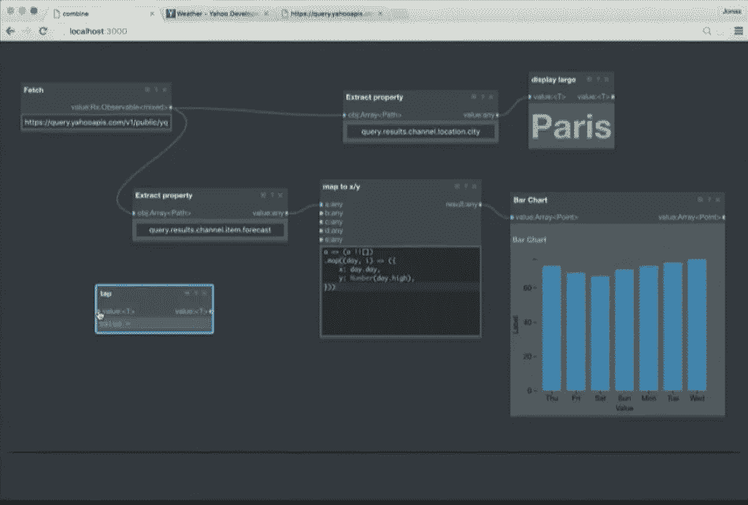
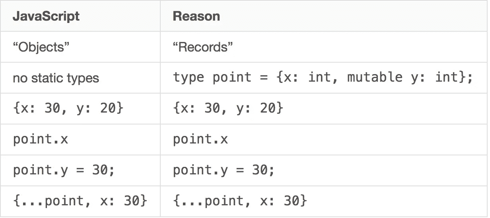
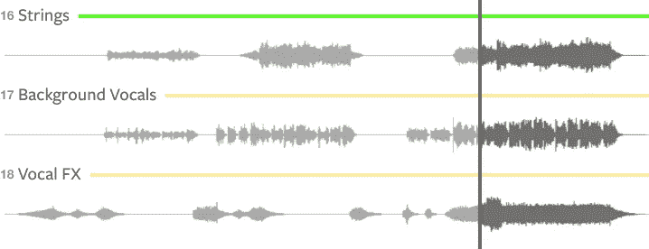
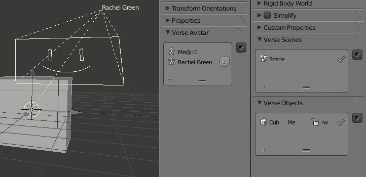
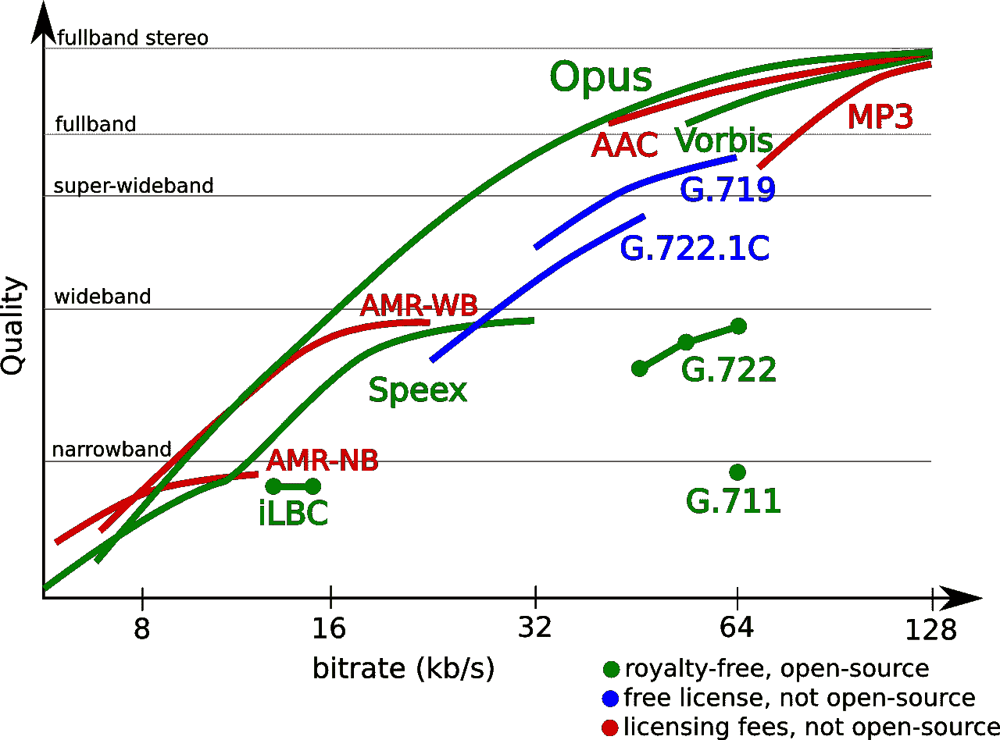

# JavaScript:2017 年什么让我兴奋

> 原文：<https://medium.com/hackernoon/javascript-what-excites-me-in-2017-7681766b7d79>

网络在全球范围内传播思想，即时且零成本。因为 JS 是在网络上执行的，所以它比其他任何语言都有不公平的优势。协作的反馈回路非常紧密。我们可以看到代码在没有编译或构建的情况下执行。伟大的思想迅速聚集在有希望的想法周围，并帮助塑造它们。随着协作工具越来越好，社区规模越来越大，这个循环就越来越紧。

一名学生对皮克斯的艾德·卡姆尔说，他周围一定有很多天才，因为他的团队有很多以他们名字命名的算法。他的回答是，当时没有任何东西可以做他们想做的事情，所以要做任何事情，他们必须发明它。创新在前沿很容易。这并不比创造性地破解遗留软件以跟上现状更难，但回报却更多。你离前沿越远，就越难想出新的东西。

# 理由

过去我会说我不想念 JS 中的类型。我见过许多开发人员从 Java 转向 JS。他们发现即时反馈比缓慢构建的严格静态分析更有效率。开始改变我想法的一件事是看到 Jonas Gebhardt 的演讲:[用 React 进化可视化编程](https://www.youtube.com/watch?v=WjJdaDXN5Vs)。

在这篇文章中，他展示了通过从 props 中挖掘流类型，他能够可视化地将组件连接到 API 和其他组件。每当他从一个节点中拉出一条边时，除了可以处理这种类型的节点的道具之外，所有的东西都会变灰。通过这种方式，应用程序可以可视化地从组件和 API 中分离出来。我看到类型真的很像你的水槽下的管道系统的模块化连接器。它们准确地告诉你什么可以连接到什么而不会泄漏。事实证明，类型和快速反馈并不相互排斥。

函数式编程的三大支柱是一级函数、不可变数据和静态类型。最后两个不是 JS 固有的，但是可以通过 immutable.js 和 Flow 注释附加进来。如果我们无论如何都要转换 JS，为什么不从一个有一级类型和不变性的语言转换呢？

输入[原因](https://facebook.github.io/reason/)。Reason 是 OCaml 的一个转换视图，使它看起来有点像 ES2016，没有 JavaScript 的坏部分。OCaml 可以通过 [BuckleScript](http://bloomberg.github.io/bucklescript/) 转换成可读的 JavaScript。

卖点:

*   第一类函数，不可变的数据和类型
*   在客户机和服务器上运行相同的代码，但在服务器上编译成本机代码
*   本机代码可以并行运行，例如适用于 VR(在 web 上使用 WebGL，在本机应用中使用 OpenGL)
*   只需学习一次，目标是任何东西，如 web、ARM、x86、Mac、PC、Raspberry PI 等
*   强类型使安全性更容易验证
*   部署 MirageOS unikernal 以实现安全性和小尺寸

MirageOS 很像 Docker 但是没有 Linux。它创建了单内核(应用程序和操作系统融合在一起),您只需要包含操作系统中您需要的部分。对于许多 web 应用程序来说，这仅仅是运行 HTTP 服务器所需的操作系统。一个内核可能只有 5MB，而 Docker 容器可能有 50-100 MB。Mirage 实例可以快速启动和关闭，因此可以针对每个请求启动一个实例(类似于 Amazon 的 Lambda，但启动速度更快，重量更轻)。或者你可以在一台机器上运行数千个。因为操作系统代码较少，而且是强类型的，所以受攻击面较小。

**社区:**React 的创建者[乔丹·沃克](https://twitter.com/jordwalke)创立了 React。[将会给规范编写者增加对 Web Assembly 并发支持的压力。](https://medium.com/u/701b0000d771#.kjgx2t1q9)

一些真正有趣的代码正在 Rust 中编写，例如 XI 编辑器，它使用 CRDT(谷歌文档风格同步)来允许文本编辑回流使用多个处理器。有了 CRDT 作为基础，将来可以更容易地添加多用户并发编辑。如果编译成 Web 程序集，这可能为 Atom 之类的应用程序提供实现远程配对的机会(这是 Atom 编辑器的初衷)。XI 的回流代码已经被用于伺服的文本领域。

一个要点是多用户和多处理器问题可能有相似的解决方案。随着越来越多的人编写安全的多处理器代码，它可能会交叉授粉网络生态系统。

# Web 组件

网络现在支持画布，SVG，网络音频，视频和 WebGL。在创建多媒体应用程序时，浏览器已经做了大量繁重的工作，我们只需要添加 UI。例如，multitracks.com 将歌曲分割成不同的音轨，这样你就可以将单个音轨设为静音。

现场乐队可以使用他们缺少的乐器的音轨或使用单独的音轨进行练习(有些歌曲有 21 个音轨)。这是一个令人敬畏的应用程序，但令人惊讶的容易写。您只需要一个组件，将音频样本转换为位图，并在页面上重复几次。跨平台多声道音频播放的难点是由浏览器完成的。

但是网络上很少有伟大的创造性工具来处理位图、矢量图形、音频、视频和 3D 图形。然而，有一些相当不错的开源桌面应用程序: [Gimp](https://www.gimp.org/) 、 [Inkscape](https://inkscape.org/) 、 [Audacity](http://www.audacityteam.org/) 和 [Blender](https://www.blender.org/) 。

这些大多可以追溯到 Sourceforge 时代，除了 Blender 之外，它们的开发速度已经放缓。他们的代码库确实有用于图像、3D 图形、声音和矢量操作的 C++和 C 代码。以及对像声音 VST 这样的插件的支持。

如果能看到从这些项目中提取处理代码并编译成 Web 程序集，那就太好了。UI 代码可以以 React 组件的形式快速迭代。然后，通过将编辑器整合在一起，可以快速创建应用程序。

很高兴看到这些项目的一些贡献者加入 JS / Web Assembly 社区。

# 拆分窗格用户界面

我的开源突破来自于创建 Divide，它是 Blenders 细分 UI 的 Redux 实现。在 Atom 和 Zeit 的 hyper 应用程序中也可以看到类似的用户界面。这种风格的 UI 很酷的一点是，它允许用户针对每个痛点拥有一个响应组件，然后根据他们的需求整合应用程序。单个窗格可以在手机上全屏使用，但是三个屏幕的桌面可以使用所有可用空间。

你可以混合搭配音频、文本、代码、视频、时间轴、SVG、位图和 3D 模型的编辑器和序列器。这允许为 3D 渲染、数字音频工作站、停止运动动画序列发生器、视频编辑器或网页编辑器重组同一组组件。

Blender 使用这种风格的 UI。虽然需要一点时间来适应，但是将这些工具带到网络上会降低破解 UI 所需的专业水平。

但是将这些应用程序转移到网络上的真正回报是，它允许多个用户在同一个项目上合作。Blender 在几年前试图通过 verse 项目做到这一点。

# 数据

2016 年，Redux 的人气爆发，GraphQL 获得了牵引力。Redux 教会我们重视不可变的数据，也重视数据历史，而不仅仅是它的当前值。GraphQL 和 Relay 让我们能够获取组件所需的最少数据，而不需要定制的 Rest 端点。然而，GraphQL 的设计中也有权衡，因为它需要与任何可以想象的后端一起工作。

如果我们更有主见，并且数据在前端和后端都是强类型的，我们就可以保证订阅、变更和 shouldComponentUpdate 可以无缝处理。OM.next 已经能够在 ClosureScript 中实现其中一些功能。我希望我们能看到这些想法结出果实。

# 使用 Docker、Now.sh 和 GitHub 页面缩放

对于许多创造性的应用程序，如视频编辑和 3D 渲染，您仍然需要在后端进行繁重的处理工作。对于 3D 渲染，您可能想要租用 1000 个内核几秒钟，并让每个内核渲染一帧动画，这可以以类似于租用 8 个内核几个小时的价格完成。

扩展服务器之前需要专业知识，但有望在 2017 年，我们将看到大量回购不仅包括开发服务器，还包括可扩展的后端，只需一个命令即可部署。像 Now.sh 这样的服务减轻了编写和部署可伸缩节点、Docker 和静态文件服务器的负担。

2016 年 GitHub 增加了将 docs 文件夹视为静态站点的功能。虽然这是一个非常微小的变化，但它使得在 GitHub 文档中包含示例或整个运行中的应用程序变得微不足道。当涉及到推广新组件时，这应该会收紧循环，因为你将能够在文档中的操场上尝试它们。

# 乌丹尼

可悲的是，在编写应用程序时，web 仍然缺乏一些非常基本的功能，比如对布局的精细控制和体面的字体度量。测量 DOM 元素的大小会产生回流，并且不能基于父元素的大小而不是窗口的大小来添加响应断点。

我想它之所以叫胡迪尼，是因为它让我们能够突破目前的盒子模式。Houdini 允许开发者以一种表演的方式对渲染进行精细的控制。

# 分散式网络

WebRTC 包含在 Firefox 和 Chrome 中已经好几年了。它第一次引起我的注意是在我写了一个多人网页游戏《萤火虫》之后。

玩家平均每秒钟按键 4 次。我希望游戏有 10 个玩家，每个数据帧(由按键生成)大约是 64 字节(因为每个帧都需要一个标题)。该引擎在每个客户端上都使用了一个减速器来通过按键创建游戏状态(这有点像 2012 年时光旅行的 Redux)。所以每个游戏每秒所需的带宽是:

64 x 4 x 10 x 10 = 25KB/秒/游戏

这很快就增加了:每 40 秒 1GB，每 11 小时 1TB，而这只是一个游戏的数据。如果这个游戏变得很流行，我会损失很多钱。由于这个原因，我从来没有推出它。然而，WebRTC 将允许我扩展到数百万个游戏，而无需为带宽支付任何费用(我现在需要的只是一些时间来进行转换)。

数据通道在 Firefox 和 Chrome 中，Edge 仍然将其视为低优先级，Safari 仍然需要实现 WebRTC(但至少正在进行中)。然而，因为现在有 20 亿 Chrome 用户，所以伟大的 WebRTC 应用程序有巨大的潜在受众。

## 隐私

SnapChat 的成功表明，人们渴望保护数据隐私。随着政府、谷歌和脸书想要索引我们输入的每一个词，点对点提供了一个保持数据隐私的好方法。

IndexDB 可用于在浏览器中持久化分布式数据库和内容。因此，在像脸书和 Twitter 这样的浏览器应用程序中，只有你的朋友保存你的数据是可能的。WebRTC 也可以在服务器上运行，因此如果您希望确保数据始终可用，您可能希望从运行在 RaspberryPI 上的服务器中获取数据。但有了 5G，我们可以预计大多数用户将一直使用物联网设备。

Service Worker 使应用程序能够缓存在浏览器中并离线运行。因此，人们可以想象一个基于服务人员的浏览器应用程序外壳，将您连接到对等版本的 Web。应用程序从远程对等点的 IndexDB 提供服务，并通过注入脚本标记和内容进行再水化。

Mozilla 也在试验 Flyweb，这是一种允许网络应用向本地网络上的其他设备提供内容的规范。

## 音频视频

WebRTC 是最新的开放音频和视频编解码器获得牵引力的途径。Opus 现已推出 Chrome、Firefox 和 Edge 版本。它拥有比 AAC，Vorbis 和 MP3 更好的性能，特别是在低比特率时。

[AV1](https://en.wikipedia.org/wiki/AOMedia_Video_1) 由谷歌、Mozilla、微软、亚马逊和网飞支持的新视频编解码器将于 2017 年初发布。它应该加入 Opus 音频编解码器作为 WebRTC 视频的标准。

## 货币

去中心化的货币应该会在 2017 年开始影响网络。如果你想出售内容，目前网络上有太多的摩擦。信用卡交易的单位成本很高。他们需要输入个人信息，这非常耗时，而且会引起隐私问题。虽然比特币提供了一个分布式账本[以太坊](https://www.ethereum.org/)提供了一个去中心化的图灵完整的合同编写方式。它可以让你实现金融交易的自动化。交易会有更少的摩擦，因为它们的单位成本可以忽略不计，而且不需要暴露购买者的身份。这意味着你可以出售文章、博客文章或视频，而不需要出售订阅或广告。

在文章的开始，我谈到了一个将音乐分解成单个乐器的音轨的网站。然而，这些曲目中的每一首也代表了一位音乐家。如果这些音乐人允许他们的曲目被重新混音，他们可能会在每次播放结果曲目时收到小额报酬。

因此，当许多人哀叹会计和行政工作将因自动化而流失时，创造性的工作是可以获得的。会计自动化降低了每个想自己创业的人的门槛。你不再需要写歌和会计，游戏编程和会计或插花和会计。你只需要一个核心技能。

# 结论

因此，对我来说，2017 年最令人兴奋的挑战是让协作创意软件更容易获得，并让创意工作在经济上更有回报。

> [黑客中午](http://bit.ly/Hackernoon)是黑客如何开始他们的下午。我们是 [@AMI](http://bit.ly/atAMIatAMI) 家庭的一员。我们现在[接受投稿](http://bit.ly/hackernoonsubmission)，并乐意[讨论广告&赞助](mailto:partners@amipublications.com)机会。
> 
> 如果你喜欢这个故事，我们推荐你阅读我们的[最新科技故事](http://bit.ly/hackernoonlatestt)和[趋势科技故事](https://hackernoon.com/trending)。直到下一次，不要把世界的现实想当然！

