# JavaScript 与 ECMA 的旅程:ES 2017

> 原文：<https://medium.com/hackernoon/javascripts-journey-with-ecma-es-2017-2ad36a7f9538>

## Javascript 简史

Photo by [Steve Halama](https://unsplash.com/photos/Yhc7YGZlz3g?utm_source=unsplash&utm_medium=referral&utm_content=creditCopyText) on [Unsplash](https://unsplash.com/search/photos/travel-and-code?utm_source=unsplash&utm_medium=referral&utm_content=creditCopyText)

JavaScript 是由 Brendan Eich 开发的。他被要求为 Netscape 通信公司开发一种新的语言，这种语言可以在他们的浏览器上运行，并且在语法上类似于 Java，这样他们的开发人员可以不费吹灰之力就能学会。它在 1995 年 9 月的某个时候以名称 **JavaScript** 推出，回顾这些年，有些人甚至称之为营销噱头。

## JavaScript 对标准的需求:

微软希望凭借**的 ie 浏览器**占领浏览器市场，赶走所有竞争对手，实现他们自己的 JavaScript 版本。

JavaScript 的创造者总结出标准的必要性，以抑制 JavaScript 的个别版本，如果没有合适的标准，这将成为开发人员的噩梦，该标准后来被称为 ECMA 标准，由一个名为 ECMA International 的组织维护。

## **ECMAScript 诞生:**

1997 年****ECMAScript**或 **ES 1** 问世，决定 **JavaScript 将是实现 ECMAScript** 的语言。**1998 年出了 ES 2，1999 年出了 ES 3，2009 年出了 ES 5，2015 年出了 ES 6 或者官方叫 ES 2015**。从 2015 年开始，我们决定每年推出一个新的 ECMAScript 标准，如果到那时还没有实现某个功能，它将不会包含在该版本中。**

## **ECMAScript 版本生命周期:**

**ECMA 遵循一个 [TC39](http://www.ecma-international.org/memento/TC39.htm) 流程，其中有 5 个主要流程:**

1.  ****Strawman 或阶段 0:** 这种情况下，提案不是正式提案，而是由 TC39 成员或贡献者提出的建议或想法，需要进行集体讨论。**
2.  ****提案或阶段 1** :这是提案变得正式的时候，特性开始包含在发布中。“冠军”负责一项提案。TC39 委员会积极参与讨论这些冲突，并对特性提出改进建议。**
3.  ****草案或第二阶段:**如果一个提案已经发展到这一步，它很可能成为以后标准的一部分，如果它错过了当前的周期，它可能不是这个版本，而是下一个版本。需要实现两个实验示例，并根据成员的反馈记录其增量变化。**
4.  ****候选或阶段 3:** 这是考虑外界反馈的阶段。指定的审阅者在提案上签字。在这一阶段，只有在出现关键问题时，才能对提案进行修改。**
5.  ****完成或第 4 阶段:**功能将包含在下一个版本中，在此阶段将进行严格的单元测试。**

**你可以在 ECMA 的这个 [github 仓库](https://github.com/tc39/ecma262)中查看所有的提议及其状态。**

## **ES 2017:**

**这是 JavaScript ECMA 标准的最新版本。让我们看看它的一些新特性。**

1.  ****async and await:** 如果你有使用。像我这样的网络世界，你会觉得这极其熟悉。虽然可能会有一些变化，但如果你已经有一些 C#的经验，理解起来会容易得多。**不要误解我的意思，这并不意味着没有 C#经验的人不会理解这一点，只是有 C#经验的人会比其他人感觉离家更近。****

**直到 ES 2016，我们都是这样使用 promises 进行异步调用的。**

**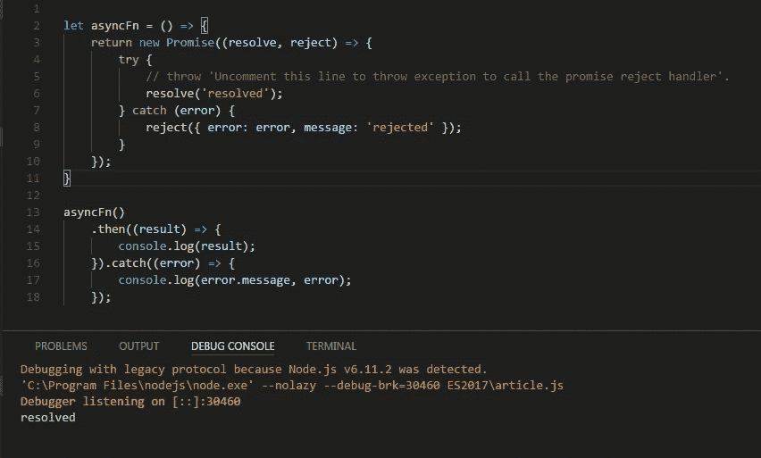**

**Example in ES 2015**

**如果你不熟悉 arrow 函数和 ES 2015，**不必担心**，因为我已经在下面给出了使用 ES 5 的相同实现，尽管你需要有一些承诺的背景。如果你对上面的图片感到满意，你可以跳过下面的图片。**

**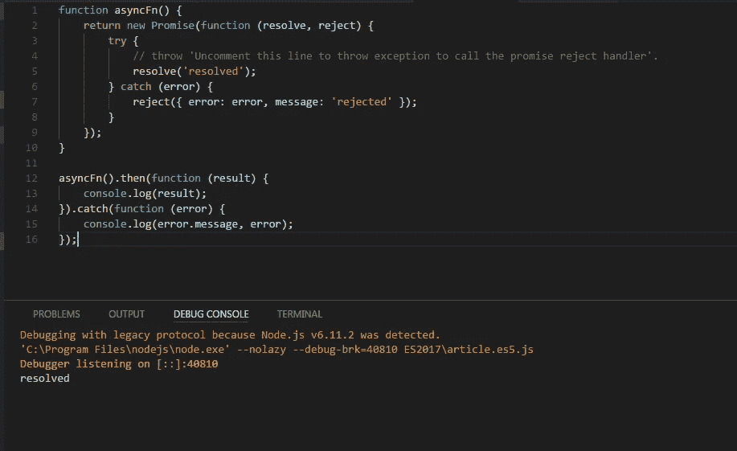**

**Example with ES 5 functions.**

**如果我在 ES 2017 中使用新的 **async 和 await** 关键字进行相同的实现，它看起来会像这样。**

**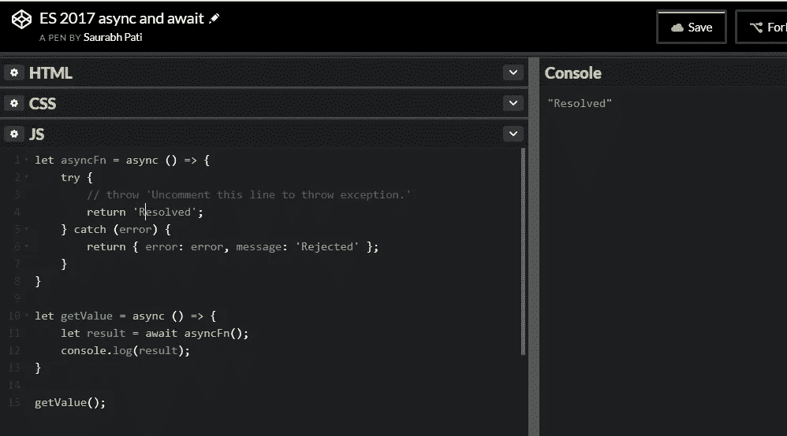**

**using async and await in ES 2017**

***你可以在这里看到实际的笔***

***这就是你如何进行异步调用，而不必通过向 **github api** 发出**xhr**’**GET**请求来下载任何外部库。***

***只需创建一个引用您的 JavaScript 文件的 html 文件。这是必要的，因为如果您只使用 node，**运行您的 JavaScript 文件，您将会违反内容安全策略，因为它将被视为攻击，因为您的 JavaScript 不在浏览器上执行。所以继续创建一个类似这样的 html 文件*****

***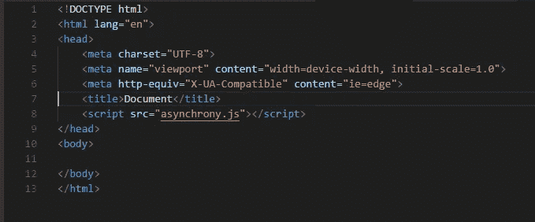***

***just a simple html file with a reference to your JavaScript file.***

***在我的例子中， *asynchrony.js* 就是这个文件。***

***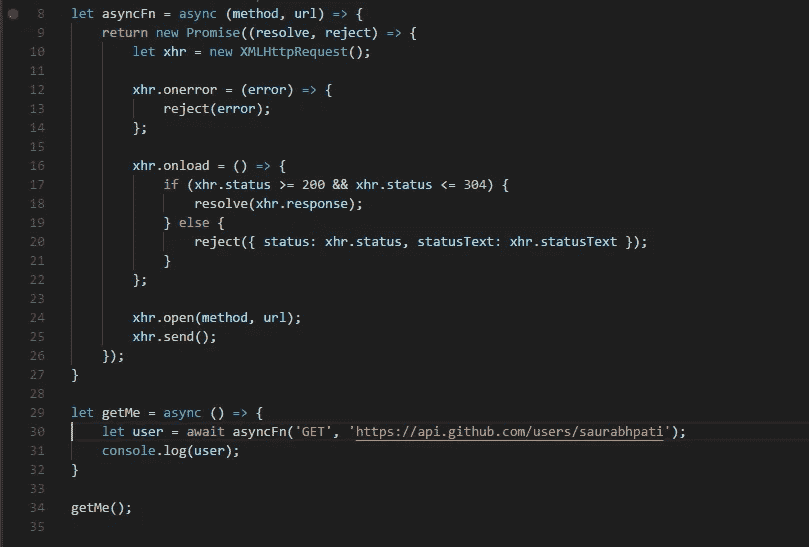***

***asynchrony.js***

***简单地浏览一下代码，这里我们刚刚创建了一个名为' **asyncFn** '的函数，该函数向 github api 的用户资源发出 GET 请求以获取我的详细信息，响应作为 json 对象返回到' **getMe** '函数内部，并记录到控制台。***

***现在，如果我们删除**第 30 行**中的 **await** 关键字，‘**async fn’**将简单地返回一个承诺，通过分别使用“**”和“**”和“ **catch** ”处理程序，可以将一个 resolve 和一个 reject 处理程序附加到该承诺上，因此您的“ **getMe** ”函数就变成这样***

***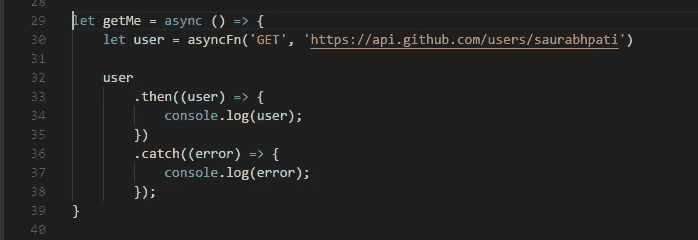***

***without await***

***因此，使用 **await** 将您的承诺解析为适当的响应对象，解析后可能是正确的响应，被“ **asyncFn** ”拒绝时可能是错误的响应。***

*****注意事项:*****

***a)你不能在一个函数中使用 **await** ，除非这个函数用 **async** 关键字标记。***

***b)如果您正在运行 visual studio 代码启动器，您需要安装 **babel** 或其他合适的工具，该工具将 **transpile** 并向代码添加合适的**polyfill**，以便您的代码可以在启动器中运行。否则，您需要在现代浏览器上执行您的 ES 2017 代码，大多数现代浏览器都可以执行 ES 2017 JavaScript 代码。***

*****2。网络工作者:**这是一个相当有趣的概念。我想用一个类比来解释一下。当我在大学的时候，我在第一学期上了**物理**课，教授是**原子物理**方面的专家，但**不是**核物理方面的专家。所以他让他的一个主修核物理的学生来代替他。所以换句话说，**主线程(教授)指派了一个工人线程(他的学生)为他做一项工作，而主线程(教授)**可怕地准备了一个测试，让我们在等待**他的学生(工人线程)**完成他的工作时进行(纯粹的邪恶)测试。***

***web worker 作为一个不同于调用 worker 的主线程的线程执行，并且为 worker 线程执行一个不同的 JavaScript 文件，它是独立执行的，尽管我们可以附加侦听器来共享数据。***

***数据共享是通过为工作线程创建一个复制数据来实现的，这样它就可以独立地处理数据，然后将结果发送回主线程。***

***在我们开始用代码探索它之前，**让我先告诉你，如果你没有在服务器中托管你的应用程序就运行它，它不会工作，因为没有服务器，JavaScript** **本质上是一个单线程语言，没有服务器的动态性，它将无法启动一个不同的线程。*****

***使用任何 web 服务器托管您的应用程序，您可以使用 ***Express*** 或使用 **http** 节点模块在 node 中创建一个 http 服务器。既然学习如何在 node 中创建 http 服务器不是我们这里的目标，您可以将该任务留给[***http-server***](https://www.npmjs.com/package/http-server)*节点模块。只需使用***npm 安装 http-server-g****并运行命令***http-server 启动您的服务器。*** 它将在 *http://localhost:8080(默认端口)上托管您的完整文件系统。*如果您不想创建应用程序，请克隆我的 git 存储库*[***https://gitlab.com/saurabhpati/es2017.git***](https://gitlab.com/saurabhpati/es2017.git)*，一旦您安装了 http-server 节点模块，只需运行命令*'****http-server****'。********

****现在，创建两个 javascript 文件，一个作为**主工作线程**，另一个作为 **web 工作线程**。我将尽可能保持它的简约和简单。****

****我已经给出了我的 html 文件的快照，参考了两个脚本，以及我如何运行服务器和在服务器上托管 html。****

****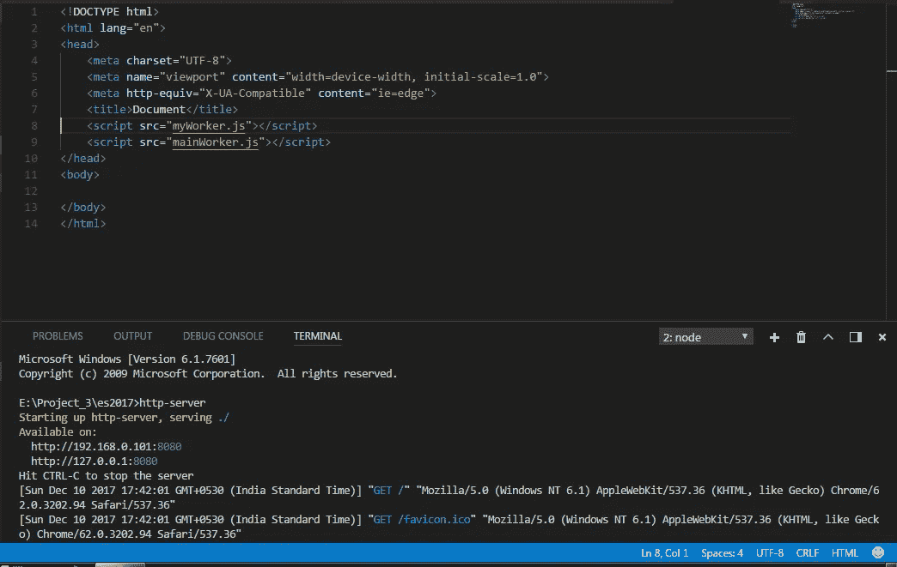****

****现在我们要做的就是编写***my worker . js****和***main worker . js***的代码*****

*******main worker . js:*******

****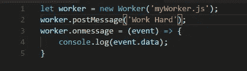****

****main worker code****

****这段代码只是创建一个 web worker，**向 worker 线程**发送一些数据，而***on message****处理程序是一个回调函数，在 worker 完成其工作时执行。*****

********myWorker.js:********

****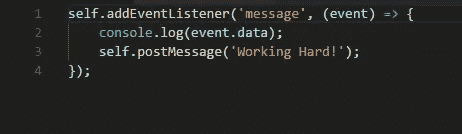****

****不要被**‘self’，**我在这里没有使用任何**‘this’**绑定，它是一个**专用的 worker 全局作用域**，当 worker 被执行时，服务器理解它。我在下面附上了结果截图。****

****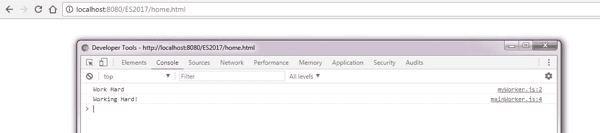****

*******3。Object.entries:*******

*******Object.keys*** *， **ES 5** 中介绍的*获取对象键数组， ***Object.values* ， **ECMA 2015** 中介绍的**获取对象值数组**。** ES 2017 引入了一个***object . entries***函数，它返回一个包含键和值的数组的数组，类似这样。****

****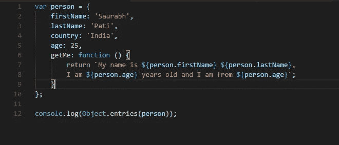****

****using Object.entries****

****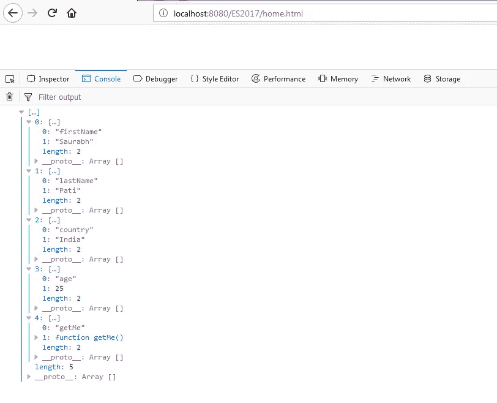****

****result of Object.entries****

*******4。object . getownpropertydescriptor/object . getownpropertydescriptor*******

****现在我们可以使用 getOwnPropertyDescriptors 方法来获取对象描述符。****

****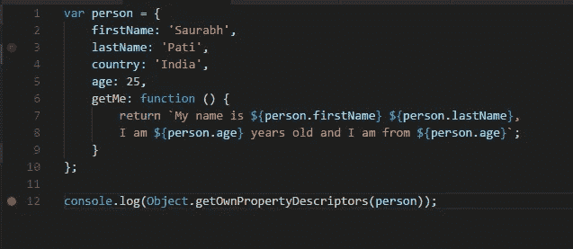****

****code for getOwnPropertyDescriptors****

****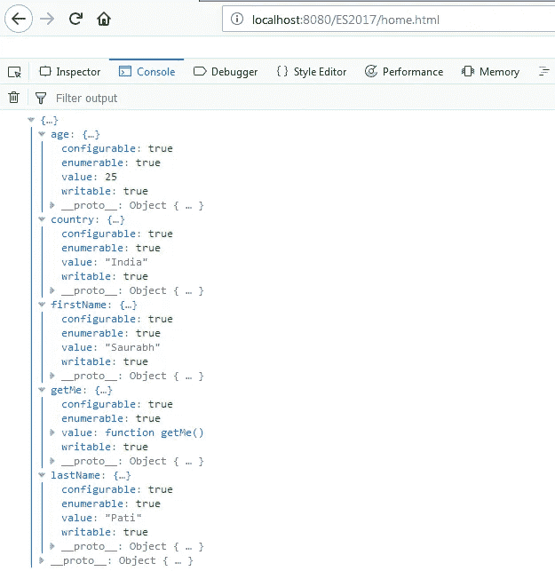****

****result****

****您还可以使用 object . getownpropertydescriptor(person，' age ')只获取年龄描述符。****

*******5。padStart 和 padEnd:* 和******

****我的名字“Saurabh Pati”是 12 个字符，所以如果需要开始和结束填充，我们现在可以使用 ES 2017 轻松完成，因为开始填充是由下面代码中的 **#*** 字符完成的，直到总长度达到 16 个字符。padEnd 函数的工作方式类似，并在字符串末尾追加 **'%$'** ，直到总长度达到 16。如果您使用 12 个字符的填充，其长度与我的名字相同，**则不应用填充**。我已经给出了这些方法的使用和结果的快照。****

********

****use of padEnd and padStart****

********

****result of padStart and padEnd****

****如果您已经阅读到这里，我想感谢您的阅读，如果您有任何建议，请将它们张贴出来，我会确保对提供的每一个建议进行处理，以便在未来改进我自己和我的内容。****