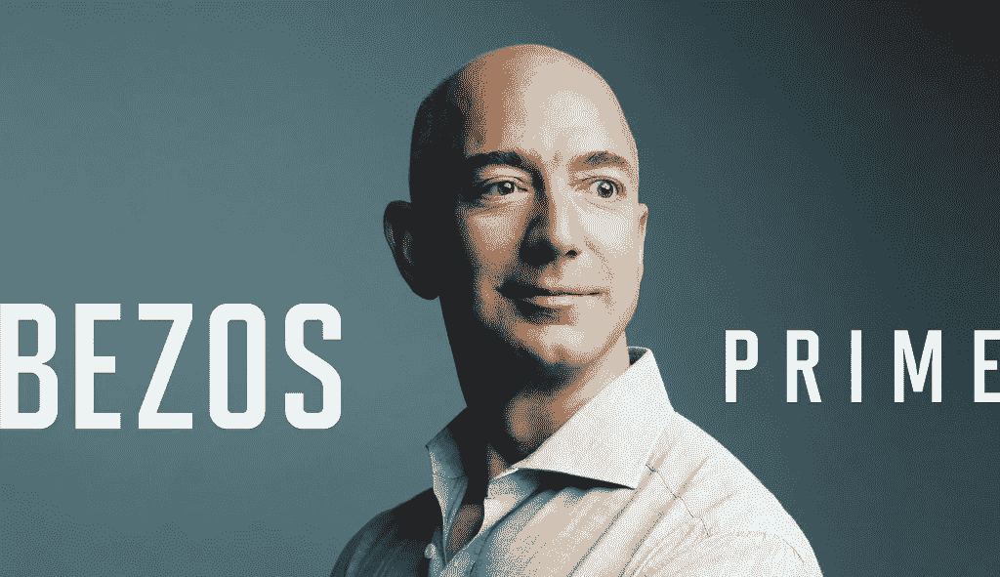
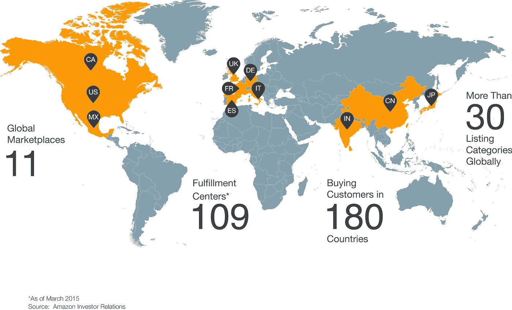
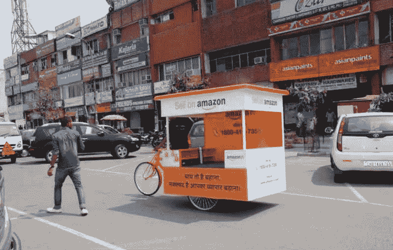
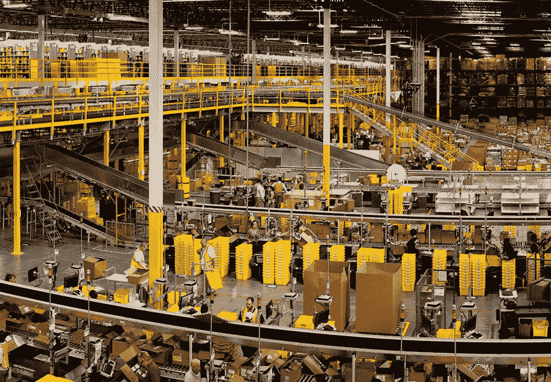
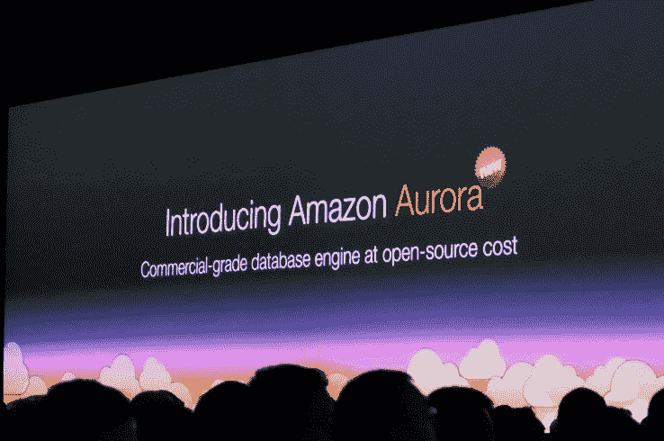
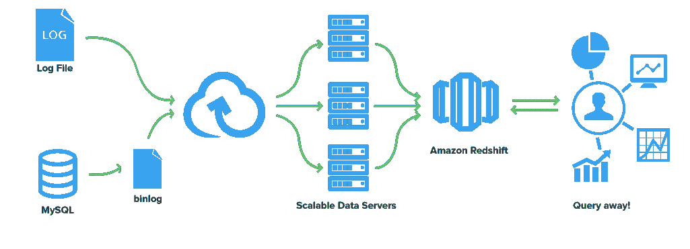
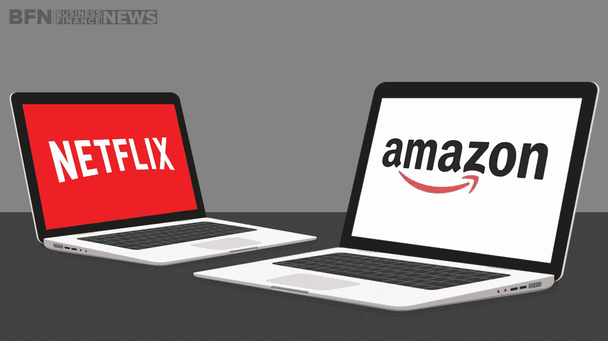
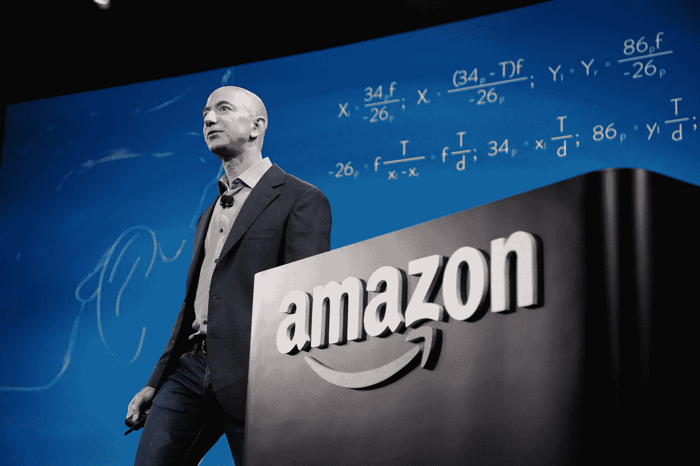

# 杰夫·贝索斯(亚马逊首席执行官)向股东解释他的商业模式

> 原文：<https://medium.com/hackernoon/jeff-bezos-ceo-amazon-explains-his-business-model-to-shareholders-80228d4e9233>

(更新)[Austen all red](https://medium.com/u/1e57e704325c?source=post_page-----80228d4e9233--------------------------------)[Lambda School](https://lambdaschool.com/)的创始人在这里发表了[每一封亚马逊股东的信在一个单独的可下载 PDF 中](/@austenallred/every-amazon-shareholder-letter-as-downloadable-pdf-4eb2ae886018)，这对我是鼓舞人心的，我将在 [Waydev](https://waydev.co) 开始做同样的事情。

**"** 致我们的股东:

今年，亚马逊成为有史以来年销售额达到 1000 亿美元最快的公司。同样在今年，**亚马逊网络服务**的年销售额将达到**100 亿美元**……这一速度甚至超过了亚马逊实现这一里程碑的速度。

这是怎么回事？这两家公司都是作为微小的种子而被种植的，并且都在没有重大收购的情况下迅速成长为有意义的大型企业。从表面上看，这两者有天壤之别。一个服务消费者，一个服务企业。一个以棕色盒子闻名，另一个以 API 闻名。两种如此不同的产品在同一个屋檐下发展如此之快，这仅仅是巧合吗？运气在每一次努力中都扮演了一个巨大的角色，我可以向你保证我们有充足的供应。但除此之外，这两个业务之间还有一个**的联系**。在表面之下，两者毕竟没有那么大的不同。他们都有一种独特的组织文化，这种文化非常关心一些原则，并坚信这些原则。我说的是**客户的痴迷**而不是竞争对手的痴迷，渴望发明和开拓，愿意失败，有耐心长期思考，以及对卓越运营的职业自豪感。透过这个镜头， **AWS 和亚马逊零售确实非常相似**。

关于企业文化的一句话:无论好坏，它们都是持久的、稳定的、难以改变的。它们可能是优势的来源，也可能是劣势的来源。你可以写下你的企业文化，但是当你这么做的时候，你是在发现它，揭示它——而不是创造它。它是随着时间的推移由人和事件慢慢创造出来的——由过去成功和失败的故事创造出来的，这些故事已经成为公司知识的一部分。如果这是一种独特的文化，它会像定制的手套一样适合某些人。文化在时间上如此稳定的原因是因为人们自我选择。一个充满竞争热情的人可能会选择并乐于接受一种文化**，而一个热爱开拓和发明的人可能会选择另一种**。谢天谢地，这个世界充满了许多**高绩效**、**极具特色的企业文化**。我们从不声称我们的方法是正确的——只是说这是我们的——在过去的二十年里，我们已经聚集了一大群志同道合的人。认为我们的方法充满活力且有意义的人们。

我认为我们特别与众不同的一个方面是失败。我相信我们是世界上最容易失败的地方。)，而失败和发明是密不可分的双胞胎。为了发明，你必须进行实验，如果你事先知道它会起作用，那就不是实验。大多数大型组织都接受发明的想法，但是不愿意经历一系列失败的实验。超额回报通常来自于与传统智慧的对赌，而传统智慧通常是正确的。如果有 10%的机会获得 100 倍的回报，你每次都应该赌一把。但你十有八九还是会错。我们都知道，如果你击球，你会有很多三振出局，但你也会打出一些本垒打。然而，棒球和商业的区别在于棒球有一个截断的结果分布。当你挥杆的时候，不管你和球的衔接有多好，你最多只能得四分。在生意上，每隔一段时间，当你踏上本垒板时，你可以得到 1000 分。这种收益的长尾分布就是大胆的重要性所在。**大赢家为这么多实验买单**。

**AWS** 、 **Marketplace** 和 **Prime** 都是亚马逊大胆押注成功的例子，我们很幸运拥有这三大支柱。他们帮助我们成长为一家大公司，有些事情只有大公司才能做到。向我们西雅图的邻居致敬，无论你是一个多么优秀的企业家，你都不会在你的车库创业中建造一架全复合材料的 787 飞机——无论如何，你都不会想乘坐这种飞机。如果使用得当，我们的规模使我们能够为客户提供我们以前从未想过的服务。但是，如果我们不警惕和深思熟虑，大小可能会减慢我们的速度，削弱我们的创造力。

当我与亚马逊的团队会面时，我不断地被展示出来的激情、智慧和创造力所震惊。我们的团队在去年取得了很大的成就，我想分享一下我们在培育和全球化我们的三大产品方面的一些亮点，这三大产品是 **Prime** 、 **Marketplace** 和 **AWS** 。虽然我将集中讨论这三个问题，但我向你们保证，我们也在努力寻找第四个问题。

# **质数**

我们希望 Prime 有这么好的价值，**不成为会员是不负责任的。**

我们已经将 Prime 两日送达选择从**100 万件增加到超过 3000 万件**，增加了**周日送达**，并为全球超过 **35 个城市的客户推出了**数十万件商品的免费当日送达**。我们已经**增加了音乐**、**照片存储**、Kindle 用户借阅图书馆和**流媒体电影和电视**。**

Prime Now 为会员提供一小时送货服务，这是一个重要的精选子集，在构想出来 111 天后才推出。在那段时间里，一个小团队开发了一个面向客户的应用程序，确定了一个城市仓库的位置，确定了 25，000 件商品中要销售的**，储备了这些商品，招聘了新员工，并进行了测试、迭代，设计了供内部使用的新软件——包括仓库管理系统和面向司机的应用程序——并在假期前及时推出。今天，在第一个城市推出 15 个月后， **Prime 现在为全球 30 多个城市的会员提供服务**。**

**黄金视频提供了世界上最有激情的 T2 故事讲述者的独家报道。我们希望像****和**斯派克·李**到**这样才华横溢的创作者敢于冒险，突破界限**。我们的原创剧集已经获得了超过 **120 项提名**，获得了近 **60 个奖项**，包括**金球奖**和**艾美奖奖**。其中许多故事在传统的线性规划模型中可能永远不会被讲述。正在筹备中的和即将推出的新系列和电影的创作者包括**杰瑞米·克拉克森**、**大卫·E·凯利**、**伍迪·艾伦**和**肯尼斯·罗纳根**。******

****根据菲利普·K·蒂克的小说改编的《城堡里的男人》探索了美国在二战中战败的另一段历史。它于 11 月 20 日在 Prime Video 首次亮相，并在四周内成为我们收视率最高的节目——获得了评论家的好评，如“**…亚马逊在*The Man in The High Castle***”和“***The Man in The High Castle*”中获得了本季度最佳新剧，而如今大多数新播出的电视剧甚至都没有尝试过。******

****这些节目对客户来说很棒，它们给 Prime 飞轮提供了食物——观看 Prime 视频的 Prime 会员更有可能从免费试用转为付费会员，并且更有可能续订他们的年度订阅。****

****最后，**我们的第一个 Prime 日**超出了我们所有人的预期——那天尝试 Prime 的新成员比我们历史上任何一天都多。全球**订单增长比**前一年的同一天增长了 266%，产品通过 FBA 获得 Prime 资格的卖家见证了破纪录的销售—**增长接近 300%** 。****

****Prime 已经成为一个“吃到饱”的实体数字混合体，深受会员们的喜爱。**去年会员增长了 51%**—**其中美国增长了 47%**，国际上的增长速度更快——现在全球有数千万会员。很有可能你已经是他们中的一员，但是如果你不是——请负责任——加入 Prime。****

# ******市场******

********

****我们经历了两次大的震荡，错过了 15 年前推出 Marketplace 前的(拍卖行和**拍卖行**。**我们从失败中吸取了教训**和**T9 在和**的愿景上依然固执。如今在**附近，亚马逊 50%的销量**都是由第三方卖家售出的。 **Marketplace 对客户**来说是个好机会，因为它增加了独特的选择；而**对卖家**来说是个好机会——有超过 **70，000 个企业家**，他们在亚马逊上销售 **，每年的销售额超过**100，000 美元，他们**创造了超过 600，000 个新工作岗位**。有了 FBA，这个飞轮就转得更快了，因为卖家的存货符合 Prime 资格了— **Prime 对会员来说更有价值**，而**卖家卖出更多**。********

今年，我们推出了一个名为**卖家履行承诺**的新项目。我们邀请了那些在运输速度和服务一致性方面达到很高标准的卖家加入 Prime 计划，并且**可以直接以 Prime 速度**下单。这些卖家的销售已经大幅提升，Prime 客户也因此在美国、英国和德国通过两天或翌日免费派送额外的几十万件商品。

我们还推出了亚马逊贷款计划，帮助卖家实现增长。自计划启动以来，我们已通过短期贷款为美国、英国和日本的微型、**中小型企业**提供了总计 15 亿美元的融资，未偿还**贷款余额约为 4 亿美元**。冲浪爱好者、Tower Paddle Boards 所有者斯蒂芬·阿尔斯托尔就是一个受益者。他的公司已经成为圣地亚哥发展最快的公司之一，部分原因是得到了亚马逊借贷(Amazon Lending)的一点帮助。**点击兑换资本**可以帮助这些小企业发展，为客户提供更多选择，同时让亚马逊受益，因为我们的**市场收入随着卖家的销售而增长**。我们希望扩大亚马逊贷款业务，目前正在想办法和银行合作，以便它们能够利用自己的专业知识来承担和管理大部分信贷风险。

除了丰富我们的产品，我们还努力使它们全球化。我们的市场**为任何地方的卖家**创造了接触全球买家的机会。过去，由于国际销售的实际挑战，许多卖家会将其客户群限制在本国。为了全球化市场和扩大卖家的机会，我们建立了销售工具，去年**让 172 个国家的企业家**接触到了 **189 个国家的客户**。这些跨境销售现在占亚马逊上所有第三方销售的近四分之一。为此，我们翻译了数亿份产品清单，并提供了 44 种货币之间的转换服务。即使是小型和利基卖家现在也可以进入我们的全球客户群和全球物流网络。最终的结果和卖家自己处理**一次**、**跨境履行**大相径庭。Plugable Technologies 的首席执行官伯尼·汤普森(Bernie Thompson)是这样说的:“**当你能够将大量货物运送到欧洲或日本的仓库，并在一两天内完成这些货物时，它真的改变了范式。**

**India** 是**如何通过客户痴迷和**对发明的热情**将**像 Marketplace 这样的产品全球化的另一个例子。去年，我们运行了一个名为**亚马逊柴车**的项目，我们部署了三轮移动车在城市的商业区导航，为**小企业主**提供茶、水和柠檬汁，并教他们关于**网上销售**。在四个月的时间里，团队行程 **15，280 公里**穿越 **31 个城市**，**提供 37，200 杯茶**，与超过 **10，000 名卖家**接洽。通过这个项目和**与卖家**的其他对话，我们发现**对网上销售**很感兴趣，但卖家们认为**这个过程很耗时**、**繁琐**和**复杂**。于是，我们发明了**亚马逊 Tatkal** ，它**能让小企业**到**在不到 60 分钟的时间内**上线。亚马逊 Tatkal 是一个特别设计的**移动工作室，提供一套启动服务，包括注册、成像和编目服务**，以及**基本的卖家培训机制**。自 2 月 17 日上线以来，我们已经联系到了 25 个城市的卖家。

我们也在通过亚马逊全球化履行，使服务适应当地客户的需求。在印度，我们启动了一个名为 **Seller Flex** 的项目，将亚马逊的物流能力与当地社区层次**的卖家选择结合起来**。卖家在仓库中留出一部分空间，用于存放要在亚马逊上销售的商品，我们将其配置为网络中的履行中心，可以接收和履行客户订单。我们的团队提供仓库布局、IT 和运营基础设施方面的指导，并对卖方进行现场标准操作程序方面的培训。我们现在已经在十个城市推出了 25 个可运营的卖家 Flex 网站。

# **亚马逊网络服务**

**就在 10 年前**， **AWS 在美国**开始了它的第一个主要服务，**一个简单的存储服务**。如今，AWS 为**计算**、**存储**、**数据库**、**分析**、**移动**、**物联网**、**企业应用**提供了超过 **70 项服务。我们还在全球 **12 个地理区域**提供了 **33 个可用区域**，明年还将在加拿大、中国、印度、美国和英国提供另外 5 个区域和 11 个可用区域。AWS 最初是由开发者和初创公司**创建的，现在有超过 100 万来自各行各业各种规模组织的客户在使用它——像 **Pinterest** 、 **Airbnb** 、 **GE** 、**艾尼路**、 **Capital One** 、 **Intuit** 、**强生&强生**、**飞利浦**

****AWS 比 Amazon.com 大**在 10 岁的时候，**以更快的速度增长**，并且——**在我看来最值得注意的**——**创新的步伐继续加快**——我们在 2015 年宣布了 **722 项重要的新功能**和服务，**比 2014 年**增长了 40%。**

**当我们开始的时候，许多人认为 AWS 是一个大胆的、不寻常的赌注。"**这跟卖书有什么关系？“我们本可以坚持织毛衣的。我很高兴我们没有。或者我们有吗？也许编织和竞技场一样与我们的方法密切相关。AWS 是**客户痴迷的**、**发明的**和**实验的**、**长期导向的**，并深切关注卓越运营。****

**经过 10 年和多次迭代，这种方法让 **AWS 迅速将**扩展为**世界上最全面的**，被广泛采用的云服务。与**一样，我们的零售业务**、 **AWS** 由**许多拥有单线程所有者的小团队**、**组成，从而实现快速创新**。该团队几乎每天都会在 70 项服务中推出新功能，而这些新功能只是“向客户展示”而已，并没有升级。**

****

**许多公司自称以客户为中心，但很少有人做到。大多数大型科技公司都以竞争对手为中心。他们看到其他人在做什么，然后**快速跟进**。相比之下，我们在 AWS 中构建的 90%到 95%都是由客户告诉我们他们想要的东西驱动的。一个很好的例子是**我们新的数据库引擎**、**亚马逊极光**。客户对传统商业级数据库提供商的专有性质、高成本和许可条款感到失望。虽然许多公司已经开始转向更开放的引擎，如 MySQL 和 Postgres，但他们往往难以获得所需的性能。客户问我们是否可以消除**不方便的权衡**，这就是为什么**我们建造了极光**。它具有商业级的耐用性和可用性，与 MySQL 完全兼容，**的性能比典型的 MySQL 实现**高 5 倍，但价格是传统商业级数据库引擎的 1/10。这引起了客户的共鸣， **Aurora 是 AWS 历史上发展最快的服务**。关于我们的托管数据仓库服务 **Redshift** ，几乎可以说是同样的故事，这是 AWS 历史上**增长第二快的服务**——小型和大型公司都在将他们的数据仓库迁移到 **Redshift** 。**

****

**我们的定价方式**也受到我们以客户为中心的文化** — **的推动。我们已经降价 51 次**，很多时候是在没有任何竞争压力的情况下降价的。除了**降价**，我们还继续推出新的低成本服务，如 **Aurora** 、 **Redshift** 、 **QuickSight** (我们的**新商业智能服务**)、 **EC2 容器服务**(我们的**新计算容器服务**)和 **Lambda** ( **我们开创性的无服务器计算能力**)，同时扩展我们的服务我们甚至推出并**持续改进服务，如可信赖的顾问**，当他们可以省钱时提醒客户——为我们的客户**节省了**数亿**美元**。我很确定**我们是唯一一家告诉客户**如何停止向我们花钱的 IT 供应商。**

**无论你是昨天成立的初创公司还是已经有 140 年历史的企业，云都为我们所有人提供了难以置信的机会，让我们可以在 T4 重塑我们的业务，增加新的客户体验，重新部署资本以推动增长，提高安全性，并且比以前快得多。MLB Advanced Media 是 AWS 客户不断重塑客户体验的一个例子。 **MLB 的 Statcast 跟踪技术**是棒球迷的一项新功能，它可以在每场比赛中测量每个球员、跑垒员和球的位置，让任何屏幕上的观众都可以访问经验数据，回答像“**如果…** 会发生什么”这样的古老问题，同时也给生活带来了新的问题。将棒球变成火箭科学， **Statcast 使用导弹雷达系统每秒测量每个投球的运动超过 2000 次**，通过**亚马逊 Kinesis** (我们处理实时流数据的服务)实时传输和收集数据，将数据存储在**亚马逊 S3** ，然后在**亚马逊 EC2** 中进行分析。这套服务将产生每场比赛近 7 TB 的原始统计数据，每个赛季高达 17 PB，为“永远不要滑入第一”这样古老但从未得到验证的棒球智慧之珠提供量化的信息**

****

****大约七年前**，**网飞**宣布他们将把他们所有的应用程序转移到云端。网飞选择 AWS 是因为它为他们提供了最大的规模和最广泛的服务和功能。网飞最近完成了他们的云迁移，像他们这样的故事正变得越来越普遍，因为像 **Infor** 、 **Intuit** 和 **Time Inc.** 这样的公司已经计划**将他们所有的应用程序迁移到 AWS** 。**

**AWS 今天已经**好到足以吸引 100 多万客户**，而且服务只会**从这里开始变得更好**。随着团队继续其**的快速创新**，我们将提供越来越多的功能，让构建者不受约束地构建，收集、存储和分析数据将变得越来越容易，我们将继续增加更多的地理位置，我们将继续看到移动和“互联”设备应用的增长。随着时间的推移，大多数公司可能会选择不运行自己的数据中心，而是选择云。**

# ****发明机器****

****

**我们希望**成为一个大公司**也就是**也是一个发明机器**。我们希望将**非凡的客户服务能力**与**通常与**创业型初创企业**相关的**行动速度、灵活性和**风险接受心态**结合起来。**

**我们能做到吗？ **我很乐观。我们在这方面有一个良好的开端，我认为我们的文化使我们能够实现这个目标。但是我认为这并不容易。有一些微妙的陷阱，即使是高绩效的大型组织也会理所当然地落入其中，作为一个机构，我们必须学会如何防范它们。大型组织的一个常见陷阱——一个损害速度和创造性的陷阱——是“一刀切”的决策。****

**有些决定是重大的、不可逆转的或几乎不可逆转的——**单行道**——这些决定必须有条不紊地、小心翼翼地、缓慢地做出，并经过**周密的考虑和磋商**。如果你走过去，不喜欢你在另一边看到的，你就无法回到你之前的地方。我们可以将这些**称为第 1 类决策**。但大多数决定不是这样的——它们是可变的、可逆的——它们是双向的。如果你做了一个次优的第二类决定，你不需要忍受那么长时间的后果。你可以重新开门，然后回去。第二类决策可以而且应该由高判断力的个人或小团队迅速做出。**

**随着组织变得越来越大，似乎有一种在大多数决策中使用重量级**第一类决策*过程*** 的趋势，包括许多第二类决策。这样做的最终结果是**缓慢**、**不充分的风险规避**、f **未能进行充分的实验**、以及**因此减少了发明**。1**我们必须找出如何对抗这种趋势**。**

**一刀切的思维将被证明只是陷阱之一。我们将努力避免它 …以及我们能识别的任何其他大型组织的弊病。**

# ****可持续性和社会发明****

****

**我们的增长速度很快。20 年前，我开着我的雪佛兰开拓者去邮局，梦想着一辆铲车。就绝对数字(相对于百分比)而言，过去几年尤为重要。我们已经从 2010 年的 30，000 名员工发展到现在的 230，000 多名员工。我们有点像父母，有一天环顾四周，意识到他们的孩子已经长大了——你眨眨眼，这就发生了。**

**我们目前的规模令人兴奋的一点是，我们可以将我们的**创新文化用于推动可持续发展和社会问题。****

**两年前，我们设定了一个长期目标，即在全球 AWS 基础设施中使用 100%可再生能源。此后，我们宣布了四个重要的风力和太阳能发电厂，它们将每年为 AWS 数据中心供电的电网提供**160 万兆瓦时**的额外可再生能源。亚马逊风力发电场福勒岭已经上线。我们**去年在 AWS 中实现了 25%的可持续能源使用**，今年有望**达到 40%**，并且正在努力实现覆盖亚马逊全球所有设施的目标，包括我们的履行中心。**

**相反的情况就没那么有趣了，毫无疑问存在一些生存偏差。任何习惯性地使用轻量级第二类决策过程来做出第一类决策的公司在变大之前就已经灭绝了。**

**我们将继续扩大在包装等领域的努力，在这些领域，我们的发明文化带来了一个大赢家——无挫折包装计划。七年前，我们推出了包含 19 种产品的**计划**。**如今，全球有超过 40 万人**。2015 年，**计划淘汰了数千万磅过剩的包装材料**。无挫败感的包装让顾客感到高兴，因为包装更容易打开。这对地球有好处，因为它产生更少的废物。这对股东也有好处，因为包装越紧，**我们运送的“空气”越少，运输成本也就越低**。**

**我们还继续为员工开创新的项目，如职业选择、休假份额和回归计划。职业选择**为教授热门技能的课程预付 95%的学费**，不管这些技能是否与在亚马逊的职业相关。**我们将支付护理证书**、**飞机机械师课程**和**许多其他课程**。我们正在我们的履行中心建造玻璃墙教室，以此鼓励员工参与该项目，并使其变得简单。我们通过像 Sharie Warmack 这样的故事看到了这种影响，她是八个孩子的单身母亲，在我们的凤凰城履行中心工作。职业选择付钱让 Sharie 获得驾驶 18 轮车的执照。Sharie 努力工作，通过了考试，现在她是 Schneider Trucking 的长途司机，并且热爱这份工作。明年，我们将推出一个项目，向其他感兴趣的公司传授职业选择的好处以及如何实施。**

**“休假分享”和“缓步返回”是让初为人父母者在不断增长的家庭中拥有灵活性的项目。如果配偶的雇主不提供带薪假期，员工可以与配偶或同居伴侣分享他们的亚马逊带薪假期。Ramp Back 让母亲们可以更好地控制她们重返工作的节奏。就像我们的医疗保健计划一样，这些福利是平等的——它们对我们的履行中心和客户服务员工来说是一样的，就像对我们最高级的管理人员一样。**

****可再生能源**、**无挫折包装**、**职业选择**、**休假分享**和**斜坡返回**是拥抱发明和长期思考的文化的例子。想到我们的规模提供了在这些领域产生影响的机会，这非常令人振奋。**

**我可以告诉你，对我来说，每天和这样一个团队一起工作是一件非常愉快的事情，这个团队由**聪明的**、**富有想象力的**和**充满激情的**人组成。代表亚马逊的所有人，感谢你们作为股东的支持。一如既往，我附上我们 1997 年给的信的副本。我们的方法保持不变，这仍然是第一天。**

****

**杰弗里·贝佐斯| Amazon.com 公司创始人兼首席执行官**

****来源:[https://www . sec . gov/Archives/Edgar/data/1018724/000119312516530910/d 168744 dex 991 . htm](https://www.sec.gov/Archives/edgar/data/1018724/000119312516530910/d168744dex991.htm)****

************************

> ****[黑客中午](http://bit.ly/Hackernoon)是黑客如何开始他们的下午。我们是这个家庭的一员。我们现在[接受投稿](http://bit.ly/hackernoonsubmission)并乐意[讨论广告&赞助](mailto:partners@amipublications.com)机会。****
> 
> ****如果你喜欢这个故事，我们推荐你阅读我们的[最新科技故事](http://bit.ly/hackernoonlatestt)和[趋势科技故事](https://hackernoon.com/trending)。直到下一次，不要把世界的现实想当然！****

********