# 所有人的笑话:第 1 集

> 原文：<https://medium.com/hackernoon/jest-for-all-episode-1-vue-js-d616bccbe186>

当谈到 [Jest](https://facebook.github.io/jest/) 时，人们通常会将它与 [React](https://facebook.github.io/react/) 联系在一起，这是因为脸书花了很多时间来确保 Jest 非常适合 React，但它远不是*而仅仅是*一个用于 [React](https://hackernoon.com/tagged/react) 应用的测试框架。
事实上，Jest 可以很好地与任何使用(或者可以被编译成) [JavaScript](https://hackernoon.com/tagged/javascript) 的库或框架一起工作。

在本系列中，我将使用一个库并展示我用来配置 Jest 并准备好使用它的过程。
我希望它能帮助人们更好地使用 Jest 和其他框架。

我将从 [Vue.js](https://vuejs.org/) 开始，因为它将允许我显示不同的配置选项，并且因为它有一个[服务器端呈现器](https://vuejs.org/v2/guide/ssr.html)，这是一个很好的[快照测试](https://facebook.github.io/jest/blog/2016/07/27/jest-14.html)的候选。

虽然 Vue 已经有集成了，但我会假装不存在，从头开始尝试建立一个新的框架。

我相信这种方式会更有用，因为人们在试图建立自己的框架时可能会遇到类似的问题。

**我们开始吧！**
我们会用到

 [## vue js-模板/网络包

### 一个全功能的 Webpack + vue-loader 设置，具有热重载、林挺、测试和 css 提取功能。

github.com](https://github.com/vuejs-templates/webpack) 

创建我们的第一个 Vue 应用程序。

> NPM install-g vue-CLI
> vue init web pack vue-jest

有人问我们一些问题，我们会同意引导使用 karma 和 mocha 的单元测试，这样我们就可以使用社区惯例进行单元测试。由于 Jest 不是 e2e 测试框架，我们可以跳过守夜人部分。

现在的第一步是添加 Jest，为此我们只需输入

> 纱线添加笑话

***注*** *:虽然我在这个教程里用的是* [*纱*](https://yarnpkg.com/) *，但是你可以用 npm。我使用 yarn 是因为我在本地缓存了大部分依赖项，这让我的体验更快。*

现在我们将修改 *package.json* 中的测试脚本来运行 Jest

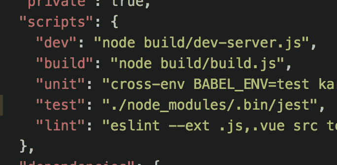

这样我们就可以跑了

> 纱线测试

开个玩笑；这正是我们接下来要做的:

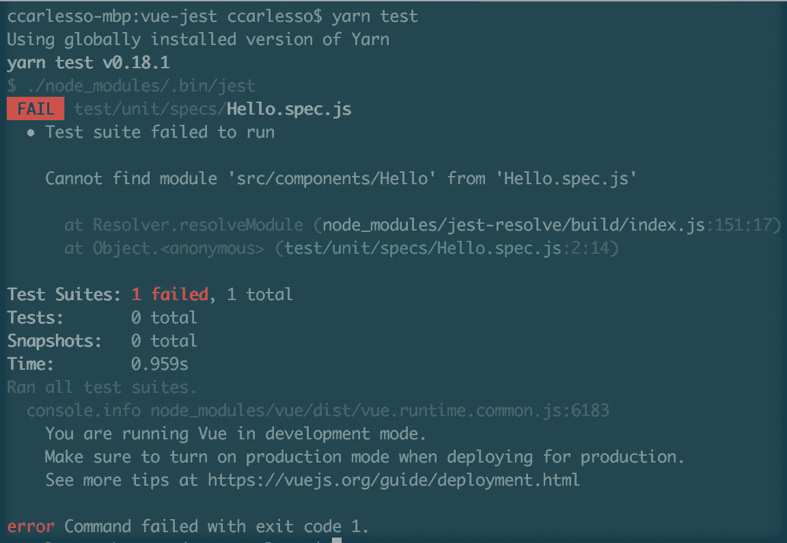

正如预期的 Jest 不能开箱即用，错误提示找不到模块，通过查看有问题的测试，我们可以看到

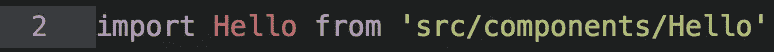

语句，但是指向的路径实际上不在 *specs* 文件夹下，因此找不到它。

Jest 提供了一个模块映射器选项，允许我们解决这个问题。

如果我们查看该项目的 webpack 配置，我们可以看到:

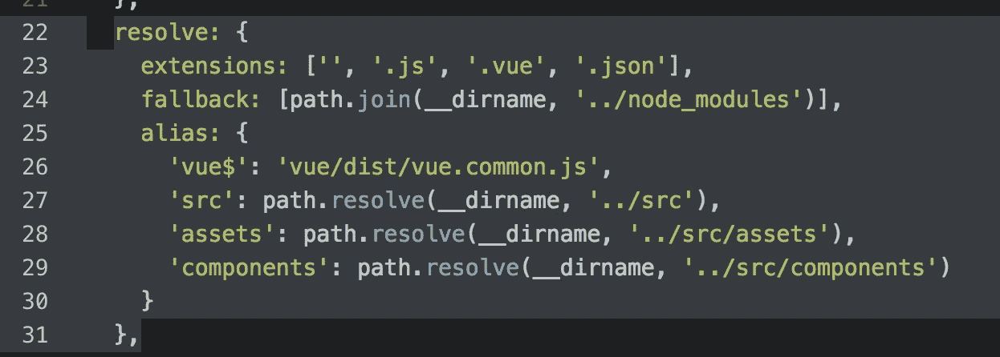

基于此，我们可以将一个 *jest/moduleNameMapper* 配置添加到 *package.json* 根:

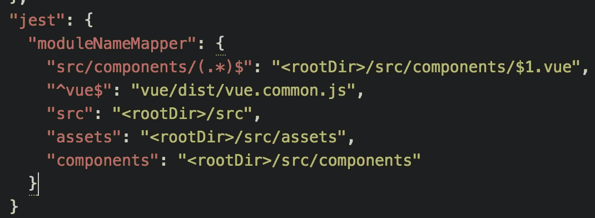

保存并重新运行 Jest 后，我们现在将看到一个新的错误:

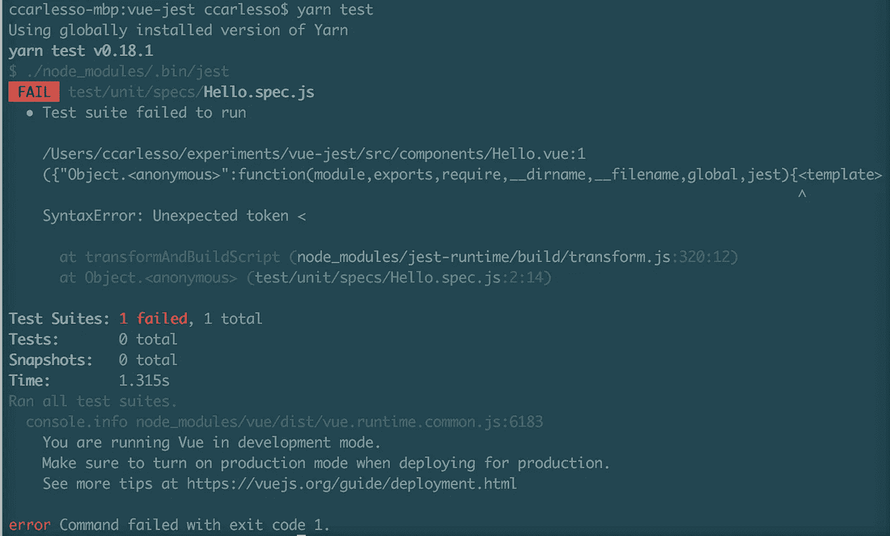

如果我们看一下 *src/components/Hello.vue* 文件，这里发生的事情就很清楚了:我们的 JS 试图需要一个 HTML 文件，这当然不是现成的。

我们需要做的是让 Jest 对文件进行预处理，返回一个对我们和 Vue 都有效的 JS 对象。

Jest 提供了一个转换选项，可以将多个正则表达式模式映射到不同的处理器，所以让我们为。 *vue* 文件:

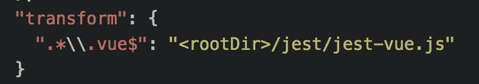

我们需要创建一个 *jest/jest-vue.js* 文件来处理转换:

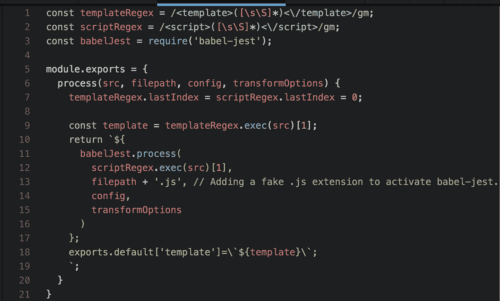

传递 Jest*—无缓存*选项(否则会缓存转换)现在会将我们带到下一个与上一个非常相似的错误:

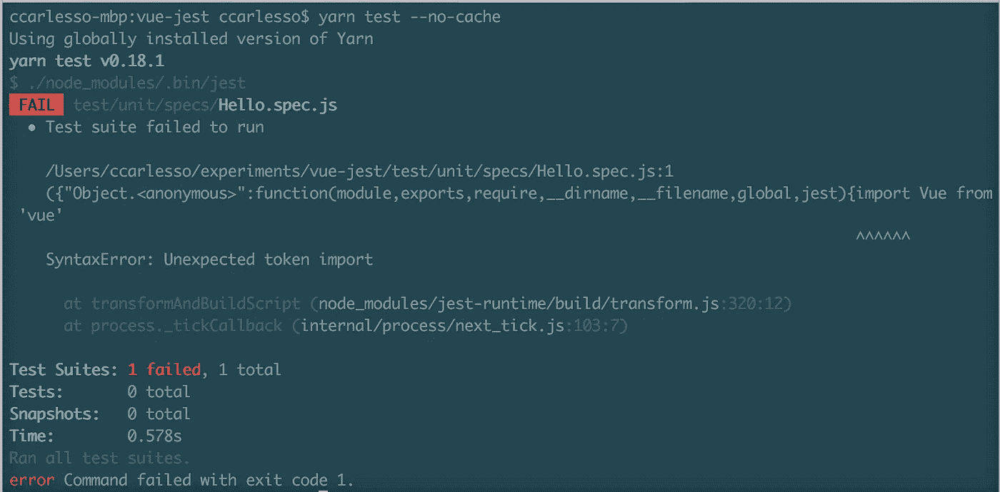

这是因为导入语句不能被 node 识别，我们需要做的就是添加第二个转换，使用 babel-jest 处理文件:

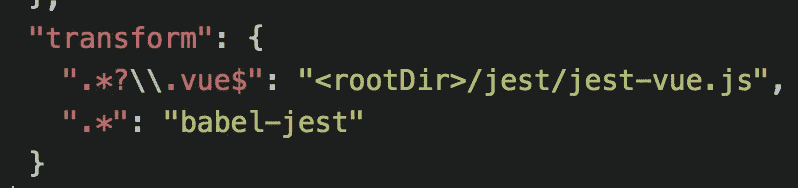

好的。再次运行的时间:

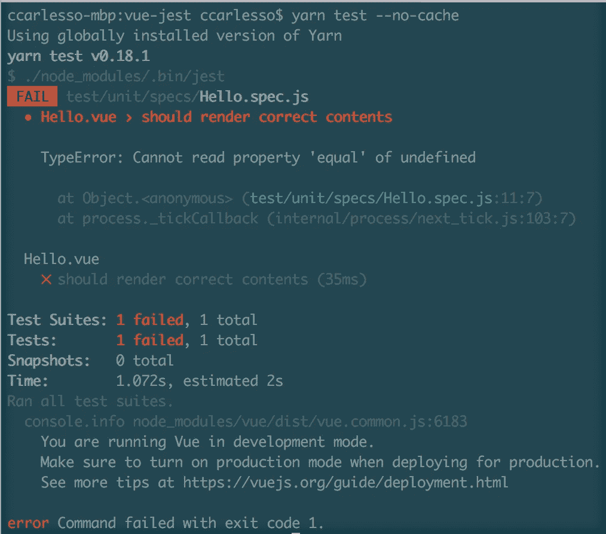

很好，这个错误是因为期望不是 Jest 格式的。
解决这个问题就像改变一样简单

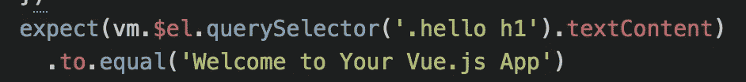

notice the **.to.equal** here…

到

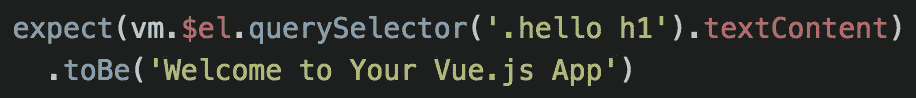

…and the **.toBe** here.

在这种情况下，这很容易，因为只有一个期望，但是如果你要迁移一个现有的测试套件，你可能想要查看[https://www.npmjs.com/package/jest-codemods](https://www.npmjs.com/package/jest-codemods)来批量处理你所有的文件。

让我们再跑一次:

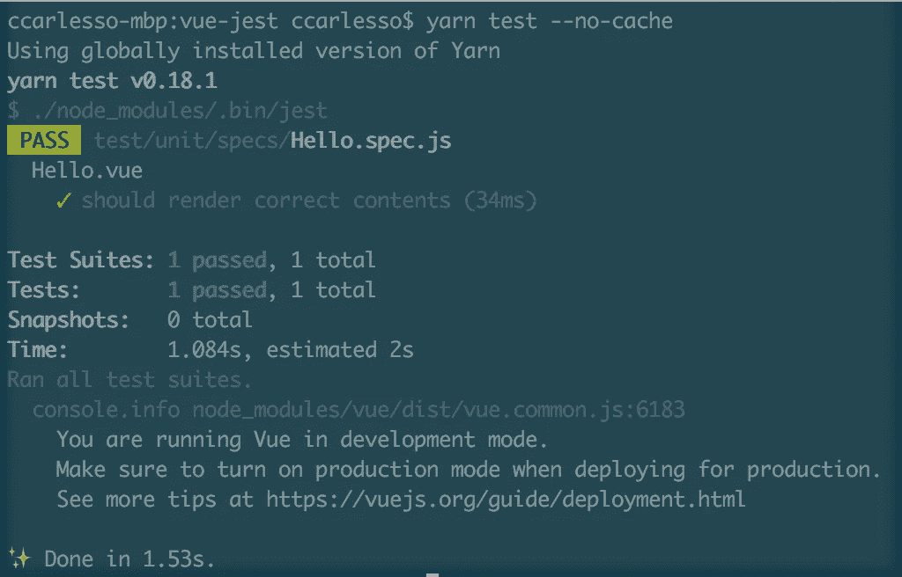

耶！我们已经配置好 Jest 并准备好了，现在让我们制作一个 Jest 快照，好吗？

为此，我将使用 *vue-server-renderer* ，让我们运行:

> 纱线添加-D vue-服务器-渲染器

并添加一个快照测试:

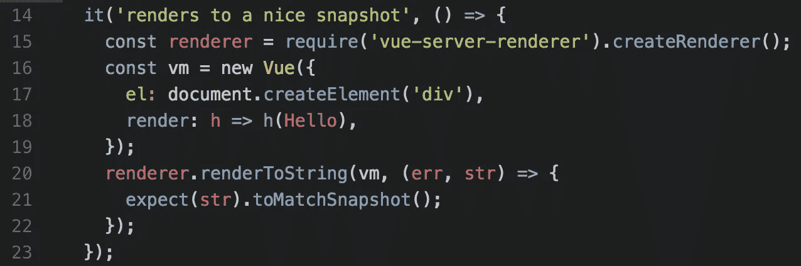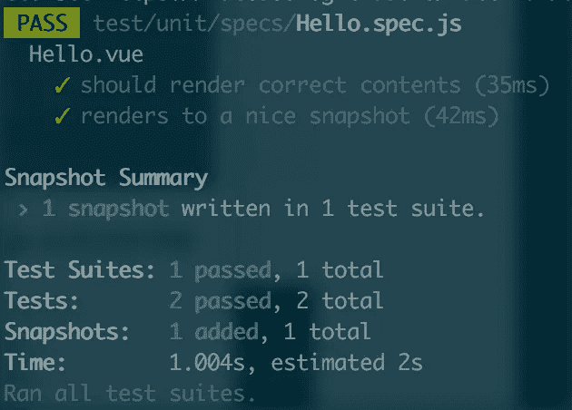

它可以工作，但是让我们来看看我们的快照:

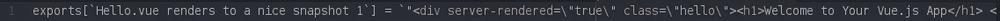

it works, but…

一切都在一条线上…我想我们可以做得更好，不是吗？

当实现快照时，我一直希望它是可扩展的，这就是为什么我们使用的漂亮打印机有一个插件系统。Jest 也非常方便地有一个*snapshot serializer*配置选项，我们将在这里使用，但在此之前，我们需要安装一个 html“prettifier”:

> 纱线添加-D js-美化

我们现在可以将快照序列化程序配置添加到 *package.json* 中的 *jest* 部分:

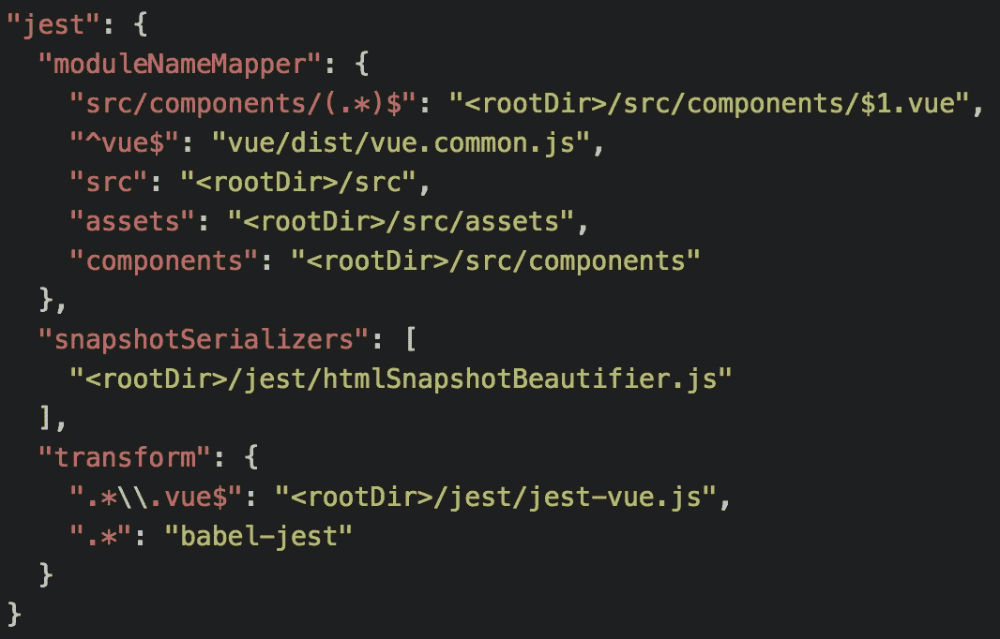

并创建这个*jest/html snapshot beautiier . js*:

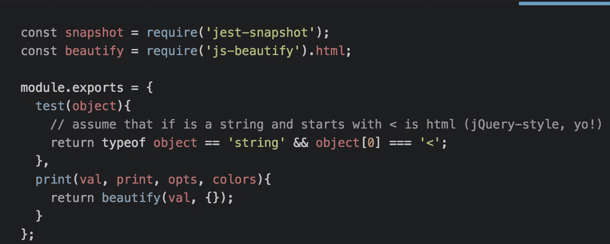

Jest 的快照序列化器必须是具有 ***测试*** 和 ***打印*** 功能的对象: ***测试*** 指示插件对于给定的节点是否激活，而 ***打印*** 返回修饰后的值。

现在，再次运行*纱线测试*后，我们得到:

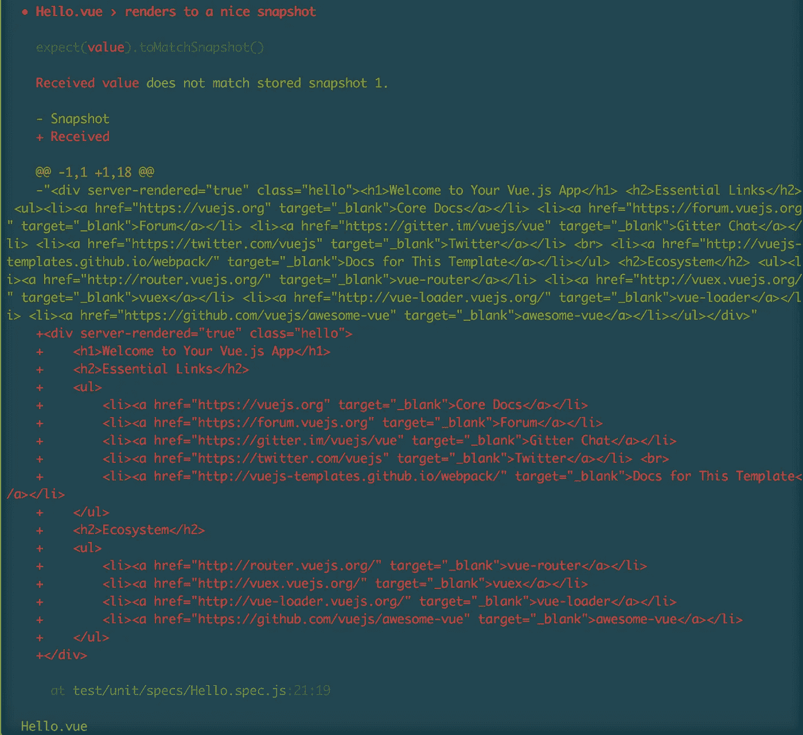

Jest 记得以前的快照，并告诉我们结果已经改变，看起来不错，所以让我们通过传递 ***-u*** 标志来保存这个新的快照，然后我们可以再次检查结果文件:

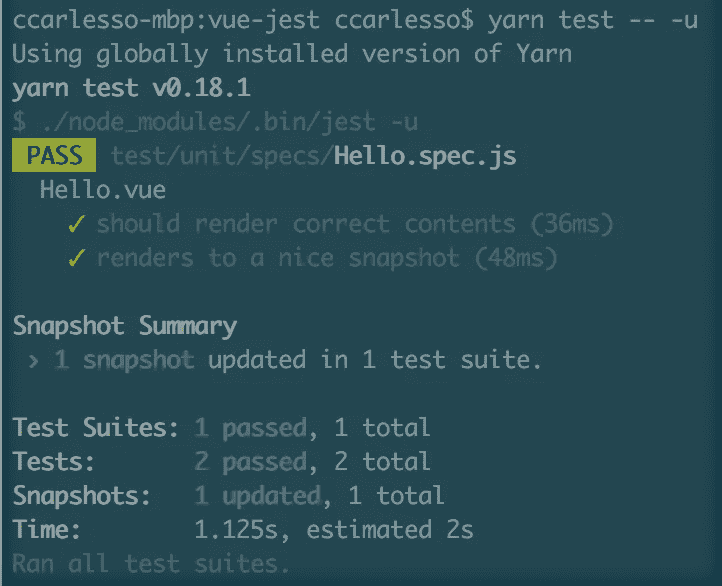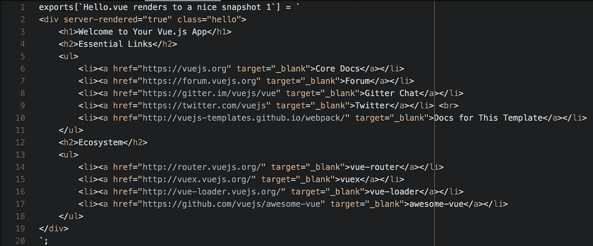

这样好多了！

本系列的第一篇文章到此结束，我希望人们会发现理解在 React 之外的库上使用 Jest 是多么容易，并且他们会受到启发开始在他们的项目中使用 Jest。

> [黑客中午](http://bit.ly/Hackernoon)是黑客如何开始他们的下午。我们是这个家庭的一员。我们现在[接受投稿](http://bit.ly/hackernoonsubmission)并乐意[讨论广告&赞助](mailto:partners@amipublications.com)机会。
> 
> 如果你喜欢这个故事，我们推荐你阅读我们的[最新科技故事](http://bit.ly/hackernoonlatestt)和[趋势科技故事](https://hackernoon.com/trending)。直到下一次，不要把世界的现实想当然！

