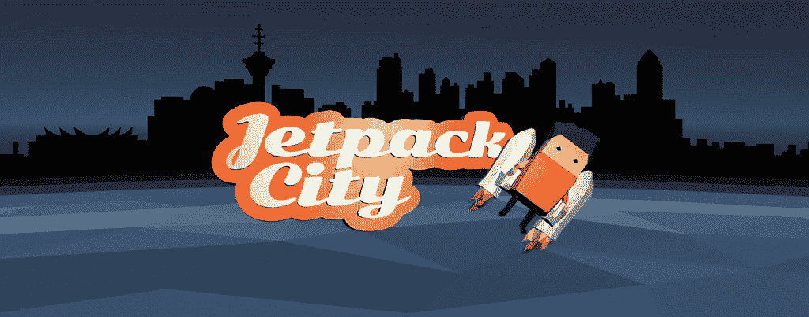

# Jetpack City:一个 VR 游戏 jam 项目

> 原文：<https://medium.com/hackernoon/jetpack-city-a-vr-game-jam-project-1a6f410e2e81>

**Jetpack City** (免费乘坐[谷歌 Play 商店](https://play.google.com/store/apps/details?id=com.OldFort.JetpackCity))已提交至[全球建筑节 Jam 2017](https://itch.io/jam/global-archiact-jam/rate/121225) ！我希望你喜欢阅读游戏的进展，就像我喜欢记录它一样。

你可以在下面按方便的时间顺序找到开发过程的所有文章。

 [## 一个月，一场比赛

### 构建游戏主题

medium.com](/@rhysp/my-first-game-jam-959dc60430db)  [## 超越主题

### 设计核心游戏循环

medium.com](/@rhysp/beyond-the-theme-98525e01711f)  [## 从原型到基础

### 精炼原型代码

medium.com](/@rhysp/from-prototype-to-foundation-602dd8e24007)  [## 创建基本 GUI

### 虚拟现实游戏的用户反馈

medium.com](/@rhysp/creating-a-basic-gui-7343bf340bef)  [## 游戏入门

### 运动员训练中的成功与失败

artplusmarketing.com](https://artplusmarketing.com/game-onboarding-5923d14c438)  [## 电平生成

### 分解一个级别的量词

artplusmarketing.com](https://artplusmarketing.com/level-generation-805787fd5c5a)  [## 提交日

### 需要上下文？Jetpack City 的动态构建在上一篇文章《关卡生成》中

medium.com](/@rhysp/submission-day-4e0b74935d3a) 

> [黑客中午](http://bit.ly/Hackernoon)是黑客如何开始他们的下午。我们是 [@AMI](http://bit.ly/atAMIatAMI) 家庭的一员。我们现在[接受投稿](http://bit.ly/hackernoonsubmission)并乐意[讨论广告&赞助](mailto:partners@amipublications.com)机会。
> 
> 如果你喜欢这个故事，我们推荐你阅读我们的[最新科技故事](http://bit.ly/hackernoonlatestt)和[趋势科技故事](https://hackernoon.com/trending)。直到下一次，不要把世界的现实想当然！

