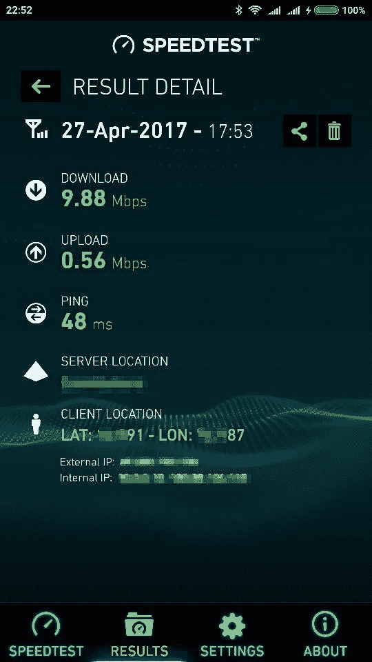
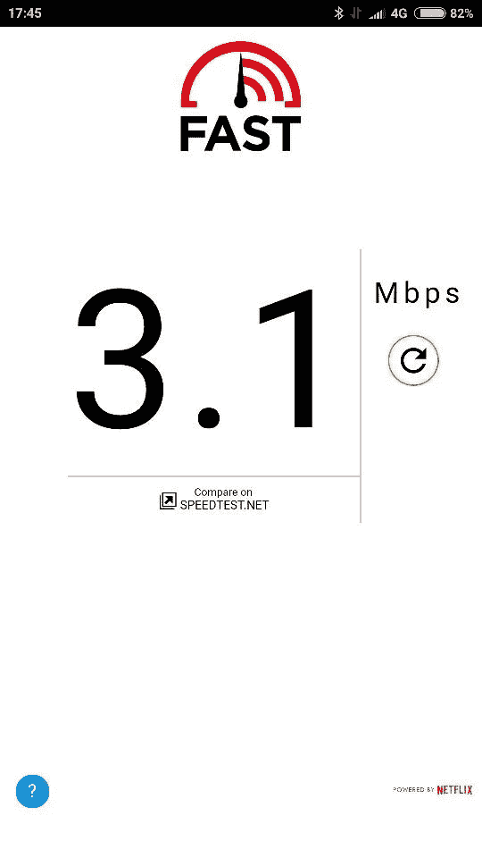
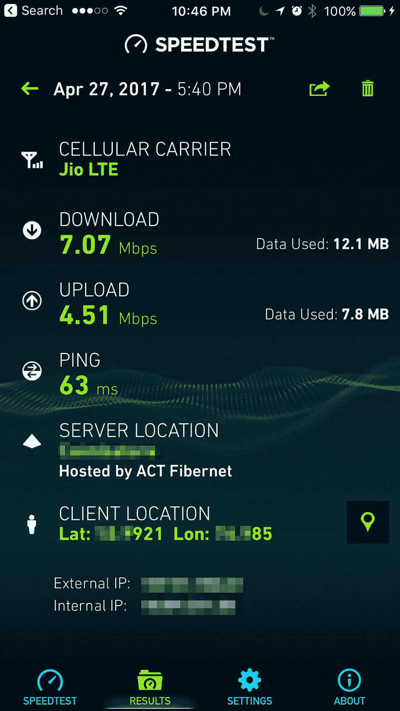
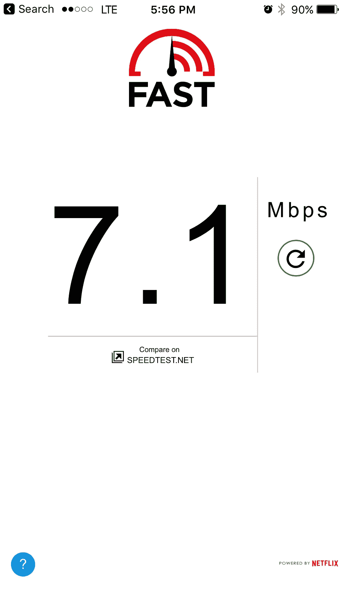
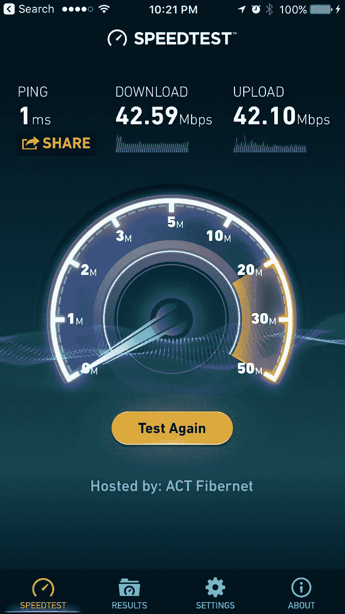
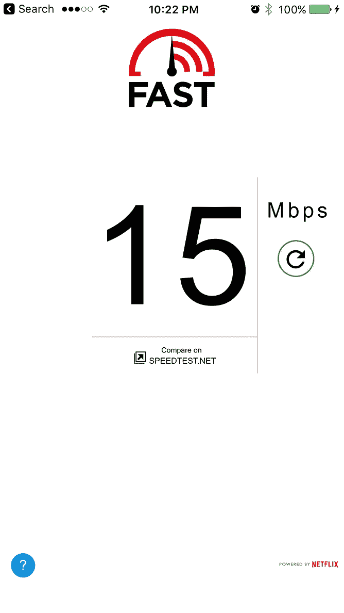
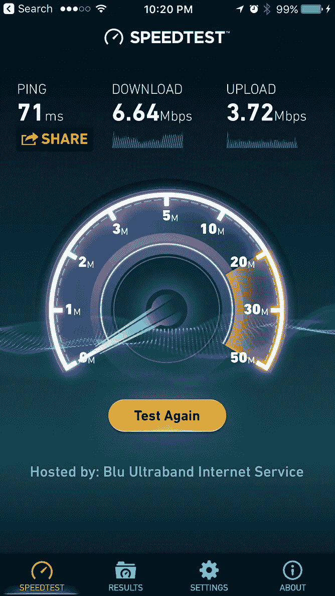

# Jio，Airtel 和一个可疑的速度测试

> 原文：<https://medium.com/hackernoon/jio-airtel-and-a-fishy-speed-test-764a8f137656>

‘Bakra bana rahe’ (Hindi for ‘Making a goat/fool out of you’)

前几天，我看到了来自 Airtel 的电视广告，声称它是“官方”印度最快的 4G 网络。在 Ookla 上测试了速度，Ookla 的 speedtest.net(网站和应用程序)在世界各地广泛使用。

这则广告显然是 Airtel 对其竞争对手 Jio 的挖苦。事实上，Jio 已经就这个广告对 Airtel 提出了误导性广告的投诉。

由于我使用 Jio 并有一个备用的 Airtel SIM 卡，我决定在 speedtest.net 亲自测试这两个网络。并在另一个速度测试场地 fast.com 比较结果。这是我的发现。

Airtel 在 speedtest 上的速度是 9.88Mbps，但在 fast.com 上只有 3.1Mbps。

Jio 在 speedtest.net 和 fast.com 的速度都是 7.1 兆比特/秒

好吧，这只是一个业余爱好者做的随机测试。但是 Airtel 在 speedtest.net 上 9.88Mbps 的更高速度提醒了一句老话——无风不起浪。

Airtel (Android Mi4i): 9.88Mbps on speedtest.net and 3.1Mbps on fast.com

Jio (iOS iPhone 6s+): 7.1 Mbps, on both speedtest.net and fast.com

## 扭曲的结果

这不是我第一次对 Ookla 有意见。事实上，我发现使用 speedtest.net 通常会引发问题，而不是答案。

以我在家里安装 ACT Fibernet 为例。我已经注册了他们的 40Mbps 宽带计划(₹1206/month).的上限是 75GB 安装该系统的工程师通过检查 Ookla 的 speedtest.net 为我验证了速度，显示速度为 42.59Mbps

我自己在手机上测试了它，这时我注意到 speedtest.net 正在“ACT Fibernet”托管的服务器上进行测试在我看来,“被告”和“法官”是同一个人。所以我悄悄地在 fast.com 上做了第二次测试，发现速度是 15Mbps。

看到这个结果，工程师有点为自己辩护，说他从来没有听说过 fast.com。所以我问他是否听说过网飞，他点了点头，我告诉他 fast.com 属于网飞。

在这一点上，他给了我所有的技术，并告诉我速度根据我的房子到速度测试服务器的距离而变化，fast.com 一定很远。他还表示，文件的下载速度将远低于流媒体速度，而国际标准是对流媒体速度进行评级。他谈到了字节和比特，kpb 和千比特，所有这些我都不懂。

我所理解的是 speedtest.net 的速度测试依赖于服务器。所以我试着换了一个同样距离的附近的服务器(离我家 3 公里)。这一次，速度甚至下降到 6.64Mbps。工程师给了我一些新的借口。

但是 speedtest.net 刚刚失去了一个粉丝。

The wide variance in my ISP’s speed when checked on different servers on speedtest.com and fast.com

## 官员质疑“官方”

回到 Airtel 声称的最快网络，还有另一个转折。

TRAI(印度电信管理局)表示，他们自己的数据显示，Jio 的速度是 Airtel 的两倍。事实上，整个“印度官方最快的 4G 网络”听起来很可疑，因为 Ookla 不被 TRAI 承认。

印度广告标准委员会(ASCI)也发现 Ookla 广告具有误导性，并要求 Airtel 在 4 月 11 日之前修改或撤回该广告。Airtel 对此提出了抗议，ASCI 表示将举行听证会。这就是目前的情况。

## 金钱万能

这有什么大不了的？这只是营销战，在爱情和战争中一切都是公平的，对吗？

嗯，还有一点，这是我关心的一点。在我做这些测试的时候，Airtel 悄悄的扒了我的口袋。

我用的 Airtel SIM 卡是预付费的，上面有₹300 的通话时间。在 Airtel 给我发消息说我的余额下降到₹200.之前，速度测试悄悄地用完了大约 20Mb(Airtel 对不使用数据包的数据收取非常高的费用，你的通话时间余额可能在几分钟内消失)。我很快加载了一个 120 兆的₹28\. 3g 数据包这 120MB 也很快被剩余的速度测试所消耗。

在五分钟内，Airtel 从我这里抢走了₹128。

Jio 呢？我有一个₹303 包，每天给我 1GB，在接下来的 3 个月里每天如此。如果我超过 1GB 的限制，我的速度会减慢，但我仍然不会被收取任何费用。所有这些速度测试都没有额外花费我一分钱。

仅仅因为大多数网络做了 Airtel 所做的，并不意味着它是正确的。此外，Airtel 还狡猾地利用受到道德挑战的 speedtest.net 来欺骗客户，让他们相信 Airtel 拥有最快的网络。

营销老话说，客户不是傻子；她是你的妻子。话虽如此，我并不在乎 Airtel 是否比 Jio 快一点，反之亦然。

但我在乎的是，当我使用 Airtel 时，我不能放松警惕。因为如果我不看着他们，他们可能会打我的内衣。

Jio 没有这样的问题。

我悄悄地把 Airtel SIM 卡从手机里取出来。

故事结束。

> [黑客中午](http://bit.ly/Hackernoon)是黑客如何开始他们的下午。我们是 [@AMI](http://bit.ly/atAMIatAMI) 家庭的一员。我们现在[接受投稿](http://bit.ly/hackernoonsubmission)，并乐意[讨论广告&赞助](mailto:partners@amipublications.com)机会。
> 
> 如果你喜欢这个故事，我们推荐你阅读我们的[最新科技故事](http://bit.ly/hackernoonlatestt)和[趋势科技故事](https://hackernoon.com/trending)。直到下一次，不要把世界的现实想当然！

