# Kubernetes 中的作业并发性:LXD 和 CPU 牵制拯救

> 原文：<https://medium.com/hackernoon/job-concurrency-in-kubernetes-lxd-and-cpu-pinning-to-the-rescue-b9fb7b44f99d>

前几天有人跟我分享了一个在 Kubernetes 中运行视频转码作业的项目。

在她的测试中，Kubernetes 默认安装在具有 40 个内核和 512GB RAM 的裸机服务器上，她为每个转码 pod 分配了 5 个完整的 CPU 内核，然后扩展到每个节点 6 个并发任务，因此机器的负载为 75%(理论上)。人们的期望是，这些作业将以与单个任务相同的速度运行。

他们的结果令人失望:当并发性上升时，单个任务的性能却下降了。在最大并发时，他们实际上观察到单个任务性能下降了 50%。

我做了一些研究来理解这种行为。它在几期 Kubernetes 中被提及，如 [#10570](https://github.com/kubernetes/kubernetes/issues/10570) 、 [#171](https://github.com/kubernetes/community/pull/171) ，一般通过[谷歌搜索](https://www.google.com/search?q=cpuset%20kubernetes&*&rct=j)。[文档](https://kubernetes.io/docs/concepts/configuration/manage-compute-resources-container/)本身揭示了默认调度程序如何工作，以及为什么性能会受到密集型任务并发性的影响。

为容器分配 CPU 时间有不同的方法:

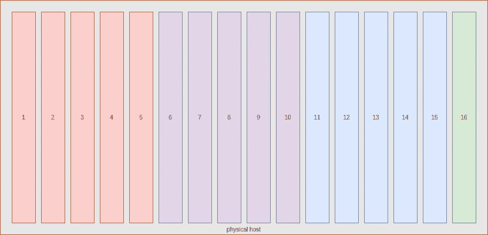

CPU Pining: each container gets a set of cores

**CPU Pining** :如果主机有足够的 CPU 核心可用，则分配 5 个“物理核心”专用于该 pod/container；


**时间切片**:考虑主机有 N 个内核，共同代表分配给容器的计算时间量。5%的 CPU 时间意味着每 100 毫秒就有 5 毫秒的计算时间用于该任务。

显然，对某些特定的工作负载来说，pining CPUs 可能很有意思，但是有一个很大的规模问题，原因很简单，您不能运行比您的集群中的核心更多的 pod。
因此， [Docker](https://hackernoon.com/tagged/docker) 默认为第二个，这也确保了分配给容器的 CPU 少于 1 个。
这会对性能产生影响，这在 HPC 或任何 CPU 密集型任务中也会发生。

我们能降低这种风险吗？也许吧。Docker 在引擎级别提供了 cpuset 选项。然而，它并没有被 Kubernetes 利用。然而， [LXD 容器](https://www.ubuntu.com/containers/lxd)能够通过 cpusets 以自动化的方式被 pined 到物理核心，正如[@ str graber](https://twitter.com/stgraber)在这篇[博客](https://stgraber.org/2016/03/26/lxd-2-0-resource-control-412/)中所解释的。

这为安排我们的工作负载提供了两个新选项:

*   将我们的主机分成几个 LXD Kubernetes 工人，看看为工人钉 CPU 是否能有所帮助；
*   在本地 Kubernetes 资源原语中包含一个“突发”选项，看看这是否有助于最大化我们集群中的计算吞吐量。

让我们看看这些是如何比较的！

## TL；速度三角形定位法(dead reckoning)

你们没有时间阅读整本书，所以简单来说:

*   如果分配给 pods 的 CPU 总是少于 1 个，那么并发性不会影响 CPU 限制的性能；
*   如果你预先知道你的最大并发性，并且它不是很高，那么通过 LXD 和 CPU 锁定来增加更多的工作线程总是比通过 Docker 的本地调度获得更好的性能；
*   获胜的策略总是最大限度地超级配置 CPU 限制，以便将每一点性能都立即分配到您的 pod

**注意:**这些结果在 AWS 中，在金属和单元之间有一个管理程序。我正在等待具有足够内核的硬件来完成任务。如果你有硬件可以用，请便，我会帮你做测试。

## 这个计划

在这篇博文中，我们将做以下事情:

1.  在严格分配 CPU 的 LXD 容器中设置各种 Kubernetes 集群:纯裸机、纯云。
2.  设计一个极简的舵图，轻松创建并行
3.  运行基准测试以扩展并发性(最多 32 个线程/节点)
4.  从这些运行中提取并处理日志，以了解并发性如何影响每个内核的性能

## 要求

对于这篇博文，我们假设

*   你对库伯内特很熟悉
*   你有赫尔姆制图或 Go 模板的概念，以及使用赫尔姆部署东西的概念
*   对 Kubernetes (CDK) 的[规范分布有初步了解者优先，但不是必需的。](https://www.ubuntu.com/containers/kubernetes)
*   下载这篇文章的代码

```
git clone [https://github.com/madeden/blogposts](https://github.com/madeden/blogposts)
cd blogposts/k8s-transcode
```

## 方法学

我们的基准是一个代码转换任务。它使用 ffmpeg 工作负载，旨在通过尽可能快地耗尽分配给计算的所有资源来最小化编码时间。我们使用单个视频进行编码，以便可以比较所有转码任务。为了最大限度地减少纯计算以外的瓶颈，我们使用相对低带宽的视频，存储在每台主机上。

转码作业运行多次，有以下变化:

*   从 0.1 到 7 个 CPU 核心的 CPU 分配
*   内存从 0.5 到 8GB RAM
*   每台主机 1 到 32 个并发线程的并发性
*   (并发* CPU 分配)永远不会超过单个主机的内核数量

我们测量每个 pod 编码需要多长时间，然后查看编码和我们的变量之间的相关性。

# 绘制一个简单的代码转换器

## 使用 ffmpeg 和 Docker 进行转码

当我想用视频做点什么的时候，我做的第一件事就是给我的朋友罗南打电话([@罗南 _ 德拉克洛瓦](http://twitter.com/ronan_delacroix))。他对转码的一切了如指掌！

所以我问了他一些很直接的问题:*我想要你能想到的 CPU 最密集的 ffmpeg 代码转换一个 liner】。*

他不仅带回了一艘班轮，还为它找到了一个非常整洁的码头工人形象，这是朱利安的功劳。

总之，您将获得:

```
docker run --rm -v $PWD:/tmp jrottenberg/ffmpeg:ubuntu \
 -i /tmp/source.mp4 \
 -stats -c:v libx264 \
 -s 1920x1080 \
 -crf 22 \
 -profile:v main \
 -pix_fmt yuv420p \
 -threads 0 \
 -f mp4 -ac 2 \
 -c:a aac -b:a 128k \
 -strict -2 \
 /tmp/output.mp4
```

这个设置的关键是 *-threads 0* ，它告诉 ffmpeg 这是一个自助餐。

对于测试视频，[高清预告片](http://www.hd-trailers.net/)或[辛特尔预告片](https://download.blender.org/durian/trailer/)是很好的来源。我用的是 1080p 的 mp4 预告片。

## 舵图

代码转换直接映射到 Kubernetes 中的*作业*的概念。作业是批处理过程，可以很容易地进行编排和配置，以便 Kubernetes 在作业完成时不会重新启动它们。

与部署副本相当的是*作业并行度*。

为了增加并发性，我想我首先试验了它。事实证明，这是一种糟糕的方法，使得分析输出日志变得更加复杂。所以我构建了一个图表，创建了许多(编号的)作业，每个作业运行一个 pod，这样我就可以轻松地跟踪它们和它们的日志。

```
{{- $type := .Values.type -}}
{{- $parallelism := .Values.parallelism -}}
{{- $cpu := .Values.resources.requests.cpu -}}
{{- $memory := .Values.resources.requests.memory -}}
{{- $requests := .Values.resources.requests -}}
{{- $multiSrc := .Values.multiSource -}}
{{- $src := .Values.defaultSource -}}
{{- $burst := .Values.burst -}}
---
{{- range $job, $nb := until (int .Values.parallelism) }}
apiVersion: batch/v1
kind: Job
metadata:
  name: {{ $type | lower }}-{{ $parallelism }}-{{ $cpu | lower }}-{{ $memory | lower }}-{{ $job }}
spec:
  parallelism: 1
  template:
    metadata:
      labels:
        role: transcoder
    spec:
      containers:
      - name: transcoder-{{ $job }}
        image: jrottenberg/ffmpeg:ubuntu
        args: [
          "-y",
          "-i", "/data/{{ if $multiSrc }}source{{ add 1 (mod 23 (add 1 (mod $parallelism (add $job 1)))) }}.mp4{{ else }}{{ $src }}{{ end }}",
          "-stats",
          "-c:v",
          "libx264",
          "-s", "1920x1080",
          "-crf", "22",
          "-profile:v", "main",
          "-pix_fmt", "yuv420p",
          "-threads", "0",
          "-f", "mp4",
          "-ac", "2",
          "-c:a", "aac",
          "-b:a", "128k",
          "-strict", "-2",
          "/data/output-{{ $job }}.mp4"
        ]
        volumeMounts:
          - mountPath: /data
            name: hostpath
        resources:
          requests: 
{{ toYaml $requests | indent 12 }}
          limits:
            cpu: {{ if $burst }}{{ max (mul 2 (atoi $cpu)) 8 | quote }}{{ else }}{{ $cpu }}{{ end }}
            memory: {{ $memory }}
      restartPolicy: Never
      volumes:
        - name: hostpath
          hostPath:
            path: /mnt
---
{{- end }}
```

与之配套的 values.yaml 文件非常非常简单:

```
# Number of // tasks
parallelism: 8
# Separator name
type: bm
# Do we want several input files
# if yes, the chart will use source${i}.mp4 with up to 24 sources
multiSource: false
# If not multi source, name of the default file
defaultSource: sintel_trailer-1080p.mp4
# Do we want to burst. If yes, resource limit will double request. 
burst: false
resources:
  requests:
    cpu: "4"
    memory: 8Gi
```

这就是你所需要的。

当然，所有的资源都在回购中供你使用，你不必复制粘贴这个。

## 创建测试文件

现在我们需要生成大量的 values.yaml 文件来覆盖许多用例。可达到的值将根据您的上下文而变化。我的家庭集群有 6 个工作线程，每个线程有 4 个内核和 32GB RAM，所以我使用了

*   1、6、12、18、24、48、96 和 192 个兼职(最多 32 个/工人)
*   CPU 的情况正好相反(如果并行度=192，则从 3 到 0.1)
*   1 至 16GB 内存

在云中，我有 16 个使用 60GB RAM 的核心工作人员，所以我只对每个任务的 1 到 7 个 CPU 核心进行了测试。

我在这里没有做任何聪明的事情，只是一些 bash 循环来生成我的所有任务。如果需要的话，他们会参与回购。

# 部署 Kubernetes

## MAAS / AWS

在 MAAS 上部署的方法与我在之前关于 [DIY GPU 集群](https://hackernoon.com/installing-a-diy-bare-metal-gpu-cluster-for-kubernetes-364200254187#.si47g6h7e)的博客中描述的方法相同

一旦安装了 MAAS 并配置 Juju 与之对话，就可以修改并使用 src/juju/中的包文件

```
juju deploy src/juju/k8s-maas.yaml
```

对于 AWS，使用 *k8s-aws.yaml* 包，它指定 c4.4xlarge 作为默认实例。

完成后，下载 kubectl 的配置，然后用

```
juju show-status kubernetes-worker-cpu --format json | \
    jq --raw-output '.applications."kubernetes-worker-cpu".units | keys[]' | \
    xargs -I UNIT juju ssh UNIT "sudo wget [https://download.blender.org/durian/trailer/sintel_trailer-1080p.mp4](https://download.blender.org/durian/trailer/sintel_trailer-1080p.mp4) -O /mnt/sintel_trailer-1080p.mp4" 
donejuju scp kubernetes-master/0:config ~/.kube/config
helm init
```

## LXD 的变化

AWS 上的 LXD 有点特别，因为网络。它打破了 Kubernetes 经常使用的一些原语，比如 pod 的代理，它必须经过 2 层而不是 1 层网络。

因此，

*   kubectl 代理不工作 ootb
*   更重要的是，头盔无法工作，因为默认情况下它会消耗一个舵柄舱的代理

然而，代码转换不需要网络访问，只需要在文件系统上做一些工作，所以这不是问题。

我发现解决这个问题的最经济的方法是部署一个不在 LXD 的特定节点，而是一个“普通”的虚拟机或节点。这个节点将被标记为一个控制平面节点，我们修改 tiller-deploy 和 kubernetes-dashboard 的部署，将它们强制部署在这个节点上。使该节点足够小将确保不会在其上安排任何代码转换。

我找不到完全自动化的方法，所以下面是要运行的一系列操作:

```
juju deploy src/juju/k8s-lxd-<nb cores per lxd>c-<max concurrency>.yaml
```

这将部署整个系统，您需要等到它完成后再进行下一步。密切监视 *juju 状态*直到你看到部署 OK，但是法兰绒没有开始。

调整每个 LXD 节点的 LXD 配置文件必须允许嵌套容器。在不久的将来(2.3 的路线图)，Juju 将获得声明它希望用于 LXD 主机的配置文件的能力。但是现在，我们需要手动构建:

```
NB_CORES_PER_LXD=4 #This is the same number used above to deploy
for MACHINE in 1 2 
do
 ./src/bin/setup-worker.sh ${MACHINE} ${NB_CORES_PER_LXD}
done
```

如果你正在看 *juju 状态*你会看到法兰绒突然开始工作。一切都好！现在下载 kubectl 的配置，然后用

```
juju scp kubernetes-master/0:config ~/.kube/config
helm init
```

我们需要识别不是 LXD 容器的 Worker，然后将其标记为我们的控制平面节点:

```
kubectl label $(kubectl get nodes -o name | grep -v lxd) controlPlane=true
kubectl label $(kubectl get nodes -o name | grep lxd) computePlane=true
```

现在我们需要依次编辑*RC/monitoring-influx db-grafana-v4*、 *deploy/heapster-v1.2.0.1、deploy/tiller-deploy* 和*deploy/kubernetes-dashboard*，以添加

```
nodeSelector:
 controlPlane: “true”
```

在清单的定义中。使用

```
kubectl edit -n kube-system rc/monitoring-influxdb-grafana-v4
```

之后，集群就可以运行了！

# 运行转码作业

## 开始作业

我们有许多测试要运行，并且我们不希望花费太长的时间来管理它们，所以我们围绕它们构建了一个简单的自动化

```
cd src 
TYPE=aws
CPU_LIST="1 2 3"
MEM_LIST="1 2 3"
PARA_LIST="1 4 8 12 24 48"for cpu in ${CPU_LIST}; do 
  for memory in ${CPU_LIST}; do 
    for para in ${PARA_LIST}; do 
    [ -f values/values-${para}-${TYPE}-${cpu}-${memory}.yaml ] && \
      { helm install transcoder --values values/values-${para}-${TYPE}-${cpu}-${memory}.yaml
        sleep 60
        while [ "$(kubectl get pods -l role=transcoder | wc -l)" -ne "0" ]; do
          sleep 15
        done
      }
    done
  done
done
```

这将尽可能快地运行测试。调整变量以适应您的本地环境

## 第一种调度方法

不需要任何调优或配置，Kubernetes 就可以很好地将负载分散到主机上。本质上，所有的作业都是平等的，它像一个循环一样在所有的节点上分配它们。下面是我们观察到的并发数为 12 的情况。

```
NAME READY STATUS RESTARTS AGE IP NODE
bm-12–1–2gi-0–9j3sh 1/1 Running 0 9m 10.1.70.162 node06
bm-12–1–2gi-1–39fh4 1/1 Running 0 9m 10.1.65.210 node07
bm-12–1–2gi-11–261f0 1/1 Running 0 9m 10.1.22.165 node01
bm-12–1–2gi-2–1gb08 1/1 Running 0 9m 10.1.40.159 node05
bm-12–1–2gi-3-ltjx6 1/1 Running 0 9m 10.1.101.147 node04
bm-12–1–2gi-5–6xcp3 1/1 Running 0 9m 10.1.22.164 node01
bm-12–1–2gi-6–3sm8f 1/1 Running 0 9m 10.1.65.211 node07
bm-12–1–2gi-7–4mpxl 1/1 Running 0 9m 10.1.40.158 node05
bm-12–1–2gi-8–29mgd 1/1 Running 0 9m 10.1.101.146 node04
bm-12–1–2gi-9-mwzhq 1/1 Running 0 9m 10.1.70.163 node06
```

对于较大的并发性也实现了相同的分布，在 192 时，我们观察到每种情况下每台主机有 32 个作业。我的测试的一些截图

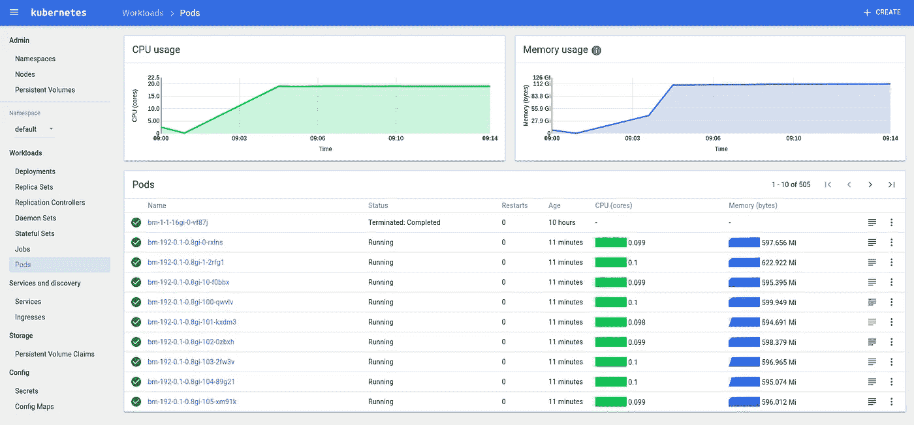

KubeUI showing 192 concurrent pods

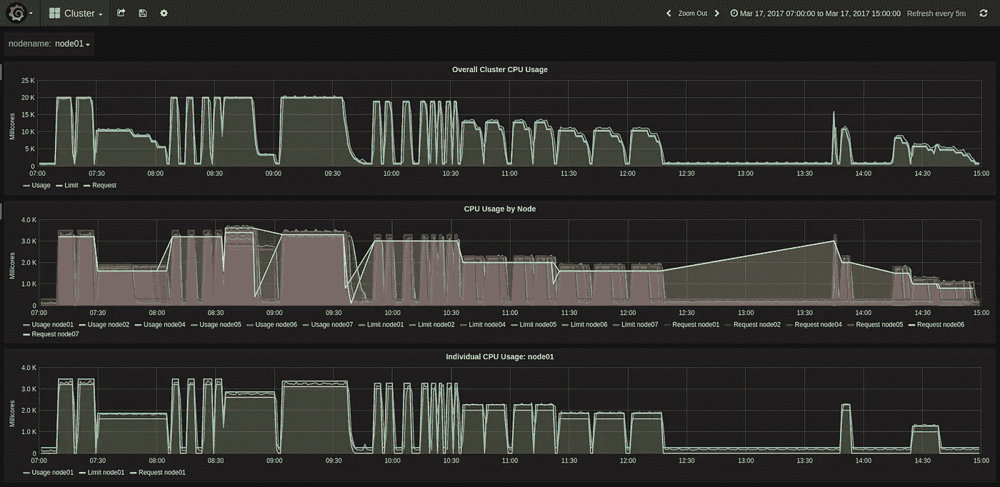

Compute Cycles at different concurrencies

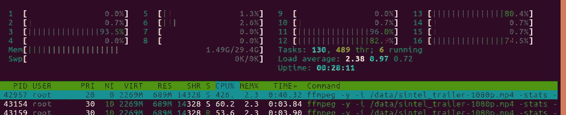

LXD pining Kubernetes Workers to CPUs

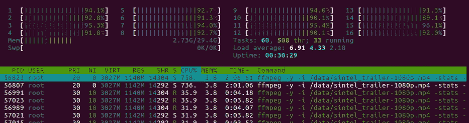

Aoutch! About 100% on the whole machine

# 收集和汇总结果

## 原始日志

这就是事情变得有点棘手的地方。我们可以使用 ELK 堆栈，并在那里提取日志，但是我找不到一种方法来真正轻松地测量我们的 KPI。

看看 Docker 在日志记录方面做了什么，您需要在每台机器上查看*/var/lib/Docker/containers/<uuid>/<uuid>-JSON . log*

在这里，我们可以看到每个作业正好生成 82 行日志，但其中只有一部分是有趣的:

*   **第一行**:给出日志的开始时间

```
{“log”:”ffmpeg version 3.1.2 Copyright © 2000–2016 the FFmpeg developers\n”,”stream”:”stderr”,”time”:”2017–03–17T10:24:35.927368842Z”}
```

*   **第 13 行**:来源名称

```
{“log”:”Input #0, mov,mp4,m4a,3gp,3g2,mj2, from ‘/data/sintel_trailer-1080p.mp4’:\n”,”stream”:”stderr”,”time”:”2017–03–17T10:24:35.932373152Z”}
```

*   **最后一行**:转码时间戳结束

```
{“log”:”[aac @ 0x3a99c60] Qavg: 658.896\n”,”stream”:”stderr”,”time”:”2017–03–17T10:39:13.956095233Z”}
```

对于高级性能极客，line 64 还为我们提供了每帧的代码转换速度，这有助于分析视频的复杂性。目前，我们并不真的需要它。

## 映射到职务

原始日志只是一个 Docker uuid，对理解它与什么作业相关没有太大帮助。Kubernetes 在 */var/log/containers/* 中优雅地创建链接，将 pod 名称映射到 docker uuid。

```
bm-1–0.8–1gi-0-t8fs5_default_transcoder-0-a39fb10555134677defc6898addefe3e4b6b720e432b7d4de24ff8d1089aac3a.log
```

所以我们是这样做的:

1.  收集每台主机上的日志列表:

```
for i in $(seq 0 1 ${MAX_NODE_ID}); do 
  [ -d stats/node0${i} ] || mkdir -p node0${i}
  juju ssh kubernetes-worker-cpu/${i} "ls /var/log/containers | grep -v POD | grep -v 'kube-system'" > stats/node0${i}/links.txt
  juju ssh kubernetes-worker-cpu/${i} "sudo tar cfz logs.tgz /var/lib/docker/containers"
  juju scp kubernetes-worker-cpu/${i}:logs.tgz stats/node0${i}/
  cd node0${i}/
  tar xfz logs.tgz --strip-components=5 -C ./
  rm -rf config.v2.json host* resolv.conf* logs.tgz var shm
  cd ..
done
```

2.提取导入日志行(适应每个环境的 nb 节点……)

```
ENVIRONMENT=lxd
MAX_NODE_ID=1
echo "Host,Type,Concurrency,CPU,Memory,JobID,PodID,JobPodID,DockerID,TimeIn,TimeOut,Source" | tee ../db-${ENVIRONMENT}.csv
for node in $(seq 0 1 ${MAX_NODE_ID})
do
  cd node0${node}
  while read line; do
    echo "processing ${line}"NODE="node0${node}"
    CSV_LINE="$(echo ${line} | head -c-5 | tr '-' ',')" # node it's -c-6 for logs from bare metal or aws, -c-5 for lxd
    UUID="$(echo ${CSV_LINE} | cut -f8 -d',')"
    JSON="$(sed -ne '1p' -ne '13p' -ne '82p' ${UUID}-json.log)"
    TIME_IN="$(echo $JSON | jq --raw-output '.time' | head -n1 | xargs -I {} date --date='{}' +%s)"
    TIME_OUT="$(echo $JSON | jq --raw-output '.time' | tail -n1 | xargs -I {} date --date='{}' +%s)"
    SOURCE=$(echo $JSON | grep from | cut -f2 -d"'")echo "${NODE},${CSV_LINE},${TIME_IN},${TIME_OUT},${SOURCE}" | tee -a ../../db-${ENVIRONMENT}.csvdone < links.txt
  cd ..
done
```

一旦我们有了所有的结果，我们加载到[谷歌电子表格](https://docs.google.com/spreadsheets/d/1KcC5nKnbTKaFcsg8_K_p_zodq3r-haRur1-_uJqJ4iI/edit?usp=sharing)并查看结果…

# 结果分析

## 记忆的影响

一旦分配超过 ffmpeg 对视频进行转码所需的量，内存在第一近似值上就是一个无影响的变量。但是，在第二个级别，我们可以看到在分配的 1gb 和 4GB 之间，性能略有提高，幅度在 0.5%到 1%之间。

然而，这一因素没有被考虑在内。

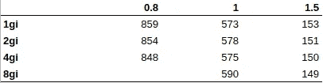

RAM does not impact performance (or only marginally)

## CPU 分配和固定的影响

无论采用何种部署方法(AWS 或裸机),当分配少于或多于 1 个“等效”CPU 时，行为都会发生变化。

1.  在线上或线下

在 1 以下运行 CPU 分配可以提供最好的一致性。该图显示，变化是包含在内的，我们看到的是性能的平均变化不到 4%。

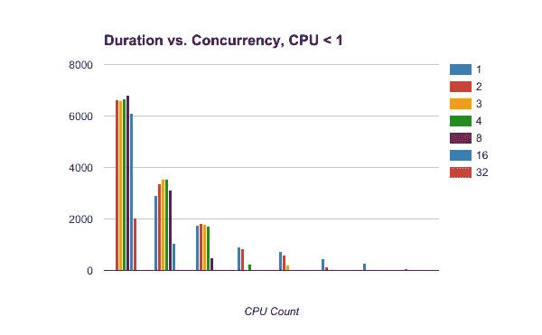

Running jobs with CPU request <1 is optimal for concurrency

有趣的是，热图显示，当(并发* CPU 计数)~ 1 时，性能最差。我不知道如何解释那种行为。想法？


2.在线上

一旦分配的内存超过一个 CPU，并发性就会直接影响性能。不管分配如何，都会有影响，并发性 3.5 会导致大约 10%到 15%的损失。使用更多的工作线程和更少的内核将会增加影响，在高并发情况下可达 40~50%

如图所示，并非所有的并发性都是相同的。下图显示了各种设置的并发持续时间函数。

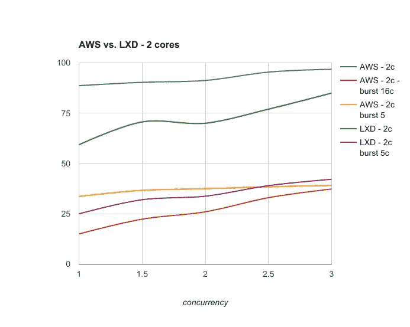

AWS with or without LXD, 2 cores / job

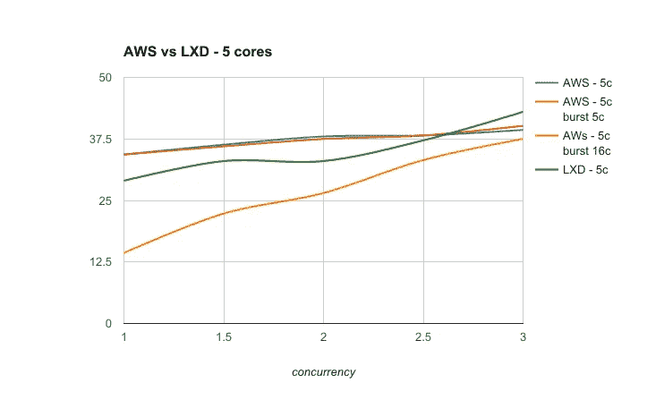

and 5 cores / job

当并发性较低且性能状况良好时，借助 LXD CPU 锁定对主机进行切片始终是一种有效的策略。

默认情况下，在这种情况下，LXD CPU-pinning 将系统地优于 Docker 和 Kubernetes 的本地调度。

似乎每台主机 2.5 的并发性是 Kubernetes 分配比通过 LXD 强制传播更有效的地方。

然而，解除作业的 CPU 限制将允许 Kubernetes 在任何时间点使用它所能使用的任何东西，从而带来整体更好的性能。

当使用最后一种策略时，无论作业需要多少个内核，性能都是一样的。下图总结了所有结果:

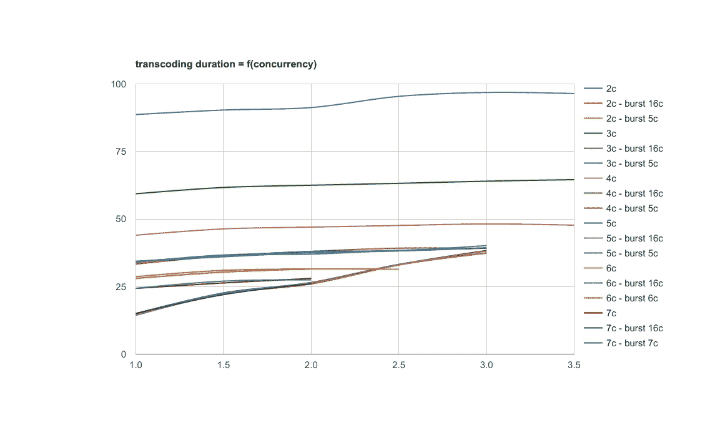

All results: unbounding CPU cores homogenizes performance

## 并发性对个人绩效的影响

并发会影响性能。下表显示了各种设置下由于并发性造成的性能损失百分比。

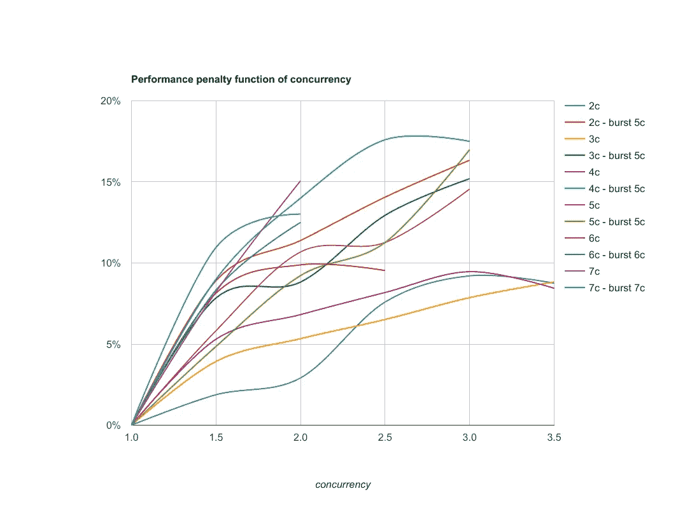

performance is impacted from 10 to 20% when concurrency is 3 or more

# 结论

在代码转换或其他 CPU 密集型任务的情况下，

*   如果分配给 pods 的 CPU 总是少于 1 个，那么并发性不会影响 CPU 限制的性能；尽管如此，还是要注意其他方面。我们的用例不依赖于内存或磁盘 IO，而您的可以。
*   如果您事先知道您的最大并发性，并且它不是太高，那么通过 LXD 和 CPU 锁定来添加更多的工作线程总会比通过 Docker 进行本地调度获得更好的性能。这还有其他有趣的特性，比如在不停机的情况下动态调整工作线程的大小，以及非常快速地提供新的工作线程。本质上，对于相同数量的物理节点，您可以获得高度灵活的集群。相当棒。
*   获胜的策略总是最大限度地超级配置 CPU 限制，以便将每一点性能都立即分配到您的 pod。当然，这不能在所有环境下都工作，所以在使用时要小心，在应用到生产中之前，要测试它是否适合您的用例。

这些结果出现在 AWS 中，在金属和单元之间有一个管理程序。我正在等待具有足够内核的硬件来完成任务。如果你有硬件可以用，请便，我会帮你做测试。

最后，为了展开讨论，下一步也可以使用 GPU 来执行相同的任务。限制是集群中可用的 GPU 数量。我正在等待一些新的 nVidia GPUs 和戴尔硬件，希望我能测试一下。

有些未知的东西我无法理清。我在这里打开了[大约 1900 份工作的结果数据集，所以你可以运行你自己的分析！如果你发现什么有趣的东西，请告诉我！](https://docs.google.com/spreadsheets/d/1KcC5nKnbTKaFcsg8_K_p_zodq3r-haRur1-_uJqJ4iI/edit#gid=714649755)

[](http://bit.ly/HackernoonFB)[](https://goo.gl/k7XYbx)[](https://goo.gl/4ofytp)

> [黑客中午](http://bit.ly/Hackernoon)是黑客如何开始他们的下午。我们是 [@AMI](http://bit.ly/atAMIatAMI) 家庭的一员。我们现在[接受投稿](http://bit.ly/hackernoonsubmission)并乐意[讨论广告&赞助](mailto:partners@amipublications.com)机会。
> 
> 如果你喜欢这个故事，我们推荐你阅读我们的[最新科技故事](http://bit.ly/hackernoonlatestt)和[趋势科技故事](https://hackernoon.com/trending)。直到下一次，不要把世界的现实想当然！

